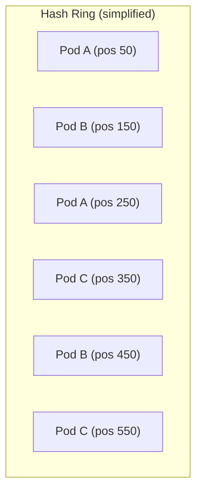

# How to Set Up Ring Hash Load Balancing in Istio

Author: [nawazdhandala](https://github.com/nawazdhandala)

Tags: Istio, Ring Hash, Load Balancing, DestinationRule, Consistent Hashing

Description: Set up ring hash load balancing in Istio to achieve consistent routing with configurable hash ring parameters for session affinity.

---

Ring hash is the default consistent hashing implementation in Istio and Envoy. When you configure `consistentHash` in a DestinationRule, Envoy uses a ring hash algorithm under the hood. Understanding how ring hash works and how to tune it gives you better control over session affinity and traffic distribution in your mesh.

## Ring Hash Basics

A ring hash algorithm places each backend endpoint at multiple positions on a virtual ring (a circular hash space from 0 to 2^32). When a request comes in, its hash key gets mapped to a position on the ring, and Envoy walks clockwise to find the nearest endpoint.

Each endpoint gets multiple positions on the ring (called "virtual nodes"). More virtual nodes per endpoint means more even distribution but more memory usage.



Each pod appears multiple times on the ring. A request with hash value 200 goes to Pod A (nearest clockwise is position 250). A request with hash value 400 goes to Pod B (nearest is 450).

## Configuration

Ring hash is automatically selected when you use `consistentHash` in your DestinationRule. There is no separate flag to enable it - it is the default consistent hash algorithm.

```yaml
apiVersion: networking.istio.io/v1
kind: DestinationRule
metadata:
  name: my-service-ringhash
spec:
  host: my-service
  trafficPolicy:
    loadBalancer:
      consistentHash:
        httpHeaderName: x-session-id
        minimumRingSize: 1024
```

The `minimumRingSize` controls how many entries the hash ring has at minimum. The default value is 1024. A larger ring gives better distribution at the cost of memory.

## How minimumRingSize Affects Distribution

With a small ring size, the distribution of requests across backends can be uneven. Imagine 3 pods on a ring of size 10 - each pod gets about 3 positions, but the spacing might not be uniform.

With a larger ring size, each pod gets more positions and the spacing becomes more even. Here is a practical guideline:

| Endpoints | Recommended Ring Size |
|-----------|----------------------|
| 2-5       | 1024 (default)       |
| 5-50      | 2048                 |
| 50-200    | 4096                 |
| 200+      | 8192 or higher       |

The ring size does not need to be exact. Envoy will use at least this many ring entries, but it may use more internally.

## Complete Working Example

Here is a full example showing ring hash with header-based hashing:

```yaml
apiVersion: v1
kind: Service
metadata:
  name: cache-service
spec:
  selector:
    app: cache-service
  ports:
  - name: http
    port: 8080
    targetPort: 8080
---
apiVersion: apps/v1
kind: Deployment
metadata:
  name: cache-service
spec:
  replicas: 6
  selector:
    matchLabels:
      app: cache-service
  template:
    metadata:
      labels:
        app: cache-service
    spec:
      containers:
      - name: cache
        image: nginx:latest
        ports:
        - containerPort: 8080
---
apiVersion: networking.istio.io/v1
kind: DestinationRule
metadata:
  name: cache-service-dr
spec:
  host: cache-service
  trafficPolicy:
    loadBalancer:
      consistentHash:
        httpHeaderName: x-cache-key
        minimumRingSize: 2048
```

Apply everything:

```bash
kubectl apply -f cache-service.yaml
```

Now requests with the same `x-cache-key` header value always route to the same pod. This is perfect for distributed caching where you want cache hits to go to the node that has the data.

## Testing Ring Hash Behavior

Send multiple requests with the same hash key and verify they go to the same pod:

```bash
kubectl run curl-test --image=curlimages/curl -it --rm -- sh
```

Inside the pod:

```bash
# Same key should always go to same pod
for i in $(seq 1 10); do
  curl -s -H "x-cache-key: user-42" http://cache-service:8080/
done

# Different key should go to (likely) a different pod
for i in $(seq 1 10); do
  curl -s -H "x-cache-key: user-99" http://cache-service:8080/
done
```

## Verifying Ring Hash in Envoy

Check the Envoy cluster configuration:

```bash
istioctl proxy-config cluster <pod-name> --fqdn cache-service.default.svc.cluster.local -o json
```

In the output, you should see:

```json
{
  "lbPolicy": "RING_HASH",
  "ringHashLbConfig": {
    "minimumRingSize": "2048"
  }
}
```

## What Happens During Scaling Events

The key advantage of ring hash over simple modulo hashing is how it handles scaling. When you add a pod:

1. The new pod gets placed at several positions on the ring
2. Only the keys that hash to positions between the new pod's positions and the next pod clockwise get remapped
3. All other keys stay on their original pod

When you remove a pod:

1. Its positions are removed from the ring
2. Keys that were mapped to that pod move to the next pod clockwise
3. All other keys are unaffected

This means scaling from 5 to 6 pods only remaps about 1/6 of the keys, instead of reshuffling everything.

## Ring Hash vs Maglev

Istio offers two consistent hash algorithms: ring hash and maglev. Ring hash is the default. Here is how they compare:

| Feature | Ring Hash | Maglev |
|---------|-----------|--------|
| Distribution evenness | Good (depends on ring size) | Better (by design) |
| Lookup speed | O(log n) | O(1) |
| Memory usage | Configurable via ring size | Fixed based on table size |
| Minimum disruption on change | Good | Slightly better |

For most use cases, ring hash is fine. Maglev is worth considering when you have hundreds of endpoints and need the most even distribution possible.

## Combining Ring Hash with Outlier Detection

Session affinity with outlier detection needs careful thought. If a pod is ejected due to errors, requests that were sticky to that pod need to go somewhere else:

```yaml
apiVersion: networking.istio.io/v1
kind: DestinationRule
metadata:
  name: cache-resilient
spec:
  host: cache-service
  trafficPolicy:
    loadBalancer:
      consistentHash:
        httpHeaderName: x-cache-key
        minimumRingSize: 2048
    outlierDetection:
      consecutive5xxErrors: 5
      interval: 10s
      baseEjectionTime: 30s
      maxEjectionPercent: 30
```

When a pod gets ejected, its ring positions are temporarily removed. Requests that were going to it will move to the next pod on the ring. When the ejected pod comes back (after `baseEjectionTime`), its positions are restored and the original mapping resumes.

## Practical Use Cases for Ring Hash

**Distributed caching**: Route requests for the same data to the same pod, maximizing cache hit rates. Without consistent hashing, cache data gets duplicated across pods.

**Stateful WebSocket servers**: Keep a user's WebSocket connection on the same server by hashing on user ID.

**Database connection pooling**: Route queries for the same shard to the same proxy pod to maximize connection reuse.

**Rate limiting**: If you do per-user rate limiting in-memory, consistent hashing ensures all requests from a user hit the same rate limiter instance.

## Cleanup

```bash
kubectl delete destinationrule cache-service-dr
kubectl delete deployment cache-service
kubectl delete service cache-service
```

Ring hash is a reliable and well-understood algorithm for session affinity in Istio. The main knob you have to tune is `minimumRingSize` - increase it if you see uneven distribution, decrease it if memory is a concern. For most services, the default of 1024 works well.
