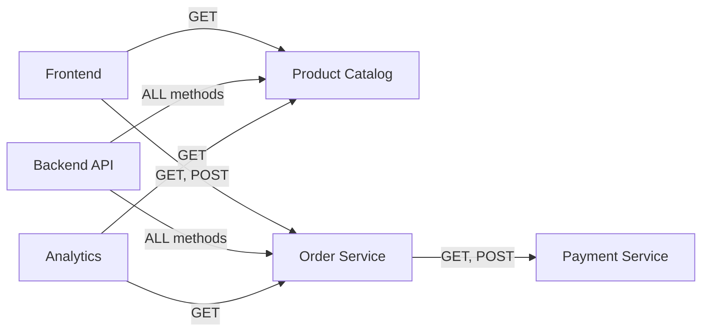

# How to Set Up Role-Based Access Control (RBAC) with Istio

Author: [nawazdhandala](https://github.com/nawazdhandala)

Tags: Istio, RBAC, Authorization, Security, Kubernetes, Service Mesh

Description: A practical guide to implementing role-based access control in Istio using authorization policies, service accounts, and JWT claims.

---

Role-based access control is one of those things that sounds simple in theory but gets complicated fast in a microservices environment. Which service can call which? Can the frontend service delete orders? Can the analytics service read user data? Istio gives you the tools to define and enforce these rules at the mesh level, without baking access control logic into each service.

## RBAC in Istio: The Basics

Istio's RBAC implementation uses `AuthorizationPolicy` resources. Each policy defines who (the subject) can do what (the action) on which resource (the target). The "who" part can be a service identity, a namespace, an IP address, or a JWT claim. The "what" part can be HTTP methods, paths, ports, or other request attributes.

Think of it this way:

- **Role** = A set of permissions (what operations are allowed on what paths/ports)
- **Subject** = The identity that gets the role (a service account, a namespace, a JWT principal)
- **Binding** = The authorization policy that connects subjects to roles

Unlike Kubernetes RBAC which has separate Role and RoleBinding objects, Istio combines everything into a single AuthorizationPolicy resource.

## Setting Up Service Account Identities

The foundation of RBAC in Istio is service identity. Each workload should run under its own Kubernetes service account:

```yaml
apiVersion: v1
kind: ServiceAccount
metadata:
  name: frontend
  namespace: default
---
apiVersion: v1
kind: ServiceAccount
metadata:
  name: backend-api
  namespace: default
---
apiVersion: v1
kind: ServiceAccount
metadata:
  name: order-processor
  namespace: default
---
apiVersion: v1
kind: ServiceAccount
metadata:
  name: analytics
  namespace: default
```

Reference these in your deployments:

```yaml
apiVersion: apps/v1
kind: Deployment
metadata:
  name: backend-api
  namespace: default
spec:
  template:
    spec:
      serviceAccountName: backend-api
      containers:
      - name: api
        image: myapp/backend-api:latest
```

When Istio issues certificates for mTLS, each workload gets a SPIFFE identity based on its service account: `cluster.local/ns/default/sa/backend-api`.

## Defining Roles Through Authorization Policies

Now you can create policies that act like role definitions. Here is a "reader" role for the product catalog service:

```yaml
apiVersion: security.istio.io/v1
kind: AuthorizationPolicy
metadata:
  name: product-catalog-readers
  namespace: default
spec:
  selector:
    matchLabels:
      app: product-catalog
  action: ALLOW
  rules:
  - from:
    - source:
        principals:
        - "cluster.local/ns/default/sa/frontend"
        - "cluster.local/ns/default/sa/analytics"
    to:
    - operation:
        methods:
        - "GET"
        paths:
        - "/products/*"
        - "/categories/*"
```

And a "writer" role for the same service:

```yaml
apiVersion: security.istio.io/v1
kind: AuthorizationPolicy
metadata:
  name: product-catalog-writers
  namespace: default
spec:
  selector:
    matchLabels:
      app: product-catalog
  action: ALLOW
  rules:
  - from:
    - source:
        principals:
        - "cluster.local/ns/default/sa/backend-api"
    to:
    - operation:
        methods:
        - "GET"
        - "POST"
        - "PUT"
        - "DELETE"
        paths:
        - "/products/*"
        - "/categories/*"
```

The frontend and analytics services can only read products. The backend API can read, create, update, and delete. Clean separation of concerns.

## Full RBAC Example: E-Commerce Application

Here is a complete RBAC setup for a simple e-commerce application with multiple services:



Default deny for the namespace:

```yaml
apiVersion: security.istio.io/v1
kind: AuthorizationPolicy
metadata:
  name: deny-all
  namespace: default
spec:
  action: ALLOW
  rules: []
```

Frontend role - can browse products and place orders:

```yaml
apiVersion: security.istio.io/v1
kind: AuthorizationPolicy
metadata:
  name: frontend-to-product-catalog
  namespace: default
spec:
  selector:
    matchLabels:
      app: product-catalog
  action: ALLOW
  rules:
  - from:
    - source:
        principals:
        - "cluster.local/ns/default/sa/frontend"
    to:
    - operation:
        methods: ["GET"]
        paths: ["/products/*", "/categories/*"]
---
apiVersion: security.istio.io/v1
kind: AuthorizationPolicy
metadata:
  name: frontend-to-order-service
  namespace: default
spec:
  selector:
    matchLabels:
      app: order-service
  action: ALLOW
  rules:
  - from:
    - source:
        principals:
        - "cluster.local/ns/default/sa/frontend"
    to:
    - operation:
        methods: ["GET", "POST"]
        paths: ["/orders/*"]
```

Order processor role - can read orders and call payment service:

```yaml
apiVersion: security.istio.io/v1
kind: AuthorizationPolicy
metadata:
  name: order-processor-to-payment
  namespace: default
spec:
  selector:
    matchLabels:
      app: payment-service
  action: ALLOW
  rules:
  - from:
    - source:
        principals:
        - "cluster.local/ns/default/sa/order-processor"
    to:
    - operation:
        methods: ["GET", "POST"]
        paths: ["/payments/*"]
```

Analytics role - read-only access to multiple services:

```yaml
apiVersion: security.istio.io/v1
kind: AuthorizationPolicy
metadata:
  name: analytics-readers
  namespace: default
spec:
  selector:
    matchLabels:
      app: product-catalog
  action: ALLOW
  rules:
  - from:
    - source:
        principals:
        - "cluster.local/ns/default/sa/analytics"
    to:
    - operation:
        methods: ["GET"]
---
apiVersion: security.istio.io/v1
kind: AuthorizationPolicy
metadata:
  name: analytics-to-orders
  namespace: default
spec:
  selector:
    matchLabels:
      app: order-service
  action: ALLOW
  rules:
  - from:
    - source:
        principals:
        - "cluster.local/ns/default/sa/analytics"
    to:
    - operation:
        methods: ["GET"]
```

## User-Level RBAC with JWT Claims

For end-user RBAC (not just service-to-service), use JWT claims. First set up JWT validation:

```yaml
apiVersion: security.istio.io/v1
kind: RequestAuthentication
metadata:
  name: jwt-auth
  namespace: default
spec:
  jwtRules:
  - issuer: "https://auth.example.com"
    jwksUri: "https://auth.example.com/.well-known/jwks.json"
```

Then create role-based policies using JWT claims:

```yaml
apiVersion: security.istio.io/v1
kind: AuthorizationPolicy
metadata:
  name: admin-role
  namespace: default
spec:
  selector:
    matchLabels:
      app: admin-panel
  action: ALLOW
  rules:
  - when:
    - key: request.auth.claims[role]
      values:
      - "admin"
---
apiVersion: security.istio.io/v1
kind: AuthorizationPolicy
metadata:
  name: manager-role
  namespace: default
spec:
  selector:
    matchLabels:
      app: order-service
  action: ALLOW
  rules:
  - when:
    - key: request.auth.claims[role]
      values:
      - "manager"
      - "admin"
    to:
    - operation:
        methods: ["GET", "PUT", "DELETE"]
        paths: ["/orders/*"]
```

## Testing Your RBAC Setup

After applying all policies, test each role:

```bash
# Test frontend role - should succeed
kubectl exec frontend-pod -- curl -s -o /dev/null -w "%{http_code}" http://product-catalog:8080/products/1

# Test frontend trying to delete - should get 403
kubectl exec frontend-pod -- curl -s -o /dev/null -w "%{http_code}" -X DELETE http://product-catalog:8080/products/1

# Test analytics trying to write orders - should get 403
kubectl exec analytics-pod -- curl -s -o /dev/null -w "%{http_code}" -X POST http://order-service:8080/orders/
```

## Tips for Managing RBAC at Scale

**Use namespaces to group related policies.** Putting all backend services in one namespace and all frontend services in another makes namespace-based rules simpler.

**Document your roles.** Keep a table or diagram of which service accounts map to which roles and what those roles allow. Policies scattered across YAML files are hard to audit.

**Start permissive, then tighten.** Deploy with monitoring first to understand actual traffic patterns, then write policies that match those patterns.

**Use Kiali to visualize access.** Kiali shows you the service graph and which connections have authorization policies. This is invaluable for spotting gaps.

RBAC in Istio is not complicated once you have a clear mental model. Service accounts are your identities, authorization policies are your role definitions, and the selector field determines which workload the role applies to. Build it up piece by piece, test each role, and you will have solid access control across your entire mesh.
