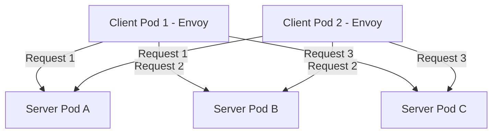

# How to Set Up Round Robin Load Balancing in Istio

Author: [nawazdhandala](https://github.com/nawazdhandala)

Tags: Istio, Round Robin, Load Balancing, DestinationRule, Kubernetes

Description: A hands-on guide to configuring and verifying round robin load balancing in Istio using DestinationRule resources.

---

Round robin is the default load balancing algorithm in Istio, and for good reason. It distributes requests evenly across all available endpoints in a predictable, sequential pattern. Pod 1 gets a request, then pod 2, then pod 3, then back to pod 1. Simple and effective for most workloads.

Even though round robin is the default, there are cases where you want to explicitly configure it - maybe to override a previously set policy, or to be explicit in your configuration for clarity. Either way, setting it up takes about 30 seconds.

## Why Round Robin?

Round robin is a solid choice when:

- Your service instances have roughly equal capacity (same CPU/memory limits)
- Your requests are roughly equal in processing cost
- You do not need session stickiness
- You want predictable, even distribution

It is the simplest algorithm to reason about. Every pod gets the same number of requests over time, assuming no pods are unhealthy.

## Setting Up a Test Service

To see round robin in action, deploy a service with multiple replicas that identifies which pod handled the request:

```yaml
apiVersion: apps/v1
kind: Deployment
metadata:
  name: echo-server
spec:
  replicas: 4
  selector:
    matchLabels:
      app: echo-server
  template:
    metadata:
      labels:
        app: echo-server
    spec:
      containers:
      - name: echo
        image: hashicorp/http-echo
        args:
        - -listen=:8080
        - -text=hello
        ports:
        - containerPort: 8080
        env:
        - name: POD_NAME
          valueFrom:
            fieldRef:
              fieldPath: metadata.name
---
apiVersion: v1
kind: Service
metadata:
  name: echo-server
spec:
  selector:
    app: echo-server
  ports:
  - name: http
    port: 8080
    targetPort: 8080
```

Apply it:

```bash
kubectl apply -f echo-server.yaml
```

Wait for all pods to be ready:

```bash
kubectl get pods -l app=echo-server -w
```

## Configuring Round Robin Explicitly

Create the DestinationRule:

```yaml
apiVersion: networking.istio.io/v1
kind: DestinationRule
metadata:
  name: echo-server-rr
spec:
  host: echo-server
  trafficPolicy:
    loadBalancer:
      simple: ROUND_ROBIN
```

Apply it:

```bash
kubectl apply -f echo-server-destinationrule.yaml
```

Since round robin is the default, this DestinationRule is functionally identical to having no DestinationRule at all for the load balancing part. But now you have an explicit configuration that anyone reading your Istio resources can understand.

## Verifying the Configuration

First, check that the DestinationRule was created:

```bash
kubectl get destinationrule echo-server-rr
```

Then inspect the Envoy configuration on a client pod:

```bash
istioctl proxy-config cluster <client-pod> --fqdn echo-server.default.svc.cluster.local -o json
```

In the JSON output, look for:

```json
{
  "lbPolicy": "ROUND_ROBIN"
}
```

This confirms Envoy is using the round robin policy for this cluster.

## Testing the Distribution

Deploy a curl pod to send test requests:

```bash
kubectl run curl-test --image=curlimages/curl -it --rm -- sh
```

Inside the pod, send 20 requests and observe the distribution:

```bash
for i in $(seq 1 20); do
  curl -s http://echo-server:8080/
  echo ""
done
```

With 4 replicas and round robin, you should see each pod getting roughly 5 out of 20 requests. The distribution will not always be perfectly even because there might be a slight lag in endpoint updates, but over a larger sample it should converge.

For a more thorough test, send 100 requests and count:

```bash
for i in $(seq 1 100); do
  curl -s http://echo-server:8080/ 2>/dev/null
done | sort | uniq -c | sort -rn
```

## How Round Robin Actually Works in Envoy

Under the hood, Envoy maintains a round-robin index for each upstream cluster. When a request comes in, Envoy picks the next endpoint in the list and increments the index. If an endpoint is unhealthy (based on outlier detection or health checks), it gets skipped.

One important thing to understand: each Envoy proxy maintains its own independent round-robin state. If you have 10 client pods each with their own sidecar, each sidecar has its own counter. This means the global distribution across all clients is not perfectly round-robin - it is more like "per-client round-robin."



Both clients might send their first request to Server Pod A simultaneously, because their counters are independent.

## Round Robin with Weighted Priorities

By default, all endpoints have equal weight. But Kubernetes endpoints do not natively support weights at the pod level. If you need weighted round robin (for example, sending more traffic to pods with more resources), you would typically use subset-based routing with VirtualService weights instead.

For example:

```yaml
apiVersion: networking.istio.io/v1
kind: DestinationRule
metadata:
  name: echo-server-subsets
spec:
  host: echo-server
  trafficPolicy:
    loadBalancer:
      simple: ROUND_ROBIN
  subsets:
  - name: primary
    labels:
      tier: primary
  - name: secondary
    labels:
      tier: secondary
```

Then in your VirtualService:

```yaml
apiVersion: networking.istio.io/v1
kind: VirtualService
metadata:
  name: echo-server-vs
spec:
  hosts:
  - echo-server
  http:
  - route:
    - destination:
        host: echo-server
        subset: primary
      weight: 80
    - destination:
        host: echo-server
        subset: secondary
      weight: 20
```

Within each subset, round robin distributes traffic evenly among the pods in that group.

## Round Robin vs Other Algorithms

Here is a quick comparison to help you decide if round robin is right for your use case:

| Scenario | Best Algorithm |
|----------|---------------|
| Equal capacity, equal request cost | Round Robin |
| Variable request processing times | Least Request |
| Need session stickiness | Consistent Hash |
| Many client proxies with few servers | Random |
| External service, DNS-based LB | Passthrough |

If your requests have wildly different processing times (like some take 5ms and others take 5 seconds), round robin can lead to uneven actual load. One pod might be stuck processing slow requests while another finishes its fast requests and sits idle. In that case, consider LEAST_REQUEST instead.

## Combining with Outlier Detection

Round robin works best when combined with outlier detection. If a pod starts failing, you want it removed from the rotation:

```yaml
apiVersion: networking.istio.io/v1
kind: DestinationRule
metadata:
  name: echo-server-healthy-rr
spec:
  host: echo-server
  trafficPolicy:
    loadBalancer:
      simple: ROUND_ROBIN
    outlierDetection:
      consecutive5xxErrors: 3
      interval: 10s
      baseEjectionTime: 30s
      maxEjectionPercent: 50
```

This removes a pod from the round-robin pool if it returns 3 consecutive 5xx errors. After 30 seconds, it gets added back. The `maxEjectionPercent` ensures at least half your pods stay in rotation even if multiple are failing.

## Cleanup

```bash
kubectl delete destinationrule echo-server-rr
kubectl delete deployment echo-server
kubectl delete service echo-server
```

Round robin is boring but reliable. For most services, you do not need anything more complex. Start with round robin and switch to something else only when you have a specific reason to.
