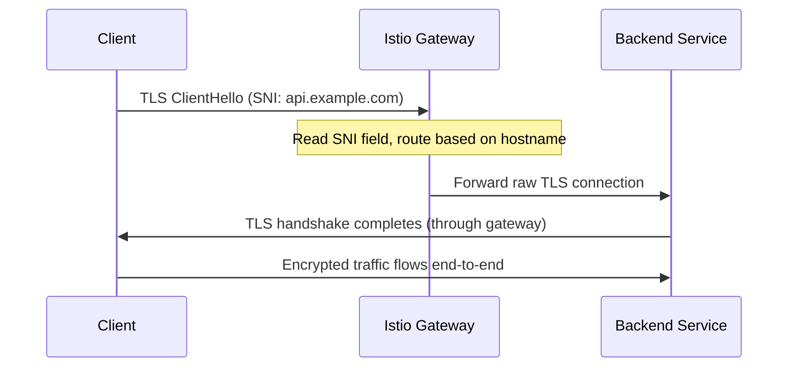

# How to Set Up SNI Passthrough at Istio Ingress Gateway

Author: [nawazdhandala](https://github.com/nawazdhandala)

Tags: Istio, SNI Passthrough, TLS, Ingress Gateway, Kubernetes

Description: Configure SNI passthrough at the Istio Ingress Gateway to forward encrypted TLS traffic directly to backend services without terminating TLS.

---

Sometimes you do not want the ingress gateway to terminate TLS. Maybe your backend service handles its own TLS certificates, or maybe you are dealing with a protocol that requires end-to-end encryption. In these cases, you want the ingress gateway to look at the TLS handshake's Server Name Indication (SNI) field, figure out where to route the traffic, and pass the encrypted connection through to the backend without decrypting it.

This is called SNI passthrough, and Istio supports it natively.

## How SNI Passthrough Works

In a normal TLS setup, the ingress gateway terminates TLS:

```text
Client -> [TLS] -> Gateway [terminates TLS] -> [plaintext] -> Backend
```

With SNI passthrough, the gateway just forwards the encrypted traffic:

```text
Client -> [TLS] -> Gateway [reads SNI, forwards] -> [TLS] -> Backend
```

The gateway never sees the decrypted traffic. It only peeks at the SNI field in the TLS ClientHello message to determine the destination hostname, then routes the raw TCP connection to the appropriate backend.



## When to Use SNI Passthrough

- **End-to-end encryption requirements:** When compliance mandates that the gateway never sees plaintext traffic
- **Backend-managed certificates:** When the backend service needs to present its own TLS certificate
- **Non-HTTP protocols over TLS:** Databases, gRPC with custom TLS, or proprietary protocols
- **Certificate pinning:** When clients pin to the backend's specific certificate

## Setting Up SNI Passthrough

### Step 1: Configure the Gateway with PASSTHROUGH Mode

```yaml
apiVersion: networking.istio.io/v1
kind: Gateway
metadata:
  name: passthrough-gateway
  namespace: default
spec:
  selector:
    istio: ingressgateway
  servers:
    - port:
        number: 443
        name: tls
        protocol: TLS
      tls:
        mode: PASSTHROUGH
      hosts:
        - "api.example.com"
        - "db.example.com"
```

Key points:
- The protocol is `TLS`, not `HTTPS`. This tells Istio it is a raw TLS connection, not HTTP over TLS.
- The `mode: PASSTHROUGH` means the gateway forwards the connection without decrypting.
- No `credentialName` is needed because the gateway does not need any certificates.

### Step 2: Create a VirtualService with TLS Routing

For passthrough traffic, you use `tls` routing rules instead of `http`:

```yaml
apiVersion: networking.istio.io/v1
kind: VirtualService
metadata:
  name: api-passthrough
spec:
  hosts:
    - "api.example.com"
  gateways:
    - passthrough-gateway
  tls:
    - match:
        - port: 443
          sniHosts:
            - "api.example.com"
      route:
        - destination:
            host: api-service
            port:
              number: 8443
```

The `sniHosts` field matches against the SNI field in the TLS ClientHello. When a client connects with SNI set to `api.example.com`, the traffic gets routed to `api-service` on port 8443.

### Step 3: Deploy the Backend Service with TLS

Your backend service needs to handle TLS itself:

```yaml
apiVersion: apps/v1
kind: Deployment
metadata:
  name: api-service
spec:
  replicas: 3
  selector:
    matchLabels:
      app: api-service
  template:
    metadata:
      labels:
        app: api-service
    spec:
      containers:
        - name: api-service
          image: myregistry/api-service:1.0.0
          ports:
            - containerPort: 8443
          volumeMounts:
            - name: tls-certs
              mountPath: /etc/tls
              readOnly: true
      volumes:
        - name: tls-certs
          secret:
            secretName: api-service-tls
---
apiVersion: v1
kind: Service
metadata:
  name: api-service
spec:
  selector:
    app: api-service
  ports:
    - port: 8443
      targetPort: 8443
      name: tls
```

Create the TLS secret for the backend:

```bash
kubectl create secret tls api-service-tls \
  --cert=api-cert.pem \
  --key=api-key.pem
```

## Routing Multiple Services with SNI

One of the advantages of SNI passthrough is that you can route to different backends based on the hostname, all on the same port:

```yaml
apiVersion: networking.istio.io/v1
kind: Gateway
metadata:
  name: multi-passthrough-gateway
spec:
  selector:
    istio: ingressgateway
  servers:
    - port:
        number: 443
        name: tls
        protocol: TLS
      tls:
        mode: PASSTHROUGH
      hosts:
        - "api.example.com"
        - "db.example.com"
        - "grpc.example.com"
---
apiVersion: networking.istio.io/v1
kind: VirtualService
metadata:
  name: multi-passthrough
spec:
  hosts:
    - "api.example.com"
    - "db.example.com"
    - "grpc.example.com"
  gateways:
    - multi-passthrough-gateway
  tls:
    - match:
        - port: 443
          sniHosts:
            - "api.example.com"
      route:
        - destination:
            host: api-service
            port:
              number: 8443
    - match:
        - port: 443
          sniHosts:
            - "db.example.com"
      route:
        - destination:
            host: database-proxy
            port:
              number: 5432
    - match:
        - port: 443
          sniHosts:
            - "grpc.example.com"
      route:
        - destination:
            host: grpc-service
            port:
              number: 50051
```

All three services share port 443 at the gateway. The SNI field determines where each connection goes.

## Handling Sidecar Interaction

When using SNI passthrough, there is an important consideration with Istio sidecars. If the backend pod has an Istio sidecar, the sidecar will try to intercept the TLS traffic. Since the traffic is already encrypted, this can cause issues.

You have two options:

### Option 1: Disable Sidecar Protocol Detection for the Port

Use a DestinationRule with `DISABLE` tls mode:

```yaml
apiVersion: networking.istio.io/v1
kind: DestinationRule
metadata:
  name: api-service
spec:
  host: api-service
  trafficPolicy:
    tls:
      mode: DISABLE
```

### Option 2: Use Port Naming Convention

Name the service port with a `tls-` prefix so Istio knows not to do protocol sniffing:

```yaml
apiVersion: v1
kind: Service
metadata:
  name: api-service
spec:
  ports:
    - port: 8443
      targetPort: 8443
      name: tls-api
```

## Testing SNI Passthrough

Test the connection:

```bash
# Test with curl
curl -v --resolve api.example.com:443:$INGRESS_IP https://api.example.com/health

# Test with openssl to verify the backend's certificate is presented
openssl s_client -connect $INGRESS_IP:443 -servername api.example.com
```

With passthrough, the certificate presented during the TLS handshake should be the backend service's certificate, not the gateway's. If you see the gateway's certificate (or the Istio self-signed cert), passthrough is not working correctly.

## Debugging SNI Passthrough

**Connection timeout:**

```bash
# Check the gateway is listening on 443
istioctl proxy-config listener <gateway-pod> -n istio-system --port 443
```

**Connection reset:**

Check that the backend service is actually listening with TLS on the expected port:

```bash
kubectl exec -it <backend-pod> -- openssl s_client -connect localhost:8443
```

**Wrong backend reached:**

Verify the SNI matching:

```bash
istioctl proxy-config route <gateway-pod> -n istio-system -o json
```

**Gateway logs:**

```bash
kubectl logs -n istio-system <gateway-pod> --tail=50
```

Look for connection errors or routing decisions in the Envoy access log.

## Limitations of SNI Passthrough

There are trade-offs with passthrough mode:

- **No HTTP-level routing:** Since the gateway does not decrypt traffic, it cannot do path-based routing, header matching, or request modification
- **No HTTP metrics:** Istio can only report TCP-level metrics (bytes transferred, connection counts), not HTTP metrics (status codes, latency)
- **No retries or timeouts at the gateway:** These HTTP-level features are not available for passthrough connections
- **SNI required:** Clients must send the SNI field. Most modern TLS clients do this automatically, but some legacy clients may not

SNI passthrough is the right choice when you need end-to-end encryption or when your backends manage their own TLS. It is simpler to configure than SIMPLE mode (no certificates needed at the gateway) and provides true end-to-end encryption. The trade-off is losing HTTP-level features at the gateway, which is usually acceptable for the use cases where passthrough is needed.
