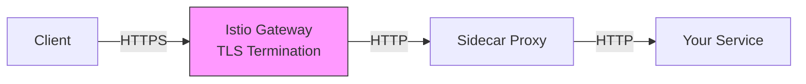

# How to Set Up TLS Termination at Istio Gateway

Author: [nawazdhandala](https://github.com/nawazdhandala)

Tags: Istio, TLS, Gateway, Security, Kubernetes

Description: Practical guide to setting up TLS termination at the Istio Gateway so your backend services can handle plain HTTP traffic securely.

---

TLS termination means the Istio ingress gateway handles all the encryption and decryption work, so your backend services do not need to deal with TLS at all. They just receive plain HTTP traffic. This is the most common TLS setup because it simplifies your application code and centralizes certificate management.

## Why Terminate TLS at the Gateway

There are solid reasons to handle TLS at the gateway rather than at each individual service:

- You manage certificates in one place instead of per service
- Backend services stay simple - they just serve HTTP
- The Envoy proxy is optimized for TLS performance
- Istio mesh mTLS still encrypts traffic between the gateway and your services inside the mesh



Within the mesh, Istio's mutual TLS handles encryption between sidecars automatically, so there is no gap in encryption even though your service receives HTTP.

## Preparing the TLS Certificate

You need a certificate and private key. For production, get these from a trusted Certificate Authority. For testing, generate a self-signed pair:

```bash
# Create a root CA
openssl req -x509 -sha256 -nodes -days 365 -newkey rsa:2048 \
  -subj '/O=MyOrg/CN=MyCA' \
  -keyout ca.key \
  -out ca.crt

# Create a certificate signing request
openssl req -out server.csr -newkey rsa:2048 -nodes \
  -keyout server.key \
  -subj "/CN=myapp.example.com/O=MyOrg"

# Sign the certificate with the CA
openssl x509 -req -sha256 -days 365 \
  -CA ca.crt -CAkey ca.key -CAcreateserial \
  -in server.csr \
  -out server.crt
```

## Storing the Certificate in Kubernetes

Create a Kubernetes secret with the certificate and key. It needs to be in the `istio-system` namespace:

```bash
kubectl create secret tls myapp-tls-credential \
  --cert=server.crt \
  --key=server.key \
  -n istio-system
```

Verify the secret was created:

```bash
kubectl get secret myapp-tls-credential -n istio-system
```

You should see a secret of type `kubernetes.io/tls` with two data entries.

## Configuring the Gateway for TLS Termination

The Gateway resource with SIMPLE TLS mode performs TLS termination:

```yaml
apiVersion: networking.istio.io/v1
kind: Gateway
metadata:
  name: myapp-gateway
spec:
  selector:
    istio: ingressgateway
  servers:
  - port:
      number: 443
      name: https
      protocol: HTTPS
    hosts:
    - "myapp.example.com"
    tls:
      mode: SIMPLE
      credentialName: myapp-tls-credential
```

The `mode: SIMPLE` is the key setting. It tells the gateway to terminate TLS - accept encrypted connections from clients and forward decrypted traffic to the backend. The gateway presents the certificate from `myapp-tls-credential` during the TLS handshake.

## Adding the VirtualService

Route the decrypted traffic to your service:

```yaml
apiVersion: networking.istio.io/v1
kind: VirtualService
metadata:
  name: myapp-vs
spec:
  hosts:
  - "myapp.example.com"
  gateways:
  - myapp-gateway
  http:
  - route:
    - destination:
        host: myapp-service
        port:
          number: 8080
```

Notice the routing rules are under `http`, not `tls`. After TLS termination, the gateway treats everything as HTTP traffic.

## Handling Multiple Domains

If you need TLS termination for multiple domains, you can include multiple server entries in a single Gateway:

```yaml
apiVersion: networking.istio.io/v1
kind: Gateway
metadata:
  name: multi-domain-gateway
spec:
  selector:
    istio: ingressgateway
  servers:
  - port:
      number: 443
      name: https-app1
      protocol: HTTPS
    hosts:
    - "app1.example.com"
    tls:
      mode: SIMPLE
      credentialName: app1-tls-credential
  - port:
      number: 443
      name: https-app2
      protocol: HTTPS
    hosts:
    - "app2.example.com"
    tls:
      mode: SIMPLE
      credentialName: app2-tls-credential
```

Istio uses SNI (Server Name Indication) to determine which certificate to present based on the hostname the client requests. Each domain can have its own certificate.

## Configuring TLS Options

You can fine-tune the TLS settings for security compliance:

```yaml
apiVersion: networking.istio.io/v1
kind: Gateway
metadata:
  name: hardened-gateway
spec:
  selector:
    istio: ingressgateway
  servers:
  - port:
      number: 443
      name: https
      protocol: HTTPS
    hosts:
    - "secure.example.com"
    tls:
      mode: SIMPLE
      credentialName: secure-tls-credential
      minProtocolVersion: TLSV1_2
      maxProtocolVersion: TLSV1_3
      cipherSuites:
      - ECDHE-ECDSA-AES256-GCM-SHA384
      - ECDHE-RSA-AES256-GCM-SHA384
      - ECDHE-ECDSA-AES128-GCM-SHA256
      - ECDHE-RSA-AES128-GCM-SHA256
```

This configuration only allows TLS 1.2 and 1.3 with strong cipher suites. Drop TLS 1.2 entirely if all your clients support TLS 1.3.

## HTTP to HTTPS Redirect

Always set up an HTTP listener that redirects to HTTPS:

```yaml
apiVersion: networking.istio.io/v1
kind: Gateway
metadata:
  name: myapp-gateway
spec:
  selector:
    istio: ingressgateway
  servers:
  - port:
      number: 443
      name: https
      protocol: HTTPS
    hosts:
    - "myapp.example.com"
    tls:
      mode: SIMPLE
      credentialName: myapp-tls-credential
  - port:
      number: 80
      name: http
      protocol: HTTP
    hosts:
    - "myapp.example.com"
    tls:
      httpsRedirect: true
```

## Testing TLS Termination

Verify TLS termination is working:

```bash
export GATEWAY_IP=$(kubectl -n istio-system get service istio-ingressgateway \
  -o jsonpath='{.status.loadBalancer.ingress[0].ip}')

# Test the HTTPS endpoint
curl -v -k --resolve "myapp.example.com:443:$GATEWAY_IP" \
  https://myapp.example.com/

# Check the certificate being served
echo | openssl s_client -servername myapp.example.com \
  -connect $GATEWAY_IP:443 2>/dev/null | \
  openssl x509 -noout -subject -dates
```

The `openssl s_client` command shows you the subject and expiration date of the certificate being served.

## Inspecting the Envoy Configuration

To see how Envoy is configured for TLS:

```bash
# Check listeners
istioctl proxy-config listener deploy/istio-ingressgateway -n istio-system

# Check specific listener details
istioctl proxy-config listener deploy/istio-ingressgateway -n istio-system \
  --port 443 -o json
```

Look for the `transport_socket` section in the JSON output. It should show the TLS context with your certificate.

## Troubleshooting TLS Termination

**Error: "No certificate chain found"**

The secret does not contain valid certificate data. Recreate it and make sure the cert file is valid:

```bash
openssl x509 -in server.crt -text -noout
```

**Error: "Secret not found"**

Check the secret name matches `credentialName` and it is in the `istio-system` namespace.

**Clients see a self-signed certificate warning when using a real cert**

The certificate chain might be incomplete. Include intermediate certificates in your cert file:

```bash
cat server.crt intermediate.crt > full-chain.crt
kubectl create secret tls myapp-tls-credential \
  --cert=full-chain.crt \
  --key=server.key \
  -n istio-system
```

**Slow TLS handshakes**

Check if the ingress gateway has enough CPU. TLS handshakes are CPU-intensive. Consider increasing the gateway pod resources:

```bash
kubectl edit deploy istio-ingressgateway -n istio-system
```

TLS termination at the Istio Gateway is the standard approach for most deployments. It keeps your application code simple, centralizes security configuration, and works seamlessly with Istio's internal mutual TLS. Once you set it up, all new services you add behind the gateway automatically benefit from the TLS configuration without any extra work.
