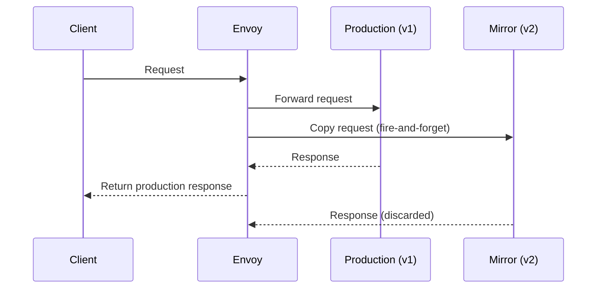

# How to Set Up Traffic Mirroring (Shadowing) in Istio

Author: [nawazdhandala](https://github.com/nawazdhandala)

Tags: Istio, Service Mesh, Traffic Mirroring, Shadowing, Kubernetes

Description: How to configure traffic mirroring in Istio to send copies of production requests to a test service without affecting users or production responses.

---

Traffic mirroring (also called shadowing) sends a copy of live production traffic to a secondary service for testing. The production response goes back to the caller as normal - the mirrored response is discarded. This lets you test a new service version with real traffic patterns without any risk to users. If the mirrored service crashes, returns errors, or is slow, nobody notices.

## How Traffic Mirroring Works in Istio

When you configure mirroring, the Envoy sidecar does the following:

1. Receives the incoming request
2. Sends the request to the primary destination (production)
3. Sends a copy of the request to the mirror destination (test)
4. Returns the primary response to the caller
5. Discards the mirror response



The mirror request is "fire and forget." Envoy does not wait for it to complete before returning the production response. This means mirroring adds negligible latency to production requests.

## Basic Traffic Mirroring Setup

Here is the simplest mirroring configuration:

```yaml
apiVersion: networking.istio.io/v1beta1
kind: VirtualService
metadata:
  name: product-service
  namespace: default
spec:
  hosts:
    - product-service
  http:
    - route:
        - destination:
            host: product-service
            subset: v1
          weight: 100
      mirror:
        host: product-service
        subset: v2
      mirrorPercentage:
        value: 100.0
```

This sends all production traffic to v1 and mirrors 100% of it to v2. Every request that hits v1 also gets sent to v2.

You also need the DestinationRule with subsets:

```yaml
apiVersion: networking.istio.io/v1beta1
kind: DestinationRule
metadata:
  name: product-service
  namespace: default
spec:
  host: product-service
  subsets:
    - name: v1
      labels:
        version: v1
    - name: v2
      labels:
        version: v2
```

## Setting Up the Deployments

You need both versions deployed with proper labels:

```yaml
apiVersion: apps/v1
kind: Deployment
metadata:
  name: product-service-v1
  namespace: default
spec:
  replicas: 3
  selector:
    matchLabels:
      app: product-service
      version: v1
  template:
    metadata:
      labels:
        app: product-service
        version: v1
    spec:
      containers:
        - name: product-service
          image: product-service:1.0.0
          ports:
            - containerPort: 8080
---
apiVersion: apps/v1
kind: Deployment
metadata:
  name: product-service-v2
  namespace: default
spec:
  replicas: 1
  selector:
    matchLabels:
      app: product-service
      version: v2
  template:
    metadata:
      labels:
        app: product-service
        version: v2
    spec:
      containers:
        - name: product-service
          image: product-service:2.0.0
          ports:
            - containerPort: 8080
```

Note that v2 only needs 1 replica initially since mirrored traffic does not need to serve users. You can scale up if needed to handle the mirror load.

## How Mirrored Requests Are Modified

Envoy modifies mirrored requests in an important way: it appends `-shadow` to the Host header. If the original request has `Host: product-service`, the mirrored request has `Host: product-service-shadow`.

This helps the mirror service distinguish between direct requests and mirrored ones. It is also useful for logging and monitoring.

## Verifying Mirroring Is Working

Send a request and check that both services receive it:

```bash
# Send a test request
kubectl exec deploy/sleep -- curl -s http://product-service:8080/api/products

# Check v1 logs
kubectl logs deploy/product-service-v1 --tail=5

# Check v2 logs (should show the mirrored request)
kubectl logs deploy/product-service-v2 --tail=5
```

You can also check Envoy stats:

```bash
# Check mirror stats
kubectl exec deploy/sleep -c istio-proxy -- \
  curl -s localhost:15000/stats | grep "mirror"
```

## Mirroring with Percentage Control

You do not have to mirror all traffic. Use `mirrorPercentage` to control how much gets mirrored:

```yaml
apiVersion: networking.istio.io/v1beta1
kind: VirtualService
metadata:
  name: product-service
  namespace: default
spec:
  hosts:
    - product-service
  http:
    - route:
        - destination:
            host: product-service
            subset: v1
          weight: 100
      mirror:
        host: product-service
        subset: v2
      mirrorPercentage:
        value: 10.0
```

This mirrors only 10% of traffic. Useful when your mirror service cannot handle the full production load, or when you just need a sample for testing.

## Mirroring to a Different Service

You can mirror to a completely different service, not just a different version:

```yaml
apiVersion: networking.istio.io/v1beta1
kind: VirtualService
metadata:
  name: api-service
  namespace: default
spec:
  hosts:
    - api-service
  http:
    - route:
        - destination:
            host: api-service
            port:
              number: 8080
      mirror:
        host: api-service-test
        port:
          number: 8080
      mirrorPercentage:
        value: 100.0
```

This mirrors traffic from `api-service` to a completely separate `api-service-test` service. No subsets needed since it is a different service.

## Important: Mirroring Only Works for HTTP

Traffic mirroring in Istio only works for HTTP/1.1, HTTP/2, and gRPC traffic. It does not work for raw TCP connections. If your service uses TCP, you will need to implement mirroring at the application level.

## Mirroring Considerations

### Write Operations

Be very careful with mirroring write operations. If both v1 and v2 write to the same database, mirrored requests will cause duplicate writes. Options:

- Have the mirror service use a separate database
- Configure the mirror service in read-only mode
- Only mirror read-only endpoints

```yaml
apiVersion: networking.istio.io/v1beta1
kind: VirtualService
metadata:
  name: product-service
  namespace: default
spec:
  hosts:
    - product-service
  http:
    # Mirror only GET requests
    - match:
        - method:
            exact: GET
      route:
        - destination:
            host: product-service
            subset: v1
      mirror:
        host: product-service
        subset: v2
      mirrorPercentage:
        value: 100.0
    # Non-GET requests - no mirroring
    - route:
        - destination:
            host: product-service
            subset: v1
```

### Resource Usage

Mirrored traffic consumes resources on the mirror service. If you are mirroring 100% of production traffic, the mirror needs enough capacity to handle it. Monitor CPU and memory on the mirror pods.

### Latency Impact

While Envoy sends mirror requests asynchronously, there is still a small amount of overhead for copying and sending the request. For most services this is negligible (sub-millisecond), but at very high request rates it could be measurable.

### Response Comparison

Istio does not compare responses between the primary and mirror services. If you want to detect differences (regression testing), you need to build that comparison logic separately - typically by logging both responses and comparing them offline.

## Monitoring Mirrored Traffic

Track the health of your mirror service:

```bash
# Request rate to the mirror
# PromQL: sum(rate(istio_requests_total{destination_service="product-service",destination_version="v2"}[5m]))

# Error rate on the mirror
# PromQL: sum(rate(istio_requests_total{destination_service="product-service",destination_version="v2",response_code=~"5.."}[5m]))

# Latency on the mirror (even though responses are discarded, high latency indicates issues)
# PromQL: histogram_quantile(0.99, sum(rate(istio_request_duration_milliseconds_bucket{destination_version="v2"}[5m])) by (le))
```

Traffic mirroring is one of the safest ways to test a new service version with production traffic. The zero-risk nature of it means you can test aggressively - if the mirror service explodes, production is completely unaffected. Use it as the first step before moving to canary deployments with real traffic shifting.
