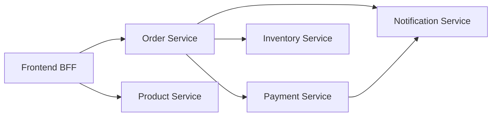

# How to Set Up Workload-to-Workload Authorization in Istio

Author: [nawazdhandala](https://github.com/nawazdhandala)

Tags: Istio, Authorization, Workload Security, Service Mesh, Kubernetes

Description: How to configure Istio authorization policies for workload-to-workload communication using mTLS identity and service accounts.

---

Workload-to-workload authorization is the core of Istio's security model. It answers a simple question: should this specific service be allowed to talk to that specific service? Unlike network policies that work at the IP level, Istio authorization uses cryptographic identities (via mTLS) to verify who is making the request. This makes policies portable and resilient to pod IP changes.

## How Workload Identity Works

Every workload in the Istio mesh gets a SPIFFE identity based on its Kubernetes service account. When pod A talks to pod B, the sidecar proxies perform a mutual TLS handshake. Pod A presents its certificate, pod B presents its certificate, and both sides verify the other's identity.

The identity format is:

```text
spiffe://cluster.local/ns/<namespace>/sa/<service-account>
```

In authorization policies, you reference this as:

```text
cluster.local/ns/<namespace>/sa/<service-account>
```

This identity is assigned by Istio's CA (istiod) and cannot be spoofed by the workload itself.

## Prerequisites

Before setting up workload authorization, make sure:

1. Sidecar injection is enabled in the relevant namespaces
2. mTLS is active (PERMISSIVE or STRICT mode)
3. Each workload uses its own service account

```bash
# Check sidecar injection
kubectl get namespace -L istio-injection

# Verify mTLS status
istioctl x describe pod <pod-name> -n <namespace>
```

Create dedicated service accounts for each workload:

```yaml
apiVersion: v1
kind: ServiceAccount
metadata:
  name: order-service
  namespace: backend
---
apiVersion: v1
kind: ServiceAccount
metadata:
  name: payment-service
  namespace: backend
---
apiVersion: v1
kind: ServiceAccount
metadata:
  name: notification-service
  namespace: backend
---
apiVersion: v1
kind: ServiceAccount
metadata:
  name: frontend-bff
  namespace: frontend
```

## Basic Workload-to-Workload Policy

Here is the simplest form. Allow the order service to call the payment service:

```yaml
apiVersion: security.istio.io/v1
kind: AuthorizationPolicy
metadata:
  name: payment-service-access
  namespace: backend
spec:
  selector:
    matchLabels:
      app: payment-service
  action: ALLOW
  rules:
  - from:
    - source:
        principals:
        - "cluster.local/ns/backend/sa/order-service"
```

This policy is attached to the payment service (via the selector) and allows incoming requests only from the order service. All other workloads are denied.

## Multiple Callers for a Single Service

Most services have more than one caller. List all allowed callers in the principals array:

```yaml
apiVersion: security.istio.io/v1
kind: AuthorizationPolicy
metadata:
  name: order-service-access
  namespace: backend
spec:
  selector:
    matchLabels:
      app: order-service
  action: ALLOW
  rules:
  - from:
    - source:
        principals:
        - "cluster.local/ns/frontend/sa/frontend-bff"
        - "cluster.local/ns/backend/sa/admin-service"
        - "cluster.local/ns/backend/sa/batch-processor"
```

All three principals are ORed. A request from any of these identities will be allowed.

## Restricting by Method and Path

You can combine source identity with operation restrictions to limit what each caller can do:

```yaml
apiVersion: security.istio.io/v1
kind: AuthorizationPolicy
metadata:
  name: order-service-granular
  namespace: backend
spec:
  selector:
    matchLabels:
      app: order-service
  action: ALLOW
  rules:
  # Frontend can read and create orders
  - from:
    - source:
        principals:
        - "cluster.local/ns/frontend/sa/frontend-bff"
    to:
    - operation:
        methods: ["GET", "POST"]
        paths: ["/orders/*"]
  # Admin can do everything
  - from:
    - source:
        principals:
        - "cluster.local/ns/backend/sa/admin-service"
    to:
    - operation:
        methods: ["GET", "POST", "PUT", "DELETE"]
        paths: ["/orders/*", "/admin/*"]
  # Batch processor can only update order status
  - from:
    - source:
        principals:
        - "cluster.local/ns/backend/sa/batch-processor"
    to:
    - operation:
        methods: ["PUT"]
        paths: ["/orders/*/status"]
```

Each rule gives a different level of access to a different caller. This is fine-grained workload authorization in action.

## Building a Complete Service Graph

For a microservices application, you typically need one authorization policy per destination service. Here is a full example:



```yaml
# Product Service - only frontend can access
apiVersion: security.istio.io/v1
kind: AuthorizationPolicy
metadata:
  name: product-service-authz
  namespace: backend
spec:
  selector:
    matchLabels:
      app: product-service
  action: ALLOW
  rules:
  - from:
    - source:
        principals:
        - "cluster.local/ns/frontend/sa/frontend-bff"
---
# Order Service - frontend and admin can access
apiVersion: security.istio.io/v1
kind: AuthorizationPolicy
metadata:
  name: order-service-authz
  namespace: backend
spec:
  selector:
    matchLabels:
      app: order-service
  action: ALLOW
  rules:
  - from:
    - source:
        principals:
        - "cluster.local/ns/frontend/sa/frontend-bff"
        - "cluster.local/ns/backend/sa/admin-service"
---
# Payment Service - only order service can access
apiVersion: security.istio.io/v1
kind: AuthorizationPolicy
metadata:
  name: payment-service-authz
  namespace: backend
spec:
  selector:
    matchLabels:
      app: payment-service
  action: ALLOW
  rules:
  - from:
    - source:
        principals:
        - "cluster.local/ns/backend/sa/order-service"
---
# Inventory Service - only order service can access
apiVersion: security.istio.io/v1
kind: AuthorizationPolicy
metadata:
  name: inventory-service-authz
  namespace: backend
spec:
  selector:
    matchLabels:
      app: inventory-service
  action: ALLOW
  rules:
  - from:
    - source:
        principals:
        - "cluster.local/ns/backend/sa/order-service"
---
# Notification Service - order and payment can access
apiVersion: security.istio.io/v1
kind: AuthorizationPolicy
metadata:
  name: notification-service-authz
  namespace: backend
spec:
  selector:
    matchLabels:
      app: notification-service
  action: ALLOW
  rules:
  - from:
    - source:
        principals:
        - "cluster.local/ns/backend/sa/order-service"
        - "cluster.local/ns/backend/sa/payment-service"
```

## Deny Policies for Explicit Blocking

Sometimes you want to explicitly block a specific workload while allowing others. Use a DENY policy:

```yaml
apiVersion: security.istio.io/v1
kind: AuthorizationPolicy
metadata:
  name: block-legacy-service
  namespace: backend
spec:
  selector:
    matchLabels:
      app: payment-service
  action: DENY
  rules:
  - from:
    - source:
        principals:
        - "cluster.local/ns/backend/sa/legacy-checkout"
```

DENY policies are evaluated before ALLOW policies. Even if another policy allows the legacy checkout service, this DENY will override it.

## Testing Workload Authorization

Test from the allowed workload:

```bash
kubectl exec -n frontend deploy/frontend-bff -- curl -s -w "\n%{http_code}" http://order-service.backend:8080/orders/
```

Test from a workload that should be denied:

```bash
kubectl exec -n backend deploy/notification-service -- curl -s -w "\n%{http_code}" http://payment-service.backend:8080/payments/
```

The first should return 200, the second should return 403 with "RBAC: access denied."

## Handling Service Account Naming

A common mistake is assuming the service account name matches the deployment name. Always verify:

```bash
kubectl get deploy -n backend -o custom-columns=NAME:.metadata.name,SA:.spec.template.spec.serviceAccountName
```

If a deployment does not specify a service account, it uses the `default` service account for the namespace. This is bad practice because all workloads using the `default` account share the same identity. Always assign dedicated service accounts.

## Monitoring Authorization Decisions

Use Prometheus metrics to track authorization outcomes:

```text
istio_requests_total{response_code="403",reporter="destination"}
```

Set up alerts for unexpected spikes in 403 responses, which could indicate a misconfigured policy or a service that was not granted access.

Workload-to-workload authorization is the backbone of a secure service mesh. By mapping out your service dependencies, creating dedicated service accounts, and writing explicit ALLOW policies, you create a cluster where every service call is verified and unauthorized access is blocked at the network level.
