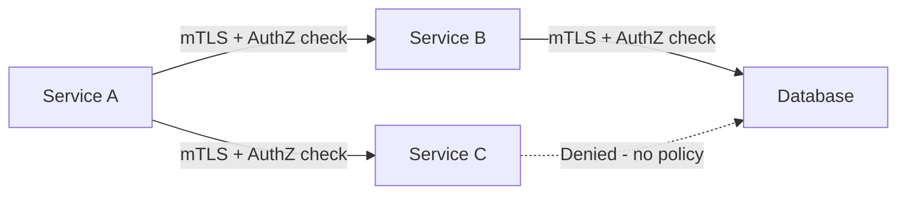

# How to Set Up Zero-Trust Security Model with Istio Authorization

Author: [nawazdhandala](https://github.com/nawazdhandala)

Tags: Istio, Zero Trust, Security, Authorization, Service Mesh, Kubernetes

Description: A hands-on guide to implementing zero-trust security in Kubernetes using Istio's mTLS, authorization policies, and identity verification.

---

Zero trust means "never trust, always verify." In a traditional network, once you are inside the perimeter, you can talk to anything. In a zero-trust model, every request between services must be authenticated and authorized, regardless of where it comes from. Istio gives you the building blocks to implement this model across your entire Kubernetes cluster without changing application code.

## What Zero Trust Looks Like in Practice

In a zero-trust service mesh, every service-to-service call goes through these checks:

1. The caller's identity is verified through mTLS certificates
2. An authorization policy checks whether the caller is allowed to reach the destination
3. The connection is encrypted end-to-end
4. No service can talk to any other service unless explicitly permitted



## Step 1: Enable Strict mTLS Mesh-Wide

The foundation of zero trust in Istio is mutual TLS. Every service must prove its identity with a certificate, and every connection must be encrypted.

Apply a mesh-wide strict mTLS policy:

```yaml
apiVersion: security.istio.io/v1
kind: PeerAuthentication
metadata:
  name: default
  namespace: istio-system
spec:
  mtls:
    mode: STRICT
```

This tells every sidecar in the mesh to require mTLS for all incoming connections. Plaintext traffic will be rejected. This is critical because without mTLS, there is no verified identity, and authorization policies that rely on source identity become meaningless.

Verify that mTLS is active:

```bash
istioctl x describe pod <any-pod> -n <any-namespace>
```

You should see that mutual TLS is enabled for the pod's connections.

## Step 2: Deny All Traffic by Default

The next step is to deny all traffic mesh-wide. This is the "trust nothing" part. Apply a default deny policy in the root namespace:

```yaml
apiVersion: security.istio.io/v1
kind: AuthorizationPolicy
metadata:
  name: deny-all
  namespace: istio-system
spec:
  {}
```

Wait, that is actually an "allow all" because it has no selector and no rules. To deny all, you need:

```yaml
apiVersion: security.istio.io/v1
kind: AuthorizationPolicy
metadata:
  name: allow-nothing
  namespace: istio-system
spec:
  action: ALLOW
  rules: []
```

An ALLOW policy with empty rules matches nothing, which means everything is denied. This applies mesh-wide because it is in the root namespace without a selector.

After applying this, everything will break. That is expected. You will now need to explicitly allow every communication path that your services need.

## Step 3: Map Your Service Dependencies

Before writing ALLOW policies, you need to know which services talk to which. If you already have Istio running with telemetry, you can use Kiali to visualize the service graph:

```bash
istioctl dashboard kiali
```

Or query Prometheus for connection data:

```bash
istio_requests_total{reporter="destination"}
```

Document every valid communication path. For example:

- Frontend -> API Gateway
- API Gateway -> User Service
- API Gateway -> Order Service
- Order Service -> Database
- User Service -> Database

## Step 4: Create Explicit ALLOW Policies

Now create an ALLOW policy for each valid communication path. Start with the most critical services.

Allow the API gateway to reach the user service:

```yaml
apiVersion: security.istio.io/v1
kind: AuthorizationPolicy
metadata:
  name: allow-gateway-to-user-service
  namespace: backend
spec:
  selector:
    matchLabels:
      app: user-service
  action: ALLOW
  rules:
  - from:
    - source:
        principals:
        - "cluster.local/ns/gateway/sa/api-gateway"
    to:
    - operation:
        ports:
        - "8080"
```

Allow the API gateway to reach the order service:

```yaml
apiVersion: security.istio.io/v1
kind: AuthorizationPolicy
metadata:
  name: allow-gateway-to-order-service
  namespace: backend
spec:
  selector:
    matchLabels:
      app: order-service
  action: ALLOW
  rules:
  - from:
    - source:
        principals:
        - "cluster.local/ns/gateway/sa/api-gateway"
    to:
    - operation:
        ports:
        - "8080"
```

Allow services to reach the database:

```yaml
apiVersion: security.istio.io/v1
kind: AuthorizationPolicy
metadata:
  name: allow-services-to-database
  namespace: database
spec:
  selector:
    matchLabels:
      app: postgres
  action: ALLOW
  rules:
  - from:
    - source:
        principals:
        - "cluster.local/ns/backend/sa/user-service"
        - "cluster.local/ns/backend/sa/order-service"
    to:
    - operation:
        ports:
        - "5432"
```

## Step 5: Allow Health Checks and System Traffic

Do not forget about system-level traffic. Kubernetes health checks, Istio control plane communication, and DNS all need to work.

Allow Kubelet health probes (these come from outside the mesh):

If you are using Istio's probe rewrite feature (enabled by default), health probes are handled by the sidecar and do not need special authorization rules. But if you disabled probe rewriting, you need to allow traffic from the kubelet IP range.

Allow Istio control plane traffic:

```yaml
apiVersion: security.istio.io/v1
kind: AuthorizationPolicy
metadata:
  name: allow-istiod
  namespace: istio-system
spec:
  selector:
    matchLabels:
      app: istiod
  action: ALLOW
  rules:
  - from:
    - source:
        principals:
        - "*"
```

## Step 6: Add Request-Level Authentication for External Traffic

For traffic coming from outside the mesh (through the ingress gateway), add JWT validation:

```yaml
apiVersion: security.istio.io/v1
kind: RequestAuthentication
metadata:
  name: jwt-auth
  namespace: gateway
spec:
  selector:
    matchLabels:
      app: istio-ingressgateway
  jwtRules:
  - issuer: "https://auth.example.com"
    jwksUri: "https://auth.example.com/.well-known/jwks.json"
    forwardOriginalToken: true
```

Then require valid JWTs for protected routes:

```yaml
apiVersion: security.istio.io/v1
kind: AuthorizationPolicy
metadata:
  name: require-jwt-at-gateway
  namespace: gateway
spec:
  selector:
    matchLabels:
      app: istio-ingressgateway
  action: ALLOW
  rules:
  - from:
    - source:
        requestPrincipals:
        - "*"
    to:
    - operation:
        paths:
        - "/api/*"
  - to:
    - operation:
        paths:
        - "/health"
        - "/public/*"
```

## Step 7: Monitor and Audit

Zero trust is not a "set it and forget it" thing. You need ongoing monitoring.

Set up Prometheus alerts for authorization denials:

```yaml
groups:
- name: istio-authz
  rules:
  - alert: HighAuthorizationDenials
    expr: |
      sum(rate(istio_requests_total{response_code="403"}[5m])) by (destination_workload) > 10
    for: 5m
    annotations:
      summary: "High rate of 403 denials for {{ $labels.destination_workload }}"
```

Check Envoy access logs for denied requests:

```bash
kubectl logs <pod-name> -c istio-proxy | grep "403"
```

## Gradual Rollout Strategy

Going from "no policies" to "zero trust" in one shot is risky. Here is a safer approach:

1. **Start with mTLS in PERMISSIVE mode.** This does not break anything but starts encrypting traffic where possible.

2. **Switch to STRICT mTLS.** Verify no services break. Fix any services that were communicating over plaintext.

3. **Add ALLOW policies one namespace at a time.** Start with the least critical namespace and work your way to production-critical services.

4. **Apply the mesh-wide deny-all policy last.** Only do this once you have verified that all necessary ALLOW policies are in place.

5. **Monitor heavily during the first week.** Watch for 403 errors and add any missing ALLOW policies.

## Summary

Implementing zero trust with Istio comes down to three things: strict mTLS everywhere, a default deny posture, and explicit ALLOW policies for every legitimate communication path. It requires upfront work to map your service dependencies and write the policies, but the result is a cluster where every service call is authenticated, authorized, and encrypted. No service can be accessed unless you have specifically permitted it.
