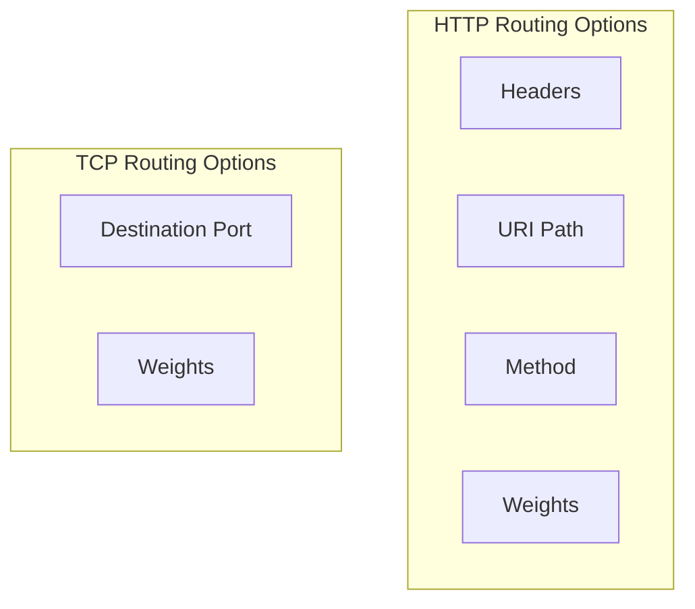

# How to Shift TCP Traffic Between Service Versions in Istio

Author: [nawazdhandala](https://github.com/nawazdhandala)

Tags: Istio, Service Mesh, Traffic Management, TCP, Kubernetes

Description: How to configure weighted TCP traffic routing in Istio for non-HTTP services like databases, message queues, and custom TCP protocols.

---

Most Istio traffic management examples focus on HTTP routing, but plenty of services use raw TCP - databases, message queues, custom protocols, legacy applications. Istio supports TCP traffic shifting too, through the `tcp` section of VirtualService. The setup is different from HTTP routing, and there are some limitations to be aware of.

## HTTP vs TCP Traffic Shifting

HTTP traffic shifting in Istio can use headers, paths, methods, and other HTTP-specific attributes for routing decisions. TCP traffic shifting is simpler - you can only route based on destination port and use weighted routing between subsets. There are no header-based matches or URI-based routing for TCP.



## Basic TCP Traffic Shifting

Here is how to set up weighted TCP routing between two versions of a service:

### Step 1: Deploy Two Versions

```yaml
apiVersion: apps/v1
kind: Deployment
metadata:
  name: tcp-service-v1
  namespace: default
spec:
  replicas: 3
  selector:
    matchLabels:
      app: tcp-service
      version: v1
  template:
    metadata:
      labels:
        app: tcp-service
        version: v1
    spec:
      containers:
        - name: tcp-service
          image: tcp-service:1.0.0
          ports:
            - containerPort: 9000
---
apiVersion: apps/v1
kind: Deployment
metadata:
  name: tcp-service-v2
  namespace: default
spec:
  replicas: 1
  selector:
    matchLabels:
      app: tcp-service
      version: v2
  template:
    metadata:
      labels:
        app: tcp-service
        version: v2
    spec:
      containers:
        - name: tcp-service
          image: tcp-service:2.0.0
          ports:
            - containerPort: 9000
---
apiVersion: v1
kind: Service
metadata:
  name: tcp-service
  namespace: default
spec:
  selector:
    app: tcp-service
  ports:
    - port: 9000
      targetPort: 9000
      name: tcp-custom
```

Important: the port must have a name that starts with `tcp-` for Istio to recognize it as TCP traffic. Without this naming convention, Istio may treat it differently.

### Step 2: Define Subsets

```yaml
apiVersion: networking.istio.io/v1beta1
kind: DestinationRule
metadata:
  name: tcp-service
  namespace: default
spec:
  host: tcp-service
  subsets:
    - name: v1
      labels:
        version: v1
    - name: v2
      labels:
        version: v2
```

### Step 3: Configure Weighted TCP Routing

```yaml
apiVersion: networking.istio.io/v1beta1
kind: VirtualService
metadata:
  name: tcp-service
  namespace: default
spec:
  hosts:
    - tcp-service
  tcp:
    - match:
        - port: 9000
      route:
        - destination:
            host: tcp-service
            subset: v1
            port:
              number: 9000
          weight: 80
        - destination:
            host: tcp-service
            subset: v2
            port:
              number: 9000
          weight: 20
```

Notice the `tcp` section instead of `http`. The match only supports port-based matching.

## Gradual TCP Traffic Shift

Just like HTTP, you shift traffic gradually:

### Phase 1: 95/5 Split

```yaml
apiVersion: networking.istio.io/v1beta1
kind: VirtualService
metadata:
  name: tcp-service
  namespace: default
spec:
  hosts:
    - tcp-service
  tcp:
    - match:
        - port: 9000
      route:
        - destination:
            host: tcp-service
            subset: v1
            port:
              number: 9000
          weight: 95
        - destination:
            host: tcp-service
            subset: v2
            port:
              number: 9000
          weight: 5
```

### Phase 2: 50/50 Split

```yaml
apiVersion: networking.istio.io/v1beta1
kind: VirtualService
metadata:
  name: tcp-service
  namespace: default
spec:
  hosts:
    - tcp-service
  tcp:
    - match:
        - port: 9000
      route:
        - destination:
            host: tcp-service
            subset: v1
            port:
              number: 9000
          weight: 50
        - destination:
            host: tcp-service
            subset: v2
            port:
              number: 9000
          weight: 50
```

### Phase 3: Complete Shift

```yaml
apiVersion: networking.istio.io/v1beta1
kind: VirtualService
metadata:
  name: tcp-service
  namespace: default
spec:
  hosts:
    - tcp-service
  tcp:
    - match:
        - port: 9000
      route:
        - destination:
            host: tcp-service
            subset: v2
            port:
              number: 9000
          weight: 100
```

## Real-World Example: Database Proxy Migration

Migrating traffic from an old database proxy to a new one:

```yaml
apiVersion: networking.istio.io/v1beta1
kind: DestinationRule
metadata:
  name: db-proxy
  namespace: default
spec:
  host: db-proxy
  subsets:
    - name: pgbouncer
      labels:
        proxy: pgbouncer
    - name: pgcat
      labels:
        proxy: pgcat
  trafficPolicy:
    connectionPool:
      tcp:
        maxConnections: 200
        connectTimeout: 5s
---
apiVersion: networking.istio.io/v1beta1
kind: VirtualService
metadata:
  name: db-proxy
  namespace: default
spec:
  hosts:
    - db-proxy
  tcp:
    - match:
        - port: 5432
      route:
        - destination:
            host: db-proxy
            subset: pgbouncer
            port:
              number: 5432
          weight: 90
        - destination:
            host: db-proxy
            subset: pgcat
            port:
              number: 5432
          weight: 10
```

This shifts 10% of database connections to the new proxy while keeping 90% on the proven one.

## Real-World Example: Redis Migration

Shifting traffic between Redis versions:

```yaml
apiVersion: networking.istio.io/v1beta1
kind: DestinationRule
metadata:
  name: redis
  namespace: default
spec:
  host: redis
  subsets:
    - name: redis6
      labels:
        version: "6"
    - name: redis7
      labels:
        version: "7"
---
apiVersion: networking.istio.io/v1beta1
kind: VirtualService
metadata:
  name: redis
  namespace: default
spec:
  hosts:
    - redis
  tcp:
    - match:
        - port: 6379
      route:
        - destination:
            host: redis
            subset: redis6
            port:
              number: 6379
          weight: 80
        - destination:
            host: redis
            subset: redis7
            port:
              number: 6379
          weight: 20
```

## Important Considerations for TCP Traffic Shifting

### Connection-Level Routing

TCP routing in Istio happens at the connection level, not the request level. Once a TCP connection is established to a specific backend, all data on that connection goes to that backend. This is different from HTTP, where each request can be routed independently.

This means:
- A long-lived TCP connection to v1 stays on v1, even after you change the weights
- The traffic split is based on new connections, not existing ones
- For accurate traffic splitting, connections need to be established regularly

### Port Naming Requirements

Istio needs to know a port carries TCP traffic. Name your service ports with the `tcp-` prefix:

```yaml
apiVersion: v1
kind: Service
metadata:
  name: my-tcp-service
spec:
  ports:
    - port: 9000
      name: tcp-custom  # Must start with tcp-
```

### No Match on Source

Unlike HTTP routing, TCP routing cannot match on source labels or namespaces in the VirtualService match conditions (though you can use AuthorizationPolicy for access control). The only match criteria is the destination port.

### Monitoring TCP Traffic Split

```bash
# Check TCP connection stats
kubectl exec deploy/tcp-service-v1 -c istio-proxy -- \
  curl -s localhost:15000/stats | grep "cx_total"

# Check active connections per subset
kubectl exec deploy/my-client -c istio-proxy -- \
  curl -s localhost:15000/clusters | grep tcp-service
```

For Prometheus, track TCP metrics:

```text
# TCP connections opened per second by version
sum(rate(istio_tcp_connections_opened_total{destination_service="tcp-service.default.svc.cluster.local"}[5m])) by (destination_version)

# TCP bytes sent per version
sum(rate(istio_tcp_sent_bytes_total{destination_service="tcp-service.default.svc.cluster.local"}[5m])) by (destination_version)
```

## Circuit Breaking for TCP Services During Shift

Add connection limits to protect both versions during the transition:

```yaml
apiVersion: networking.istio.io/v1beta1
kind: DestinationRule
metadata:
  name: tcp-service
  namespace: default
spec:
  host: tcp-service
  trafficPolicy:
    connectionPool:
      tcp:
        maxConnections: 200
        connectTimeout: 5s
  subsets:
    - name: v1
      labels:
        version: v1
      trafficPolicy:
        connectionPool:
          tcp:
            maxConnections: 180
    - name: v2
      labels:
        version: v2
      trafficPolicy:
        connectionPool:
          tcp:
            maxConnections: 40
```

The v2 subset gets lower connection limits proportional to the traffic it handles.

TCP traffic shifting is less flexible than HTTP traffic shifting, but it covers a critical gap for non-HTTP services. The key thing to remember is that routing happens per-connection, so long-lived connections will not be affected by weight changes until they reconnect.
