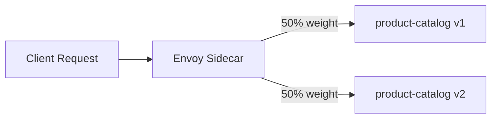

# How to Shift Traffic from v1 to v2 Using Istio

Author: [nawazdhandala](https://github.com/nawazdhandala)

Tags: Istio, Traffic Shifting, Canary Deployment, Kubernetes, Service Mesh

Description: Step-by-step guide to gradually shifting traffic from version 1 to version 2 of a service using Istio VirtualService weight-based routing.

---

Deploying a new version of a service is always a bit nerve-wracking, especially when real users are involved. You cannot just flip a switch and hope everything works. What you need is a controlled, gradual rollout where you send a small percentage of traffic to the new version, watch how it performs, and then slowly increase the ratio until v2 handles everything.

Istio makes this straightforward with weight-based traffic splitting in VirtualService resources. You define how much traffic goes to v1 and how much goes to v2, and you can adjust those numbers any time you want.

## What You Need

- Kubernetes cluster with Istio installed
- Two versions of your service deployed (v1 and v2)
- Istio sidecar injection enabled in your namespace
- Basic familiarity with VirtualService and DestinationRule

## Deploy Both Versions

Here is a typical setup with a `product-catalog` service running v1 and v2 side by side.

```yaml
apiVersion: apps/v1
kind: Deployment
metadata:
  name: product-catalog-v1
spec:
  replicas: 3
  selector:
    matchLabels:
      app: product-catalog
      version: v1
  template:
    metadata:
      labels:
        app: product-catalog
        version: v1
    spec:
      containers:
        - name: product-catalog
          image: myregistry/product-catalog:1.0.0
          ports:
            - containerPort: 8080
---
apiVersion: apps/v1
kind: Deployment
metadata:
  name: product-catalog-v2
spec:
  replicas: 3
  selector:
    matchLabels:
      app: product-catalog
      version: v2
  template:
    metadata:
      labels:
        app: product-catalog
        version: v2
    spec:
      containers:
        - name: product-catalog
          image: myregistry/product-catalog:2.0.0
          ports:
            - containerPort: 8080
```

And the Kubernetes Service:

```yaml
apiVersion: v1
kind: Service
metadata:
  name: product-catalog
spec:
  selector:
    app: product-catalog
  ports:
    - port: 80
      targetPort: 8080
```

## Define the DestinationRule

The DestinationRule sets up the subsets that your VirtualService will reference. Each subset maps to a version label.

```yaml
apiVersion: networking.istio.io/v1
kind: DestinationRule
metadata:
  name: product-catalog
spec:
  host: product-catalog
  subsets:
    - name: v1
      labels:
        version: v1
    - name: v2
      labels:
        version: v2
```

```bash
kubectl apply -f product-catalog-destinationrule.yaml
```

## Step 1: Start with All Traffic on v1

Before you begin shifting, make sure all traffic is explicitly routed to v1. Without a VirtualService, Kubernetes round-robins across all pods, which means v2 would already be getting traffic.

```yaml
apiVersion: networking.istio.io/v1
kind: VirtualService
metadata:
  name: product-catalog
spec:
  hosts:
    - product-catalog
  http:
    - route:
        - destination:
            host: product-catalog
            subset: v1
          weight: 100
        - destination:
            host: product-catalog
            subset: v2
          weight: 0
```

```bash
kubectl apply -f product-catalog-virtualservice.yaml
```

At this point, v2 pods are running but receiving no traffic. Good - this gives you a chance to verify they started correctly.

## Step 2: Send 10% to v2

Once you have confirmed v2 pods are healthy, start with a small slice of traffic.

```yaml
apiVersion: networking.istio.io/v1
kind: VirtualService
metadata:
  name: product-catalog
spec:
  hosts:
    - product-catalog
  http:
    - route:
        - destination:
            host: product-catalog
            subset: v1
          weight: 90
        - destination:
            host: product-catalog
            subset: v2
          weight: 10
```

```bash
kubectl apply -f product-catalog-virtualservice.yaml
```

Now 10% of requests hit v2. Monitor your dashboards for a while. Look at error rates, latency percentiles (p50, p95, p99), and any application-specific metrics.

## Step 3: Increase to 50%

If v2 looks solid after some time at 10%, bump it up.

```yaml
    - route:
        - destination:
            host: product-catalog
            subset: v1
          weight: 50
        - destination:
            host: product-catalog
            subset: v2
          weight: 50
```

At 50/50, you are getting a real comparison between the two versions. This is a great time to compare performance metrics head-to-head.

## Step 4: Move to 90% on v2

Getting close to done. Send most traffic to v2 while keeping v1 around as a safety net.

```yaml
    - route:
        - destination:
            host: product-catalog
            subset: v1
          weight: 10
        - destination:
            host: product-catalog
            subset: v2
          weight: 90
```

## Step 5: Complete the Migration

Everything looks good? Route 100% to v2.

```yaml
    - route:
        - destination:
            host: product-catalog
            subset: v2
          weight: 100
```

## Monitoring During the Shift

At every stage, you should be watching these metrics:

**Request success rate:**

```bash
istioctl dashboard prometheus
```

Query for error rates:

```text
sum(rate(istio_requests_total{destination_service="product-catalog.default.svc.cluster.local",response_code!~"5.*"}[5m])) by (destination_version)
/
sum(rate(istio_requests_total{destination_service="product-catalog.default.svc.cluster.local"}[5m])) by (destination_version)
```

**Latency comparison:**

```text
histogram_quantile(0.99, sum(rate(istio_request_duration_milliseconds_bucket{destination_service="product-catalog.default.svc.cluster.local"}[5m])) by (le, destination_version))
```

**Quick check with istioctl:**

```bash
istioctl x describe service product-catalog
```

This command gives you a summary of the routing rules in effect.

## The Traffic Flow

Here is what happens at the 50/50 split:



The Envoy proxy in the sidecar handles the weight distribution. It is not perfectly round-robin at small scales - if you send 10 requests, you might see 6 go to one side and 4 to the other. But over thousands of requests, it converges to the configured percentages.

## Common Mistakes to Avoid

**Weights not adding up to 100.** Istio requires the weights in a route to sum to 100. If they do not, the configuration will not work as expected.

**Forgetting the DestinationRule.** Without subsets defined in a DestinationRule, your VirtualService has nothing to reference. You will get routing errors.

**Not matching labels correctly.** The `version` labels in your DestinationRule subsets must exactly match the pod labels. A typo here means traffic goes nowhere.

**Jumping too fast.** Going from 0% to 100% defeats the purpose of gradual traffic shifting. Be patient. Each step should run long enough to build confidence.

**Ignoring resource scaling.** If v2 is getting 50% of traffic but only has 1 replica while v1 has 5, you are going to see problems. Scale v2 appropriately as you increase its traffic share.

## Cleaning Up After Migration

Once v2 is handling 100% and you are confident it is stable, you can:

1. Scale down v1 replicas to 0 or delete the v1 deployment
2. Simplify the VirtualService to only reference v2
3. Optionally remove the DestinationRule if you no longer need subsets

```bash
kubectl delete deployment product-catalog-v1
```

Keep v1 images and manifests around in your Git repo though. You never know when you might need to roll back.

## Summary of the Shift Schedule

| Stage | v1 Weight | v2 Weight | Duration |
|-------|-----------|-----------|----------|
| Start | 100% | 0% | Until v2 pods healthy |
| Canary | 90% | 10% | 1-2 hours minimum |
| Balanced | 50% | 50% | 1-4 hours |
| Near-complete | 10% | 90% | 1-2 hours |
| Complete | 0% | 100% | Permanent |

The durations here are just suggestions. For critical services, you might want to stay at each step for a full day or even a week. The point is that Istio gives you the control to move at whatever pace makes sense for your team and your risk tolerance.

Weight-based traffic shifting is one of the most practical features Istio offers. It turns scary deployments into boring, controlled operations - and boring is exactly what you want when it comes to production releases.
