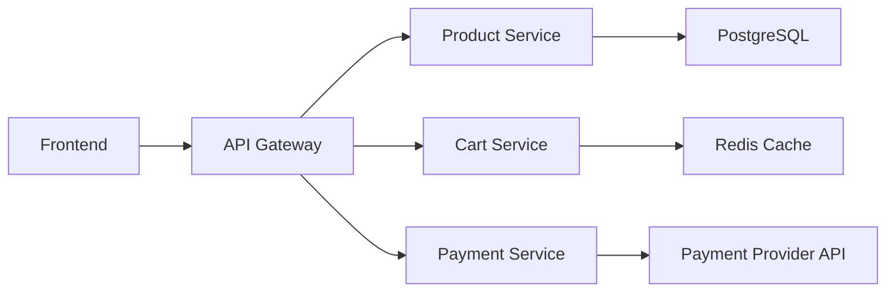

# How to Test Application Resilience with Istio Fault Injection

Author: [nawazdhandala](https://github.com/nawazdhandala)

Tags: Istio, Fault Injection, Resilience Testing, Chaos Engineering, Kubernetes

Description: A complete strategy for testing application resilience using Istio fault injection, covering delays, aborts, and progressive failure scenarios.

---

Building resilient applications is not just about writing retry logic or adding timeouts. You need to actually test that your resilience patterns work. The problem is that failures in distributed systems are hard to reproduce on demand. Network partitions, slow databases, flaky APIs - these things happen unpredictably, and you can't just wait around for them.

Istio fault injection gives you the ability to simulate these failures on demand. You can inject delays, error responses, and partial failures into any service-to-service communication in your mesh. This post outlines a practical strategy for using these capabilities to systematically test your application's resilience.

## Building a Test Plan

Before injecting faults, you need a plan. Random fault injection is better than nothing, but targeted testing based on known risks is far more valuable.

Start by mapping your critical paths:



For each dependency, ask:

- What happens if this dependency is completely down?
- What happens if it responds slowly (2x, 5x, 10x normal latency)?
- What happens if it intermittently fails (10%, 25%, 50% of requests)?
- Does the calling service have timeouts, retries, and fallbacks?

## Test Category 1: Complete Failure

Simulate a service being completely unavailable by injecting 100% abort:

```yaml
apiVersion: networking.istio.io/v1beta1
kind: VirtualService
metadata:
  name: payment-service
  namespace: production
spec:
  hosts:
    - payment-service
  http:
    - fault:
        abort:
          httpStatus: 503
          percentage:
            value: 100.0
      route:
        - destination:
            host: payment-service
```

What to verify:

- Does the frontend show an appropriate error message?
- Can users still browse products and add to cart, even if payment is down?
- Does the system log the errors appropriately?
- Do alerts fire?

```bash
# Apply the fault
kubectl apply -f payment-complete-failure.yaml

# Run your test suite or manually test the user flows
# Check frontend behavior
curl -v http://frontend:8080/checkout

# Check error logs
kubectl logs deploy/api-gateway -c istio-proxy -n production | grep "payment-service"

# Clean up
kubectl delete virtualservice payment-service -n production
```

## Test Category 2: Slow Responses

Slow dependencies are tricky because they tie up resources. A service waiting for a slow upstream holds connections, threads, and memory:

```yaml
apiVersion: networking.istio.io/v1beta1
kind: VirtualService
metadata:
  name: product-service
  namespace: production
spec:
  hosts:
    - product-service
  http:
    - fault:
        delay:
          fixedDelay: 5s
          percentage:
            value: 100.0
      route:
        - destination:
            host: product-service
```

What to verify:

- Does the calling service time out before 5 seconds?
- If it times out, does it return a useful error to the user?
- Does the system recover when the delay is removed?
- Under sustained slow responses, does the calling service run out of connections?

Test with concurrent requests to check for connection pool exhaustion:

```bash
# Apply delay
kubectl apply -f product-slow.yaml

# Run concurrent requests
for i in $(seq 1 50); do
  kubectl exec deploy/test-client -n production -- curl -s -o /dev/null -w "%{http_code} %{time_total}s\n" http://product-service:8080/products &
done
wait
```

## Test Category 3: Intermittent Failures

This is the hardest type of failure to handle because it's unpredictable. Some requests succeed, some fail:

```yaml
apiVersion: networking.istio.io/v1beta1
kind: VirtualService
metadata:
  name: product-service
  namespace: production
spec:
  hosts:
    - product-service
  http:
    - fault:
        abort:
          httpStatus: 500
          percentage:
            value: 30.0
      route:
        - destination:
            host: product-service
```

What to verify:

- Does the calling service retry failed requests?
- After retrying, does the user get a successful response most of the time?
- Does the circuit breaker open if failures persist?
- Are retries adding excessive load to the upstream?

## Test Category 4: Compound Failures

Real outages rarely affect just one service. Test what happens when multiple dependencies degrade simultaneously:

```yaml
# Slow product service
apiVersion: networking.istio.io/v1beta1
kind: VirtualService
metadata:
  name: product-service
  namespace: production
spec:
  hosts:
    - product-service
  http:
    - fault:
        delay:
          fixedDelay: 3s
          percentage:
            value: 50.0
      route:
        - destination:
            host: product-service
---
# Failing payment service
apiVersion: networking.istio.io/v1beta1
kind: VirtualService
metadata:
  name: payment-service
  namespace: production
spec:
  hosts:
    - payment-service
  http:
    - fault:
        abort:
          httpStatus: 503
          percentage:
            value: 25.0
      route:
        - destination:
            host: payment-service
```

This creates a scenario where the product service is slow and the payment service is intermittently failing. How does the frontend handle this?

## Running Tests Safely

Testing in production requires care. Here's how to do it without causing real incidents:

### Use Header-Based Targeting

Only inject faults for requests with a specific header:

```yaml
apiVersion: networking.istio.io/v1beta1
kind: VirtualService
metadata:
  name: payment-service
  namespace: production
spec:
  hosts:
    - payment-service
  http:
    - match:
        - headers:
            x-chaos-test:
              exact: "true"
      fault:
        abort:
          httpStatus: 503
          percentage:
            value: 100.0
      route:
        - destination:
            host: payment-service
    - route:
        - destination:
            host: payment-service
```

Run tests with synthetic traffic that includes the header. Real users are unaffected.

### Use a Staging Environment

If you have a staging environment with Istio, run fault injection tests there first. It's less risky and you can be more aggressive with failure percentages.

### Set Time Limits

Don't leave fault injection running indefinitely. Script your tests with automatic cleanup:

```bash
#!/bin/bash
# apply-and-cleanup.sh

# Apply fault injection
kubectl apply -f fault-injection.yaml

# Wait for test duration
echo "Fault injection active for 5 minutes..."
sleep 300

# Clean up
kubectl delete -f fault-injection.yaml
echo "Fault injection removed."
```

## Measuring Resilience

For each test, record these metrics:

| Metric | What It Shows |
|---|---|
| Error rate at the frontend | How much failure users actually see |
| p99 latency at the frontend | Impact on user experience |
| Retry rate | Whether retries are working |
| Circuit breaker trips | Whether circuit breakers activate |
| Recovery time | How quickly the system returns to normal after fault removal |

Compare these against your SLO targets. If your SLO says 99.9% availability and a 10% failure rate on one dependency causes the frontend error rate to exceed 0.1%, your resilience needs work.

## Building a Regular Test Schedule

Fault injection testing shouldn't be a one-time activity. Build it into your release process:

1. Before each major release, run the full fault injection test suite
2. Monthly, run compound failure scenarios
3. After any changes to retry policies, timeouts, or circuit breakers, validate them with fault injection
4. When adding new service dependencies, add corresponding fault injection tests

The investment in resilience testing pays for itself the first time a real outage hits and your system handles it gracefully instead of cascading into a full outage.
