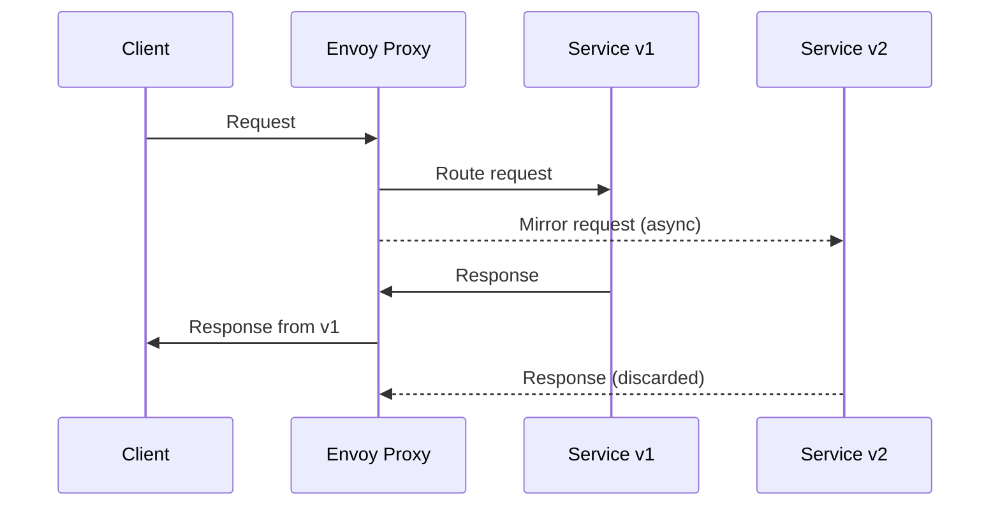

# How to Test New Service Versions with Traffic Mirroring

Author: [nawazdhandala](https://github.com/nawazdhandala)

Tags: Istio, Traffic Mirroring, Service Mesh, Kubernetes, Testing, Canary Deployment

Description: Learn how to use Istio traffic mirroring to safely test new service versions by duplicating live production traffic without affecting real users.

---

Traffic mirroring (sometimes called shadowing) is one of the most underused features in Istio, and honestly, it should be part of every team's deployment toolkit. The idea is simple: you copy real production traffic and send it to a new version of your service, but the mirrored responses get discarded. Your users never see the results from the new version. You get to see how it handles real-world load and data without any risk.

This is way safer than spinning up a canary and hoping for the best. With mirroring, there is zero impact on production traffic if the new version crashes, returns errors, or takes too long.

## Prerequisites

Before you get started, make sure you have:

- A Kubernetes cluster with Istio installed (1.18+ recommended)
- `istioctl` and `kubectl` configured
- A service with at least two versions deployed (v1 and v2)
- Sidecar injection enabled in your namespace

## Setting Up the Sample Application

Suppose you have a service called `payment-service` with two deployments, one for v1 and one for v2.

```yaml
apiVersion: apps/v1
kind: Deployment
metadata:
  name: payment-service-v1
  labels:
    app: payment-service
    version: v1
spec:
  replicas: 3
  selector:
    matchLabels:
      app: payment-service
      version: v1
  template:
    metadata:
      labels:
        app: payment-service
        version: v1
    spec:
      containers:
        - name: payment-service
          image: myregistry/payment-service:1.0.0
          ports:
            - containerPort: 8080
---
apiVersion: apps/v1
kind: Deployment
metadata:
  name: payment-service-v2
  labels:
    app: payment-service
    version: v2
spec:
  replicas: 3
  selector:
    matchLabels:
      app: payment-service
      version: v2
  template:
    metadata:
      labels:
        app: payment-service
        version: v2
    spec:
      containers:
        - name: payment-service
          image: myregistry/payment-service:2.0.0
          ports:
            - containerPort: 8080
```

You also need a Kubernetes Service that targets both versions:

```yaml
apiVersion: v1
kind: Service
metadata:
  name: payment-service
spec:
  selector:
    app: payment-service
  ports:
    - port: 80
      targetPort: 8080
```

## Creating the DestinationRule

First, define subsets for v1 and v2 in a DestinationRule. This tells Istio how to group pods by version label.

```yaml
apiVersion: networking.istio.io/v1
kind: DestinationRule
metadata:
  name: payment-service
spec:
  host: payment-service
  subsets:
    - name: v1
      labels:
        version: v1
    - name: v2
      labels:
        version: v2
```

Apply it:

```bash
kubectl apply -f payment-service-destinationrule.yaml
```

## Configuring Traffic Mirroring with a VirtualService

Now comes the interesting part. You configure a VirtualService that routes all traffic to v1 and mirrors it to v2.

```yaml
apiVersion: networking.istio.io/v1
kind: VirtualService
metadata:
  name: payment-service
spec:
  hosts:
    - payment-service
  http:
    - route:
        - destination:
            host: payment-service
            subset: v1
          weight: 100
      mirror:
        host: payment-service
        subset: v2
      mirrorPercentage:
        value: 100.0
```

Apply this:

```bash
kubectl apply -f payment-service-virtualservice.yaml
```

Here is what happens with this configuration:

1. Every request to `payment-service` goes to v1 (the stable version)
2. A copy of every request also goes to v2
3. Responses from v2 are thrown away - users only see responses from v1
4. The mirrored requests include a `-shadow` suffix on the `Host` header

## Controlling Mirror Percentage

You probably do not want to mirror 100% of traffic if your service handles thousands of requests per second. You can dial it down:

```yaml
      mirror:
        host: payment-service
        subset: v2
      mirrorPercentage:
        value: 10.0
```

This mirrors only 10% of traffic. Start low, watch the metrics, and ramp up if the new version handles it well.

## How the Mirrored Traffic Works Internally

When Istio mirrors traffic, the Envoy sidecar proxy handles the duplication. The original request goes through the normal routing path to v1. Envoy also fires off an asynchronous copy to v2. Critically, the mirrored request is fire-and-forget. Envoy does not wait for a response from v2 before returning the v1 response to the caller.

The mirrored request has a modified `Host` header. If the original request targets `payment-service`, the mirrored request header becomes `payment-service-shadow`. This helps you distinguish mirrored traffic in your logs and metrics.



## Monitoring the Mirrored Service

The whole point of mirroring is to observe how v2 behaves. Here are the things you want to keep an eye on:

**Check Envoy metrics for the mirrored cluster:**

```bash
istioctl proxy-config cluster <pod-name> -o json | grep -A 5 "payment-service-v2"
```

**Look at v2 pod logs:**

```bash
kubectl logs -l app=payment-service,version=v2 -f
```

**Use Kiali or Grafana dashboards** to compare error rates and latency between v1 and v2. Istio generates metrics for both the primary and mirrored traffic, so you can build dashboards that show them side by side.

**Check response codes in Prometheus:**

```bash
istio_requests_total{destination_service="payment-service.default.svc.cluster.local",destination_version="v2"}
```

## Watch Out for Side Effects

There is one big caveat with traffic mirroring: if your service writes to a database, sends emails, charges credit cards, or triggers any other side effect, the mirrored traffic will also perform those actions. That means you could end up with duplicate writes or duplicate charges.

You have a few ways to handle this:

1. **Point v2 at a separate database** or use a test/staging database
2. **Use feature flags** in v2 to disable write operations
3. **Configure v2 in read-only mode** if your application supports it
4. **Use a mock backend** for external service calls in v2

This is arguably the most important thing to get right before you enable mirroring. Forgetting about side effects can cause real production issues.

## Removing the Mirror

When you are done testing and ready to either promote v2 or scrap it, remove the mirror configuration:

```yaml
apiVersion: networking.istio.io/v1
kind: VirtualService
metadata:
  name: payment-service
spec:
  hosts:
    - payment-service
  http:
    - route:
        - destination:
            host: payment-service
            subset: v1
          weight: 100
```

Or if you are promoting v2:

```yaml
apiVersion: networking.istio.io/v1
kind: VirtualService
metadata:
  name: payment-service
spec:
  hosts:
    - payment-service
  http:
    - route:
        - destination:
            host: payment-service
            subset: v2
          weight: 100
```

## Practical Tips

- Always start with a low mirror percentage and increase gradually
- Make sure v2 has enough resources (CPU, memory) to handle the mirrored load
- Set up alerts on v2 error rates before enabling mirroring
- Use network policies to isolate v2 from production databases if needed
- Remember that mirrored traffic counts toward your service mesh resource usage

Traffic mirroring gives you a production-quality testing signal that staging environments simply cannot replicate. The requests are real, the data patterns are real, and the timing is real. If you are deploying critical services and want confidence before shifting traffic, mirroring is the way to go. Set it up, watch the dashboards, and only promote the new version when you are satisfied with its behavior under real load.
