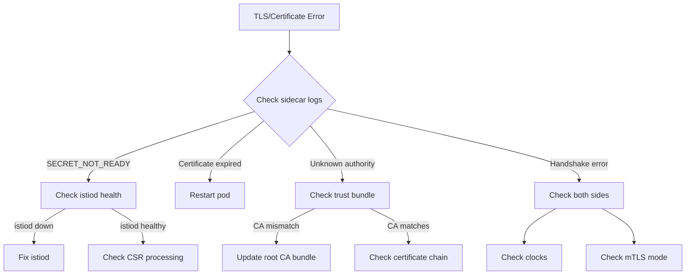

# How to Troubleshoot Certificate Errors in Istio

Author: [nawazdhandala](https://github.com/nawazdhandala)

Tags: Istio, Certificates, Troubleshooting, MTLS, Security, Kubernetes

Description: A practical troubleshooting guide for diagnosing and fixing certificate errors in Istio, covering expired certs, chain issues, and rotation failures.

---

Certificate errors in Istio are some of the most frustrating issues to debug. The symptoms are vague - connection refused, 503 errors, TLS handshake failures - and the root cause is buried in certificate chains, expiry times, and trust bundles. This guide gives you a systematic approach to finding and fixing certificate problems.

## Common Symptoms of Certificate Issues

Before diving into diagnostics, here are the symptoms that usually point to certificate problems:

- `503 Service Unavailable` with response flag `UC` (upstream connection failure)
- `TLS error: SECRET_NOT_READY` in sidecar logs
- `connection refused` or `connection reset` between services
- Pods stuck in `ContainerCreating` or `Init` state
- `x509: certificate has expired or is not yet valid` in logs
- `x509: certificate signed by unknown authority` in logs

## Step 1: Check the Sidecar Proxy Logs

Start with the destination service's sidecar logs:

```bash
kubectl logs <pod-name> -c istio-proxy -n <namespace> | grep -i "tls\|cert\|ssl\|x509\|secret"
```

Common error messages and what they mean:

**"SECRET_NOT_READY"** - The sidecar has not received its certificate from istiod yet. This usually happens during pod startup or when istiod is unavailable.

**"x509: certificate has expired or is not yet valid"** - A certificate in the chain has expired or the system clock is wrong.

**"x509: certificate signed by unknown authority"** - The peer's certificate was signed by a CA that is not in the trust bundle. This happens after CA rotation or when clusters have different root CAs.

**"TLS handshake error"** - General TLS negotiation failure. Could be any of the above or a protocol mismatch.

## Step 2: Inspect Workload Certificates

Check the current certificate status:

```bash
istioctl proxy-config secret <pod-name> -n <namespace>
```

This shows all secrets (certificates) loaded in the sidecar, including their status, serial number, and expiry time.

For detailed certificate information:

```bash
istioctl proxy-config secret <pod-name> -n <namespace> -o json | \
  jq -r '.dynamicActiveSecrets[] | select(.name=="default") | .secret.tlsCertificate.certificateChain.inlineBytes' | \
  base64 -d | openssl x509 -text -noout
```

Check specifically for expiry:

```bash
istioctl proxy-config secret <pod-name> -n <namespace> -o json | \
  jq -r '.dynamicActiveSecrets[] | select(.name=="default") | .secret.tlsCertificate.certificateChain.inlineBytes' | \
  base64 -d | openssl x509 -noout -dates
```

## Step 3: Verify the Certificate Chain

A valid certificate chain means the workload certificate was signed by the intermediate CA, which was signed by the root CA. If any link is broken, TLS fails.

Extract and verify the full chain:

```bash
# Extract the chain
istioctl proxy-config secret <pod-name> -n <namespace> -o json | \
  jq -r '.dynamicActiveSecrets[] | select(.name=="default") | .secret.tlsCertificate.certificateChain.inlineBytes' | \
  base64 -d > /tmp/workload-chain.pem

# Extract the root CA
istioctl proxy-config secret <pod-name> -n <namespace> -o json | \
  jq -r '.dynamicActiveSecrets[] | select(.name=="ROOTCA") | .secret.validationContext.trustedCa.inlineBytes' | \
  base64 -d > /tmp/root-ca.pem

# Verify the chain
openssl verify -CAfile /tmp/root-ca.pem /tmp/workload-chain.pem
```

If this outputs an error, the chain is broken. Common reasons:
- The root CA was rotated but the workload still has a certificate from the old CA
- The intermediate CA certificate is missing from the chain
- The root cert in the trust bundle does not match the one that signed the chain

## Step 4: Check Istiod CA Health

If workloads are not getting certificates, the problem might be with istiod:

```bash
# Check istiod is running
kubectl get pods -n istio-system -l app=istiod

# Check istiod logs for CA errors
kubectl logs deployment/istiod -n istio-system | grep -i "ca\|cert\|error\|fail"

# Check istiod metrics
kubectl exec deployment/istiod -n istio-system -- curl -s localhost:15014/metrics | \
  grep -E "citadel_server_(csr_sign_err|csr_parsing_err|authentication_failure)"
```

If you see `csr_sign_err` increasing, istiod cannot sign certificates. This could be because:
- The CA certificate or key is invalid
- The cacerts secret is malformed
- istiod does not have permission to read the secret

## Step 5: Verify the CA Secret

Check that the CA certificates in Kubernetes are valid:

```bash
# For custom CA (cacerts secret)
kubectl get secret cacerts -n istio-system -o jsonpath='{.data.ca-cert\.pem}' | \
  base64 -d | openssl x509 -text -noout | grep -E "Not Before|Not After|Subject|Issuer"

# Check key matches certificate
CA_CERT_MOD=$(kubectl get secret cacerts -n istio-system -o jsonpath='{.data.ca-cert\.pem}' | \
  base64 -d | openssl x509 -noout -modulus | md5sum)
CA_KEY_MOD=$(kubectl get secret cacerts -n istio-system -o jsonpath='{.data.ca-key\.pem}' | \
  base64 -d | openssl rsa -noout -modulus | md5sum)

if [ "$CA_CERT_MOD" = "$CA_KEY_MOD" ]; then
  echo "CA key matches certificate"
else
  echo "ERROR: CA key does NOT match certificate!"
fi
```

## Step 6: Check Clock Skew

Certificate validation is time-sensitive. If the system clock on a node is wrong, certificates might appear expired or not yet valid:

```bash
# Check node time
kubectl get nodes -o jsonpath='{range .items[*]}{.metadata.name}: {.status.conditions[?(@.type=="Ready")].lastHeartbeatTime}{"\n"}{end}'

# Check time inside a pod
kubectl exec <pod-name> -c istio-proxy -- date
```

If the clock is off by more than the certificate's validity period, TLS will fail. NTP synchronization issues are more common than you might think, especially in virtual environments.

## Step 7: Common Fixes

### Fix: Certificate Expired - Restart the Pod

The simplest fix for an expired workload certificate is to restart the pod. It will get a fresh certificate from istiod:

```bash
kubectl delete pod <pod-name> -n <namespace>
```

For a deployment-wide restart:

```bash
kubectl rollout restart deployment <deployment-name> -n <namespace>
```

### Fix: Istiod Cannot Sign Certificates

If istiod's CA is broken, check the secret:

```bash
kubectl get secret cacerts -n istio-system -o yaml
```

Make sure all four required keys are present: `ca-cert.pem`, `ca-key.pem`, `root-cert.pem`, `cert-chain.pem`.

If the secret is missing or corrupted, recreate it:

```bash
kubectl create secret generic cacerts -n istio-system \
  --from-file=ca-cert.pem \
  --from-file=ca-key.pem \
  --from-file=root-cert.pem \
  --from-file=cert-chain.pem \
  --dry-run=client -o yaml | kubectl apply -f -

kubectl rollout restart deployment istiod -n istio-system
```

### Fix: Trust Bundle Mismatch After CA Rotation

After rotating the CA, some workloads might have certificates from the old CA while others have certificates from the new CA. If the trust bundle only contains the new root, old certificates are rejected.

Make sure the trust bundle contains both old and new root CAs during the transition:

```bash
cat old-root-cert.pem new-root-cert.pem > combined-root.pem
```

Update the cacerts secret with the combined root and restart istiod.

### Fix: SECRET_NOT_READY During Pod Startup

If pods consistently fail to get certificates on startup:

```bash
# Check istiod health
kubectl get pods -n istio-system -l app=istiod

# Check if istiod can process CSRs
kubectl logs deployment/istiod -n istio-system | grep -i "csr"

# Check network connectivity from the pod to istiod
kubectl exec <pod-name> -c istio-proxy -- curl -k https://istiod.istio-system:15012/debug/endpointz
```

Common causes:
- istiod is overloaded (too many CSRs)
- Network policy blocks the sidecar from reaching istiod
- Service account token is not mounted correctly

### Fix: x509 Certificate Signed by Unknown Authority

This means the peer's CA is not in the trust bundle:

```bash
# Check what root CA the pod trusts
istioctl proxy-config secret <pod-name> -n <namespace> -o json | \
  jq -r '.dynamicActiveSecrets[] | select(.name=="ROOTCA") | .secret.validationContext.trustedCa.inlineBytes' | \
  base64 -d | openssl x509 -noout -subject -issuer

# Compare with the peer's CA
istioctl proxy-config secret <peer-pod-name> -n <namespace> -o json | \
  jq -r '.dynamicActiveSecrets[] | select(.name=="default") | .secret.tlsCertificate.certificateChain.inlineBytes' | \
  base64 -d | openssl crl2pkcs7 -nocrl -certfile /dev/stdin | \
  openssl pkcs7 -print_certs -noout -text | grep "Issuer"
```

If the CAs do not match, the pods are using different trust hierarchies. This happens in multi-cluster setups where the root CAs are not the same.

## Diagnostic Flowchart



## Quick Reference Commands

```bash
# Check certificate expiry for a pod
istioctl proxy-config secret <pod> -n <ns>

# Check CA secret health
kubectl get secret cacerts -n istio-system -o json | jq '.data | keys'

# Check istiod CA metrics
kubectl exec deploy/istiod -n istio-system -- curl -s localhost:15014/metrics | grep citadel

# Force certificate refresh
kubectl delete pod <pod> -n <ns>

# Check mTLS status
istioctl x describe pod <pod> -n <ns>

# Enable TLS debug logging
istioctl proxy-config log <pod> -n <ns> --level tls:debug
```

Certificate troubleshooting in Istio follows a predictable pattern: check the logs for the specific error, verify the certificate chain, check the CA, and verify that trust bundles match. Most issues come down to expired certificates, mismatched CAs after rotation, or istiod being unavailable when a workload needs a new certificate. Having these diagnostic commands ready to go saves a lot of time during incidents.
