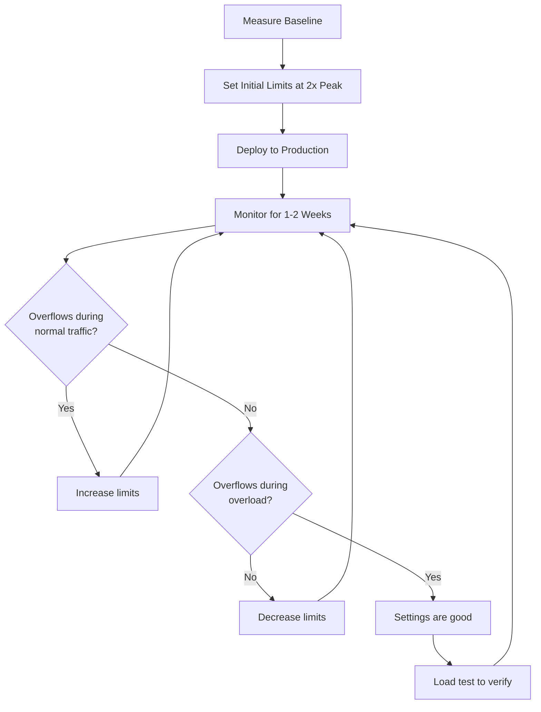

# How to Tune Circuit Breaker Settings for Production in Istio

Author: [nawazdhandala](https://github.com/nawazdhandala)

Tags: Istio, Service Mesh, Circuit Breaking, Production, Kubernetes, Performance

Description: A practical guide to tuning circuit breaker settings in Istio for production workloads based on real traffic patterns, service characteristics, and capacity planning.

---

Tuning circuit breakers for production is different from configuring them in a lab. In a lab, you set tight limits and watch requests get rejected. In production, the goal is to protect services from cascading failures without accidentally rejecting valid traffic during normal operation. This requires understanding your traffic patterns, your service capacity, and how the different settings interact.

## Start by Understanding Your Baseline

Before tuning anything, you need to know what normal looks like. Collect these metrics for at least a week:

```bash
# Current active connections per service
kubectl exec deploy/my-service -c istio-proxy -- \
  curl -s localhost:15000/stats | grep "cx_active"

# Current active requests
kubectl exec deploy/my-service -c istio-proxy -- \
  curl -s localhost:15000/stats | grep "rq_active"

# Request rate
kubectl exec deploy/my-service -c istio-proxy -- \
  curl -s localhost:15000/stats | grep "rq_total"
```

Or use Prometheus queries to get historical data:

```
# Peak concurrent connections over 7 days
max_over_time(envoy_cluster_upstream_cx_active{cluster_name=~".*my-service.*"}[7d])

# Peak concurrent requests over 7 days
max_over_time(envoy_cluster_upstream_rq_active{cluster_name=~".*my-service.*"}[7d])

# P99 request rate per second
quantile_over_time(0.99, rate(envoy_cluster_upstream_rq_total{cluster_name=~".*my-service.*"}[5m])[7d:5m])
```

## The 2x Rule for Connection Pool Settings

A good starting point is to set connection pool limits at roughly 2x your observed peak values. This gives you headroom for normal traffic spikes while still protecting against extreme overload.

If your service peaks at 50 concurrent connections and 100 concurrent requests:

```yaml
apiVersion: networking.istio.io/v1beta1
kind: DestinationRule
metadata:
  name: my-service
  namespace: production
spec:
  host: my-service
  trafficPolicy:
    connectionPool:
      tcp:
        maxConnections: 100    # 2x peak of 50
      http:
        http1MaxPendingRequests: 50  # Buffer for brief spikes
        http2MaxRequests: 200        # 2x peak of 100
        maxRequestsPerConnection: 100
```

Then monitor overflow metrics for a few days. If you see zero overflows, the limits are providing protection without affecting traffic. If you see occasional overflows during known traffic spikes, that is acceptable. If you see frequent overflows during normal traffic, bump the limits up.

## Tuning Outlier Detection

Outlier detection settings need to balance speed of detection against false positives.

### For Critical Services (Payments, Auth)

Detect failures fast, eject quickly, but be conservative about how many instances you eject:

```yaml
outlierDetection:
  consecutive5xxErrors: 2
  consecutiveGatewayErrors: 1
  interval: 5s
  baseEjectionTime: 60s
  maxEjectionPercent: 25
  minHealthPercent: 50
```

Low error thresholds (1-2) catch problems quickly. Low `maxEjectionPercent` (25%) ensures you always have 75% capacity. High `minHealthPercent` (50%) disables ejection if too many instances are unhealthy, preventing a death spiral.

### For Standard Services (APIs, Backends)

Balanced settings that handle both transient and persistent failures:

```yaml
outlierDetection:
  consecutive5xxErrors: 3
  interval: 10s
  baseEjectionTime: 30s
  maxEjectionPercent: 40
  minHealthPercent: 30
```

### For Non-Critical Services (Logging, Analytics)

Tolerant settings that only eject truly broken instances:

```yaml
outlierDetection:
  consecutive5xxErrors: 10
  interval: 30s
  baseEjectionTime: 15s
  maxEjectionPercent: 60
```

## Accounting for Retries

Retries amplify traffic, and that amplified traffic counts against circuit breaker limits. If you have 3 retries configured and your service gets 100 RPS, the circuit breaker might see up to 300 RPS in a failure scenario.

Factor this into your connection pool settings:

```yaml
apiVersion: networking.istio.io/v1beta1
kind: VirtualService
metadata:
  name: my-service
spec:
  hosts:
    - my-service
  http:
    - route:
        - destination:
            host: my-service
      retries:
        attempts: 3
        perTryTimeout: 2s
        retryOn: "gateway-error,connect-failure"
---
apiVersion: networking.istio.io/v1beta1
kind: DestinationRule
metadata:
  name: my-service
spec:
  host: my-service
  trafficPolicy:
    connectionPool:
      tcp:
        maxConnections: 300    # 100 base * 3 retry factor
      http:
        http1MaxPendingRequests: 150
        http2MaxRequests: 600
```

## Per-Service vs Global Settings

You can set global defaults using a mesh-wide DestinationRule and override for specific services:

```yaml
# Global default - conservative limits
apiVersion: networking.istio.io/v1beta1
kind: DestinationRule
metadata:
  name: global-defaults
  namespace: istio-system
spec:
  host: "*.production.svc.cluster.local"
  trafficPolicy:
    connectionPool:
      tcp:
        maxConnections: 100
      http:
        http1MaxPendingRequests: 50
        http2MaxRequests: 200
    outlierDetection:
      consecutive5xxErrors: 5
      interval: 10s
      baseEjectionTime: 30s
      maxEjectionPercent: 50
```

```yaml
# Override for high-traffic service
apiVersion: networking.istio.io/v1beta1
kind: DestinationRule
metadata:
  name: high-traffic-api
  namespace: production
spec:
  host: high-traffic-api.production.svc.cluster.local
  trafficPolicy:
    connectionPool:
      tcp:
        maxConnections: 1000
      http:
        http1MaxPendingRequests: 500
        http2MaxRequests: 2000
    outlierDetection:
      consecutive5xxErrors: 3
      interval: 5s
      baseEjectionTime: 45s
      maxEjectionPercent: 30
```

## Tuning for Deployments

Rolling deployments temporarily reduce capacity. Your circuit breaking settings need to handle this gracefully.

During a deployment of a 4-pod service with `maxSurge: 1` and `maxUnavailable: 1`:
- Minimum capacity: 3 pods (one terminating)
- If `maxEjectionPercent: 50` ejects 1 pod: 2 pods serving traffic
- If `maxEjectionPercent: 25` ejects 0 pods (can't eject 25% of 3): 3 pods serving traffic

For services with few pods, lower `maxEjectionPercent` to prevent capacity from dropping too far during deployments:

```yaml
# For a 4-pod service
outlierDetection:
  maxEjectionPercent: 25  # At most 1 pod ejected
  baseEjectionTime: 15s   # Short ejection during deployments
```

## Iterative Tuning Process

Tuning circuit breakers is an iterative process:

1. **Baseline** - Measure peak connections, requests, and error rates
2. **Configure** - Set limits at 2x peak with moderate outlier detection
3. **Monitor** - Watch overflow and ejection metrics for 1-2 weeks
4. **Adjust** - Tighten limits if no overflows, loosen if normal traffic gets rejected
5. **Test** - Run load tests in staging to verify protection works
6. **Repeat** - Re-tune when traffic patterns or service capacity changes



## Production Configuration Template

Here is a production-ready template you can adapt:

```yaml
apiVersion: networking.istio.io/v1beta1
kind: DestinationRule
metadata:
  name: SERVICENAME
  namespace: production
spec:
  host: SERVICENAME.production.svc.cluster.local
  trafficPolicy:
    connectionPool:
      tcp:
        maxConnections: 200      # Adjust based on peak * 2
        connectTimeout: 5s
      http:
        http1MaxPendingRequests: 100  # Adjust based on peak pending * 2
        http2MaxRequests: 400         # Adjust based on peak concurrent * 2
        maxRequestsPerConnection: 100 # Recycle connections periodically
    outlierDetection:
      consecutive5xxErrors: 3     # Eject after 3 consecutive errors
      consecutiveGatewayErrors: 2 # More sensitive to gateway errors
      interval: 10s               # Check every 10 seconds
      baseEjectionTime: 30s       # First ejection: 30s
      maxEjectionPercent: 40      # Never eject more than 40%
      minHealthPercent: 30        # Disable ejection if < 30% healthy
```

Replace `SERVICENAME` with your actual service name and adjust the numeric values based on your baseline measurements.

The most important thing about circuit breaker tuning is that it is never finished. Traffic patterns change, services get updated, infrastructure evolves. Build monitoring into your workflow and revisit these settings regularly.
