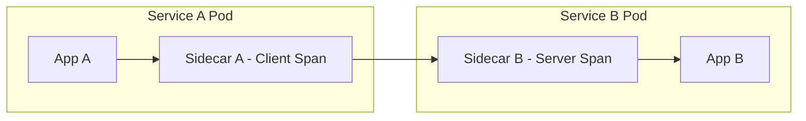

# How to Understand Envoy-Based Tracing in Istio

Author: [nawazdhandala](https://github.com/nawazdhandala)

Tags: Istio, Envoy, Tracing, Proxy, Service Mesh, Observability

Description: A deep look at how Envoy generates trace spans in Istio, including span lifecycle, timing fields, and what each span represents.

---

When you enable tracing in Istio, the heavy lifting happens inside the Envoy proxy. Every sidecar generates trace spans for the requests it handles. But what exactly goes into those spans? What does each timing field mean? And how do client-side and server-side spans relate to each other? Understanding the mechanics of Envoy-based tracing helps you interpret traces correctly and troubleshoot issues that show up in your tracing backend.

## What Envoy Does Automatically

Every Envoy sidecar in the mesh generates spans without any application code changes. When a request passes through a sidecar, Envoy:

1. Checks for incoming trace headers (B3 or W3C Trace Context)
2. If no trace exists, creates a new trace ID and root span
3. If a trace exists, creates a child span under the existing trace
4. Records timing information (when the request started, when the upstream responded, total duration)
5. Records metadata (HTTP method, path, response code, upstream host)
6. Sends the span to the configured tracing backend

## The Two Spans Per Hop

Here's something that confuses people: a single service-to-service call generates two spans, not one.



- **Client span (outbound):** Generated by the calling service's sidecar. It measures the time from when the sidecar sent the request to when it received the response.
- **Server span (inbound):** Generated by the receiving service's sidecar. It measures the time from when the sidecar received the request to when it sent the response back.

The difference between the client span duration and the server span duration is the network latency plus any time spent in the proxy itself.

## Span Attributes

Each Envoy-generated span includes a set of attributes. Here are the key ones:

| Attribute | Description | Example |
|-----------|-------------|---------|
| `node_id` | The sidecar's unique identifier | `sidecar~10.244.0.5~productpage-v1-xxx.default~default.svc.cluster.local` |
| `upstream_cluster` | The cluster Envoy routed to | `outbound\|9080\|\|reviews.default.svc.cluster.local` |
| `upstream_cluster.name` | Short form of the cluster name | `reviews.default` |
| `http.url` | Full request URL | `http://reviews:9080/reviews/1` |
| `http.method` | HTTP method | `GET` |
| `http.status_code` | Response status code | `200` |
| `response_size` | Response body size in bytes | `1234` |
| `request_size` | Request body size in bytes | `0` |
| `response_flags` | Envoy response flags | `-` or `UO` |
| `peer.address` | Address of the other end | `10.244.1.15:9080` |
| `guid:x-request-id` | Envoy's request ID | `d4e5f6-...` |

## How Envoy Determines Span Operations

The operation name of a span tells you what Envoy is doing:

- **Inbound spans** use the format: `<service-name>.<namespace>.svc.cluster.local:<port>/*`
- **Outbound spans** use the format: `<destination-service>.<namespace>.svc.cluster.local:<port>/*`

For example, a request from productpage to reviews might produce:
- Client span: `reviews.default.svc.cluster.local:9080/*`
- Server span: `reviews.default.svc.cluster.local:9080/*`

The operation name comes from the route configuration. If you have specific route matches, the operation name can be more descriptive.

## Timing Breakdown

Understanding the timing fields in Envoy spans helps you identify where latency is coming from:

```mermaid
gantt
    title Request Timing Breakdown
    dateFormat X
    axisFormat %L

    section Client Sidecar
    Client Span Total: 0, 100
    section Network
    Network Out: 5, 15
    Network Back: 85, 95
    section Server Sidecar
    Server Span Total: 15, 85
    section Application
    App Processing: 20, 80
```



- **Client span duration:** Total time from request sent to response received (includes network + server processing)
- **Server span duration:** Time from when the server sidecar received the request to when it sent the response
- **Gap between client start and server start:** Outbound network latency + proxy processing
- **Gap between server end and client end:** Return network latency + proxy processing

When you see a client span of 100ms and a server span of 60ms, the remaining 40ms is split between network latency (both directions) and proxy overhead.

## The Role of x-request-id

Envoy generates a unique `x-request-id` header for each request that enters the mesh. This ID serves multiple purposes:

1. It's included in access logs for correlation
2. It can trigger trace sampling (Envoy can sample based on the request ID's hash)
3. It helps identify the same request across different Envoy instances

The request ID is different from the trace ID. A single trace can have one request ID per hop, while the trace ID stays consistent across all hops.

## How Envoy Handles Missing Trace Headers

When Envoy receives a request without trace headers, its behavior depends on the configuration:

1. **External requests entering through the ingress gateway:** The gateway creates a new trace ID and root span
2. **Internal requests without headers:** The sidecar creates a new trace (this usually means header propagation is broken)
3. **Requests with headers but wrong format:** Envoy tries to parse them; if it fails, it starts a new trace

You can check whether Envoy is creating new traces or continuing existing ones by looking at the parent span ID. A root span has no parent.

## Examining Envoy's Tracing Configuration

To see exactly how a sidecar is configured for tracing:

```bash
# View the bootstrap configuration
istioctl proxy-config bootstrap deploy/productpage -o json | python3 -c "
import json, sys
config = json.load(sys.stdin)
tracing = config.get('bootstrap', {}).get('tracing', {})
print(json.dumps(tracing, indent=2))
"

# Check the active tracing configuration
istioctl proxy-config bootstrap deploy/productpage -o json | grep -A20 tracing
```

You can also check the Envoy admin interface directly:

```bash
kubectl exec deploy/productpage -c istio-proxy -- \
  curl -s localhost:15000/config_dump | python3 -m json.tool | grep -A10 tracing
```

## Envoy Tracing Stats

Envoy tracks tracing-related statistics that are useful for debugging:

```bash
kubectl exec deploy/productpage -c istio-proxy -- \
  curl -s localhost:15000/stats | grep tracing
```

Key stats to watch:

- `tracing.random_sampling` - Indicates how many requests were sampled
- `tracing.service_forced` - Requests traced due to force-trace headers
- `tracing.not_traceable` - Requests that weren't traced
- `tracing.health_check` - Health check requests (typically not traced)
- `tracing.client_enabled` - Client-initiated trace decisions

## How Envoy Reports Spans

Envoy can report spans using several protocols:

- **Zipkin** - HTTP POST to the Zipkin collector's `/api/v2/spans` endpoint
- **OpenTelemetry (OTLP)** - gRPC to an OTLP collector
- **Datadog** - Direct reporting to Datadog Agent

The reporting happens asynchronously. Envoy buffers spans and sends them in batches to minimize the performance impact. If the tracing backend is temporarily unavailable, spans are dropped rather than queued indefinitely.

## Understanding Trace Gaps

Sometimes you'll see gaps in traces where time seems unaccounted for. Common causes:

**Connection pooling:** If Envoy reuses an existing connection, there's minimal connection setup time. But if it needs to establish a new connection (including TLS handshake for mTLS), that adds time that appears as a gap.

**Load balancing:** Envoy's load balancing decision adds a small amount of time. With many endpoints and complex routing rules, this can be measurable.

**Filter chain processing:** Envoy runs requests through a filter chain (authentication, authorization, rate limiting, etc.). Each filter adds processing time.

## Debugging Span Issues

If spans look wrong or unexpected:

```bash
# Enable trace-level logging for tracing
istioctl proxy-config log deploy/productpage --level trace:debug

# Watch the sidecar logs for tracing activity
kubectl logs deploy/productpage -c istio-proxy -f | grep -i "tracing\|span\|trace"

# Reset log level when done
istioctl proxy-config log deploy/productpage --level info
```

Check the Envoy clusters used for trace reporting:

```bash
istioctl proxy-config cluster deploy/productpage | grep -i "zipkin\|otel\|jaeger\|tracing"
```

If no tracing cluster exists, Envoy isn't configured to send spans anywhere.

## Summary

Envoy-based tracing in Istio generates two spans per service hop (client and server), records detailed timing and metadata, and reports spans asynchronously to your tracing backend. Understanding the difference between client and server spans, what the timing gaps mean, and how to examine Envoy's tracing configuration gives you the foundation to interpret traces correctly and diagnose issues when traces don't look right. The sidecars do most of the work automatically, but your applications still need to propagate trace headers for the spans to connect into complete traces.
