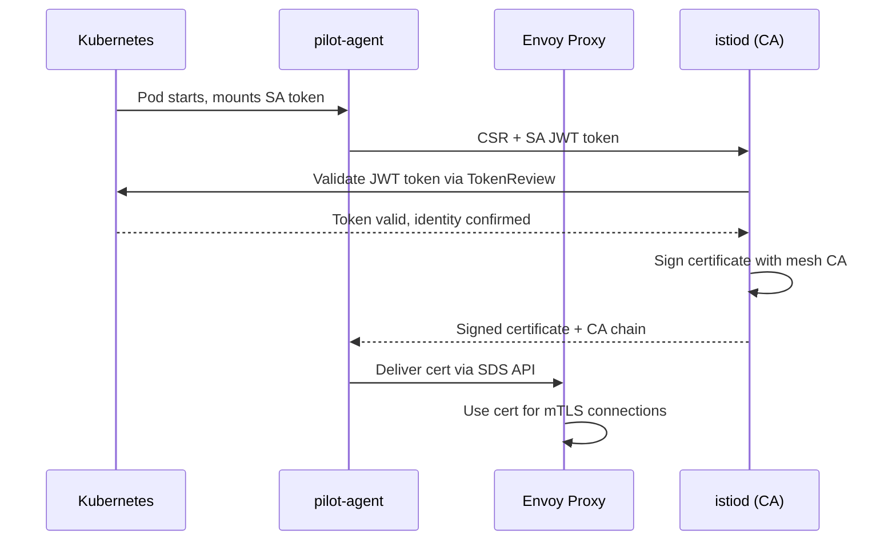

# How to Understand Istio's Certificate Provisioning Workflow

Author: [nawazdhandala](https://github.com/nawazdhandala)

Tags: Istio, Certificate, Security, mTLS, Service Mesh

Description: A detailed walkthrough of how Istio provisions, distributes, and rotates certificates for workload identity and mutual TLS encryption.

---

Every time a pod with an Istio sidecar starts up, a series of steps happen behind the scenes to give that workload a cryptographic identity. Understanding this flow is important for debugging certificate errors, planning CA rotations, and making sure your security posture is solid.

The certificate provisioning workflow in Istio involves several components working together: the Envoy sidecar proxy, the pilot-agent process, istiod (specifically its CA component), and Kubernetes service accounts. Here is how it all fits together.

## The Big Picture

At a high level, the certificate provisioning workflow follows these steps:



Each of these steps deserves a closer look.

## Step 1: Pod Startup and Service Account Token

When Kubernetes schedules a pod with Istio injection enabled, the sidecar injector adds the `istio-proxy` container to the pod spec. This container runs both the pilot-agent process and the Envoy proxy.

Kubernetes also mounts a service account token into the pod. In modern Kubernetes (1.21+), this is a projected volume with a bound service account token that has a limited audience and expiration time.

The relevant volume mount looks something like this in the pod spec:

```yaml
volumes:
  - name: istio-token
    projected:
      sources:
        - serviceAccountToken:
            audience: istio-ca
            expirationSeconds: 43200
            path: istio-token
```

The `audience: istio-ca` part is critical. It tells Kubernetes to issue a token that is specifically intended for istiod's CA. This limits the blast radius if the token is somehow compromised - it cannot be used to authenticate to the Kubernetes API server for general operations.

## Step 2: Certificate Signing Request

Once the pilot-agent process starts, it generates an RSA or EC private key (EC P-256 by default) and creates a Certificate Signing Request (CSR). The CSR contains the workload's desired identity in the Subject Alternative Name (SAN) field.

The SPIFFE ID format for the SAN is:

```text
spiffe://<trust-domain>/ns/<namespace>/sa/<service-account>
```

For example, if your trust domain is `cluster.local`, the namespace is `default`, and the service account is `httpbin`, the SAN would be:

```text
spiffe://cluster.local/ns/default/sa/httpbin
```

The pilot-agent sends the CSR along with the Kubernetes service account JWT token to istiod over a gRPC connection. This connection itself is secured - the pilot-agent validates istiod's certificate before sending the CSR.

You can see this connection in action by checking the pilot-agent logs:

```bash
kubectl logs <pod-name> -c istio-proxy | grep "CSR"
```

## Step 3: Token Validation

When istiod receives the CSR and JWT token, it needs to verify that the request is legitimate. It does this by calling the Kubernetes TokenReview API:

```bash
# This is what istiod does internally
kubectl create tokenreview --token=<the-jwt-token>
```

The TokenReview API tells istiod:
- Whether the token is valid and not expired
- Which service account the token belongs to
- Which namespace the service account is in

Istiod then checks that the identity requested in the CSR matches the identity proven by the token. If the pod is running as `default/httpbin` but the CSR requests an identity for `production/payment-service`, istiod will reject the request.

## Step 4: Certificate Signing

After validation, istiod signs the CSR using its CA private key. The resulting certificate contains:

- The workload's SPIFFE ID in the SAN field
- A validity period (default is 24 hours)
- The certificate chain up to the root CA

Istiod's CA can operate in several modes:

**Self-signed mode** (default): Istiod generates its own root CA at startup and signs workload certificates directly. The root CA certificate is stored in a Kubernetes secret called `istio-ca-secret` in the `istio-system` namespace.

**Plug-in CA mode**: You provide your own CA certificate and key, and istiod uses them as an intermediate CA to sign workload certificates. This is the recommended approach for production.

**External CA mode**: Istiod forwards CSRs to an external certificate authority (like Vault, SPIRE, or a cloud KMS).

Check which mode your installation uses:

```bash
kubectl get secret cacerts -n istio-system
# If this exists, you are in plug-in CA mode

kubectl get secret istio-ca-secret -n istio-system
# If this exists (and cacerts does not), you are in self-signed mode
```

## Step 5: Certificate Delivery via SDS

The signed certificate travels back from istiod to the pilot-agent, which then delivers it to the Envoy proxy through the Secret Discovery Service (SDS) API. SDS is part of Envoy's xDS protocol family.

This is a significant design choice. Instead of writing certificates to disk (where they could be read by other processes in the pod), certificates are delivered through an in-memory gRPC API. The pilot-agent acts as the local SDS server for the Envoy instance in the same pod.

You can inspect the certificates that Envoy currently holds:

```bash
istioctl proxy-config secret <pod-name> -n <namespace>
```

Sample output:

```text
RESOURCE NAME     TYPE           STATUS   VALID CERT   SERIAL NUMBER          NOT AFTER                NOT BEFORE
default           Cert Chain     ACTIVE   true         c8e..                  2026-02-25T12:00:00Z     2026-02-24T12:00:00Z
ROOTCA            CA             ACTIVE   true         f4a..                  2036-02-22T12:00:00Z     2026-02-24T12:00:00Z
```

## Step 6: Certificate Rotation

Certificates do not last forever. By default, Istio workload certificates have a 24-hour lifetime. The pilot-agent handles rotation automatically before the certificate expires.

The rotation happens at roughly 50% of the certificate's remaining lifetime. So for a 24-hour certificate, rotation kicks in around the 12-hour mark. This gives plenty of buffer in case the rotation fails and needs to be retried.

You can adjust the certificate TTL through mesh configuration:

```yaml
apiVersion: install.istio.io/v1alpha1
kind: IstioOperator
spec:
  meshConfig:
    defaultConfig:
      proxyMetadata:
        SECRET_TTL: "12h"
```

## Watching the Workflow in Real Time

To see the certificate provisioning happening live, you can watch the istiod logs while deploying a new workload:

```bash
# Terminal 1: Watch istiod logs
kubectl logs -n istio-system deployment/istiod -f | grep -E "CSR|cert|SDS"

# Terminal 2: Deploy a workload
kubectl apply -f samples/httpbin/httpbin.yaml
```

You will see log lines about receiving CSR requests, validating tokens, and signing certificates.

## Common Failure Points

**Service account token mount missing**: If the projected volume is not mounted, pilot-agent cannot authenticate to istiod. Check the pod spec for the `istio-token` volume.

**Clock skew**: Certificate validation is time-sensitive. If the clock on a node is significantly off, certificates may appear expired or not-yet-valid. Use NTP to keep cluster node clocks synchronized.

**istiod unreachable**: If pilot-agent cannot connect to istiod, it will retry with exponential backoff. During this time, the sidecar will not have a certificate and mTLS connections will fail. Check network policies and DNS resolution.

```bash
# Check if the pod can reach istiod
kubectl exec <pod-name> -c istio-proxy -- curl -s https://istiod.istio-system.svc:15012/debug/endpointz
```

**Root CA rotation without overlap**: If you rotate the root CA without keeping the old one trusted during the transition, existing certificates signed by the old CA will fail verification. Always overlap trust during rotation.

Understanding this workflow helps you reason about security boundaries in your mesh. The certificate provisioning is the foundation that makes mutual TLS, authorization policies, and workload identity possible. When something goes wrong with service-to-service communication in Istio, the certificate workflow is often the first place to investigate.
