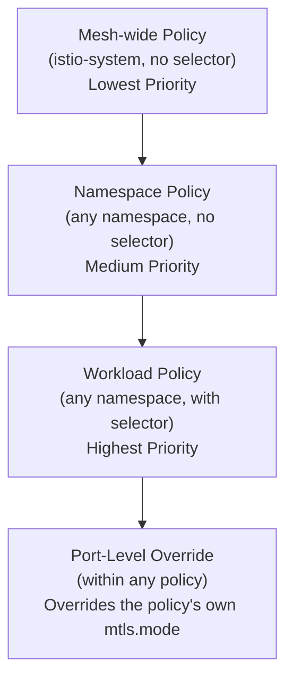

# How to Understand Peer Authentication Policy Precedence in Istio

Author: [nawazdhandala](https://github.com/nawazdhandala)

Tags: Istio, PeerAuthentication, mTLS, Policy Precedence, Security

Description: A clear explanation of how Istio resolves PeerAuthentication policy precedence across mesh, namespace, and workload levels.

---

When you have PeerAuthentication policies at multiple levels - mesh-wide, namespace, and workload - it's critical to understand which one actually takes effect. Istio follows a clear precedence hierarchy, but the details aren't always intuitive, especially when port-level overrides get involved.

## The Three Levels of PeerAuthentication

Istio evaluates PeerAuthentication policies at three distinct levels:

1. **Mesh-wide** - A policy in the root namespace (usually `istio-system`) with no selector. This is the baseline default.
2. **Namespace-wide** - A policy in a specific namespace with no selector. Overrides the mesh-wide default for that namespace.
3. **Workload-specific** - A policy with a `selector` targeting specific pods. Overrides the namespace default for those pods.

The rule is straightforward: **the most specific policy wins**. Workload-specific beats namespace-wide, and namespace-wide beats mesh-wide.

## Visualizing the Precedence



## Walk-Through Example

Suppose you have these three policies:

```yaml
# Mesh-wide: PERMISSIVE
apiVersion: security.istio.io/v1
kind: PeerAuthentication
metadata:
  name: default
  namespace: istio-system
spec:
  mtls:
    mode: PERMISSIVE
---
# Namespace: STRICT for backend
apiVersion: security.istio.io/v1
kind: PeerAuthentication
metadata:
  name: default
  namespace: backend
spec:
  mtls:
    mode: STRICT
---
# Workload: PERMISSIVE for legacy-api in backend
apiVersion: security.istio.io/v1
kind: PeerAuthentication
metadata:
  name: legacy-exception
  namespace: backend
spec:
  selector:
    matchLabels:
      app: legacy-api
  mtls:
    mode: PERMISSIVE
```

Now, here's what happens for different pods:

| Pod | Namespace | Effective Mode | Why |
|-----|-----------|---------------|-----|
| order-service | backend | STRICT | Namespace policy applies |
| legacy-api | backend | PERMISSIVE | Workload policy overrides namespace |
| frontend | frontend | PERMISSIVE | No namespace policy, inherits mesh-wide |
| anything | istio-system | PERMISSIVE | Mesh-wide policy applies to root namespace too |

## Port-Level Overrides Add Another Layer

Port-level mTLS settings (`portLevelMtls`) override the `mtls.mode` field within the same policy. They don't change the precedence between policies - they just refine what the winning policy does.

```yaml
apiVersion: security.istio.io/v1
kind: PeerAuthentication
metadata:
  name: backend-strict
  namespace: backend
spec:
  mtls:
    mode: STRICT
  portLevelMtls:
    9090:
      mode: PERMISSIVE
```

For pods in the `backend` namespace (that don't have a more specific workload policy):
- Port 9090: PERMISSIVE (from portLevelMtls)
- All other ports: STRICT (from mtls.mode)

## How UNSET Mode Works

The `UNSET` mode means "inherit from the parent level." This is actually the default when you don't specify a mode at all. Here's how inheritance works:

- A workload policy with UNSET inherits from the namespace policy.
- A namespace policy with UNSET inherits from the mesh-wide policy.
- A mesh-wide policy with UNSET falls back to Istio's built-in default, which is PERMISSIVE.

```yaml
# This workload policy inherits from the namespace default
apiVersion: security.istio.io/v1
kind: PeerAuthentication
metadata:
  name: inherit-example
  namespace: backend
spec:
  selector:
    matchLabels:
      app: my-service
  mtls:
    mode: UNSET
  portLevelMtls:
    8080:
      mode: STRICT
```

In this case, `my-service` uses whatever mode the namespace policy sets for all ports except 8080, which is always STRICT.

## The Full Resolution Algorithm

When Istio needs to determine the mTLS mode for a specific port on a specific pod, it follows this algorithm:

1. Find all PeerAuthentication policies in the pod's namespace that match the pod (via selector or no selector).
2. If a workload-specific policy exists that matches the pod:
   a. If it has a `portLevelMtls` entry for this port, use that mode.
   b. Otherwise, use the policy's `mtls.mode`.
   c. If the mode is UNSET, go to step 3.
3. If a namespace-wide policy exists (no selector):
   a. If it has a `portLevelMtls` entry for this port, use that mode.
   b. Otherwise, use the policy's `mtls.mode`.
   c. If the mode is UNSET, go to step 4.
4. If a mesh-wide policy exists in the root namespace (no selector):
   a. If it has a `portLevelMtls` entry for this port, use that mode.
   b. Otherwise, use the policy's `mtls.mode`.
   c. If the mode is UNSET, use PERMISSIVE (Istio's built-in default).

## Complex Scenario

Here's a scenario that exercises the full precedence chain:

```yaml
# Mesh-wide
apiVersion: security.istio.io/v1
kind: PeerAuthentication
metadata:
  name: default
  namespace: istio-system
spec:
  mtls:
    mode: STRICT
  portLevelMtls:
    15014:
      mode: DISABLE
---
# Namespace
apiVersion: security.istio.io/v1
kind: PeerAuthentication
metadata:
  name: default
  namespace: backend
spec:
  mtls:
    mode: PERMISSIVE
---
# Workload
apiVersion: security.istio.io/v1
kind: PeerAuthentication
metadata:
  name: payment-auth
  namespace: backend
spec:
  selector:
    matchLabels:
      app: payment-service
  mtls:
    mode: STRICT
  portLevelMtls:
    9090:
      mode: DISABLE
```

Results for different pods and ports:

| Pod | Namespace | Port | Mode | Explanation |
|-----|-----------|------|------|-------------|
| payment-service | backend | 8080 | STRICT | Workload policy mtls.mode |
| payment-service | backend | 9090 | DISABLE | Workload policy portLevelMtls |
| order-service | backend | 8080 | PERMISSIVE | Namespace policy mtls.mode |
| order-service | backend | 15014 | PERMISSIVE | Namespace policy mtls.mode (NOT mesh portLevelMtls) |
| any-service | frontend | 8080 | STRICT | Mesh-wide mtls.mode |
| any-service | frontend | 15014 | DISABLE | Mesh-wide portLevelMtls |

Notice the entry for `order-service` on port 15014. Even though the mesh-wide policy disables mTLS on 15014, the namespace policy overrides the mesh-wide policy entirely. The namespace policy doesn't have a portLevelMtls for 15014, so it uses its own `mtls.mode` (PERMISSIVE). Port-level overrides from a lower-precedence policy do not bleed through.

## Verifying Precedence

Use `istioctl` to check what the effective policy is for a given pod:

```bash
istioctl x describe pod payment-service-abc123 -n backend
```

For the actual Envoy configuration:

```bash
istioctl proxy-config listener payment-service-abc123 -n backend -o json
```

You can also run `istioctl analyze` to detect any inconsistencies:

```bash
istioctl analyze -n backend
```

## Common Misunderstandings

**"STRICT should always win because it's more secure."** Nope. Precedence is based on specificity, not strictness. A namespace PERMISSIVE policy overrides a mesh-wide STRICT policy.

**"Port-level overrides from parent policies carry over."** They don't. When a more specific policy takes over, its port-level overrides apply, and the parent's port-level settings are completely ignored.

**"UNSET means disabled."** UNSET means "inherit from parent." It's not the same as DISABLE.

Understanding precedence saves you from hours of debugging. The key takeaway: most specific wins, port-level settings only apply within the winning policy, and UNSET means inherit. Once you internalize these rules, PeerAuthentication becomes predictable.
