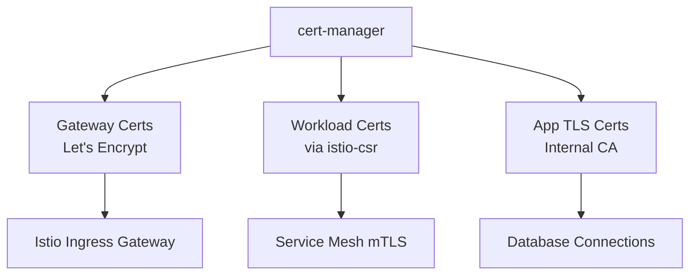

# How to Use cert-manager with Istio for Certificate Management

Author: [nawazdhandala](https://github.com/nawazdhandala)

Tags: Istio, Cert-Manager, Certificates, Security, Kubernetes, Let's Encrypt

Description: How to integrate cert-manager with Istio to automate certificate issuance and management using external CAs like Let's Encrypt and private CAs.

---

cert-manager is the standard way to manage certificates in Kubernetes. Istio has its own built-in CA, but there are good reasons to use cert-manager instead or alongside it. Maybe you want to use Let's Encrypt for your ingress gateway, or you want cert-manager to manage the Istio CA certificate itself. This guide covers both use cases.

## Two Integration Patterns

There are two main ways to use cert-manager with Istio:

1. **cert-manager for gateway certificates** - Use cert-manager to provision TLS certificates for Istio's ingress gateway (for external-facing HTTPS)
2. **cert-manager as Istio's CA** - Use cert-manager's istio-csr component to replace Istio's built-in CA for workload certificates

These are independent and you can use either or both.

## Pattern 1: Gateway TLS with cert-manager

This is the most common setup. cert-manager handles the HTTPS certificates for your ingress gateway, while Istio's built-in CA still handles the internal mTLS certificates.

### Install cert-manager

```bash
kubectl apply -f https://github.com/cert-manager/cert-manager/releases/download/v1.14.0/cert-manager.yaml
```

Wait for it to be ready:

```bash
kubectl wait --for=condition=Available deployment --all -n cert-manager --timeout=120s
```

### Create a ClusterIssuer

For Let's Encrypt:

```yaml
apiVersion: cert-manager.io/v1
kind: ClusterIssuer
metadata:
  name: letsencrypt-prod
spec:
  acme:
    server: https://acme-v02.api.letsencrypt.org/directory
    email: admin@example.com
    privateKeySecretRef:
      name: letsencrypt-prod-key
    solvers:
    - http01:
        ingress:
          class: istio
```

For a private CA:

```yaml
apiVersion: cert-manager.io/v1
kind: ClusterIssuer
metadata:
  name: private-ca
spec:
  ca:
    secretName: ca-key-pair
```

### Create a Certificate for the Gateway

```yaml
apiVersion: cert-manager.io/v1
kind: Certificate
metadata:
  name: gateway-cert
  namespace: istio-system
spec:
  secretName: gateway-tls
  issuerRef:
    name: letsencrypt-prod
    kind: ClusterIssuer
  commonName: "*.example.com"
  dnsNames:
  - "example.com"
  - "*.example.com"
```

cert-manager will create a Kubernetes TLS secret named `gateway-tls` in the `istio-system` namespace.

### Configure the Istio Gateway to Use the Certificate

```yaml
apiVersion: networking.istio.io/v1
kind: Gateway
metadata:
  name: main-gateway
  namespace: istio-system
spec:
  selector:
    istio: ingressgateway
  servers:
  - port:
      number: 443
      name: https
      protocol: HTTPS
    tls:
      mode: SIMPLE
      credentialName: gateway-tls
    hosts:
    - "*.example.com"
  - port:
      number: 80
      name: http
      protocol: HTTP
    tls:
      httpsRedirect: true
    hosts:
    - "*.example.com"
```

The `credentialName` field references the secret that cert-manager created. Istio's ingress gateway will use this certificate for HTTPS termination.

cert-manager automatically renews the certificate before it expires. The gateway picks up the new certificate without any restart required.

## Pattern 2: cert-manager as Istio's CA (istio-csr)

This is the more advanced setup where cert-manager completely replaces Istio's built-in CA. Workload certificates are issued by cert-manager instead of istiod.

### Install istio-csr

istio-csr is a cert-manager project that acts as a bridge between Istio and cert-manager:

```bash
helm repo add jetstack https://charts.jetstack.io
helm repo update

helm install istio-csr jetstack/cert-manager-istio-csr \
  --namespace cert-manager \
  --set "app.tls.rootCAFile=/var/run/secrets/istio-csr/ca.pem" \
  --set "app.server.clusterID=cluster.local" \
  --set "app.certmanager.issuerRef.name=istio-ca" \
  --set "app.certmanager.issuerRef.kind=ClusterIssuer" \
  --set "app.certmanager.issuerRef.group=cert-manager.io"
```

### Create a CA Issuer for Istio

```yaml
apiVersion: cert-manager.io/v1
kind: ClusterIssuer
metadata:
  name: istio-ca
spec:
  ca:
    secretName: istio-ca-key-pair
---
apiVersion: v1
kind: Secret
metadata:
  name: istio-ca-key-pair
  namespace: cert-manager
type: kubernetes.io/tls
data:
  tls.crt: <base64-encoded-ca-cert>
  tls.key: <base64-encoded-ca-key>
```

### Install Istio with External CA Configuration

When installing Istio, configure it to use istio-csr instead of the built-in CA:

```yaml
apiVersion: install.istio.io/v1alpha1
kind: IstioOperator
spec:
  values:
    global:
      caAddress: cert-manager-istio-csr.cert-manager.svc:443
  components:
    pilot:
      k8s:
        env:
        - name: ENABLE_CA_SERVER
          value: "false"
        overlays:
        - apiVersion: apps/v1
          kind: Deployment
          name: istiod
          patches:
          - path: spec.template.spec.containers[0].volumeMounts[-1]
            value:
              name: root-ca
              mountPath: /var/run/secrets/istio/root-cert.pem
              subPath: ca.pem
              readOnly: true
          - path: spec.template.spec.volumes[-1]
            value:
              name: root-ca
              configMap:
                name: istio-root-cert
```

The key settings:
- `caAddress` points to istio-csr instead of istiod
- `ENABLE_CA_SERVER=false` disables istiod's built-in CA

### Verify the Integration

Check that workloads are getting certificates from cert-manager:

```bash
kubectl get certificaterequests -n cert-manager
```

You should see certificate requests being created for each workload in the mesh.

Verify a workload certificate:

```bash
istioctl proxy-config secret <pod-name> -n <namespace> -o json | \
  jq -r '.dynamicActiveSecrets[0].secret.tlsCertificate.certificateChain.inlineBytes' | \
  base64 -d | openssl x509 -text -noout | grep "Issuer"
```

The issuer should match your cert-manager CA.

## Managing Multiple Certificate Types

A common production setup uses cert-manager for everything:



Each use case can have its own issuer:

```yaml
# Let's Encrypt for public-facing
apiVersion: cert-manager.io/v1
kind: ClusterIssuer
metadata:
  name: letsencrypt-prod
spec:
  acme:
    server: https://acme-v02.api.letsencrypt.org/directory
    email: admin@example.com
    privateKeySecretRef:
      name: letsencrypt-key
    solvers:
    - http01:
        ingress:
          class: istio
---
# Private CA for mesh traffic
apiVersion: cert-manager.io/v1
kind: ClusterIssuer
metadata:
  name: mesh-ca
spec:
  ca:
    secretName: mesh-ca-key-pair
---
# Vault-backed for application certificates
apiVersion: cert-manager.io/v1
kind: ClusterIssuer
metadata:
  name: vault-issuer
spec:
  vault:
    server: https://vault.internal:8200
    path: pki/sign/my-role
    auth:
      kubernetes:
        role: cert-manager
        mountPath: /v1/auth/kubernetes
```

## Monitoring cert-manager

cert-manager exposes Prometheus metrics:

```yaml
# Check for certificate readiness
certmanager_certificate_ready_status{condition="True"}

# Monitor certificate expiry
certmanager_certificate_expiration_timestamp_seconds

# Track renewal failures
certmanager_certificate_renewal_timestamp_seconds
```

Set up an alert for certificates that are not ready:

```yaml
groups:
- name: cert-manager
  rules:
  - alert: CertificateNotReady
    expr: certmanager_certificate_ready_status{condition="True"} == 0
    for: 10m
    labels:
      severity: critical
    annotations:
      summary: "Certificate {{ $labels.name }} in {{ $labels.namespace }} is not ready"
```

## Troubleshooting

If certificates are not being issued, check cert-manager logs:

```bash
kubectl logs -n cert-manager deploy/cert-manager
```

Check the certificate resource status:

```bash
kubectl describe certificate gateway-cert -n istio-system
```

For istio-csr issues:

```bash
kubectl logs -n cert-manager deploy/cert-manager-istio-csr
```

The cert-manager and Istio integration gives you a unified certificate management layer across your entire cluster. Whether you just need Let's Encrypt for your gateway or want to replace Istio's CA entirely, cert-manager provides the automation and flexibility to handle it.
