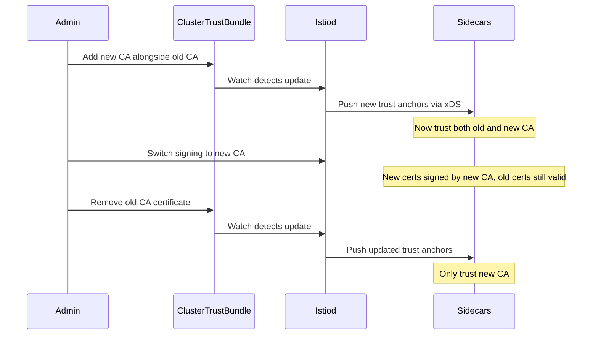

# How to Use ClusterTrustBundle with Istio

Author: [nawazdhandala](https://github.com/nawazdhandala)

Tags: Istio, ClusterTrustBundle, Kubernetes, TLS, Security, Certificates

Description: A practical guide to using Kubernetes ClusterTrustBundle resources with Istio for managing trust anchors across your service mesh.

---

Kubernetes introduced ClusterTrustBundle as a way to distribute trust anchors (CA certificates) across the cluster in a standardized, API-driven manner. If you run Istio, this gives you a cleaner approach to managing the root certificates that your mesh workloads trust, compared to manually distributing CA bundles through ConfigMaps or secrets.

ClusterTrustBundle is a cluster-scoped resource, meaning it is available to all namespaces. This fits naturally with how Istio distributes trust - the mesh needs a consistent set of trusted roots everywhere.

## What Problem Does ClusterTrustBundle Solve

Traditionally in Istio, root CA certificates are distributed through Kubernetes secrets (like `istio-ca-secret` or `cacerts`) or baked into the mesh configuration. This works, but it has drawbacks:

- Updating CA certificates requires touching secrets in specific namespaces
- There is no standard API for querying which CAs are trusted
- During CA rotation, you need the old and new roots available simultaneously, which means careful secret management
- Multi-cluster setups need consistent CA distribution, and secrets do not help with that

ClusterTrustBundle provides an API object specifically designed for distributing trust anchors. It is declarative, versionable, and integrates with Kubernetes RBAC.

## Prerequisites

- Kubernetes 1.29+ (ClusterTrustBundle reached beta in 1.29)
- Istio 1.22+ (for ClusterTrustBundle support)
- The `ClusterTrustBundle` feature gate enabled on the API server

Check if ClusterTrustBundle is available in your cluster:

```bash
kubectl api-resources | grep trustbundle
```

If you see `clustertrustbundles` in the output, you are good to go.

## Creating a ClusterTrustBundle

First, you need your CA certificate. If you are using Istio's built-in CA, you can extract the root certificate:

```bash
kubectl get secret istio-ca-secret -n istio-system -o jsonpath='{.data.ca-cert\.pem}' | base64 -d > root-cert.pem
```

Now create a ClusterTrustBundle resource:

```yaml
apiVersion: certificates.k8s.io/v1alpha1
kind: ClusterTrustBundle
metadata:
  name: istio-mesh-root
spec:
  trustBundle: |
    -----BEGIN CERTIFICATE-----
    MIIFjTCCA3WgAwIBAgIUK2x1GmYTjORA6M6fJx4i9dDRBjwwDQYJKoZIhvcNAQEL
    BQAwVjELMAkGA1UEBhMCVVMxEzARBgNVBAgTCkNhbGlmb3JuaWExFjAUBgNVBAcT
    ... (your CA certificate content) ...
    -----END CERTIFICATE-----
```

Apply it:

```bash
kubectl apply -f istio-trust-bundle.yaml
```

You can also create signer-linked ClusterTrustBundles. These are tied to a specific signer name and useful when you have multiple CAs:

```yaml
apiVersion: certificates.k8s.io/v1alpha1
kind: ClusterTrustBundle
metadata:
  name: istio.io:istio-mesh-root
spec:
  signerName: istio.io/mesh-ca
  trustBundle: |
    -----BEGIN CERTIFICATE-----
    ... (your CA certificate content) ...
    -----END CERTIFICATE-----
```

## Configuring Istio to Use ClusterTrustBundle

To have Istio read trust anchors from ClusterTrustBundle resources, you configure the mesh through the IstioOperator or Istio's mesh configuration.

```yaml
apiVersion: install.istio.io/v1alpha1
kind: IstioOperator
metadata:
  name: istio-config
spec:
  meshConfig:
    caCertificates:
      - clusterTrustBundle:
          name: istio-mesh-root
    defaultConfig:
      proxyMetadata:
        PROXY_CONFIG_XDS_AGENT: "true"
  values:
    pilot:
      env:
        ENABLE_CLUSTER_TRUST_BUNDLE: "true"
```

Apply this configuration:

```bash
istioctl install -f istio-trustbundle-config.yaml -y
```

## Using ClusterTrustBundle for Peer Verification

Once Istio is configured to read from ClusterTrustBundle, sidecars will use the trust anchors from the bundle to verify peer certificates during mTLS connections.

You can verify this by checking the proxy configuration of a running workload:

```bash
istioctl proxy-config secret <pod-name> -n <namespace> -o json
```

The ROOTCA entry should reflect the certificate from your ClusterTrustBundle.

## CA Rotation with ClusterTrustBundle

One of the biggest advantages of ClusterTrustBundle is simplified CA rotation. During rotation, you need both the old and new CA certificates to be trusted simultaneously. With ClusterTrustBundle, you simply update the resource to include both certificates.

```yaml
apiVersion: certificates.k8s.io/v1alpha1
kind: ClusterTrustBundle
metadata:
  name: istio-mesh-root
spec:
  trustBundle: |
    -----BEGIN CERTIFICATE-----
    ... (OLD CA certificate) ...
    -----END CERTIFICATE-----
    -----BEGIN CERTIFICATE-----
    ... (NEW CA certificate) ...
    -----END CERTIFICATE-----
```

Apply the update:

```bash
kubectl apply -f istio-trust-bundle-rotated.yaml
```

Istio will pick up the change and distribute both trust anchors to all sidecars. The timeline for a typical rotation looks like this:



After all workloads have rotated their certificates to ones signed by the new CA (which happens automatically based on certificate TTL), you can remove the old CA from the bundle.

## Multi-Cluster Trust Distribution

In multi-cluster Istio setups, ClusterTrustBundle simplifies trust distribution. Each cluster can have its own ClusterTrustBundle resource containing the root CAs from all clusters in the mesh.

For a two-cluster setup:

Cluster 1 ClusterTrustBundle:

```yaml
apiVersion: certificates.k8s.io/v1alpha1
kind: ClusterTrustBundle
metadata:
  name: istio-mesh-roots
spec:
  trustBundle: |
    -----BEGIN CERTIFICATE-----
    ... (Cluster 1 root CA) ...
    -----END CERTIFICATE-----
    -----BEGIN CERTIFICATE-----
    ... (Cluster 2 root CA) ...
    -----END CERTIFICATE-----
```

You can automate the synchronization of trust bundles across clusters using a controller or a CI/CD pipeline that reads root CAs from each cluster and updates the ClusterTrustBundle in all clusters.

## Monitoring ClusterTrustBundle Changes

Since ClusterTrustBundle is a Kubernetes resource, you can use standard Kubernetes tooling to monitor changes:

```bash
kubectl get clustertrustbundles -w
```

For audit purposes, Kubernetes audit logs will capture all modifications to ClusterTrustBundle resources, giving you a trail of who changed trust anchors and when.

You can also set up a simple monitoring script:

```bash
#!/bin/bash
# Check certificate expiry in ClusterTrustBundle
BUNDLE=$(kubectl get clustertrustbundle istio-mesh-root -o jsonpath='{.spec.trustBundle}')
echo "$BUNDLE" | openssl x509 -text -noout | grep "Not After"
```

## RBAC for ClusterTrustBundle

Control who can modify trust anchors using Kubernetes RBAC:

```yaml
apiVersion: rbac.authorization.k8s.io/v1
kind: ClusterRole
metadata:
  name: trustbundle-admin
rules:
  - apiGroups: ["certificates.k8s.io"]
    resources: ["clustertrustbundles"]
    verbs: ["get", "list", "watch", "create", "update", "patch", "delete"]
---
apiVersion: rbac.authorization.k8s.io/v1
kind: ClusterRole
metadata:
  name: trustbundle-reader
rules:
  - apiGroups: ["certificates.k8s.io"]
    resources: ["clustertrustbundles"]
    verbs: ["get", "list", "watch"]
```

Bind the admin role only to platform team members who manage the CA infrastructure. Istio's istiod service account needs at least read access.

## Troubleshooting

If sidecars are not picking up the trust bundle, check a few things:

1. Verify the ClusterTrustBundle exists and has valid PEM content:

```bash
kubectl get clustertrustbundle istio-mesh-root -o yaml
```

2. Check istiod logs for trust bundle related messages:

```bash
kubectl logs -n istio-system deployment/istiod | grep -i trust
```

3. Verify the certificate content is valid:

```bash
kubectl get clustertrustbundle istio-mesh-root -o jsonpath='{.spec.trustBundle}' | openssl x509 -text -noout
```

ClusterTrustBundle gives you a Kubernetes-native way to manage trust anchors for Istio. It is particularly useful during CA rotations and in multi-cluster setups where consistent trust distribution matters. As the feature matures in Kubernetes, expect tighter integration with Istio and other service mesh implementations.
