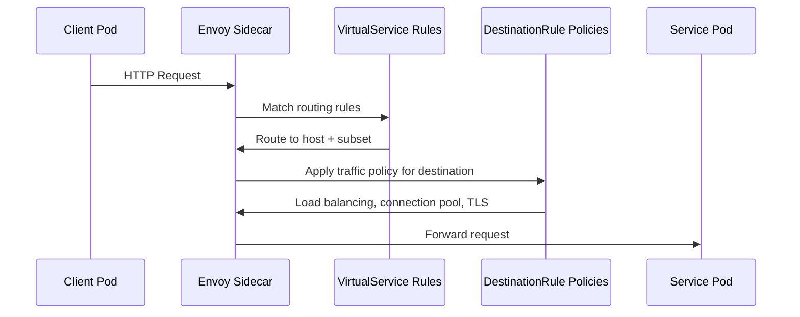

# How to Use DestinationRule with VirtualService Together

Author: [nawazdhandala](https://github.com/nawazdhandala)

Tags: Istio, DestinationRule, VirtualService, Traffic Management, Kubernetes

Description: Learn how DestinationRule and VirtualService work together in Istio for complete traffic routing and policy management.

---

VirtualService and DestinationRule are the two core traffic management resources in Istio, and they are designed to work together. VirtualService handles the "where" - routing rules that determine which service and subset receives traffic. DestinationRule handles the "how" - traffic policies like load balancing, connection pools, and TLS settings that apply once a destination is chosen.

Understanding how these two resources interact is essential for building any non-trivial Istio traffic management configuration.

## The Request Flow

When a request flows through the mesh, VirtualService and DestinationRule are evaluated at different stages:



1. The request hits the client's Envoy sidecar
2. VirtualService rules are evaluated to pick a destination (host and optional subset)
3. DestinationRule policies are applied for that destination (load balancing, circuit breaking, TLS)
4. The request is sent to the upstream pod

## A Basic Combined Example

Here is the simplest example showing both resources working together:

```yaml
apiVersion: networking.istio.io/v1
kind: DestinationRule
metadata:
  name: reviews-dr
spec:
  host: reviews
  trafficPolicy:
    loadBalancer:
      simple: RANDOM
  subsets:
  - name: v1
    labels:
      version: v1
  - name: v2
    labels:
      version: v2
  - name: v3
    labels:
      version: v3
---
apiVersion: networking.istio.io/v1
kind: VirtualService
metadata:
  name: reviews-vs
spec:
  hosts:
  - reviews
  http:
  - match:
    - headers:
        end-user:
          exact: jason
    route:
    - destination:
        host: reviews
        subset: v3
  - route:
    - destination:
        host: reviews
        subset: v1
      weight: 80
    - destination:
        host: reviews
        subset: v2
      weight: 20
```

The VirtualService defines three routing rules:
1. If the `end-user` header is "jason", route to v3
2. Otherwise, split traffic 80/20 between v1 and v2

The DestinationRule defines:
1. Three subsets (v1, v2, v3) based on the `version` label
2. Random load balancing across pods within each subset

## Canary Deployment Pattern

One of the most common patterns combining VirtualService and DestinationRule:

```yaml
apiVersion: networking.istio.io/v1
kind: DestinationRule
metadata:
  name: my-app-dr
spec:
  host: my-app
  subsets:
  - name: stable
    labels:
      version: v1
    trafficPolicy:
      connectionPool:
        tcp:
          maxConnections: 200
  - name: canary
    labels:
      version: v2
    trafficPolicy:
      connectionPool:
        tcp:
          maxConnections: 20
      outlierDetection:
        consecutive5xxErrors: 2
        interval: 5s
        baseEjectionTime: 60s
---
apiVersion: networking.istio.io/v1
kind: VirtualService
metadata:
  name: my-app-vs
spec:
  hosts:
  - my-app
  http:
  - route:
    - destination:
        host: my-app
        subset: stable
      weight: 95
    - destination:
        host: my-app
        subset: canary
      weight: 5
```

The VirtualService sends 5% of traffic to canary. The DestinationRule ensures the canary has strict circuit breaking so it fails fast if something is wrong.

## Header-Based Routing with Session Affinity

Route traffic based on headers, then ensure session stickiness within each route:

```yaml
apiVersion: networking.istio.io/v1
kind: DestinationRule
metadata:
  name: web-app-dr
spec:
  host: web-app
  subsets:
  - name: default
    labels:
      version: v1
    trafficPolicy:
      loadBalancer:
        consistentHash:
          httpCookie:
            name: SESSION_ID
            ttl: 3600s
  - name: beta
    labels:
      version: v2
    trafficPolicy:
      loadBalancer:
        consistentHash:
          httpCookie:
            name: SESSION_ID
            ttl: 3600s
---
apiVersion: networking.istio.io/v1
kind: VirtualService
metadata:
  name: web-app-vs
spec:
  hosts:
  - web-app
  http:
  - match:
    - headers:
        x-beta-user:
          exact: "true"
    route:
    - destination:
        host: web-app
        subset: beta
  - route:
    - destination:
        host: web-app
        subset: default
```

Beta users (identified by the `x-beta-user` header) go to v2. Everyone else goes to v1. Both subsets use cookie-based session affinity.

## Fault Injection with Circuit Breaking

VirtualService can inject faults for testing, and DestinationRule can protect against those faults:

```yaml
apiVersion: networking.istio.io/v1
kind: VirtualService
metadata:
  name: test-resilience
spec:
  hosts:
  - backend-service
  http:
  - fault:
      abort:
        percentage:
          value: 10
        httpStatus: 500
    route:
    - destination:
        host: backend-service
---
apiVersion: networking.istio.io/v1
kind: DestinationRule
metadata:
  name: backend-resilient
spec:
  host: backend-service
  trafficPolicy:
    outlierDetection:
      consecutive5xxErrors: 3
      interval: 10s
      baseEjectionTime: 30s
    connectionPool:
      http:
        http1MaxPendingRequests: 50
```

The VirtualService injects 10% failures. The DestinationRule's outlier detection ejects endpoints that are "failing" (from the injected faults). This is useful for testing your circuit breaking configuration.

## Timeouts and Retries with Connection Limits

VirtualService handles request-level timeouts and retries. DestinationRule handles connection-level limits:

```yaml
apiVersion: networking.istio.io/v1
kind: VirtualService
metadata:
  name: api-vs
spec:
  hosts:
  - api-service
  http:
  - route:
    - destination:
        host: api-service
    timeout: 10s
    retries:
      attempts: 3
      perTryTimeout: 4s
      retryOn: 5xx,connect-failure
---
apiVersion: networking.istio.io/v1
kind: DestinationRule
metadata:
  name: api-dr
spec:
  host: api-service
  trafficPolicy:
    connectionPool:
      tcp:
        maxConnections: 100
        connectTimeout: 3s
      http:
        http1MaxPendingRequests: 50
        maxRetries: 10
```

Note the interplay between `retries.attempts` in VirtualService (per-request retry count) and `maxRetries` in DestinationRule (global concurrent retry limit). The VirtualService says "retry up to 3 times per request." The DestinationRule says "no more than 10 retries happening at once across all requests."

## The Order of Operations

A common question: "Do I need to create the DestinationRule before the VirtualService?"

Technically, no. Istio's control plane will accept both resources in any order. But functionally, if your VirtualService references a subset that does not exist yet (because the DestinationRule has not been created), requests to that subset will fail with 503.

Best practice: Apply the DestinationRule first, then the VirtualService.

```bash
kubectl apply -f destinationrule.yaml
kubectl apply -f virtualservice.yaml
```

## Troubleshooting the Combination

**Subset not found**: VirtualService references subset "v2" but DestinationRule does not define it. Result: 503 errors.

```bash
istioctl analyze
```

This will flag the missing subset reference.

**Different hosts**: VirtualService routes to `my-service` but DestinationRule is for `my-service.default.svc.cluster.local`. These should resolve to the same service, but for clarity, use the same format in both resources.

**Policy not applied**: If the DestinationRule exists but its policies do not seem to take effect, verify the host matches:

```bash
istioctl proxy-config cluster <pod-name> --fqdn my-service.default.svc.cluster.local -o json
```

## Cleanup

```bash
kubectl delete virtualservice reviews-vs
kubectl delete destinationrule reviews-dr
```

VirtualService and DestinationRule are complementary resources. VirtualService controls routing decisions, and DestinationRule controls how those routed requests behave. For any serious traffic management setup, you will use both together. Get comfortable with how they interact and you can build sophisticated deployment strategies like canary releases, A/B testing, and gradual rollouts with full circuit breaking protection.
