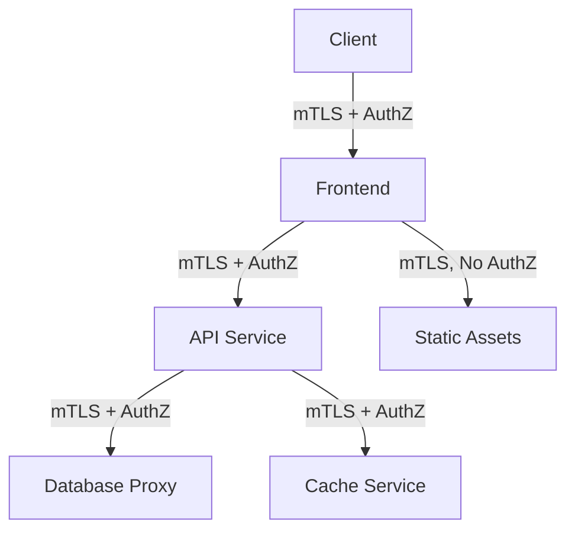

# How to Use Kiali for Security Policy Visualization

Author: [nawazdhandala](https://github.com/nawazdhandala)

Tags: Istio, Kiali, Security, AuthorizationPolicy, Service Mesh, mTLS

Description: Learn how to visualize and audit your Istio security policies including mTLS, authorization, and authentication using Kiali.

---

Security in Istio operates at multiple layers: mTLS encryption between services, authorization policies that control who can talk to whom, and authentication policies that verify identity. The challenge is that these policies interact with each other in complex ways, and it's easy to end up with a configuration that looks right on paper but has gaps in practice.

Kiali gives you visual tools to inspect your security posture. You can see which connections are encrypted, which services have authorization policies, and where your security configuration might have issues. This post covers how to use these features.

## mTLS Visualization in the Graph

One of Kiali's most useful security features is its mTLS visualization. On the traffic graph, you can see which connections between services are using mTLS and which are not.

Enable mTLS badges from the Display dropdown by toggling "Security." Once enabled, you'll see lock icons on edges that are using mTLS. Edges without the lock icon are sending traffic in plaintext.

This is incredibly valuable for verifying that your mTLS rollout is complete. If you've set PeerAuthentication to STRICT mode across the mesh, every edge should show a lock. Any edge without one indicates a problem.

## Checking Mesh-Wide mTLS Status

Kiali shows the overall mTLS status of your mesh in the toolbar. Look for the lock icon at the top of the page:

- **Lock icon (green)**: Mesh-wide mTLS is enabled and all traffic is encrypted
- **Lock icon with exclamation**: mTLS is partially enabled (some connections are not encrypted)
- **No lock**: mTLS is not enabled mesh-wide

Click the lock icon for more details about which namespaces have mTLS enabled and which don't.

## PeerAuthentication Visualization

Kiali's Istio Config page lists all PeerAuthentication resources. Click on any one to see its scope and mode:

```yaml
apiVersion: security.istio.io/v1
kind: PeerAuthentication
metadata:
  name: default
  namespace: istio-system
spec:
  mtls:
    mode: STRICT
```

This mesh-wide policy requires mTLS for all services. Kiali validates that no conflicting PeerAuthentication policies exist at the namespace or workload level that would weaken this setting.

For namespace-level overrides:

```yaml
apiVersion: security.istio.io/v1
kind: PeerAuthentication
metadata:
  name: namespace-policy
  namespace: legacy-app
spec:
  mtls:
    mode: PERMISSIVE
```

Kiali shows this as a warning because it allows plaintext traffic in a mesh that otherwise requires mTLS.

## Authorization Policy Visualization

AuthorizationPolicies control which services can communicate. Kiali displays these policies in the Istio Config section and also surfaces their effects in the graph view.

### Viewing Authorization Policies

Go to Istio Config and filter by type "AuthorizationPolicy." You'll see all policies across your namespaces with their validation status.

Click on a policy to see its details:

```yaml
apiVersion: security.istio.io/v1
kind: AuthorizationPolicy
metadata:
  name: reviews-access
  namespace: bookinfo
spec:
  selector:
    matchLabels:
      app: reviews
  rules:
    - from:
        - source:
            principals: ["cluster.local/ns/bookinfo/sa/productpage"]
      to:
        - operation:
            methods: ["GET"]
            paths: ["/reviews/*"]
```

This policy only allows the `productpage` service account to make GET requests to `/reviews/*` on the reviews service. Kiali validates that:

- The selector matches actual workloads
- The referenced service accounts exist
- The policy doesn't conflict with other policies

### Security Badges in the Graph

On the traffic graph, services with authorization policies show a badge indicating they have access control. This makes it easy to scan the graph and identify which services are protected and which aren't.

Services without any authorization policy are potential security gaps, especially in a zero-trust architecture.

## Detecting Security Misconfigurations

Kiali catches several security-related misconfigurations:

### mTLS Policy Conflicts

When a namespace-level PeerAuthentication says STRICT but a DestinationRule disables TLS for a specific service:

```yaml
# PeerAuthentication says STRICT
apiVersion: security.istio.io/v1
kind: PeerAuthentication
metadata:
  name: default
  namespace: bookinfo
spec:
  mtls:
    mode: STRICT
---
# DestinationRule disables TLS
apiVersion: networking.istio.io/v1
kind: DestinationRule
metadata:
  name: reviews
  namespace: bookinfo
spec:
  host: reviews
  trafficPolicy:
    tls:
      mode: DISABLE
```

Kiali flags this conflict because the DestinationRule will prevent mTLS from working for the reviews service, even though the PeerAuthentication requires it.

### Authorization Policy with No Matching Workloads

If your AuthorizationPolicy's selector doesn't match any pods:

```yaml
apiVersion: security.istio.io/v1
kind: AuthorizationPolicy
metadata:
  name: orphan-policy
  namespace: bookinfo
spec:
  selector:
    matchLabels:
      app: nonexistent-service
  rules:
    - from:
        - source:
            namespaces: ["bookinfo"]
```

Kiali warns that no workloads match this policy, meaning it has no effect.

### Overly Permissive Policies

While Kiali doesn't flag policies as "too permissive" by default, you can identify them by looking at what they allow. A policy with empty rules effectively allows all traffic:

```yaml
apiVersion: security.istio.io/v1
kind: AuthorizationPolicy
metadata:
  name: allow-all
  namespace: bookinfo
spec:
  rules:
    - {}
```

This allows all traffic to all services in the namespace, which is probably not what you want.

## Security Walkthrough: Auditing Your Mesh

Here's a practical workflow for auditing security with Kiali:

### Step 1: Check mTLS Status

Open the Graph view, enable Security display, and verify all edges show lock icons. Note any edges without locks.

### Step 2: Review PeerAuthentication Policies

Go to Istio Config, filter by PeerAuthentication. Verify:
- There's a mesh-wide policy in `istio-system` (if desired)
- Namespace-level overrides make sense
- No workload-level overrides weaken security unexpectedly

### Step 3: Audit Authorization Policies

Filter Istio Config by AuthorizationPolicy. For each policy, check:
- Does the selector match the intended workloads?
- Are the source principals/namespaces correct?
- Are the allowed operations (methods, paths) as restrictive as needed?

### Step 4: Look for Unprotected Services

Cross-reference the services in your namespace with the authorization policies. Any service without a policy is accessible to everyone in the mesh (assuming no namespace-level deny-all policy).

### Step 5: Validate Everything

Check that all security resources pass Kiali's validation. Fix any warnings or errors before considering the audit complete.

## Mapping Security Policies to Traffic



In Kiali's graph, you'd see lock icons on all edges (mTLS) and authorization badges on services B, C, E, and F. Service D has no authorization policy, which might be intentional (static assets) or a gap to fix.

## Practical Tips

1. Start with a deny-all policy at the namespace level and then add specific allow rules. This is easier to audit than the reverse approach.

2. Use Kiali's mTLS visualization after any mesh upgrade to verify mTLS wasn't disrupted.

3. When onboarding new services, check Kiali immediately to verify they're participating in mTLS and have appropriate authorization policies.

4. Review security policies quarterly using the audit workflow above. Policies tend to accumulate and drift over time.

Kiali won't replace a proper security review, but it makes the review process much faster and more visual. Seeing your security posture on a graph is worth a thousand lines of YAML.
