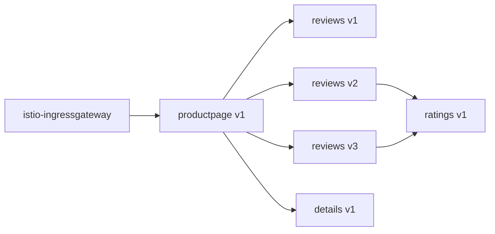

# How to Use Kiali to Visualize Service Dependencies in Istio

Author: [nawazdhandala](https://github.com/nawazdhandala)

Tags: Istio, Kiali, Service Mesh, Observability, Microservices

Description: Learn how to use Kiali's graph features to map and understand service dependencies across your Istio mesh.

---

When you have a handful of microservices, keeping track of which service talks to which is manageable. But once you hit 30, 50, or 100+ services, that mental model breaks down fast. Kiali solves this by building a live dependency graph from the actual traffic flowing through your Istio mesh.

Unlike static documentation or manually maintained architecture diagrams, Kiali's dependency visualization is based on real network traffic. If service A calls service B, you see that connection. If a dependency was removed three weeks ago, it vanishes from the graph. This is incredibly useful for understanding the actual state of your system rather than what someone thought it looked like six months ago.

## How Kiali Discovers Dependencies

Kiali doesn't use any special agents or instrumentation to discover dependencies. It relies entirely on Prometheus metrics that Istio's Envoy proxies generate automatically. Every request that passes through the mesh creates metrics like `istio_requests_total`, which include source and destination labels.

Kiali queries these metrics and stitches them together into a dependency graph. The key metrics it uses are:

- `istio_requests_total` - HTTP/gRPC request counts with source/destination
- `istio_tcp_sent_bytes_total` - TCP traffic between services
- `istio_tcp_received_bytes_total` - TCP bytes received

Since these metrics include labels like `source_workload`, `destination_service`, `response_code`, and more, Kiali can build very detailed graphs.

## Opening the Graph View

Access Kiali (via `istioctl dashboard kiali` or port-forward) and click "Graph" in the left navigation. You'll see the main topology graph for your mesh.

The default view shows all namespaces, but you should filter to specific namespaces using the namespace dropdown at the top. This keeps the graph readable.

## Graph Types and When to Use Each

Kiali offers four graph types, each showing dependencies from a different angle:

### App Graph

```
Graph Type: App
```

This groups all workloads by their `app` label. If you have `reviews-v1`, `reviews-v2`, and `reviews-v3`, they all appear as a single "reviews" node. Use this when you want a high-level view of which applications depend on each other without worrying about versions.

### Versioned App Graph

```
Graph Type: Versioned App
```

Same as the app graph, but it splits out different versions. You'll see `reviews v1`, `reviews v2`, and `reviews v3` as separate nodes with their own traffic flows. This is the best option when you're doing canary deployments or A/B testing and want to see how traffic splits between versions.

### Workload Graph

```
Graph Type: Workload
```

Shows individual workloads (Deployments, StatefulSets, etc.) as separate nodes. This is the most granular view and is useful when you need to see exactly which pods are communicating.

### Service Graph

```
Graph Type: Service
```

Shows Kubernetes services as nodes. Traffic flows are aggregated at the service level. Good for understanding the logical architecture of your system.

## Reading the Dependency Graph

Each edge (line) in the graph represents a dependency. The direction of the arrow shows who is calling whom. Green edges mean healthy traffic, orange means some errors, and red means high error rates.

You can hover over any edge to see detailed stats:

- Request rate (requests per second)
- Error rate (percentage of 5xx responses)
- Response time (p50, p95, p99)

Click on an edge to get even more detail, including a breakdown by response code.

## Finding Hidden Dependencies

One of the most valuable uses of Kiali is discovering dependencies you didn't know about. Filter the graph to your namespace and look for unexpected connections. Common surprises include:

- Services making direct database calls instead of going through an API gateway
- Debug endpoints that are still being called in production
- Services depending on external APIs that aren't documented anywhere

To see external dependencies (services outside the mesh), make sure "Unknown" nodes are enabled in the display settings. These appear as a special node type on the graph.

## Using Edge Labels for Deeper Analysis

Configure edge labels to show additional information. Click the "Display" dropdown and select what you want on the edges:

- **Response Time** - Shows average response time on each edge
- **Throughput** - Shows requests per second
- **Traffic Distribution** - Shows percentage of traffic on each edge (useful during canary releases)

For dependency analysis, response time labels are particularly helpful because they quickly reveal which downstream dependencies are slow.

## Filtering and Focusing

With large meshes, the full graph can be overwhelming. Kiali provides several ways to focus on specific dependencies:

### Find and Hide

Use the "Find" box to highlight specific services:

```
node = "reviews"
```

Or hide nodes that clutter the graph:

```
node = "istio-ingressgateway"
```

### Namespace Filtering

Select only the namespaces you care about from the namespace dropdown. You can select multiple namespaces to see cross-namespace dependencies.

### Traffic Filtering

Use the traffic dropdown to filter by protocol:

- HTTP traffic only
- gRPC traffic only
- TCP traffic only

This is helpful when you're troubleshooting a specific protocol.

## Exporting Dependency Information

Sometimes you need to share the dependency map with your team. Kiali doesn't have a direct export to PNG feature in all versions, but you have options:

1. Take a screenshot of the graph view
2. Use the Kiali API to get graph data programmatically:

```bash
curl -s "http://localhost:20001/kiali/api/namespaces/graph?namespaces=bookinfo&graphType=versionedApp" | python3 -m json.tool
```

The API response includes all nodes and edges in JSON format, which you can transform into whatever format you need.

## Practical Example: Mapping the Bookinfo App

If you have the Istio Bookinfo sample app deployed, here's what the dependency chain looks like:



In Kiali's versioned app graph, you'd see this exact topology with live traffic numbers on each edge. You can immediately tell which version of reviews is getting the most traffic and whether ratings is being called from both v2 and v3.

## Tracking Dependencies Over Time

Kiali's graph is based on traffic within a time window. The default is "Last 1m" (last minute), but you can adjust this using the time range selector. Options include:

- Last 1m, 5m, 10m, 30m
- Last 1h, 3h, 6h, 12h, 24h

A longer time window shows more connections (because you're capturing dependencies that might not fire every second), while a shorter window shows only the active ones. For a complete dependency map, use a longer window like 1h or more.

## Handling Services Outside the Mesh

Not all your services might be in the Istio mesh. Services without sidecars still show up in Kiali as "Unknown" source or destination nodes. To get better visibility:

1. Make sure all your services have proper `app` and `version` labels
2. Consider adding the Istio sidecar to critical services that aren't yet in the mesh
3. Use ServiceEntry resources to give names to external dependencies:

```yaml
apiVersion: networking.istio.io/v1
kind: ServiceEntry
metadata:
  name: external-api
  namespace: bookinfo
spec:
  hosts:
    - api.external-service.com
  ports:
    - number: 443
      name: https
      protocol: HTTPS
  resolution: DNS
  location: MESH_EXTERNAL
```

With a ServiceEntry in place, the external dependency appears with its real name in Kiali instead of "Unknown."

## Wrapping Up

Kiali's dependency visualization turns an abstract mesh into something you can actually understand and reason about. The key is to use the right graph type for your goal, filter aggressively on large meshes, and leverage edge labels to spot bottlenecks. Once you have a clear picture of your dependencies, you can make better decisions about circuit breakers, retries, and timeout policies across the mesh.
