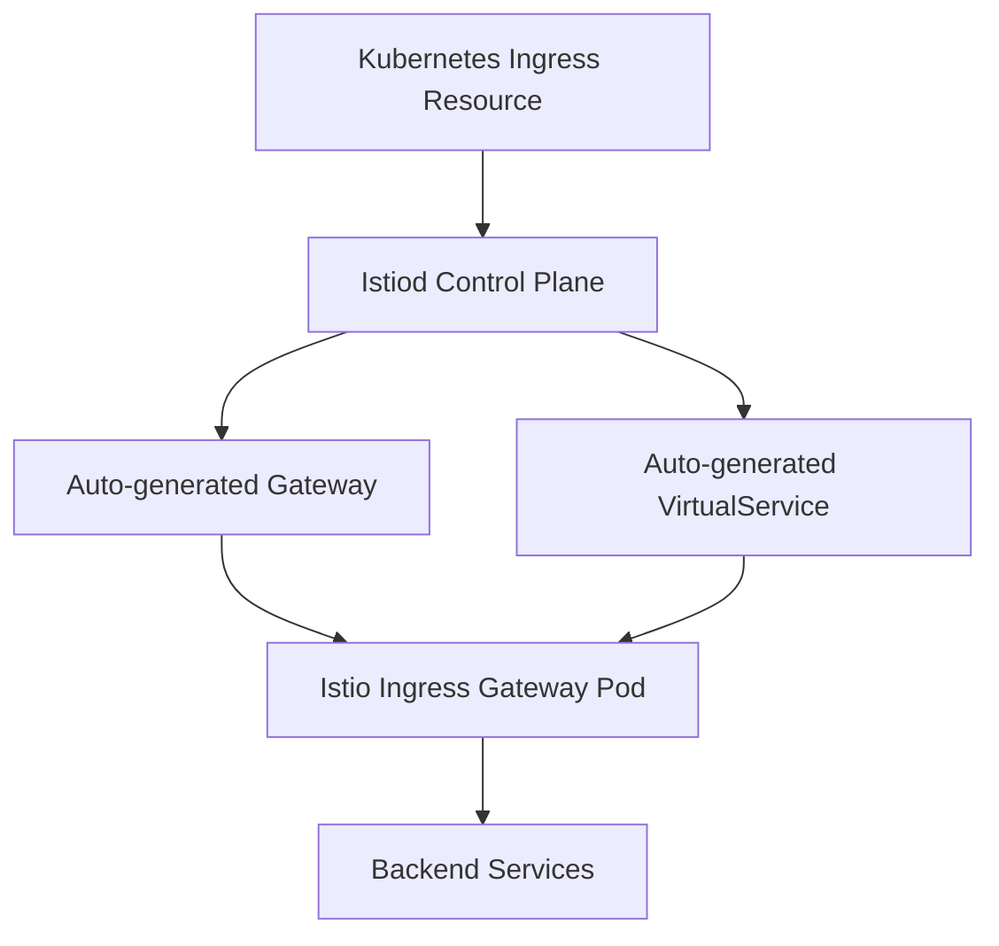

# How to Use Kubernetes Ingress Resource with Istio

Author: [nawazdhandala](https://github.com/nawazdhandala)

Tags: Istio, Kubernetes Ingress, Service Mesh, Traffic Routing, Kubernetes

Description: Use standard Kubernetes Ingress resources with Istio as the ingress controller for simple HTTP routing without Istio-specific Gateway resources.

---

Istio has its own Gateway and VirtualService resources for handling ingress traffic, but you do not always need them. If you are already using standard Kubernetes Ingress resources and want to switch to Istio as your ingress controller, or if you prefer the simpler Ingress API for straightforward HTTP routing, Istio supports that too.

The Kubernetes Ingress resource is a simpler API compared to Istio's Gateway/VirtualService combination. It covers the most common use cases like host-based routing, path-based routing, and TLS termination. For anything more advanced (like header matching, traffic splitting, or fault injection), you will still need Istio's native resources. But for basic setups, the Ingress resource works fine with Istio.

## How Istio Handles Kubernetes Ingress

When you create a Kubernetes Ingress resource, Istio's control plane (istiod) watches for it and automatically generates the corresponding Gateway and VirtualService configurations. Your Ingress resource is translated into Istio's native config behind the scenes.



## Setting Up Istio as the Ingress Controller

### Step 1: Annotate Your Ingress Resource

For Istio to process your Ingress resource, you need to set the `ingressClassName` to `istio`:

```yaml
apiVersion: networking.k8s.io/v1
kind: Ingress
metadata:
  name: myapp-ingress
spec:
  ingressClassName: istio
  rules:
    - host: "myapp.example.com"
      http:
        paths:
          - path: /
            pathType: Prefix
            backend:
              service:
                name: frontend-service
                port:
                  number: 80
          - path: /api
            pathType: Prefix
            backend:
              service:
                name: api-service
                port:
                  number: 80
```

```bash
kubectl apply -f myapp-ingress.yaml
```

### Step 2: Verify the Ingress was Created

```bash
kubectl get ingress myapp-ingress
```

The ADDRESS field should show the Istio ingress gateway's external IP.

### Step 3: Test It

```bash
INGRESS_IP=$(kubectl get ingress myapp-ingress -o jsonpath='{.status.loadBalancer.ingress[0].ip}')
curl -H "Host: myapp.example.com" http://$INGRESS_IP/
curl -H "Host: myapp.example.com" http://$INGRESS_IP/api/health
```

## Adding TLS to the Ingress

Standard Kubernetes TLS ingress works with Istio:

```yaml
apiVersion: networking.k8s.io/v1
kind: Ingress
metadata:
  name: myapp-ingress
spec:
  ingressClassName: istio
  tls:
    - hosts:
        - myapp.example.com
      secretName: myapp-tls
  rules:
    - host: "myapp.example.com"
      http:
        paths:
          - path: /
            pathType: Prefix
            backend:
              service:
                name: frontend-service
                port:
                  number: 80
```

Create the TLS secret:

```bash
kubectl create secret tls myapp-tls \
  --cert=fullchain.pem \
  --key=privkey.pem
```

Note that with Ingress resources, the TLS secret goes in the same namespace as the Ingress, not in `istio-system`. Istio handles the translation.

## Multiple Host Routing

Route different domains to different services:

```yaml
apiVersion: networking.k8s.io/v1
kind: Ingress
metadata:
  name: multi-host-ingress
spec:
  ingressClassName: istio
  tls:
    - hosts:
        - app.example.com
        - api.example.com
      secretName: example-tls
  rules:
    - host: "app.example.com"
      http:
        paths:
          - path: /
            pathType: Prefix
            backend:
              service:
                name: web-app
                port:
                  number: 80
    - host: "api.example.com"
      http:
        paths:
          - path: /v1
            pathType: Prefix
            backend:
              service:
                name: api-v1
                port:
                  number: 80
          - path: /v2
            pathType: Prefix
            backend:
              service:
                name: api-v2
                port:
                  number: 80
```

## Path Types

Kubernetes Ingress supports three path types, and Istio handles all of them:

```yaml
paths:
  # Prefix matching - /api matches /api, /api/, /api/users
  - path: /api
    pathType: Prefix
    backend:
      service:
        name: api-service
        port:
          number: 80

  # Exact matching - only matches /health exactly
  - path: /health
    pathType: Exact
    backend:
      service:
        name: health-service
        port:
          number: 80

  # ImplementationSpecific - behavior depends on the ingress controller
  - path: /legacy
    pathType: ImplementationSpecific
    backend:
      service:
        name: legacy-service
        port:
          number: 80
```

## Using Annotations for Additional Configuration

While Istio does not support all annotation-based configuration that Nginx Ingress does, there are some Istio-specific annotations you can use:

```yaml
apiVersion: networking.k8s.io/v1
kind: Ingress
metadata:
  name: myapp-ingress
  annotations:
    # Use a specific Istio ingress gateway
    istio.io/ingress-use-istio: "true"
spec:
  ingressClassName: istio
  rules:
    - host: "myapp.example.com"
      http:
        paths:
          - path: /
            pathType: Prefix
            backend:
              service:
                name: frontend-service
                port:
                  number: 80
```

## Default Backend

Configure a default backend for requests that do not match any rule:

```yaml
apiVersion: networking.k8s.io/v1
kind: Ingress
metadata:
  name: myapp-ingress
spec:
  ingressClassName: istio
  defaultBackend:
    service:
      name: default-service
      port:
        number: 80
  rules:
    - host: "myapp.example.com"
      http:
        paths:
          - path: /api
            pathType: Prefix
            backend:
              service:
                name: api-service
                port:
                  number: 80
```

Requests that do not match `/api` will go to `default-service`.

## Limitations Compared to Istio Gateway/VirtualService

The Kubernetes Ingress API is simpler, and that simplicity comes with limitations:

| Feature | K8s Ingress | Istio Gateway/VS |
|---------|-------------|------------------|
| Host-based routing | Yes | Yes |
| Path-based routing | Yes | Yes |
| TLS termination | Yes | Yes |
| Header-based routing | No | Yes |
| Traffic splitting | No | Yes |
| Fault injection | No | Yes |
| Request mirroring | No | Yes |
| Retry policies | No | Yes |
| Timeout configuration | No | Yes |
| CORS policies | No | Yes |

If you need any of the features in the right column, use Istio's native Gateway and VirtualService resources instead.

## Migrating from Ingress to Gateway/VirtualService

When you outgrow the Ingress API, here is how a typical Ingress resource translates to Istio resources:

**Ingress:**

```yaml
apiVersion: networking.k8s.io/v1
kind: Ingress
metadata:
  name: myapp
spec:
  ingressClassName: istio
  tls:
    - hosts:
        - myapp.example.com
      secretName: myapp-tls
  rules:
    - host: myapp.example.com
      http:
        paths:
          - path: /api
            pathType: Prefix
            backend:
              service:
                name: api-service
                port:
                  number: 80
          - path: /
            pathType: Prefix
            backend:
              service:
                name: frontend
                port:
                  number: 80
```

**Equivalent Istio Gateway + VirtualService:**

```yaml
apiVersion: networking.istio.io/v1
kind: Gateway
metadata:
  name: myapp-gateway
spec:
  selector:
    istio: ingressgateway
  servers:
    - port:
        number: 443
        name: https
        protocol: HTTPS
      tls:
        mode: SIMPLE
        credentialName: myapp-tls
      hosts:
        - myapp.example.com
---
apiVersion: networking.istio.io/v1
kind: VirtualService
metadata:
  name: myapp
spec:
  hosts:
    - myapp.example.com
  gateways:
    - myapp-gateway
  http:
    - match:
        - uri:
            prefix: /api
      route:
        - destination:
            host: api-service
            port:
              number: 80
    - match:
        - uri:
            prefix: /
      route:
        - destination:
            host: frontend
            port:
              number: 80
```

## Troubleshooting

**Ingress not getting an IP address:**

```bash
# Check if Istio is processing the Ingress
kubectl get ingress myapp-ingress -o yaml
# Look for the status.loadBalancer section
```

**Routes not working:**

```bash
# Check what Istio generated from your Ingress
istioctl analyze -n default
```

**TLS not working:**

Make sure the TLS secret exists in the same namespace as the Ingress resource and has the correct key names (`tls.crt` and `tls.key`).

Using Kubernetes Ingress resources with Istio is a good starting point, especially if you are migrating from another ingress controller. It keeps things simple for basic routing needs. When you need more advanced traffic management, you can switch to Istio's Gateway and VirtualService resources for the services that need them while keeping Ingress resources for everything else.
