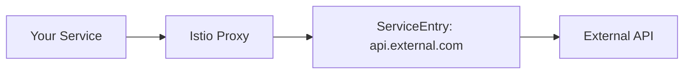

# How to Use VirtualService to Route to External Services

Author: [nawazdhandala](https://github.com/nawazdhandala)

Tags: Istio, VirtualService, ServiceEntry, External Services, Traffic Management

Description: Learn how to use Istio VirtualService with ServiceEntry to route mesh traffic to external services with timeouts, retries, and traffic shifting.

---

By default, Istio allows mesh services to call external endpoints, but you do not get any of Istio's traffic management features for those calls. If you want timeouts, retries, circuit breaking, or traffic splitting for external service calls, you need to register the external service with a ServiceEntry and then create a VirtualService for it.

## The ServiceEntry + VirtualService Pattern

The basic flow is:

1. Create a **ServiceEntry** to register the external service with Istio's service registry
2. Create a **VirtualService** to apply traffic management rules
3. Optionally create a **DestinationRule** for connection pool settings and TLS



## Registering an External HTTP Service

First, create a ServiceEntry for the external service:

```yaml
apiVersion: networking.istio.io/v1beta1
kind: ServiceEntry
metadata:
  name: external-api
  namespace: default
spec:
  hosts:
    - api.external.com
  ports:
    - number: 443
      name: https
      protocol: HTTPS
  resolution: DNS
  location: MESH_EXTERNAL
```

Now Istio knows about `api.external.com` and can apply traffic management rules to it.

## Adding a VirtualService for the External Service

With the ServiceEntry in place, add a VirtualService:

```yaml
apiVersion: networking.istio.io/v1beta1
kind: VirtualService
metadata:
  name: external-api
  namespace: default
spec:
  hosts:
    - api.external.com
  http:
    - timeout: 5s
      retries:
        attempts: 3
        perTryTimeout: 2s
        retryOn: "5xx,reset,connect-failure"
      route:
        - destination:
            host: api.external.com
            port:
              number: 443
```

Now every call to `api.external.com` from within the mesh gets a 5-second timeout and 3 retry attempts on failures.

## Routing to Different External Endpoints

You can route different paths to different external services:

```yaml
apiVersion: networking.istio.io/v1beta1
kind: ServiceEntry
metadata:
  name: payment-provider-a
  namespace: default
spec:
  hosts:
    - payments-a.example.com
  ports:
    - number: 443
      name: https
      protocol: HTTPS
  resolution: DNS
  location: MESH_EXTERNAL
---
apiVersion: networking.istio.io/v1beta1
kind: ServiceEntry
metadata:
  name: payment-provider-b
  namespace: default
spec:
  hosts:
    - payments-b.example.com
  ports:
    - number: 443
      name: https
      protocol: HTTPS
  resolution: DNS
  location: MESH_EXTERNAL
---
apiVersion: networking.istio.io/v1beta1
kind: VirtualService
metadata:
  name: payment-routing
  namespace: default
spec:
  hosts:
    - payment-gateway    # Internal service name
  http:
    - match:
        - headers:
            x-payment-provider:
              exact: "provider-a"
      route:
        - destination:
            host: payments-a.example.com
            port:
              number: 443
    - route:
        - destination:
            host: payments-b.example.com
            port:
              number: 443
```

## Traffic Splitting Between External Providers

You can split traffic between external services for migration or A/B testing:

```yaml
apiVersion: networking.istio.io/v1beta1
kind: VirtualService
metadata:
  name: search-api
  namespace: default
spec:
  hosts:
    - search-api
  http:
    - route:
        - destination:
            host: old-search.example.com
            port:
              number: 443
          weight: 80
        - destination:
            host: new-search.example.com
            port:
              number: 443
          weight: 20
```

80% of search requests go to the old provider, 20% to the new one. This is great for migrating between external services.

## TLS Origination

If your application talks HTTP internally but the external service requires HTTPS, use TLS origination in the DestinationRule:

```yaml
apiVersion: networking.istio.io/v1beta1
kind: ServiceEntry
metadata:
  name: external-api
  namespace: default
spec:
  hosts:
    - api.external.com
  ports:
    - number: 80
      name: http-port
      protocol: HTTP
    - number: 443
      name: https
      protocol: HTTPS
  resolution: DNS
  location: MESH_EXTERNAL
---
apiVersion: networking.istio.io/v1beta1
kind: DestinationRule
metadata:
  name: external-api
  namespace: default
spec:
  host: api.external.com
  trafficPolicy:
    portLevelSettings:
      - port:
          number: 443
        tls:
          mode: SIMPLE
---
apiVersion: networking.istio.io/v1beta1
kind: VirtualService
metadata:
  name: external-api
  namespace: default
spec:
  hosts:
    - api.external.com
  http:
    - match:
        - port: 80
      route:
        - destination:
            host: api.external.com
            port:
              number: 443
```

Your application calls `http://api.external.com`, and the Istio proxy upgrades the connection to HTTPS before sending it out.

## Fault Injection for External Services

Testing how your application handles external service failures:

```yaml
apiVersion: networking.istio.io/v1beta1
kind: VirtualService
metadata:
  name: external-api
  namespace: default
spec:
  hosts:
    - api.external.com
  http:
    - fault:
        delay:
          percentage:
            value: 50.0
          fixedDelay: 5s
        abort:
          percentage:
            value: 10.0
          httpStatus: 503
      route:
        - destination:
            host: api.external.com
            port:
              number: 443
```

50% of calls to the external API get a 5-second delay, and 10% get a 503 error. This is useful for testing your application's resilience to external service problems.

## Circuit Breaking for External Services

Protect your application from cascading failures when an external service goes down:

```yaml
apiVersion: networking.istio.io/v1beta1
kind: DestinationRule
metadata:
  name: external-api
  namespace: default
spec:
  host: api.external.com
  trafficPolicy:
    connectionPool:
      tcp:
        maxConnections: 100
      http:
        h2UpgradePolicy: DEFAULT
        maxRequestsPerConnection: 10
    outlierDetection:
      consecutive5xxErrors: 5
      interval: 30s
      baseEjectionTime: 30s
```

## Routing to External Services Through an Egress Gateway

For tighter security control, route external traffic through a dedicated egress gateway:

```yaml
apiVersion: networking.istio.io/v1beta1
kind: Gateway
metadata:
  name: egress-gateway
  namespace: istio-system
spec:
  selector:
    istio: egressgateway
  servers:
    - port:
        number: 443
        name: tls
        protocol: TLS
      hosts:
        - api.external.com
      tls:
        mode: PASSTHROUGH
---
apiVersion: networking.istio.io/v1beta1
kind: VirtualService
metadata:
  name: external-api-egress
  namespace: default
spec:
  hosts:
    - api.external.com
  gateways:
    - mesh
    - istio-system/egress-gateway
  tls:
    - match:
        - gateways:
            - mesh
          sniHosts:
            - api.external.com
      route:
        - destination:
            host: istio-egressgateway.istio-system.svc.cluster.local
            port:
              number: 443
    - match:
        - gateways:
            - istio-system/egress-gateway
          sniHosts:
            - api.external.com
      route:
        - destination:
            host: api.external.com
            port:
              number: 443
```

This forces all external traffic through the egress gateway, giving you a central point for monitoring and controlling outbound traffic.

## Using Internal Service Name for External Services

You can create an internal alias for an external service:

```yaml
apiVersion: networking.istio.io/v1beta1
kind: ServiceEntry
metadata:
  name: external-db
  namespace: default
spec:
  hosts:
    - external-db.default.svc.cluster.local
  addresses:
    - 10.0.0.100
  ports:
    - number: 5432
      name: tcp-postgres
      protocol: TCP
  resolution: STATIC
  location: MESH_EXTERNAL
  endpoints:
    - address: 10.0.0.100
---
apiVersion: networking.istio.io/v1beta1
kind: VirtualService
metadata:
  name: external-db
  namespace: default
spec:
  hosts:
    - external-db.default.svc.cluster.local
  tcp:
    - route:
        - destination:
            host: external-db.default.svc.cluster.local
            port:
              number: 5432
```

Your application connects to `external-db` as if it were an internal Kubernetes service.

## Debugging External Service Routing

```bash
# Check the ServiceEntry was registered
kubectl get serviceentries -n default

# Verify Istio can resolve the external host
istioctl proxy-config clusters deploy/my-app -n default | grep external

# Check endpoints
istioctl proxy-config endpoints deploy/my-app -n default | grep external

# Check for connectivity
kubectl exec deploy/my-app -c istio-proxy -- curl -s -o /dev/null -w "%{http_code}" https://api.external.com/health
```

Routing to external services with Istio gives you the same traffic management capabilities you have for internal services. Timeouts, retries, circuit breaking, and traffic splitting all work once you register the external service with a ServiceEntry.
