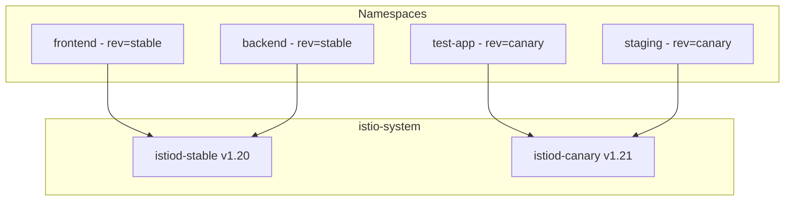

# How to Manage Multiple Istio Control Plane Revisions

Author: [nawazdhandala](https://github.com/nawazdhandala)

Tags: Istio, Kubernetes, Service Mesh, Control Plane, Revisions

Description: Learn how to run multiple Istio control plane revisions simultaneously for safe upgrades, A/B testing, and gradual migration of workloads.

---

Running multiple Istio control plane revisions at the same time is one of the more powerful features Istio offers for operational safety. Instead of a single istiod instance that every workload depends on, you can run multiple versions side by side and control exactly which workloads connect to which revision. This is the foundation of canary upgrades, but it is also useful for testing new configurations, running different Istio versions for different teams, or maintaining a stable fallback during experimentation.

Here is everything you need to know about managing multiple revisions.

## How Revisions Work

When you install Istio with a revision label, Istio creates a separate istiod deployment with that revision name. Each revision has its own:

- istiod deployment (e.g., `istiod-stable`, `istiod-canary`)
- Mutating webhook configuration
- Service for proxy discovery

Namespaces opt into a specific revision using the `istio.io/rev` label instead of the standard `istio-injection=enabled` label. When a pod is created in a labeled namespace, the webhook for that revision injects the sidecar proxy configured to connect to that specific istiod instance.



## Installing Multiple Revisions

Start by installing your first revision. If you already have a default Istio installation without a revision, you can add revisions alongside it.

Install the "stable" revision:

```bash
istioctl install --revision=stable --set profile=default -y
```

Install the "canary" revision with a different Istio version:

```bash
# Switch to the newer istioctl
export PATH=/path/to/istio-1.21.0/bin:$PATH

istioctl install --revision=canary --set profile=default -y
```

Verify both are running:

```bash
kubectl get pods -n istio-system -l app=istiod
```

Output:

```text
NAME                            READY   STATUS    RESTARTS   AGE
istiod-stable-6b4c4d8f9-abc12  1/1     Running   0          7d
istiod-canary-7c5d6e9f1-xyz34  1/1     Running   0          5m
```

You can also see the mutating webhook configurations:

```bash
kubectl get mutatingwebhookconfiguration | grep istio
```

Each revision creates its own webhook:

```text
istio-sidecar-injector-stable   1    7d
istio-sidecar-injector-canary   1    5m
```

## Assigning Namespaces to Revisions

Label namespaces to control which revision they use:

```bash
# Point namespace to the stable revision
kubectl label namespace frontend istio.io/rev=stable

# Point namespace to the canary revision
kubectl label namespace test-app istio.io/rev=canary
```

Important: Make sure to remove the `istio-injection=enabled` label if it exists, because having both can cause conflicts:

```bash
kubectl label namespace frontend istio-injection-
```

After labeling, restart pods to pick up the correct sidecar:

```bash
kubectl rollout restart deployment -n frontend
kubectl rollout restart deployment -n test-app
```

## Checking Which Revision a Namespace Uses

To see the revision label for all namespaces:

```bash
kubectl get namespaces -L istio.io/rev
```

This shows a column with the revision label. Namespaces without the label will not have sidecar injection from any revision.

To see which istiod a specific proxy is connected to:

```bash
istioctl proxy-status
```

The ISTIOD column shows which control plane instance each proxy is communicating with.

## Moving Workloads Between Revisions

Migrating a namespace from one revision to another is straightforward:

```bash
# Change the revision label
kubectl label namespace backend istio.io/rev=canary --overwrite

# Restart workloads
kubectl rollout restart deployment -n backend
```

After the rollout, verify the proxies are connected to the new revision:

```bash
istioctl proxy-status | grep backend
```

You can migrate workloads at whatever pace you are comfortable with. One namespace at a time, a batch of namespaces, or everything at once. The key advantage of revisions is that you control the pace.

## Managing Configuration Across Revisions

Each revision is a separate istiod instance, but they share the same Kubernetes API and the same Istio CRDs. This means VirtualServices, DestinationRules, and other Istio resources are visible to all revisions. A VirtualService created in a namespace managed by the stable revision will also be seen by the canary revision if a proxy on that revision needs it.

This is generally fine, but be aware of a few things:

- If the newer revision supports CRD fields that the older one does not, resources using those fields might cause errors in the older control plane's logs.
- Each revision can have different mesh configuration. Set mesh-level options per revision during install:

```bash
istioctl install --revision=canary \
  --set meshConfig.accessLogFile=/dev/stdout \
  --set meshConfig.defaultConfig.holdApplicationUntilProxyStarts=true \
  -y
```

## Monitoring Multiple Revisions

Each istiod revision exposes its own metrics. You can scrape them separately:

```bash
# Check stable revision metrics
kubectl port-forward -n istio-system deployment/istiod-stable 15014:15014 &
curl http://localhost:15014/metrics

# Check canary revision metrics
kubectl port-forward -n istio-system deployment/istiod-canary 15015:15014 &
curl http://localhost:15015/metrics
```

Key metrics to compare between revisions:

- `pilot_xds_pushes` - Number of config pushes to proxies
- `pilot_proxy_convergence_time` - How long it takes proxies to get new config
- `pilot_conflict_inbound_listener` - Configuration conflicts
- `pilot_xds_push_errors` - Push errors (any non-zero value needs investigation)

Set up Grafana dashboards that show both revisions side by side so you can compare their health during a migration.

## Cleaning Up Old Revisions

Once all workloads have been migrated away from a revision, you can safely remove it:

```bash
# Verify no proxies are connected to the old revision
istioctl proxy-status | grep stable

# If empty, safe to remove
istioctl uninstall --revision=stable -y
```

Double-check by looking at the pods:

```bash
kubectl get pods -n istio-system -l app=istiod
```

Only the active revision should remain.

Also clean up the webhook:

```bash
kubectl get mutatingwebhookconfiguration | grep stable
```

The uninstall command should remove it, but verify to be safe.

## Resource Considerations

Running multiple revisions means running multiple istiod instances. Each istiod instance uses CPU and memory, so plan your resource budgets accordingly.

A typical istiod instance might use:

```yaml
resources:
  requests:
    cpu: 500m
    memory: 2Gi
  limits:
    cpu: "2"
    memory: 4Gi
```

Running two revisions doubles this. For large clusters with autoscaling enabled, you could have 4-6 istiod pods total across two revisions. Make sure your cluster has enough headroom.

## Best Practices

- **Use descriptive revision names.** Names like `stable` and `canary` are clear. Avoid version numbers as names (like `1-20`) because they get confusing over time.
- **Keep the number of active revisions to two at most.** More than two is a sign that migrations are not completing.
- **Set a timeline for migration completion.** Running two revisions indefinitely wastes resources and adds operational complexity.
- **Automate revision tracking.** Build dashboards or alerts that show which namespaces are on which revision.
- **Test cross-revision communication.** If services on different revisions need to talk to each other, verify that mTLS and routing work across the revision boundary.

## Summary

Multiple Istio control plane revisions give you a powerful tool for safe upgrades and gradual migration. Install revisions with the `--revision` flag, assign namespaces via labels, restart workloads to pick up the new revision, and clean up old revisions when the migration is done. The extra operational overhead is worth the safety it provides, especially in production environments where downtime has real costs.
