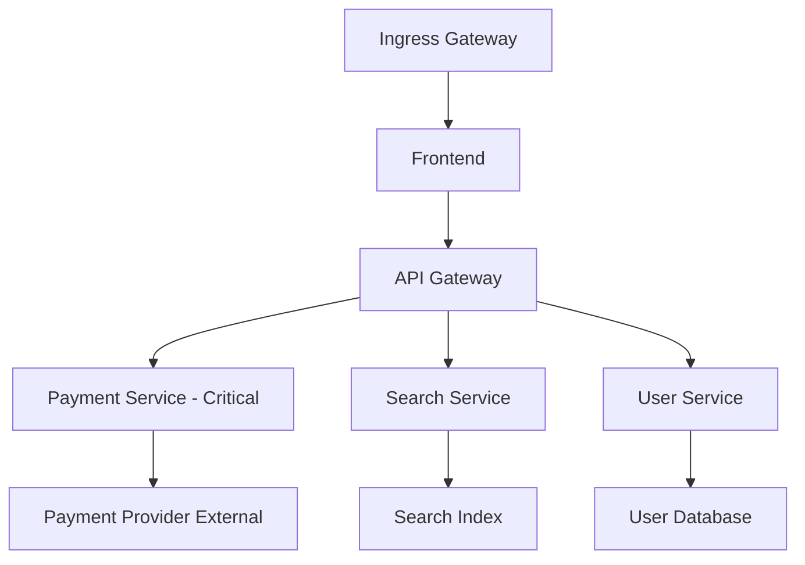
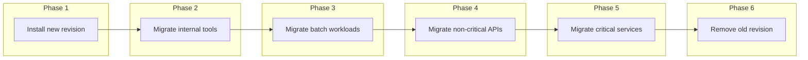

# How to Plan an Istio Upgrade Strategy for Large Clusters

Author: [nawazdhandala](https://github.com/nawazdhandala)

Tags: Istio, Kubernetes, Service Mesh, Upgrade Strategy, Large Scale

Description: A comprehensive planning guide for Istio upgrades in large Kubernetes clusters with hundreds of services, multiple teams, and strict uptime requirements.

---

Upgrading Istio in a cluster with 10 services is one thing. Upgrading Istio in a cluster with 500 services, 50 namespaces, 8 teams, and a 99.99% uptime SLA is a completely different challenge. The technical steps are the same, but the planning, communication, and risk management are far more complex.

This guide covers how to plan an Istio upgrade strategy that works at scale.

## Understand Your Cluster

Before planning any upgrade, you need a clear picture of what you are working with.

### Inventory Your Mesh

```bash
# How many namespaces have sidecar injection
kubectl get ns -l istio-injection=enabled --no-headers | wc -l
kubectl get ns -L istio.io/rev | grep -v "<none>" | wc -l

# How many pods have sidecars
istioctl proxy-status | wc -l

# What proxy versions are running
istioctl version

# How many Istio custom resources exist
for type in virtualservices destinationrules gateways serviceentries authorizationpolicies peerauthentications envoyfilters sidecars; do
  echo "$type: $(kubectl get $type --all-namespaces --no-headers 2>/dev/null | wc -l)"
done
```

### Map Service Dependencies

Understand which services are critical and which are less important:



Critical services need more careful handling during the upgrade. Less critical services can be upgraded first as canaries.

### Identify Stakeholders

For large clusters, multiple teams typically own different services. Map out:

- Which team owns which namespaces
- Who needs to be notified about the upgrade
- Who needs to approve changes to their services
- Who is on-call during the upgrade window

## Choose Your Upgrade Method

For large clusters, the canary revision approach is almost always the right choice. In-place upgrades are too risky when hundreds of services depend on the mesh.

### Revision-Based Canary Strategy



Each phase should have a validation period. Do not move to the next phase until the current one is stable.

## Create an Upgrade Timeline

A realistic timeline for a large cluster Istio upgrade:

**Week 1: Preparation**
- Review release notes and breaking changes
- Translate configuration changes needed
- Update staging environment
- Test upgrade in staging

**Week 2: Staging Validation**
- Run full test suite in staging
- Performance testing to compare before/after
- Fix any issues found
- Get sign-off from stakeholders

**Week 3: Production - Phase 1 and 2**
- Install new revision in production
- Migrate internal tools and non-critical namespaces
- Monitor for 48 hours minimum

**Week 4: Production - Phase 3 and 4**
- Migrate batch workloads and non-critical APIs
- Continue monitoring

**Week 5: Production - Phase 5 and 6**
- Migrate critical services
- Remove old revision after stability period
- Post-upgrade review

Five weeks might seem like a lot for what is technically a few commands. But for a cluster serving millions of requests, the validation time between phases is what prevents incidents.

## Define Rollback Criteria

Before starting, define exactly what would trigger a rollback:

- Error rate increase above X% for any service
- Latency increase above Y ms at the p99 level
- Any service unable to communicate
- Certificate errors between services
- istiod health degradation

Write these down and share them with the team. During the upgrade, emotions can cloud judgment. Having pre-defined criteria removes the debate about whether to roll back.

## Communication Plan

### Pre-Upgrade

Send a notification to all teams at least two weeks before:

```
Subject: Istio Upgrade - [Version] - Starting [Date]

We are upgrading Istio from [current] to [target].

Timeline:
- [Date]: Staging upgrade and testing
- [Date]: Production Phase 1 - Internal tools
- [Date]: Production Phase 2 - Non-critical services
- [Date]: Production Phase 3 - All remaining services

Action Required:
- Review the breaking changes: [link]
- Verify your team's services have readiness probes configured
- Ensure PodDisruptionBudgets are in place for critical services
- Be available during your namespace's migration window

Questions? Contact [team/channel].
```

### During Upgrade

Provide real-time updates in a shared channel:

```
[10:00] Starting Phase 2 - Migrating namespace: batch-processing
[10:15] batch-processing migrated. 0 errors. Monitoring.
[10:45] batch-processing stable for 30 minutes. Moving to next namespace.
[10:45] Starting namespace: search-indexing
```

## Resource Planning

Running two Istio revisions doubles the control plane resource usage:

```bash
# Check current istiod resource usage
kubectl top pods -n istio-system -l app=istiod
```

Plan for additional resources:

```yaml
# Each revision needs its own istiod instances
# With autoscaling, you might have:
# Stable revision: 2-5 istiod pods
# Canary revision: 2-5 istiod pods
# Total: 4-10 istiod pods during migration

# Each istiod pod typically needs:
# CPU: 500m-2000m
# Memory: 2Gi-4Gi
```

Make sure your cluster has enough headroom. If needed, scale up node pools before starting.

## Monitoring Setup

Set up dashboards specifically for the upgrade. You need visibility into:

**Control Plane Health:**

```bash
# Key metrics to watch
# pilot_xds_pushes - Config push rate
# pilot_proxy_convergence_time - Time for proxies to get new config
# pilot_conflict_inbound_listener - Configuration conflicts
# pilot_xds_push_errors - Push failures
```

**Data Plane Health:**

```bash
# Per-service metrics
# istio_requests_total - Request counts by response code
# istio_request_duration_milliseconds - Latency
# istio_tcp_connections_opened_total - Connection counts
# istio_tcp_connections_closed_total - Connection closures
```

**Upgrade Progress:**

Create a custom dashboard showing:
- Number of proxies per version
- Namespaces pending migration
- Time since last migration phase

## Handling Cross-Namespace Dependencies

In large clusters, services often depend on services in other namespaces. During a mixed-revision state, some services will be on the old revision and some on the new.

Istio handles this correctly - mTLS and routing work across revisions. But test it explicitly:

```bash
# From a pod on the new revision
kubectl exec -n new-revision-ns test-pod -- curl -s http://service.old-revision-ns:80

# From a pod on the old revision
kubectl exec -n old-revision-ns test-pod -- curl -s http://service.new-revision-ns:80
```

If you have AuthorizationPolicies, verify they still work correctly across revisions.

## Automation for Scale

At scale, manual namespace migration is impractical. Script the process:

```bash
#!/bin/bash
set -e

NEW_REVISION="canary"
MIGRATION_PLAN="migration-plan.txt"

# migration-plan.txt contains namespace names, one per line, in order
while IFS= read -r namespace; do
  echo "$(date): Migrating namespace: $namespace"

  # Capture pre-migration metrics
  ERROR_RATE_BEFORE=$(kubectl exec -n istio-system deploy/prometheus -- \
    promtool query instant 'sum(rate(istio_requests_total{response_code=~"5.*",destination_workload_namespace="'$namespace'"}[5m]))' 2>/dev/null || echo "0")

  # Migrate
  kubectl label namespace $namespace istio-injection- --overwrite 2>/dev/null || true
  kubectl label namespace $namespace istio.io/rev=$NEW_REVISION --overwrite
  kubectl rollout restart deployment -n $namespace

  # Wait for rollout
  for deploy in $(kubectl get deployments -n $namespace -o name); do
    kubectl rollout status $deploy -n $namespace --timeout=600s
  done

  # Validate
  sleep 120  # Wait 2 minutes for metrics to stabilize

  # Check error rate did not spike
  ERROR_RATE_AFTER=$(kubectl exec -n istio-system deploy/prometheus -- \
    promtool query instant 'sum(rate(istio_requests_total{response_code=~"5.*",destination_workload_namespace="'$namespace'"}[5m]))' 2>/dev/null || echo "0")

  echo "$(date): $namespace migrated. Error rate: before=$ERROR_RATE_BEFORE after=$ERROR_RATE_AFTER"

  # Wait between namespaces
  sleep 300  # 5 minute cooling period

done < "$MIGRATION_PLAN"

echo "Migration complete!"
```

## Post-Upgrade Review

After the upgrade is complete and the old revision is removed, hold a review:

- What went well?
- What problems were encountered?
- How long did it take compared to the plan?
- Were the rollback criteria triggered? If so, what happened?
- What should change for the next upgrade?

Document the answers and update your runbook.

## Summary

Planning an Istio upgrade for a large cluster requires more than technical knowledge. You need a clear inventory of your mesh, a phased migration plan with validation at each step, pre-defined rollback criteria, communication with all stakeholders, adequate resource planning, comprehensive monitoring, and automation to handle the scale. The technical steps are the easy part. Getting the planning and coordination right is what makes the difference between a smooth upgrade and an incident.
