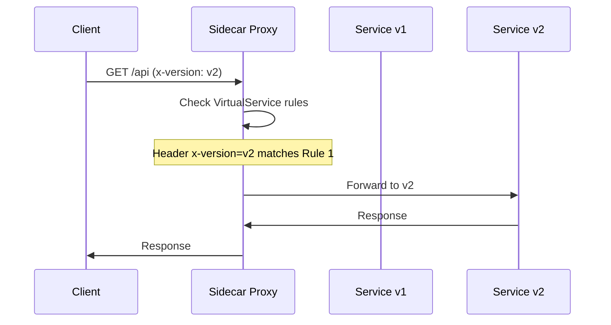

# How to Route Traffic Based on HTTP Headers in Istio

Author: [nawazdhandala](https://github.com/nawazdhandala)

Tags: Istio, Kubernetes, VirtualService, HTTP Headers, Traffic Routing

Description: How to use Istio VirtualService to route traffic based on HTTP headers, with practical examples for A/B testing, canary deployments, and debugging.

---

Routing traffic based on HTTP headers is one of the most practical features Istio offers. It lets you direct specific requests to specific service versions without changing your application code. Want to test a new version with a specific user? Add a header. Need to route internal debug traffic to a debug-enabled build? Check for a header. Running A/B tests across different feature flags? Headers make it clean.

This guide covers header-based routing in depth, with real examples you can apply to your own services.

## How Header-Based Routing Works

When a request enters the mesh, the sidecar proxy inspects the HTTP headers and compares them against VirtualService match rules. If the headers match, the request is routed to the specified destination.



The header check happens at the proxy level, so it is fast and does not add measurable latency.

## Prerequisites

You need a service with at least two versions deployed, plus a DestinationRule defining the subsets:

```yaml
apiVersion: networking.istio.io/v1
kind: DestinationRule
metadata:
  name: my-service
  namespace: my-app
spec:
  host: my-service
  subsets:
  - name: v1
    labels:
      version: v1
  - name: v2
    labels:
      version: v2
  - name: debug
    labels:
      version: debug
```

Apply it:

```bash
kubectl apply -f destinationrule.yaml
```

## Exact Header Match

The simplest form - route when a header has a specific value:

```yaml
apiVersion: networking.istio.io/v1
kind: VirtualService
metadata:
  name: my-service
  namespace: my-app
spec:
  hosts:
  - my-service
  http:
  - match:
    - headers:
        x-version:
          exact: "v2"
    route:
    - destination:
        host: my-service
        subset: v2
  - route:
    - destination:
        host: my-service
        subset: v1
```

Test it:

```bash
# Goes to v1 (default)
curl http://my-service:8080/api

# Goes to v2
curl -H "x-version: v2" http://my-service:8080/api
```

## Prefix Header Match

Match headers that start with a specific string:

```yaml
http:
- match:
  - headers:
      x-api-key:
        prefix: "beta-"
  route:
  - destination:
      host: my-service
      subset: v2
- route:
  - destination:
      host: my-service
      subset: v1
```

Any request with an API key starting with "beta-" goes to v2. This is useful for giving beta users access to new features without maintaining a separate URL.

## Regex Header Match

For more complex patterns, use regular expressions:

```yaml
http:
- match:
  - headers:
      x-user-group:
        regex: "^(internal|engineering|qa)$"
  route:
  - destination:
      host: my-service
      subset: v2
- route:
  - destination:
      host: my-service
      subset: v1
```

Requests from internal, engineering, or QA user groups go to v2.

## Multiple Header Conditions (AND)

When you need all headers to match:

```yaml
http:
- match:
  - headers:
      x-env:
        exact: "canary"
      x-region:
        exact: "us-east"
  route:
  - destination:
      host: my-service
      subset: v2
- route:
  - destination:
      host: my-service
      subset: v1
```

Both headers must be present AND match for the route to v2. A request with only `x-env: canary` but no `x-region` header goes to v1.

## Multiple Header Conditions (OR)

When any of several header conditions should trigger the route:

```yaml
http:
- match:
  - headers:
      x-debug:
        exact: "true"
  - headers:
      x-env:
        exact: "staging"
  route:
  - destination:
      host: my-service
      subset: v2
- route:
  - destination:
      host: my-service
      subset: v1
```

Requests with `x-debug: true` OR `x-env: staging` go to v2.

## Real-World Use Case: A/B Testing

Route users to different versions based on a cookie or user identifier:

```yaml
apiVersion: networking.istio.io/v1
kind: VirtualService
metadata:
  name: frontend
  namespace: web
spec:
  hosts:
  - frontend
  http:
  - match:
    - headers:
        cookie:
          regex: ".*experiment=new-checkout.*"
    route:
    - destination:
        host: frontend
        subset: experiment
  - route:
    - destination:
        host: frontend
        subset: control
```

Users with the `experiment=new-checkout` cookie see the experimental checkout flow. Everyone else sees the existing one. Your analytics system can track which group a user belongs to based on the cookie.

## Real-World Use Case: Debug Routing

Route debug requests to a service version with enhanced logging:

```yaml
apiVersion: networking.istio.io/v1
kind: VirtualService
metadata:
  name: payment-service
  namespace: payments
spec:
  hosts:
  - payment-service
  http:
  - match:
    - headers:
        x-debug:
          exact: "true"
        x-debug-token:
          exact: "secret-debug-token-2024"
    route:
    - destination:
        host: payment-service
        subset: debug
  - route:
    - destination:
        host: payment-service
        subset: v1
```

This requires both the debug flag AND a secret token, preventing unauthorized access to the debug version. The debug version might have verbose logging enabled or additional diagnostic endpoints.

## Real-World Use Case: Canary by Team

Give each team access to the canary version of a shared service:

```yaml
apiVersion: networking.istio.io/v1
kind: VirtualService
metadata:
  name: shared-service
  namespace: platform
spec:
  hosts:
  - shared-service
  http:
  - match:
    - headers:
        x-team:
          exact: "platform-team"
    route:
    - destination:
        host: shared-service
        subset: canary
  - route:
    - destination:
        host: shared-service
        subset: stable
```

The platform team sets the `x-team` header in their services and gets to test the canary version. Everyone else stays on stable.

## Header Propagation

One important detail: headers need to be propagated through the call chain for header-based routing to work end-to-end. If Service A calls Service B calls Service C, and you want to route the C call based on a header set by A, Service B needs to forward that header.

Istio does not automatically propagate custom headers. Your application code needs to forward them. Common headers to propagate:

```
x-request-id
x-b3-traceid
x-b3-spanid
x-b3-parentspanid
x-b3-sampled
x-b3-flags
b3
x-ot-span-context
```

For custom routing headers, add them to your propagation list:

```python
# Python example
import requests

def call_downstream(request):
    headers = {
        'x-version': request.headers.get('x-version', ''),
        'x-debug': request.headers.get('x-debug', ''),
    }
    return requests.get('http://downstream-service:8080/api', headers=headers)
```

## Combining Headers with Other Match Conditions

Headers can be combined with URI, method, and other conditions:

```yaml
http:
- match:
  - headers:
      x-api-version:
        exact: "v2"
    uri:
      prefix: /api
    method:
      exact: POST
  route:
  - destination:
      host: api-service
      subset: v2
```

This only matches POST requests to /api paths with the x-api-version header set to v2.

## Using Standard Headers

You can match on standard HTTP headers too, not just custom ones:

```yaml
http:
- match:
  - headers:
      user-agent:
        regex: ".*Mobile.*"
  route:
  - destination:
      host: my-service
      subset: mobile
- route:
  - destination:
      host: my-service
      subset: desktop
```

Route mobile users to a mobile-optimized version and desktop users to the desktop version.

Or route by content type:

```yaml
http:
- match:
  - headers:
      content-type:
        exact: "application/grpc"
  route:
  - destination:
      host: grpc-backend
- route:
  - destination:
      host: rest-backend
```

## Debugging Header-Based Routes

When header routing does not work as expected:

```bash
# Check what the proxy has
istioctl proxy-config routes deploy/my-service -n my-app -o json

# Look for the specific route
istioctl proxy-config routes deploy/my-service -n my-app -o json | jq '.[].virtualHosts[].routes[] | select(.match.headers)'

# Analyze for issues
istioctl analyze -n my-app
```

Common problems:

- **Header name case sensitivity**: Header names in Istio matches are case-insensitive, but make sure your application sends them correctly.
- **Missing default route**: If no match condition hits and there is no default route, the request may fail.
- **Rule ordering**: More specific rules must come before less specific ones.

## Summary

Header-based routing in Istio gives you precise control over which requests go to which service versions. Use it for A/B testing, canary deployments, debug routing, team-based access to new features, and content-based routing. Match conditions support exact, prefix, and regex patterns, and you can combine multiple header conditions with AND/OR logic. Remember to propagate headers through your service chain if you need end-to-end header-based routing.
