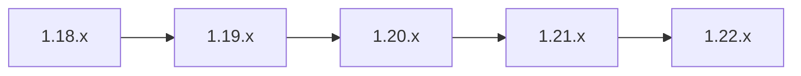

# How to Upgrade Istio Across Multiple Minor Versions

Author: [nawazdhandala](https://github.com/nawazdhandala)

Tags: Istio, Kubernetes, Service Mesh, Upgrade, Version Management

Description: How to safely upgrade Istio across multiple minor versions using a step-by-step sequential approach with validation at each stage.

---

You are running Istio 1.18 and you want to get to 1.22. Can you jump straight there? No. Istio only supports upgrading one minor version at a time. Skipping versions is unsupported and can break your mesh in subtle ways that are hard to debug. The control plane, CRDs, and data plane proxies are designed to be compatible within a one-version window, not across arbitrary version gaps.

So if you need to cross multiple minor versions, you have to do it step by step. Here is how to plan and execute a multi-hop Istio upgrade safely.

## Why You Cannot Skip Versions

Each Istio minor version may introduce:

- CRD schema changes that assume the previous version's schema is in place
- Configuration migrations that build on the prior version
- API deprecations with a one-version grace period
- Internal protocol changes between istiod and the sidecar proxies

When you skip a version, you skip those incremental migration steps. Resources might not validate correctly. Internal APIs might be incompatible. The result is a control plane that looks like it is running but is actually broken in unpredictable ways.

The official Istio documentation is clear: upgrade one minor version at a time.

## Planning the Upgrade Path

Map out your version hop path. For example, going from 1.18 to 1.22:



For each version in the path, you need:

1. The istioctl binary for that version
2. The release notes reviewed for breaking changes
3. A validation plan

Pick the latest patch release for each minor version. For example, if the latest 1.19 patch is 1.19.7, use that instead of 1.19.0. Patch releases contain bug fixes that make the upgrade smoother.

## Step 0: Prepare

Download all the istioctl binaries you will need:

```bash
for version in 1.19.7 1.20.5 1.21.3 1.22.0; do
  curl -L https://istio.io/downloadIstio | ISTIO_VERSION=$version sh -
done
```

Organize them:

```bash
ls -d istio-*/bin/istioctl
```

Back up your current state:

```bash
istioctl version > upgrade-starting-point.txt
kubectl get istiooperator -n istio-system -o yaml > istiooperator-backup.yaml
kubectl get vs,dr,gw,se --all-namespaces -o yaml > istio-resources-backup.yaml
```

## Step 1: Upgrade 1.18 to 1.19

Set the path to the 1.19 binary:

```bash
export PATH=$PWD/istio-1.19.7/bin:$PATH
istioctl version --remote=false
```

Run the pre-upgrade check:

```bash
istioctl x precheck
```

Perform the upgrade:

```bash
istioctl upgrade -y
```

Wait for the rollout:

```bash
kubectl rollout status deployment/istiod -n istio-system
```

Verify:

```bash
istioctl version
```

Now update the sidecar proxies. You do not necessarily need to update all proxies at every hop - Istio supports one minor version of skew between control plane and data plane. But it is cleaner to update them, especially if you are doing multiple hops:

```bash
for ns in $(kubectl get ns -l istio-injection=enabled -o jsonpath='{.items[*].metadata.name}'); do
  kubectl rollout restart deployment -n $ns
done
```

Validate:

```bash
istioctl proxy-status
istioctl analyze --all-namespaces
```

Run your application tests. Check error rates and latency in your monitoring. Give it at least 15-30 minutes to confirm stability before proceeding.

## Step 2: Upgrade 1.19 to 1.20

Same process with the next binary:

```bash
export PATH=$PWD/istio-1.20.5/bin:$PATH
istioctl x precheck
istioctl upgrade -y
kubectl rollout status deployment/istiod -n istio-system
istioctl version
```

Restart sidecars:

```bash
for ns in $(kubectl get ns -l istio-injection=enabled -o jsonpath='{.items[*].metadata.name}'); do
  kubectl rollout restart deployment -n $ns
done
```

Validate again. Same checks, same patience.

## Step 3: Upgrade 1.20 to 1.21

```bash
export PATH=$PWD/istio-1.21.3/bin:$PATH
istioctl x precheck
istioctl upgrade -y
kubectl rollout status deployment/istiod -n istio-system
istioctl version
```

Restart sidecars and validate. At this point you are three hops in, and you should feel confident in the process. But do not skip validation - each version can introduce its own issues.

## Step 4: Upgrade 1.21 to 1.22

Final hop:

```bash
export PATH=$PWD/istio-1.22.0/bin:$PATH
istioctl x precheck
istioctl upgrade -y
kubectl rollout status deployment/istiod -n istio-system
istioctl version
```

Final sidecar restart:

```bash
for ns in $(kubectl get ns -l istio-injection=enabled -o jsonpath='{.items[*].metadata.name}'); do
  kubectl rollout restart deployment -n $ns
done
```

Full validation:

```bash
istioctl proxy-status
istioctl analyze --all-namespaces
```

## Handling Breaking Changes at Each Hop

Each minor version might deprecate features or change defaults. Here is how to handle that:

Read the release notes for each version and look for "Breaking Changes" or "Upgrade Notes" sections. Common things that change between versions:

- **Deprecated APIs removed.** If version 1.19 deprecated an API field and 1.20 removes it, you need to update your resources before upgrading to 1.20.
- **Default values changed.** A setting that defaulted to one value might default to another.
- **Feature flags promoted or removed.** Features that were behind a flag might become always-on.

If a breaking change requires modifying your Istio resources, do it during the hop where it is relevant:

```bash
# Example: updating a VirtualService before upgrading to a version that changes its API
kubectl apply -f updated-virtualservice.yaml

# Then proceed with the upgrade
istioctl upgrade -y
```

## Automating Multi-Hop Upgrades

If you need to perform multi-hop upgrades regularly (for example, in multiple clusters), you can script it:

```bash
#!/bin/bash
set -e

VERSIONS=("1.19.7" "1.20.5" "1.21.3" "1.22.0")

for version in "${VERSIONS[@]}"; do
  echo "=== Upgrading to Istio $version ==="

  export PATH=$PWD/istio-${version}/bin:$PATH

  echo "Running pre-check..."
  istioctl x precheck

  echo "Upgrading control plane..."
  istioctl upgrade -y

  echo "Waiting for rollout..."
  kubectl rollout status deployment/istiod -n istio-system

  echo "Restarting sidecars..."
  for ns in $(kubectl get ns -l istio-injection=enabled -o jsonpath='{.items[*].metadata.name}'); do
    kubectl rollout restart deployment -n $ns
    kubectl rollout status deployment -n $ns --timeout=300s
  done

  echo "Validating..."
  istioctl version
  istioctl analyze --all-namespaces

  echo "=== Successfully upgraded to $version ==="
  echo "Waiting 60 seconds before next hop..."
  sleep 60
done

echo "Multi-hop upgrade complete!"
```

This script is a starting point. In a real environment, you would add more validation steps and probably require manual confirmation between hops.

## Time Estimates

A multi-hop upgrade takes significant time. For each hop, expect:

- Pre-check and upgrade: 5-10 minutes
- Sidecar restarts: 10-30 minutes depending on cluster size
- Validation: 15-60 minutes depending on your thoroughness

For a 4-hop upgrade, that is anywhere from 2 hours to an entire day. Plan accordingly and communicate the timeline with your team. Do not try to rush through all four hops at 11 PM on a Friday.

## When to Consider a Fresh Install Instead

If you are more than three or four minor versions behind, it might be easier to do a fresh install of the latest version and re-apply your Istio configuration. This approach involves:

1. Export all Istio resources
2. Uninstall the old version
3. Install the new version fresh
4. Re-apply your resources
5. Restart all workloads

The downside is temporary loss of mesh functionality during the reinstall. The upside is that it takes significantly less time than a multi-hop upgrade and avoids accumulating quirks from each intermediate version.

## Summary

Upgrading Istio across multiple minor versions requires stepping through each version one at a time. Download the istioctl binaries for each intermediate version, upgrade sequentially, restart sidecars, and validate at each hop. It is tedious but necessary for a stable mesh. Automate the process where possible, plan for the time it takes, and always have a rollback path at each step.
