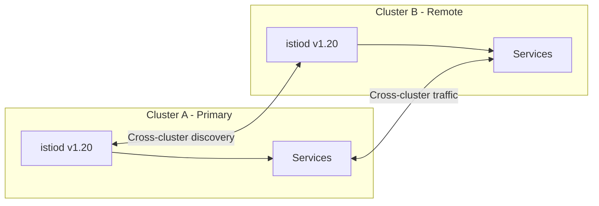
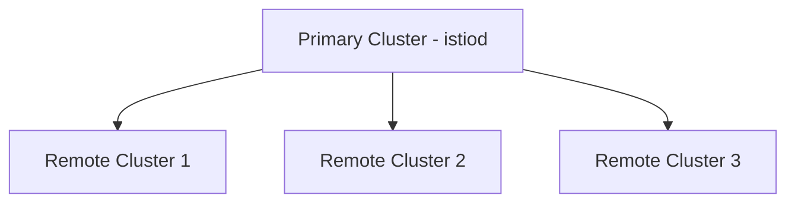
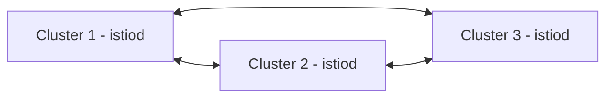

# How to Upgrade Istio in a Multicluster Environment

Author: [nawazdhandala](https://github.com/nawazdhandala)

Tags: Istio, Kubernetes, Multicluster, Service Mesh, Upgrade

Description: How to safely upgrade Istio across a multicluster mesh, covering version compatibility, upgrade ordering, and cross-cluster traffic considerations.

---

Upgrading Istio is already complex in a single cluster. In a multicluster mesh where services span multiple clusters and cross-cluster traffic depends on the mesh being consistent, the complexity goes up significantly. A version mismatch between clusters can break cross-cluster service discovery, mTLS handshakes, and traffic routing.

Here is how to plan and execute an Istio upgrade across a multicluster environment.

## Understanding Multicluster Compatibility

In an Istio multicluster mesh, the control planes in different clusters communicate and share service information. This communication has compatibility requirements:

- All control planes in the mesh should be within one minor version of each other
- Cross-cluster mTLS requires compatible certificate chains
- Service discovery relies on consistent API versions across clusters

If cluster A is running Istio 1.20 and you upgrade cluster B to 1.22, you have a two-version gap that can cause problems. Always upgrade one minor version at a time and keep all clusters within one version of each other.



## Multicluster Topology Considerations

Istio supports several multicluster topologies. Your upgrade strategy depends on which one you use.

### Primary-Remote

One cluster runs the primary control plane, remote clusters connect to it:



Upgrade order: Primary cluster first, then remote clusters.

### Multi-Primary

Each cluster has its own control plane, and they share service information:



Upgrade order: One cluster at a time, any order, but validate cross-cluster communication after each.

### Primary-Remote with Shared Control Plane

Multiple remote clusters share a single primary's control plane:

Upgrade order: Primary first (carefully), since all remotes depend on it.

## Pre-Upgrade: Verify Cross-Cluster State

Before starting, make sure the multicluster mesh is healthy:

```bash
# On each cluster, check service discovery
istioctl remote-clusters --context=cluster-a
istioctl remote-clusters --context=cluster-b
```

Verify cross-cluster traffic is working:

```bash
# From cluster A, call a service in cluster B
kubectl exec -n test deploy/sleep --context=cluster-a -- curl -s http://httpbin.test.svc.cluster.local:80/status/200
```

Check that certificates are consistent:

```bash
# Compare root CAs across clusters
istioctl proxy-config secret deploy/sleep -n test --context=cluster-a -o json | jq '.dynamicActiveSecrets[0].secret.validationContext'
istioctl proxy-config secret deploy/sleep -n test --context=cluster-b -o json | jq '.dynamicActiveSecrets[0].secret.validationContext'
```

The root CA should be the same across all clusters in the mesh.

## Upgrade Strategy: Primary-Remote

### Step 1: Upgrade the Primary Cluster

The primary cluster must be upgraded first because remote clusters depend on its control plane.

```bash
# On the primary cluster
export PATH=$PWD/istio-1.21.0/bin:$PATH

# Pre-check
istioctl x precheck --context=cluster-primary

# Upgrade
istioctl upgrade --context=cluster-primary -y
```

Or with Helm:

```bash
helm upgrade istio-base istio/base -n istio-system --version 1.21.0 --kube-context=cluster-primary
helm upgrade istiod istio/istiod -n istio-system --version 1.21.0 -f values.yaml --wait --kube-context=cluster-primary
```

Verify the primary is healthy:

```bash
kubectl rollout status deployment/istiod -n istio-system --context=cluster-primary
istioctl version --context=cluster-primary
```

### Step 2: Validate Cross-Cluster Communication

After upgrading the primary, check that remote clusters still work. The remote clusters are still on the old version, so this tests version skew compatibility.

```bash
# Test service discovery from primary to remote
kubectl exec -n test deploy/sleep --context=cluster-primary -- curl -s http://httpbin.test.svc.cluster.local:80/status/200

# Test service discovery from remote to primary
kubectl exec -n test deploy/sleep --context=cluster-remote -- curl -s http://httpbin.test.svc.cluster.local:80/status/200
```

### Step 3: Upgrade Remote Clusters

Upgrade remote clusters one at a time:

```bash
# Upgrade remote cluster 1
istioctl upgrade --context=cluster-remote-1 -y
kubectl rollout status deployment/istiod -n istio-system --context=cluster-remote-1

# Validate
kubectl exec -n test deploy/sleep --context=cluster-remote-1 -- curl -s http://httpbin.test.svc.cluster.local:80/status/200

# Upgrade remote cluster 2
istioctl upgrade --context=cluster-remote-2 -y
kubectl rollout status deployment/istiod -n istio-system --context=cluster-remote-2
```

### Step 4: Update Sidecars Across All Clusters

After all control planes are upgraded, restart workloads in each cluster:

```bash
for ctx in cluster-primary cluster-remote-1 cluster-remote-2; do
  echo "Restarting sidecars in $ctx"
  for ns in $(kubectl get ns -l istio-injection=enabled -o jsonpath='{.items[*].metadata.name}' --context=$ctx); do
    kubectl rollout restart deployment -n $ns --context=$ctx
  done
done
```

## Upgrade Strategy: Multi-Primary

With multi-primary, each cluster has an independent control plane. The upgrade order is more flexible, but you still need to coordinate.

### Step 1: Pick a Cluster to Go First

Choose the least critical cluster or one that handles the least traffic.

```bash
# Upgrade cluster 1
istioctl upgrade --context=cluster-1 -y
kubectl rollout status deployment/istiod -n istio-system --context=cluster-1
```

### Step 2: Validate Across the Mesh

Check that cluster 1 (now upgraded) can still communicate with cluster 2 (still old):

```bash
# Cross-cluster call from upgraded cluster
kubectl exec -n test deploy/sleep --context=cluster-1 -- curl -s http://httpbin.test.svc.cluster.local:80/status/200

# Cross-cluster call from old cluster to upgraded
kubectl exec -n test deploy/sleep --context=cluster-2 -- curl -s http://httpbin.test.svc.cluster.local:80/status/200
```

### Step 3: Upgrade Remaining Clusters

One at a time, with validation between each:

```bash
for ctx in cluster-2 cluster-3; do
  echo "Upgrading $ctx"
  istioctl upgrade --context=$ctx -y
  kubectl rollout status deployment/istiod -n istio-system --context=$ctx

  echo "Validating cross-cluster traffic for $ctx"
  # Run cross-cluster connectivity tests
  sleep 60
done
```

## Handling Shared Root CA

In multicluster meshes, all clusters share a root CA for mTLS. During upgrades, make sure the root CA configuration is consistent.

If you use the Istio CA (citadel):

```bash
# Check root cert on each cluster
kubectl get secret cacerts -n istio-system --context=cluster-a -o jsonpath='{.data.root-cert\.pem}' | base64 -d | openssl x509 -noout -subject

kubectl get secret cacerts -n istio-system --context=cluster-b -o jsonpath='{.data.root-cert\.pem}' | base64 -d | openssl x509 -noout -subject
```

Both clusters must use the same root CA. If the upgrade changes certificate configuration, update all clusters consistently.

## Handling East-West Gateways

Multicluster meshes use east-west gateways for cross-cluster traffic. These gateways must be upgraded along with the control plane.

```bash
# Check east-west gateway version
kubectl get pods -n istio-system -l istio=eastwestgateway --context=cluster-a

# Upgrade the gateway
helm upgrade istio-eastwestgateway istio/gateway -n istio-system \
  --version 1.21.0 \
  -f eastwest-gateway-values.yaml \
  --kube-context=cluster-a
```

If the east-west gateway goes down during the upgrade, cross-cluster traffic will fail. Make sure the gateway has multiple replicas and is upgraded with a rolling update strategy.

## Rollback in a Multicluster Environment

If the upgrade breaks cross-cluster communication, roll back the upgraded cluster:

```bash
# Roll back the last upgraded cluster
helm rollback istiod 1 -n istio-system --kube-context=cluster-remote-1
```

Since the other clusters were not changed, rolling back one cluster should restore the previous working state.

If you upgraded multiple clusters before noticing the problem, roll them back in reverse order:

```bash
# Reverse order of upgrade
helm rollback istiod 1 -n istio-system --kube-context=cluster-remote-2
helm rollback istiod 1 -n istio-system --kube-context=cluster-remote-1
helm rollback istiod 1 -n istio-system --kube-context=cluster-primary
```

## Monitoring Multicluster Upgrades

During the upgrade, monitor cross-cluster metrics:

```bash
# Check cross-cluster request success rate
# This PromQL query filters for requests that went through the east-west gateway
sum(rate(istio_requests_total{source_cluster!="destination_cluster",response_code="200"}[5m])) / sum(rate(istio_requests_total{source_cluster!="destination_cluster"}[5m]))
```

Alert if cross-cluster error rates increase beyond your threshold.

Also watch for:

- Cross-cluster service discovery failures
- Increased latency on cross-cluster requests
- Certificate verification errors in proxy logs

## Summary

Upgrading Istio in a multicluster environment follows the same principles as single-cluster upgrades, but with added coordination requirements. Keep all clusters within one minor version of each other, upgrade one cluster at a time, and validate cross-cluster communication after each step. For primary-remote topologies, always upgrade the primary first. For multi-primary, start with the least critical cluster. Pay close attention to shared root CAs, east-west gateways, and cross-cluster traffic during the upgrade window.
