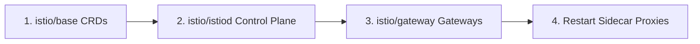

# How to Upgrade Istio Using Helm Charts

Author: [nawazdhandala](https://github.com/nawazdhandala)

Tags: Istio, Kubernetes, Helm, Service Mesh, Upgrade

Description: Step-by-step guide to upgrading Istio using Helm charts, covering base components, istiod, and gateway upgrades with proper ordering.

---

Helm has become the recommended installation method for Istio, and upgrading through Helm gives you fine-grained control over each component. Unlike `istioctl upgrade` which handles everything in one shot, Helm upgrades let you update the base CRDs, control plane, and gateways independently. This is great for teams that already manage their infrastructure through Helm and want Istio to fit into that same workflow.

Here is how to upgrade Istio using Helm charts, step by step.

## Understanding the Istio Helm Charts

Istio splits its Helm installation into three charts:

1. **istio/base** - Installs CRDs and cluster-wide resources
2. **istio/istiod** - Installs the istiod control plane
3. **istio/gateway** - Installs ingress/egress gateways

The upgrade order matters. You must upgrade them in this exact sequence: base first, then istiod, then gateways. Upgrading out of order can cause CRD mismatches or webhook issues.



## Prerequisites

You need:

- Helm 3.6 or later
- kubectl with cluster admin access
- The Istio Helm repository added

Add or update the Istio Helm repo:

```bash
helm repo add istio https://istio-release.storage.googleapis.com/charts
helm repo update
```

Check available versions:

```bash
helm search repo istio --versions
```

Check what you currently have installed:

```bash
helm list -n istio-system
```

This shows you the installed chart versions and their status.

## Step 1: Back Up Your Values

Before upgrading, export your current Helm values so you know exactly what custom settings are in place:

```bash
helm get values istiod -n istio-system -o yaml > istiod-values-backup.yaml
helm get values istio-base -n istio-system -o yaml > base-values-backup.yaml
helm get values istio-ingressgateway -n istio-system -o yaml > gateway-values-backup.yaml
```

If a chart returns `null` for values, it means you are using all defaults, which is fine.

## Step 2: Upgrade the Base Chart (CRDs)

The base chart contains Istio's Custom Resource Definitions. Upgrading this first makes sure the cluster recognizes any new or changed resource types before the control plane starts using them.

```bash
helm upgrade istio-base istio/base -n istio-system --version 1.21.0
```

If you have custom values for the base chart:

```bash
helm upgrade istio-base istio/base -n istio-system --version 1.21.0 -f base-values.yaml
```

Verify the CRDs are updated:

```bash
kubectl get crds | grep istio
```

You should see CRDs like `virtualservices.networking.istio.io`, `destinationrules.networking.istio.io`, and others. Their creation timestamps will not change, but their stored versions will be updated.

## Step 3: Upgrade istiod

This is the main control plane upgrade. The istiod chart manages the istiod deployment, webhooks, RBAC, and related resources.

```bash
helm upgrade istiod istio/istiod -n istio-system --version 1.21.0 --wait
```

The `--wait` flag tells Helm to wait until the deployment is fully rolled out before marking the upgrade as complete. This is important because you want to confirm istiod is healthy before moving on.

If you have custom values:

```bash
helm upgrade istiod istio/istiod -n istio-system --version 1.21.0 -f istiod-values.yaml --wait
```

Common custom values people set include:

```yaml
# istiod-values.yaml
meshConfig:
  accessLogFile: /dev/stdout
  defaultConfig:
    holdApplicationUntilProxyStarts: true
pilot:
  resources:
    requests:
      cpu: 500m
      memory: 2Gi
  autoscaleMin: 2
  autoscaleMax: 5
```

Check the upgrade status:

```bash
kubectl rollout status deployment/istiod -n istio-system
helm status istiod -n istio-system
```

Verify the new version is running:

```bash
kubectl get pods -n istio-system -l app=istiod -o jsonpath='{.items[*].spec.containers[*].image}'
```

## Step 4: Upgrade Gateways

If you installed gateways through Helm (which is the recommended approach), upgrade them next:

```bash
helm upgrade istio-ingressgateway istio/gateway -n istio-system --version 1.21.0 --wait
```

If you have an egress gateway:

```bash
helm upgrade istio-egressgateway istio/gateway -n istio-system --version 1.21.0 --wait
```

Verify the gateway pods are running the new version:

```bash
kubectl get pods -n istio-system -l istio=ingressgateway
```

## Step 5: Update Sidecar Proxies

The control plane and gateways are updated, but your application sidecar proxies are still running the old version. Restart your workloads to pick up the new proxy:

```bash
# Restart one namespace at a time
kubectl rollout restart deployment -n my-app

# Or restart all injected namespaces
for ns in $(kubectl get ns -l istio-injection=enabled -o jsonpath='{.items[*].metadata.name}'); do
  kubectl rollout restart deployment -n $ns
done
```

Verify all proxies are updated:

```bash
istioctl proxy-status
```

Every proxy should show SYNCED status and the new version.

## Using Revision-Based Helm Upgrades

For a canary-style upgrade with Helm, you can install the new version as a separate revision:

```bash
helm install istiod-canary istio/istiod -n istio-system \
  --set revision=canary \
  --version 1.21.0
```

Then migrate namespaces by changing labels:

```bash
kubectl label namespace my-app istio-injection- istio.io/rev=canary --overwrite
kubectl rollout restart deployment -n my-app
```

After validation, remove the old release:

```bash
helm delete istiod -n istio-system
```

## Handling Upgrade Failures

If the Helm upgrade fails partway through, check what happened:

```bash
helm history istiod -n istio-system
```

You will see the revision history with status. If the latest shows FAILED, you can roll back:

```bash
helm rollback istiod <previous-revision-number> -n istio-system
```

For example, if revision 3 failed and revision 2 was good:

```bash
helm rollback istiod 2 -n istio-system
```

Check that Helm shows the rollback:

```bash
helm status istiod -n istio-system
```

## Storing Values in Version Control

One of the biggest advantages of Helm-based Istio management is that you can store your values files in Git. This makes upgrades reproducible and auditable.

A typical repo structure looks like:

```
istio/
  base-values.yaml
  istiod-values.yaml
  gateway-values.yaml
  upgrade.sh
```

Where `upgrade.sh` contains:

```bash
#!/bin/bash
VERSION=$1

if [ -z "$VERSION" ]; then
  echo "Usage: ./upgrade.sh <version>"
  exit 1
fi

echo "Upgrading Istio to version $VERSION"

helm upgrade istio-base istio/base -n istio-system --version $VERSION -f base-values.yaml
helm upgrade istiod istio/istiod -n istio-system --version $VERSION -f istiod-values.yaml --wait
helm upgrade istio-ingressgateway istio/gateway -n istio-system --version $VERSION -f gateway-values.yaml --wait

echo "Control plane upgraded. Restart workloads to update sidecars."
```

## Post-Upgrade Checks

After the full upgrade, run through this validation checklist:

```bash
# Check control plane health
istioctl analyze --all-namespaces

# Verify versions match
istioctl version

# Check proxy sync status
istioctl proxy-status

# Review control plane logs for errors
kubectl logs -n istio-system -l app=istiod --tail=100 | grep -i error
```

Watch your application metrics for 15-30 minutes. Look for changes in error rates, latency, and throughput. If everything looks stable, the upgrade is complete.

## Summary

Upgrading Istio with Helm follows a specific order: base CRDs first, then istiod, then gateways, and finally sidecar proxies. The process integrates naturally with existing Helm-based infrastructure management, and the ability to roll back individual components gives you more control than the all-in-one istioctl approach. Keep your values files in version control, always back up before upgrading, and take your time validating between each step.
