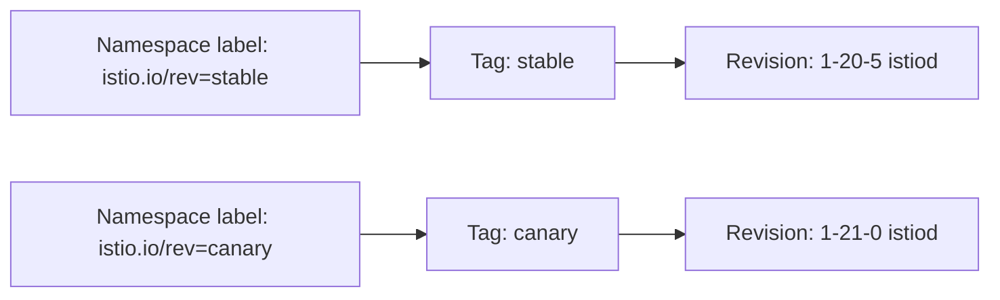
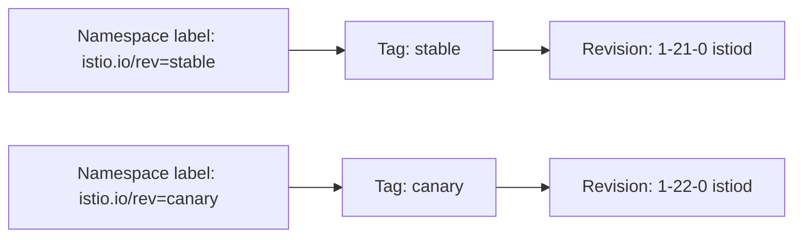

# How to Use Revision Tags for Safe Istio Upgrades

Author: [nawazdhandala](https://github.com/nawazdhandala)

Tags: Istio, Kubernetes, Service Mesh, Revision Tags, Upgrade Safety

Description: How to use Istio revision tags to create stable label aliases for control plane revisions, making upgrades safer and namespace management simpler.

---

Istio revision labels are great for canary upgrades, but they have a practical problem. When you label a namespace with `istio.io/rev=1-20-5`, and then upgrade to a new revision called `1-21-0`, you need to relabel every single namespace. In a cluster with dozens or hundreds of namespaces, that is tedious and error-prone.

Revision tags solve this problem by creating stable aliases that point to specific revisions. Instead of labeling namespaces with the actual revision name, you label them with a tag like `stable` or `production`. When you upgrade, you just change where the tag points - no namespace relabeling needed.

## How Revision Tags Work

A revision tag is a pointer from a stable name to an actual Istio revision. Here is the flow:



When you want to upgrade namespaces from 1.20 to 1.21, you just move the `stable` tag to point at the `1-21-0` revision. The namespace labels stay the same.



## Setting Up Revision Tags

### Step 1: Install Istio with a Revision

First, install Istio with an explicit revision name:

```bash
istioctl install --revision=1-20-5 --set profile=default -y
```

This creates an `istiod-1-20-5` deployment.

### Step 2: Create a Revision Tag

Create a tag called `stable` that points to the `1-20-5` revision:

```bash
istioctl tag set stable --revision=1-20-5
```

This creates a MutatingWebhookConfiguration that maps the `stable` tag to the `1-20-5` revision's injection webhook.

Verify the tag:

```bash
istioctl tag list
```

Output:

```
TAG    REVISION  NAMESPACES
stable 1-20-5
```

### Step 3: Label Namespaces with the Tag

Label your namespaces using the tag name instead of the revision name:

```bash
kubectl label namespace my-app istio.io/rev=stable
kubectl label namespace backend istio.io/rev=stable
kubectl label namespace frontend istio.io/rev=stable
```

Restart workloads to pick up sidecar injection:

```bash
kubectl rollout restart deployment -n my-app
kubectl rollout restart deployment -n backend
kubectl rollout restart deployment -n frontend
```

Verify the tag list now shows associated namespaces:

```bash
istioctl tag list
```

```
TAG    REVISION  NAMESPACES
stable 1-20-5    my-app,backend,frontend
```

## Upgrading with Revision Tags

Now comes the payoff. When you want to upgrade to Istio 1.21, the namespace labels do not need to change at all.

### Step 1: Install the New Revision

```bash
export PATH=$PWD/istio-1.21.0/bin:$PATH
istioctl install --revision=1-21-0 --set profile=default -y
```

### Step 2: Create a Canary Tag

Create a `canary` tag pointing to the new revision:

```bash
istioctl tag set canary --revision=1-21-0
```

### Step 3: Test with a Non-Critical Namespace

Move one namespace to the canary tag:

```bash
kubectl label namespace test-app istio.io/rev=canary --overwrite
kubectl rollout restart deployment -n test-app
```

Validate that the test namespace is working correctly with the new version:

```bash
istioctl proxy-status | grep test-app
istioctl analyze -n test-app
```

### Step 4: Move the Stable Tag

Once you are confident in the new revision, move the `stable` tag to point to it:

```bash
istioctl tag set stable --revision=1-21-0 --overwrite
```

That is it. Every namespace labeled with `istio.io/rev=stable` will now get sidecars from the 1.21 revision on the next pod restart. No relabeling needed.

### Step 5: Restart Workloads

The tag change does not automatically update running pods. Restart them:

```bash
for ns in my-app backend frontend; do
  kubectl rollout restart deployment -n $ns
done
```

### Step 6: Clean Up the Old Revision

After all workloads are on the new revision:

```bash
# Remove the old canary tag if not needed
istioctl tag remove canary

# Remove the old revision
istioctl uninstall --revision=1-20-5 -y
```

## Practical Tag Naming Strategies

### Two-Tag Strategy

The simplest approach uses two tags: `stable` and `canary`.

- `stable` always points to the proven production revision
- `canary` points to the new revision being tested
- After validation, `stable` moves to the canary revision
- On next upgrade, `canary` gets a new revision

### Three-Tag Strategy

For larger organizations with more environments:

- `production` - fully validated, production workloads
- `staging` - being tested in staging namespaces
- `development` - latest version for dev teams

```bash
istioctl tag set production --revision=1-20-5
istioctl tag set staging --revision=1-21-0
istioctl tag set development --revision=1-22-0
```

### Team-Based Tags

If different teams upgrade at different paces:

```bash
istioctl tag set team-payments --revision=1-20-5
istioctl tag set team-search --revision=1-21-0
istioctl tag set team-platform --revision=1-21-0
```

Each team manages their own upgrade schedule.

## Viewing Tag Configuration

Tags are implemented as MutatingWebhookConfigurations. You can inspect them:

```bash
kubectl get mutatingwebhookconfiguration -l istio.io/tag
```

For detailed information:

```bash
kubectl get mutatingwebhookconfiguration istio-revision-tag-stable -o yaml
```

The webhook configuration contains the `objectSelector` matching the tag name and the client config pointing to the revision's istiod service.

## Troubleshooting Revision Tags

### Tag Not Working

If pods are not getting sidecars after labeling with a tag:

```bash
# Check the tag exists and points to the right revision
istioctl tag list

# Check the webhook configuration
kubectl get mutatingwebhookconfiguration istio-revision-tag-stable -o yaml

# Make sure the namespace label is correct
kubectl get namespace my-app -o jsonpath='{.metadata.labels}'
```

### Multiple Webhooks Competing

If a namespace has both `istio-injection=enabled` and `istio.io/rev=stable`, the behavior is unpredictable. Remove the old label:

```bash
kubectl label namespace my-app istio-injection-
```

### Tag Pointing to Non-Existent Revision

If you accidentally delete a revision that a tag still points to:

```bash
# Sidecar injection will fail for namespaces using this tag
# Fix by updating the tag to a valid revision
istioctl tag set stable --revision=valid-revision --overwrite
```

## Automating Tag Management

For GitOps workflows, you can manage tags declaratively. Since tags are MutatingWebhookConfigurations, you can create them as Kubernetes manifests and manage them through your GitOps pipeline.

Export a tag's webhook configuration:

```bash
kubectl get mutatingwebhookconfiguration istio-revision-tag-stable -o yaml > stable-tag.yaml
```

Store it in Git and let your GitOps tool (ArgoCD, Flux) manage it. When you need to change where a tag points, update the manifest in Git and let the pipeline apply it.

## Migration from Non-Tagged to Tagged Setup

If you are already using revision labels directly (like `istio.io/rev=1-20-5`) and want to switch to tags:

1. Create a tag pointing to your current revision:

```bash
istioctl tag set stable --revision=1-20-5
```

2. Relabel namespaces one at a time:

```bash
kubectl label namespace my-app istio.io/rev=stable --overwrite
kubectl rollout restart deployment -n my-app
```

3. After all namespaces are on the tag, future upgrades will not require relabeling.

This is a one-time migration. Once you are on tags, you stay on tags.

## Summary

Revision tags add a layer of indirection between namespace labels and actual Istio revisions. Instead of labeling namespaces with specific version-based revision names, you label them with stable tag names like `stable` or `canary`. When upgrading, you move the tag pointer rather than relabeling namespaces. This makes multi-namespace upgrades simpler, reduces the chance of labeling mistakes, and integrates well with GitOps workflows. If you are doing revision-based upgrades, tags should be part of your standard setup.
