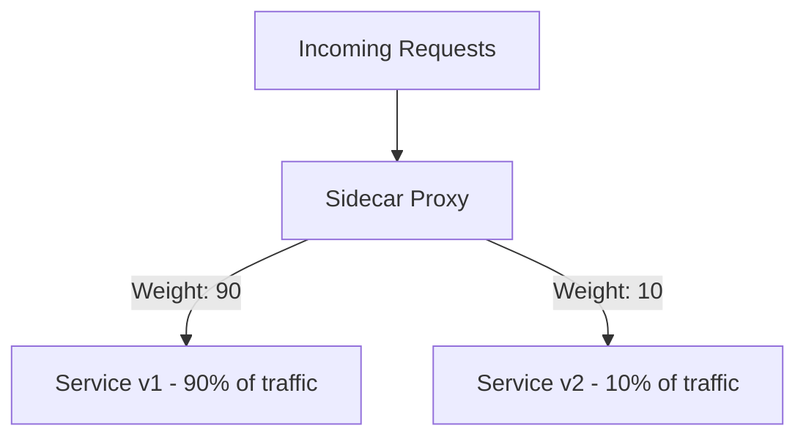

# How to Set Up Weighted Traffic Splitting with VirtualService

Author: [nawazdhandala](https://github.com/nawazdhandala)

Tags: Istio, Kubernetes, VirtualService, Traffic Splitting, Canary Deployment

Description: A practical guide to setting up weighted traffic splitting in Istio using VirtualService for canary deployments, blue-green deployments, and gradual rollouts.

---

Weighted traffic splitting is one of the most practical features you get from a service mesh. Instead of routing all traffic to one version of a service, you split it between multiple versions with precise percentages. Send 95% to the stable version and 5% to the canary. If the canary looks good, bump it to 20%, then 50%, then 100%. If it looks bad, set it back to 0%. All without touching your application code or redeploying anything.

Istio makes this straightforward with VirtualService weights. Here is how to set it up and use it effectively.

## How Weighted Routing Works

When you define multiple destinations with weights in a VirtualService, the sidecar proxy distributes requests proportionally. It is not a simple round-robin - the proxy uses a weighted random algorithm that, over enough requests, converges to the specified percentages.



For low traffic volumes, the actual distribution might not be exactly 90/10 on any given minute. Over a longer period and more requests, it converges to the configured weights.

## Prerequisites

Deploy your service with multiple versions and label them:

```yaml
apiVersion: apps/v1
kind: Deployment
metadata:
  name: my-service-v1
  namespace: my-app
spec:
  replicas: 3
  selector:
    matchLabels:
      app: my-service
      version: v1
  template:
    metadata:
      labels:
        app: my-service
        version: v1
    spec:
      containers:
      - name: my-service
        image: my-service:1.0.0
        ports:
        - containerPort: 8080
---
apiVersion: apps/v1
kind: Deployment
metadata:
  name: my-service-v2
  namespace: my-app
spec:
  replicas: 3
  selector:
    matchLabels:
      app: my-service
      version: v2
  template:
    metadata:
      labels:
        app: my-service
        version: v2
    spec:
      containers:
      - name: my-service
        image: my-service:2.0.0
        ports:
        - containerPort: 8080
---
apiVersion: v1
kind: Service
metadata:
  name: my-service
  namespace: my-app
spec:
  selector:
    app: my-service
  ports:
  - port: 8080
    targetPort: 8080
```

Create the DestinationRule with subsets:

```yaml
apiVersion: networking.istio.io/v1
kind: DestinationRule
metadata:
  name: my-service
  namespace: my-app
spec:
  host: my-service
  subsets:
  - name: v1
    labels:
      version: v1
  - name: v2
    labels:
      version: v2
```

## Basic Weighted Split

Start with a 95/5 split:

```yaml
apiVersion: networking.istio.io/v1
kind: VirtualService
metadata:
  name: my-service
  namespace: my-app
spec:
  hosts:
  - my-service
  http:
  - route:
    - destination:
        host: my-service
        subset: v1
      weight: 95
    - destination:
        host: my-service
        subset: v2
      weight: 5
```

Apply it:

```bash
kubectl apply -f virtualservice.yaml
```

Verify:

```bash
# Check the route config
istioctl proxy-config routes deploy/my-service-v1 -n my-app

# Send test traffic and count responses
for i in $(seq 1 100); do
  kubectl exec deploy/sleep -n my-app -- curl -s my-service:8080/version
done | sort | uniq -c
```

You should see roughly 95 responses from v1 and 5 from v2.

## Canary Deployment Workflow

A typical canary deployment progresses through stages:

### Stage 1: Initial Canary (5%)

```yaml
http:
- route:
  - destination:
      host: my-service
      subset: v1
    weight: 95
  - destination:
      host: my-service
      subset: v2
    weight: 5
```

Monitor for 30 minutes to 1 hour. Check error rates, latency, and business metrics.

### Stage 2: Increase to 25%

```yaml
http:
- route:
  - destination:
      host: my-service
      subset: v1
    weight: 75
  - destination:
      host: my-service
      subset: v2
    weight: 25
```

Apply and monitor for another 30 minutes.

### Stage 3: Increase to 50%

```yaml
http:
- route:
  - destination:
      host: my-service
      subset: v1
    weight: 50
  - destination:
      host: my-service
      subset: v2
    weight: 50
```

### Stage 4: Full Rollout (100%)

```yaml
http:
- route:
  - destination:
      host: my-service
      subset: v2
    weight: 100
```

At this point, v2 is fully rolled out. You can scale down v1 and clean up.

### Rollback (If Problems)

At any stage, set v2 back to 0%:

```yaml
http:
- route:
  - destination:
      host: my-service
      subset: v1
    weight: 100
```

No pod restarts. No redeployment. Just a config change that takes effect in seconds.

## Blue-Green Deployment

Blue-green is a special case of weighted traffic splitting where you go from 100/0 to 0/100 in one step:

```yaml
# Blue (current) is active
http:
- route:
  - destination:
      host: my-service
      subset: blue
    weight: 100
  - destination:
      host: my-service
      subset: green
    weight: 0
```

After testing green in isolation (maybe with header-based routing), flip:

```yaml
# Green (new) is active
http:
- route:
  - destination:
      host: my-service
      subset: blue
    weight: 0
  - destination:
      host: my-service
      subset: green
    weight: 100
```

The 0-weight destination still exists in the configuration, making it easy to flip back.

## Weighted Split with External Traffic

For traffic coming through an Istio Gateway:

```yaml
apiVersion: networking.istio.io/v1
kind: VirtualService
metadata:
  name: my-service-external
  namespace: my-app
spec:
  hosts:
  - "myapp.example.com"
  gateways:
  - my-gateway
  http:
  - route:
    - destination:
        host: my-service
        subset: v1
        port:
          number: 8080
      weight: 90
    - destination:
        host: my-service
        subset: v2
        port:
          number: 8080
      weight: 10
```

## Three-Way Split

You are not limited to two destinations. Split across three or more versions:

```yaml
http:
- route:
  - destination:
      host: my-service
      subset: v1
    weight: 60
  - destination:
      host: my-service
      subset: v2
    weight: 30
  - destination:
      host: my-service
      subset: v3
    weight: 10
```

This is useful during a migration where you are phasing out v1 while ramping up v2 and testing v3.

## Weighted Split Combined with Match Rules

You can combine header-based matching with weighted splitting:

```yaml
http:
- match:
  - headers:
      x-canary:
        exact: "true"
  route:
  - destination:
      host: my-service
      subset: v2
    weight: 100
- route:
  - destination:
      host: my-service
      subset: v1
    weight: 90
  - destination:
      host: my-service
      subset: v2
    weight: 10
```

Requests with the canary header always go to v2. Regular requests are split 90/10.

## Automating the Weight Progression

Manually updating weights is fine for occasional deployments, but for frequent releases, automate it:

```bash
#!/bin/bash
set -e

SERVICE="my-service"
NAMESPACE="my-app"
NEW_SUBSET="v2"
OLD_SUBSET="v1"

STAGES=(5 25 50 75 100)

for weight in "${STAGES[@]}"; do
  old_weight=$((100 - weight))

  cat <<EOF | kubectl apply -f -
apiVersion: networking.istio.io/v1
kind: VirtualService
metadata:
  name: $SERVICE
  namespace: $NAMESPACE
spec:
  hosts:
  - $SERVICE
  http:
  - route:
    - destination:
        host: $SERVICE
        subset: $OLD_SUBSET
      weight: $old_weight
    - destination:
        host: $SERVICE
        subset: $NEW_SUBSET
      weight: $weight
EOF

  echo "Set $NEW_SUBSET to $weight%. Monitoring..."

  # Wait and check health
  sleep 300

  # Check error rate
  ERROR_RATE=$(curl -s "http://prometheus:9090/api/v1/query" \
    --data-urlencode "query=sum(rate(istio_requests_total{destination_workload=\"${SERVICE}\",destination_version=\"${NEW_SUBSET}\",response_code=~\"5.*\"}[5m])) / sum(rate(istio_requests_total{destination_workload=\"${SERVICE}\",destination_version=\"${NEW_SUBSET}\"}[5m]))" \
    | jq -r '.data.result[0].value[1] // "0"')

  if (( $(echo "$ERROR_RATE > 0.05" | bc -l 2>/dev/null || echo 0) )); then
    echo "Error rate $ERROR_RATE exceeds threshold. Rolling back."
    cat <<EOF | kubectl apply -f -
apiVersion: networking.istio.io/v1
kind: VirtualService
metadata:
  name: $SERVICE
  namespace: $NAMESPACE
spec:
  hosts:
  - $SERVICE
  http:
  - route:
    - destination:
        host: $SERVICE
        subset: $OLD_SUBSET
      weight: 100
EOF
    echo "Rolled back to $OLD_SUBSET"
    exit 1
  fi

  echo "Health check passed at $weight%"
done

echo "Canary rollout complete. $NEW_SUBSET is at 100%."
```

For production use, consider tools like Flagger or Argo Rollouts that automate this pattern with more sophisticated analysis.

## Monitoring Weighted Splits

Track the actual traffic distribution:

```text
# PromQL: Request rate by version
sum(rate(istio_requests_total{destination_workload="my-service"}[5m])) by (destination_version)
```

Compare error rates between versions:

```text
# PromQL: Error rate by version
sum(rate(istio_requests_total{destination_workload="my-service",response_code=~"5.*"}[5m])) by (destination_version)
/
sum(rate(istio_requests_total{destination_workload="my-service"}[5m])) by (destination_version)
```

Compare latency:

```text
# PromQL: P99 latency by version
histogram_quantile(0.99, sum(rate(istio_request_duration_milliseconds_bucket{destination_workload="my-service"}[5m])) by (le, destination_version))
```

Set up a Grafana dashboard with these queries so you can see the canary and stable versions side by side during the rollout.

## Common Pitfalls

**Weights not adding up to 100.** Istio requires weights to sum to 100. If they do not, the VirtualService may be rejected or behavior may be undefined.

**Not enough replicas.** If v2 has one replica and receives 50% of traffic, that one replica might be overloaded. Scale the new version proportionally to its traffic weight.

**Session affinity expectations.** Weighted routing is stateless. The same user might hit v1 on one request and v2 on the next. If you need session affinity, use consistent hash-based load balancing in the DestinationRule instead of weights.

**Missing DestinationRule.** If you reference a subset that does not exist in the DestinationRule, requests going to that destination will return 503.

## Summary

Weighted traffic splitting with VirtualService gives you precise control over how traffic is distributed between service versions. Use it for canary deployments, blue-green deployments, and gradual rollouts. The weights can be changed instantly with a config update - no pod restarts needed. Monitor error rates and latency by version during the rollout, and automate the weight progression for a fully hands-off canary process. Combined with header-based routing, weighted splitting covers most production traffic management scenarios.
