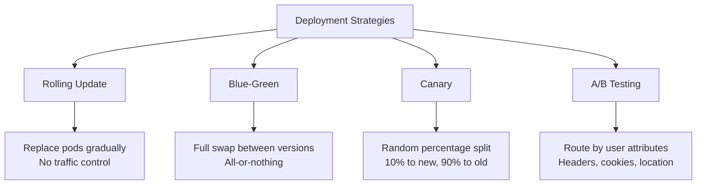

# How to Implement A/B Testing Deployments with ArgoCD

Author: [nawazdhandala](https://github.com/nawazdhandala)

Tags: ArgoCD, GitOps, Kubernetes, Argo Rollouts, A/B Testing

Description: Learn how to implement A/B testing deployments with ArgoCD and Argo Rollouts using header-based and cookie-based traffic routing for controlled experiments.

---

A/B testing deployments let you route specific users to a new version of your application based on request attributes like HTTP headers, cookies, or query parameters. Unlike canary deployments that split traffic randomly by percentage, A/B testing gives you precise control over who sees which version. This is invaluable for testing new features with specific user segments before a full rollout.

In this guide, we will implement A/B testing using ArgoCD for state management and Argo Rollouts with Istio or NGINX for traffic routing.

## A/B Testing vs Canary vs Blue-Green

Understanding the difference between deployment strategies helps you pick the right one:



A/B testing is the right choice when:
- You need to test a feature with a specific user group (e.g., beta users)
- You want to compare metrics between two versions for the same type of traffic
- You need to route internal testers to the new version while keeping production stable

## Prerequisites

A/B testing requires a traffic management layer. Argo Rollouts supports this with:
- Istio VirtualService
- NGINX Ingress
- AWS ALB
- Traefik

For this guide, we will use both Istio and NGINX examples.

## A/B Testing with Istio

### Setting Up the Rollout

```yaml
# rollout.yaml
apiVersion: argoproj.io/v1alpha1
kind: Rollout
metadata:
  name: my-app
  namespace: production
spec:
  replicas: 5
  selector:
    matchLabels:
      app: my-app
  template:
    metadata:
      labels:
        app: my-app
    spec:
      containers:
        - name: my-app
          image: myorg/my-app:1.0.0
          ports:
            - containerPort: 8080
          readinessProbe:
            httpGet:
              path: /health
              port: 8080
  strategy:
    canary:
      stableService: my-app-stable
      canaryService: my-app-canary
      trafficRouting:
        istio:
          virtualServices:
            - name: my-app-vsvc
              routes:
                - primary
      steps:
        # Step 1: Route header-matched traffic to canary
        - setHeaderRoute:
            name: beta-users
            match:
              - headerName: X-Beta-User
                headerValue:
                  exact: "true"
        # Step 2: Pause for A/B testing duration
        - pause: {}  # Indefinite pause - promote manually when test is done
```

### Istio VirtualService

```yaml
# virtualservice.yaml
apiVersion: networking.istio.io/v1beta1
kind: VirtualService
metadata:
  name: my-app-vsvc
  namespace: production
spec:
  hosts:
    - my-app.example.com
  gateways:
    - my-app-gateway
  http:
    - name: primary
      route:
        - destination:
            host: my-app-stable
            port:
              number: 80
          weight: 100
        - destination:
            host: my-app-canary
            port:
              number: 80
          weight: 0
```

### Services

```yaml
# services.yaml
apiVersion: v1
kind: Service
metadata:
  name: my-app-stable
  namespace: production
spec:
  selector:
    app: my-app
  ports:
    - port: 80
      targetPort: 8080
---
apiVersion: v1
kind: Service
metadata:
  name: my-app-canary
  namespace: production
spec:
  selector:
    app: my-app
  ports:
    - port: 80
      targetPort: 8080
```

When the rollout executes the `setHeaderRoute` step, Argo Rollouts automatically modifies the Istio VirtualService to add a route that matches the header and sends matching traffic to the canary.

## A/B Testing with NGINX Ingress

For NGINX-based A/B testing:

```yaml
# rollout.yaml with NGINX
apiVersion: argoproj.io/v1alpha1
kind: Rollout
metadata:
  name: my-app
  namespace: production
spec:
  replicas: 5
  selector:
    matchLabels:
      app: my-app
  template:
    metadata:
      labels:
        app: my-app
    spec:
      containers:
        - name: my-app
          image: myorg/my-app:1.0.0
          ports:
            - containerPort: 8080
  strategy:
    canary:
      stableService: my-app-stable
      canaryService: my-app-canary
      trafficRouting:
        nginx:
          stableIngress: my-app-ingress
      steps:
        # Route users with specific header to canary
        - setHeaderRoute:
            name: beta-route
            match:
              - headerName: X-Canary
                headerValue:
                  exact: "true"
        - pause: {}
---
# ingress.yaml
apiVersion: networking.k8s.io/v1
kind: Ingress
metadata:
  name: my-app-ingress
  namespace: production
  annotations:
    kubernetes.io/ingress.class: nginx
spec:
  rules:
    - host: my-app.example.com
      http:
        paths:
          - path: /
            pathType: Prefix
            backend:
              service:
                name: my-app-stable
                port:
                  number: 80
```

## ArgoCD Application Configuration

```yaml
# argocd-application.yaml
apiVersion: argoproj.io/v1alpha1
kind: Application
metadata:
  name: my-app-production
  namespace: argocd
spec:
  project: default
  source:
    repoURL: https://github.com/myorg/my-manifests.git
    targetRevision: main
    path: production/my-app
  destination:
    server: https://kubernetes.default.svc
    namespace: production
  syncPolicy:
    automated:
      prune: true
      selfHeal: true
```

## Running the A/B Test

### Triggering the Test

Update the image in your Rollout manifest and push to Git:

```yaml
# Change image to the version you want to A/B test
image: myorg/my-app:2.0.0-beta
```

ArgoCD syncs the change, and Argo Rollouts starts the A/B test.

### Sending Test Traffic

Route specific users to the new version by setting the appropriate header:

```bash
# Test as a beta user - goes to version 2.0.0-beta
curl -H "X-Beta-User: true" https://my-app.example.com/api/feature

# Regular request - goes to version 1.0.0 (stable)
curl https://my-app.example.com/api/feature
```

For browser-based testing, you can use a browser extension to add custom headers, or route through a proxy that adds the header.

### Cookie-Based Routing

You can also route based on cookies, which is more user-friendly for browser-based testing:

```yaml
steps:
  - setHeaderRoute:
      name: beta-route
      match:
        - headerName: Cookie
          headerValue:
            regex: ".*beta_user=true.*"
  - pause: {}
```

Set the cookie on the client side:

```javascript
// Set cookie for beta users
document.cookie = "beta_user=true; path=/; max-age=86400";
```

## Combining A/B Testing with Analysis

Add automated analysis to compare the A/B test versions:

```yaml
# analysis-template.yaml
apiVersion: argoproj.io/v1alpha1
kind: AnalysisTemplate
metadata:
  name: ab-test-analysis
  namespace: production
spec:
  metrics:
    # Compare error rates between stable and canary
    - name: error-rate-comparison
      interval: 60s
      count: 30
      successCondition: result[0] <= result[1] * 1.1
      provider:
        prometheus:
          address: http://prometheus.monitoring:9090
          query: |
            # Canary error rate should not be more than 10% higher than stable
            (
              sum(rate(http_requests_total{app="my-app",rollouts_pod_template_hash="{{args.canary-hash}}",status=~"5.."}[5m]))
              /
              sum(rate(http_requests_total{app="my-app",rollouts_pod_template_hash="{{args.canary-hash}}"}[5m]))
            )
    # Compare response times
    - name: latency-comparison
      interval: 60s
      count: 30
      successCondition: result[0] < 500
      provider:
        prometheus:
          address: http://prometheus.monitoring:9090
          query: |
            histogram_quantile(0.95,
              sum(rate(http_request_duration_milliseconds_bucket{
                app="my-app",
                rollouts_pod_template_hash="{{args.canary-hash}}"
              }[5m])) by (le)
            )
```

## Completing the A/B Test

When the test is complete:

```bash
# If the new version wins - promote it
kubectl argo rollouts promote my-app -n production

# If the old version wins - abort and rollback
kubectl argo rollouts abort my-app -n production
```

After promotion, the header route is removed and all traffic goes to the new version.

## Monitoring the A/B Test

```bash
# Watch the rollout status
kubectl argo rollouts get rollout my-app -n production --watch

# Check which step the rollout is on
kubectl argo rollouts status my-app -n production

# View the modified VirtualService to see routing rules
kubectl get virtualservice my-app-vsvc -n production -o yaml
```

## Summary

A/B testing with ArgoCD and Argo Rollouts gives you precise control over which users see which version of your application. Use `setHeaderRoute` steps to route traffic based on HTTP headers or cookies, combine with AnalysisTemplates for automated comparison metrics, and let ArgoCD manage the entire workflow through Git. This strategy is ideal for feature testing with specific user segments. For random percentage-based traffic splitting, use [canary deployments](https://oneuptime.com/blog/post/2026-02-26-argocd-canary-deployments-argo-rollouts/view) instead.
