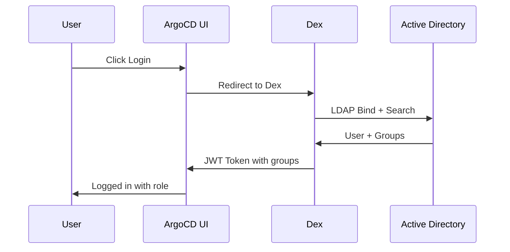

# How to Integrate ArgoCD with Active Directory

Author: [nawazdhandala](https://github.com/nawazdhandala)

Tags: ArgoCD, GitOps, Kubernetes, Active Directory, Authentication

Description: Learn how to integrate ArgoCD with Microsoft Active Directory for enterprise authentication, including LDAP configuration, group mapping to RBAC roles, and troubleshooting common AD issues.

---

Most enterprises run Microsoft Active Directory (AD) as their central identity provider. Integrating ArgoCD with AD means your teams can log in with their existing corporate credentials, and you can map AD security groups directly to ArgoCD RBAC roles. No more managing separate ArgoCD user accounts.

This guide covers the complete setup from LDAP configuration through Dex to AD group-based RBAC in ArgoCD.

## How the Integration Works

ArgoCD uses Dex as its identity broker. Dex connects to Active Directory over LDAP (or LDAPS), authenticates users, retrieves their group memberships, and passes that information back to ArgoCD as JWT claims. ArgoCD then maps those groups to RBAC roles.



## Prerequisites

Before you start, gather these details from your AD administrator:

- AD domain controller hostname (e.g., `dc01.corp.example.com`)
- LDAPS port (typically 636 for secure LDAP)
- Base DN for users (e.g., `OU=Users,DC=corp,DC=example,DC=com`)
- Base DN for groups (e.g., `OU=Groups,DC=corp,DC=example,DC=com`)
- A service account for ArgoCD to bind with (e.g., `CN=argocd-svc,OU=Service Accounts,DC=corp,DC=example,DC=com`)
- The CA certificate if using internal PKI

## Step 1: Create the Service Account Secret

Store the AD service account password in a Kubernetes secret:

```bash
kubectl create secret generic argocd-dex-ad-credentials \
  --namespace argocd \
  --from-literal=bindPW='YourServiceAccountPassword'
```

If your AD uses a self-signed or internal CA, also add the CA certificate:

```bash
kubectl create secret generic ad-ca-cert \
  --namespace argocd \
  --from-file=ca.crt=/path/to/ad-ca-certificate.pem
```

## Step 2: Configure Dex LDAP Connector

Edit the `argocd-cm` ConfigMap to add the Dex LDAP connector pointing to your AD:

```yaml
apiVersion: v1
kind: ConfigMap
metadata:
  name: argocd-cm
  namespace: argocd
data:
  url: https://argocd.corp.example.com

  dex.config: |
    connectors:
    - type: ldap
      name: Active Directory
      id: active-directory
      config:
        # AD domain controller - always use LDAPS (port 636)
        host: dc01.corp.example.com:636

        # TLS settings
        insecureNoSSL: false
        insecureSkipVerify: false
        # If using internal CA, reference the CA cert
        rootCAData: <base64-encoded-ca-certificate>

        # Service account for LDAP bind
        bindDN: CN=argocd-svc,OU=Service Accounts,DC=corp,DC=example,DC=com
        bindPW: $dex.ldap.bindPW

        # User search configuration
        userSearch:
          # Where to search for users
          baseDN: OU=Users,DC=corp,DC=example,DC=com
          # Filter to find user accounts only (not computers, etc.)
          filter: "(&(objectClass=person)(!(userAccountControl:1.2.840.113556.1.4.803:=2)))"
          # AD attribute used as the login username
          username: sAMAccountName
          # Unique identifier
          idAttr: sAMAccountName
          # Email attribute
          emailAttr: userPrincipalName
          # Display name
          nameAttr: displayName

        # Group search configuration
        groupSearch:
          # Where to search for groups
          baseDN: OU=Groups,DC=corp,DC=example,DC=com
          # Filter for security groups
          filter: "(objectClass=group)"
          # How to match users to groups
          userMatchers:
          - userAttr: DN
            groupAttr: member
          # Group name attribute
          nameAttr: cn
```

A few notes on the user search filter:
- `objectClass=person` matches AD user objects
- The `userAccountControl` filter excludes disabled accounts (bit flag 2 means disabled)
- `sAMAccountName` is the traditional AD login name (e.g., `jsmith`)
- `userPrincipalName` is the email-format login (e.g., `jsmith@corp.example.com`)

## Step 3: Configure the Dex Secret Reference

The `$dex.ldap.bindPW` reference in the Dex config needs to be mapped in the `argocd-secret`:

```yaml
apiVersion: v1
kind: Secret
metadata:
  name: argocd-secret
  namespace: argocd
type: Opaque
stringData:
  # This key is referenced by $dex.ldap.bindPW in the Dex config
  dex.ldap.bindPW: "YourServiceAccountPassword"
```

Or if you prefer, store it as a separate key and reference it:

```bash
kubectl patch secret argocd-secret -n argocd \
  --type merge \
  -p '{"stringData": {"dex.ldap.bindPW": "YourServiceAccountPassword"}}'
```

## Step 4: Map AD Groups to ArgoCD RBAC Roles

Now configure the RBAC policy to map AD security groups to ArgoCD roles:

```yaml
apiVersion: v1
kind: ConfigMap
metadata:
  name: argocd-rbac-cm
  namespace: argocd
data:
  # Default: no access unless mapped
  policy.default: role:readonly

  # Use AD group names for RBAC
  scopes: '[groups, email]'

  policy.csv: |
    # Platform team gets admin access
    p, role:platform-admin, applications, *, */*, allow
    p, role:platform-admin, clusters, *, *, allow
    p, role:platform-admin, repositories, *, *, allow
    p, role:platform-admin, projects, *, *, allow
    p, role:platform-admin, accounts, *, *, allow
    p, role:platform-admin, gpgkeys, *, *, allow

    # Developers can view and sync their project apps
    p, role:developer, applications, get, */*, allow
    p, role:developer, applications, list, */*, allow
    p, role:developer, applications, sync, */*, allow
    p, role:developer, logs, get, */*, allow

    # QA team can view applications
    p, role:qa, applications, get, */*, allow
    p, role:qa, applications, list, */*, allow

    # Map AD groups to ArgoCD roles
    g, Platform-Engineering, role:platform-admin
    g, DevOps-Team, role:platform-admin
    g, Application-Developers, role:developer
    g, QA-Engineers, role:qa
```

The `g` lines are the group mappings. The group names must match exactly what AD returns as the `cn` attribute of the group.

## Step 5: Restart Dex and Verify

After making ConfigMap changes, restart the Dex server:

```bash
kubectl rollout restart deployment argocd-dex-server -n argocd
```

Wait for the pods to become ready, then test the login:

```bash
# Test via CLI
argocd login argocd.corp.example.com --sso

# This should open a browser window for AD authentication
```

## Troubleshooting Common Issues

### Issue: "Failed to authenticate: ldap: invalid credentials"

This usually means the service account bind is failing. Verify:

```bash
# Test LDAP bind directly
ldapsearch -H ldaps://dc01.corp.example.com:636 \
  -D "CN=argocd-svc,OU=Service Accounts,DC=corp,DC=example,DC=com" \
  -W \
  -b "OU=Users,DC=corp,DC=example,DC=com" \
  "(sAMAccountName=testuser)"
```

### Issue: Groups not appearing in JWT token

Check the Dex logs for group search issues:

```bash
kubectl logs deployment/argocd-dex-server -n argocd | grep -i group
```

Common causes:
- Wrong `baseDN` for group search
- Group `member` attribute uses DN but `userAttr` is set to something else
- Nested groups - Dex does not follow nested AD groups by default

For nested groups, add the LDAP_MATCHING_RULE_IN_CHAIN OID to your group filter:

```yaml
groupSearch:
  baseDN: OU=Groups,DC=corp,DC=example,DC=com
  filter: "(objectClass=group)"
  userMatchers:
  - userAttr: DN
    groupAttr: "member:1.2.840.113556.1.4.1941:"
  nameAttr: cn
```

The `1.2.840.113556.1.4.1941` OID tells AD to recursively resolve nested group memberships.

### Issue: TLS Certificate Errors

If you see `x509: certificate signed by unknown authority`, your AD CA cert is not properly configured:

```bash
# Get the AD CA certificate
openssl s_client -connect dc01.corp.example.com:636 -showcerts < /dev/null 2>/dev/null | \
  openssl x509 -outform PEM > ad-ca.pem

# Base64 encode it for the Dex config
cat ad-ca.pem | base64 -w0
```

### Issue: Login works but user has no permissions

Check the RBAC configuration:

```bash
# Verify what groups ArgoCD sees for a user
argocd account get-user-info --grpc-web
```

Ensure the group names in `policy.csv` match exactly what Dex returns. AD group names are case-sensitive in ArgoCD RBAC.

## Security Best Practices

1. Always use LDAPS (port 636), never plain LDAP (port 389)
2. Use a dedicated service account with minimal AD permissions (read-only)
3. Set a strong password and rotate it regularly
4. Enable AD account lockout policies for the service account
5. Restrict the service account to only query the OUs it needs
6. Monitor failed authentication attempts through [OneUptime](https://oneuptime.com/blog/post/2026-02-09-argocd-monitoring-prometheus/view) to detect potential brute-force attempts

## Conclusion

Integrating ArgoCD with Active Directory gives enterprise teams single sign-on with their existing corporate credentials and leverages AD security groups for role-based access control. The configuration involves setting up a Dex LDAP connector, configuring user and group search parameters specific to AD's schema, and mapping AD groups to ArgoCD RBAC roles. The most common pitfalls are TLS certificate issues, incorrect bind credentials, and nested group resolution - all of which have straightforward solutions. Once set up, AD integration means you never have to manage ArgoCD user accounts manually again.
