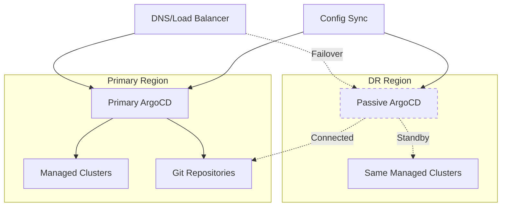

# How to Set Up Active-Passive ArgoCD for DR

Author: [nawazdhandala](https://github.com/nawazdhandala)

Tags: ArgoCD, GitOps, Kubernetes, Disaster Recovery, High Availability

Description: Learn how to set up an active-passive ArgoCD disaster recovery configuration with automatic failover, state synchronization, and recovery procedures.

---

An active-passive ArgoCD setup provides a standby instance that can take over if your primary ArgoCD fails. Unlike a full HA deployment within a single cluster, active-passive DR protects against entire cluster or region failures. The passive instance stays synchronized with the primary's configuration and can be activated quickly when needed.

## Architecture Overview



The key components:

- **Primary ArgoCD** - Actively manages all applications
- **Passive ArgoCD** - Installed and configured but not actively syncing
- **Config Sync** - Keeps the passive instance's application definitions in sync
- **DNS/Load Balancer** - Routes traffic to the active instance

## Setting Up the Passive Instance

### Step 1: Install ArgoCD in the DR Cluster

```bash
# Switch to DR cluster context
kubectl config use-context dr-cluster

# Create namespace
kubectl create namespace argocd

# Install ArgoCD (same version as primary)
kubectl apply -n argocd \
  -f https://raw.githubusercontent.com/argoproj/argo-cd/v2.13.0/manifests/ha/install.yaml

# Wait for installation
kubectl wait --for=condition=available deployment --all -n argocd --timeout=180s
```

### Step 2: Disable Auto-Sync on Passive

The passive instance should have all application definitions but should NOT automatically sync them. This prevents two ArgoCD instances from competing to manage the same clusters:

```yaml
# On the passive instance, scale down the application controller
# This prevents the passive from reconciling applications
apiVersion: apps/v1
kind: StatefulSet
metadata:
  name: argocd-application-controller
  namespace: argocd
spec:
  replicas: 0  # Scaled to zero on passive
```

Apply it:

```bash
# Scale down the application controller on the passive instance
kubectl scale statefulset argocd-application-controller \
  --replicas=0 -n argocd --context=dr-cluster
```

### Step 3: Synchronize Configuration

Create a sync job that copies the primary's configuration to the passive instance:

```bash
#!/bin/bash
# sync-argocd-config.sh - Sync primary ArgoCD config to passive

PRIMARY_CONTEXT="primary-cluster"
DR_CONTEXT="dr-cluster"
NAMESPACE="argocd"

echo "Syncing ArgoCD configuration from primary to DR..."

# Sync ConfigMaps
for cm in argocd-cm argocd-rbac-cm argocd-cmd-params-cm \
           argocd-notifications-cm argocd-ssh-known-hosts-cm \
           argocd-tls-certs-cm; do
  echo "Syncing ConfigMap: $cm"
  kubectl get configmap "$cm" -n "$NAMESPACE" \
    --context="$PRIMARY_CONTEXT" -o yaml | \
    # Remove cluster-specific metadata
    python3 -c "
import sys, yaml
doc = yaml.safe_load(sys.stdin)
meta = doc.get('metadata', {})
for f in ['resourceVersion', 'uid', 'creationTimestamp', 'managedFields']:
    meta.pop(f, None)
print(yaml.dump(doc, default_flow_style=False))
" | kubectl apply -f - -n "$NAMESPACE" --context="$DR_CONTEXT"
done

# Sync Secrets (repos, clusters)
for label in repository repo-creds cluster; do
  echo "Syncing Secrets: $label"
  kubectl get secrets -n "$NAMESPACE" \
    -l "argocd.argoproj.io/secret-type=$label" \
    --context="$PRIMARY_CONTEXT" -o yaml | \
    python3 -c "
import sys, yaml
for doc in yaml.safe_load_all(sys.stdin):
    if doc is None or doc.get('kind') == 'List':
        items = doc.get('items', []) if doc else []
    else:
        items = [doc]
    for item in items:
        meta = item.get('metadata', {})
        for f in ['resourceVersion', 'uid', 'creationTimestamp', 'managedFields']:
            meta.pop(f, None)
        print('---')
        print(yaml.dump(item, default_flow_style=False))
" | kubectl apply -f - -n "$NAMESPACE" --context="$DR_CONTEXT"
done

# Sync Projects
echo "Syncing Projects..."
kubectl get appprojects.argoproj.io -n "$NAMESPACE" \
  --context="$PRIMARY_CONTEXT" -o yaml | \
  python3 -c "
import sys, yaml
for doc in yaml.safe_load_all(sys.stdin):
    if doc is None:
        continue
    if doc.get('kind') == 'List':
        items = doc.get('items', [])
    else:
        items = [doc]
    for item in items:
        meta = item.get('metadata', {})
        for f in ['resourceVersion', 'uid', 'creationTimestamp', 'managedFields']:
            meta.pop(f, None)
        item.pop('status', None)
        print('---')
        print(yaml.dump(item, default_flow_style=False))
" | kubectl apply -f - -n "$NAMESPACE" --context="$DR_CONTEXT"

# Sync Applications (but keep them disabled)
echo "Syncing Applications..."
kubectl get applications.argoproj.io -n "$NAMESPACE" \
  --context="$PRIMARY_CONTEXT" -o yaml | \
  python3 -c "
import sys, yaml
for doc in yaml.safe_load_all(sys.stdin):
    if doc is None:
        continue
    if doc.get('kind') == 'List':
        items = doc.get('items', [])
    else:
        items = [doc]
    for item in items:
        meta = item.get('metadata', {})
        for f in ['resourceVersion', 'uid', 'creationTimestamp', 'managedFields']:
            meta.pop(f, None)
        item.pop('status', None)
        item.pop('operation', None)
        print('---')
        print(yaml.dump(item, default_flow_style=False))
" | kubectl apply -f - -n "$NAMESPACE" --context="$DR_CONTEXT"

echo ""
echo "Sync complete. DR instance updated."
echo "Applications: $(kubectl get applications.argoproj.io -n $NAMESPACE --context=$DR_CONTEXT --no-headers | wc -l | tr -d ' ')"
```

### Step 4: Schedule Regular Syncs

Run the sync as a CronJob:

```yaml
apiVersion: batch/v1
kind: CronJob
metadata:
  name: argocd-dr-sync
  namespace: argocd
spec:
  schedule: "*/15 * * * *"  # Every 15 minutes
  jobTemplate:
    spec:
      template:
        spec:
          serviceAccountName: argocd-dr-sync
          containers:
            - name: sync
              image: bitnami/kubectl:latest
              command:
                - /bin/bash
                - /scripts/sync-argocd-config.sh
              volumeMounts:
                - name: scripts
                  mountPath: /scripts
                - name: kubeconfig
                  mountPath: /root/.kube
          volumes:
            - name: scripts
              configMap:
                name: dr-sync-scripts
            - name: kubeconfig
              secret:
                secretName: dr-kubeconfig
          restartPolicy: OnFailure
```

## Failover Procedure

When the primary fails, activate the passive instance:

```bash
#!/bin/bash
# failover-to-dr.sh - Activate DR ArgoCD instance

DR_CONTEXT="dr-cluster"
NAMESPACE="argocd"

echo "=== ArgoCD DR Failover ==="
echo "Activating DR instance..."

# Step 1: Scale up the application controller
echo "Step 1: Starting application controller..."
kubectl scale statefulset argocd-application-controller \
  --replicas=1 -n "$NAMESPACE" --context="$DR_CONTEXT"

# Step 2: Wait for the controller to be ready
echo "Step 2: Waiting for controller to be ready..."
kubectl rollout status statefulset argocd-application-controller \
  -n "$NAMESPACE" --context="$DR_CONTEXT" --timeout=120s

# Step 3: Update DNS to point to DR instance
echo "Step 3: Update DNS (manual step or update here)..."
# Example with Route53
# aws route53 change-resource-record-sets --hosted-zone-id $ZONE_ID \
#   --change-batch '{"Changes":[{"Action":"UPSERT","ResourceRecordSet":{"Name":"argocd.example.com","Type":"CNAME","TTL":60,"ResourceRecords":[{"Value":"dr-argocd.example.com"}]}}]}'

# Step 4: Force refresh all applications
echo "Step 4: Refreshing all applications..."
for APP in $(kubectl get applications.argoproj.io -n "$NAMESPACE" \
  --context="$DR_CONTEXT" -o jsonpath='{.items[*].metadata.name}'); do
  kubectl patch applications.argoproj.io "$APP" -n "$NAMESPACE" \
    --context="$DR_CONTEXT" --type=merge \
    -p '{"metadata":{"annotations":{"argocd.argoproj.io/refresh":"hard"}}}'
done

echo ""
echo "Failover complete. DR ArgoCD is now active."
echo "Monitor: kubectl get applications.argoproj.io -n $NAMESPACE --context=$DR_CONTEXT"
```

## Failback Procedure

When the primary is restored, fail back:

```bash
#!/bin/bash
# failback-to-primary.sh

PRIMARY_CONTEXT="primary-cluster"
DR_CONTEXT="dr-cluster"
NAMESPACE="argocd"

echo "=== ArgoCD Failback to Primary ==="

# Step 1: Sync latest state from DR to Primary
echo "Step 1: Syncing DR state to Primary..."
# Run the sync script in reverse
# (similar to sync-argocd-config.sh but from DR to Primary)

# Step 2: Scale down DR application controller
echo "Step 2: Deactivating DR controller..."
kubectl scale statefulset argocd-application-controller \
  --replicas=0 -n "$NAMESPACE" --context="$DR_CONTEXT"

# Step 3: Verify Primary is healthy
echo "Step 3: Verifying Primary health..."
kubectl get pods -n "$NAMESPACE" --context="$PRIMARY_CONTEXT"

# Step 4: Update DNS back to primary
echo "Step 4: Updating DNS to Primary..."

# Step 5: Force refresh on Primary
echo "Step 5: Refreshing applications on Primary..."
for APP in $(kubectl get applications.argoproj.io -n "$NAMESPACE" \
  --context="$PRIMARY_CONTEXT" -o jsonpath='{.items[*].metadata.name}'); do
  kubectl patch applications.argoproj.io "$APP" -n "$NAMESPACE" \
    --context="$PRIMARY_CONTEXT" --type=merge \
    -p '{"metadata":{"annotations":{"argocd.argoproj.io/refresh":"hard"}}}'
done

echo "Failback complete. Primary ArgoCD is active again."
```

## Monitoring the DR Setup

Regularly verify the DR instance is ready:

```bash
#!/bin/bash
# dr-health-check.sh - Verify DR readiness

DR_CONTEXT="dr-cluster"
NAMESPACE="argocd"

echo "=== DR Health Check ==="

# Check pods are running (except controller which should be scaled to 0)
echo "Pod Status:"
kubectl get pods -n "$NAMESPACE" --context="$DR_CONTEXT"

# Check application count matches primary
PRIMARY_APPS=$(kubectl get applications.argoproj.io -n "$NAMESPACE" \
  --context=primary-cluster --no-headers 2>/dev/null | wc -l | tr -d ' ')
DR_APPS=$(kubectl get applications.argoproj.io -n "$NAMESPACE" \
  --context="$DR_CONTEXT" --no-headers 2>/dev/null | wc -l | tr -d ' ')

echo ""
echo "Application count - Primary: $PRIMARY_APPS, DR: $DR_APPS"
if [ "$PRIMARY_APPS" = "$DR_APPS" ]; then
  echo "PASS: Application counts match"
else
  echo "WARN: Application counts differ!"
fi

# Check controller is scaled down
CONTROLLER_REPLICAS=$(kubectl get statefulset argocd-application-controller \
  -n "$NAMESPACE" --context="$DR_CONTEXT" -o jsonpath='{.spec.replicas}')
echo ""
if [ "$CONTROLLER_REPLICAS" = "0" ]; then
  echo "PASS: Controller is scaled down (passive mode)"
else
  echo "WARN: Controller has $CONTROLLER_REPLICAS replicas (should be 0 in passive mode)"
fi
```

An active-passive ArgoCD setup gives you confidence that your GitOps platform can survive a major failure. The key is keeping the passive instance synchronized and testing your failover procedure regularly. With regular config syncs and documented procedures, you can recover from a primary failure in minutes rather than hours.
