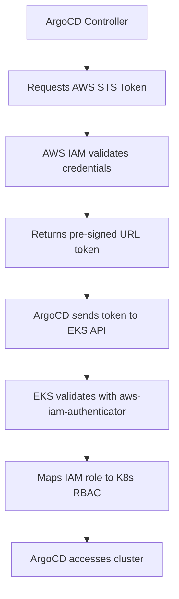

# How to Add an EKS Cluster to ArgoCD

Author: [nawazdhandala](https://github.com/nawazdhandala)

Tags: ArgoCD, GitOps, Kubernetes, AWS EKS, Multi-Cluster

Description: Learn how to register an Amazon EKS cluster with ArgoCD for multi-cluster GitOps deployments, covering IAM authentication, IRSA configuration, and secure cluster registration methods.

---

Adding an Amazon EKS cluster to ArgoCD is more involved than adding a generic Kubernetes cluster because EKS uses AWS IAM for authentication rather than static tokens. You need to configure ArgoCD to authenticate with AWS, which means setting up IAM roles, configuring the aws-iam-authenticator, and ensuring the ArgoCD controller can obtain valid AWS credentials.

In this guide, I will cover three approaches: the quick CLI method, the IRSA-based production setup, and the declarative approach.

## Understanding EKS Authentication

EKS uses the AWS IAM authenticator to map IAM identities to Kubernetes RBAC. When ArgoCD connects to an EKS cluster, the flow looks like this:



## Method 1: Quick CLI Setup

The fastest way to add an EKS cluster, good for development and testing:

```bash
# Make sure you have the EKS cluster in your kubeconfig
aws eks update-kubeconfig --name my-eks-cluster --region us-east-1

# Verify the context
kubectl config get-contexts

# Add the cluster to ArgoCD
argocd cluster add arn:aws:eks:us-east-1:123456789012:cluster/my-eks-cluster

# This creates a service account with a long-lived token
# in the EKS cluster, bypassing IAM auth
```

This approach creates a ServiceAccount with a static token. It works but is not ideal for production because:
- The token does not expire
- It bypasses AWS IAM auditing
- Token rotation requires manual intervention

## Method 2: IRSA-Based Authentication (Recommended)

IAM Roles for Service Accounts (IRSA) is the production-grade approach. ArgoCD's service account assumes an IAM role that has EKS access.

### Step 1: Create the IAM Policy

```bash
# Create a policy that allows EKS cluster access
cat > argocd-eks-policy.json << 'EOF'
{
  "Version": "2012-10-17",
  "Statement": [
    {
      "Effect": "Allow",
      "Action": [
        "eks:DescribeCluster",
        "eks:ListClusters"
      ],
      "Resource": "*"
    }
  ]
}
EOF

aws iam create-policy \
  --policy-name ArgoCD-EKS-Access \
  --policy-document file://argocd-eks-policy.json
```

### Step 2: Create an IAM Role with IRSA Trust

```bash
# Get the OIDC provider for the ArgoCD cluster
OIDC_PROVIDER=$(aws eks describe-cluster \
  --name argocd-cluster \
  --region us-east-1 \
  --query "cluster.identity.oidc.issuer" \
  --output text | sed 's|https://||')

# Create the trust policy
cat > trust-policy.json << EOF
{
  "Version": "2012-10-17",
  "Statement": [
    {
      "Effect": "Allow",
      "Principal": {
        "Federated": "arn:aws:iam::123456789012:oidc-provider/${OIDC_PROVIDER}"
      },
      "Action": "sts:AssumeRoleWithWebIdentity",
      "Condition": {
        "StringEquals": {
          "${OIDC_PROVIDER}:sub": "system:serviceaccount:argocd:argocd-application-controller",
          "${OIDC_PROVIDER}:aud": "sts.amazonaws.com"
        }
      }
    }
  ]
}
EOF

# Create the IAM role
aws iam create-role \
  --role-name ArgoCD-EKS-Controller \
  --assume-role-policy-document file://trust-policy.json

# Attach the policy
aws iam attach-role-policy \
  --role-name ArgoCD-EKS-Controller \
  --policy-arn arn:aws:iam::123456789012:policy/ArgoCD-EKS-Access
```

### Step 3: Map the IAM Role to EKS RBAC

In the remote EKS cluster, map the IAM role to a Kubernetes ClusterRole:

```bash
# Edit the aws-auth ConfigMap in the remote EKS cluster
kubectl edit configmap aws-auth -n kube-system --context remote-eks
```

Add the ArgoCD role mapping:

```yaml
apiVersion: v1
kind: ConfigMap
metadata:
  name: aws-auth
  namespace: kube-system
data:
  mapRoles: |
    - rolearn: arn:aws:iam::123456789012:role/ArgoCD-EKS-Controller
      username: argocd-controller
      groups:
        - system:masters  # Or use a custom ClusterRole for least privilege
```

For least-privilege access, create a custom ClusterRole instead of using `system:masters`:

```yaml
# Apply to the remote EKS cluster
apiVersion: rbac.authorization.k8s.io/v1
kind: ClusterRole
metadata:
  name: argocd-manager
rules:
  - apiGroups: ["*"]
    resources: ["*"]
    verbs: ["get", "list", "watch"]
  - apiGroups: ["apps", "extensions", ""]
    resources: ["deployments", "services", "configmaps", "secrets", "pods", "namespaces", "replicasets", "statefulsets", "daemonsets"]
    verbs: ["*"]
  - apiGroups: ["networking.k8s.io"]
    resources: ["ingresses"]
    verbs: ["*"]

---
apiVersion: rbac.authorization.k8s.io/v1
kind: ClusterRoleBinding
metadata:
  name: argocd-manager-binding
roleRef:
  apiGroup: rbac.authorization.k8s.io
  kind: ClusterRole
  name: argocd-manager
subjects:
  - kind: User
    name: argocd-controller
    apiGroup: rbac.authorization.k8s.io
```

### Step 4: Annotate the ArgoCD Service Account

```bash
# Annotate the ArgoCD application controller SA with the IAM role
kubectl annotate serviceaccount argocd-application-controller \
  -n argocd \
  eks.amazonaws.com/role-arn=arn:aws:iam::123456789012:role/ArgoCD-EKS-Controller
```

### Step 5: Register the Cluster with exec-based Auth

```yaml
apiVersion: v1
kind: Secret
metadata:
  name: eks-production-cluster
  namespace: argocd
  labels:
    argocd.argoproj.io/secret-type: cluster
    environment: production
    provider: aws
    region: us-east-1
type: Opaque
stringData:
  name: eks-production
  server: https://ABCDEF1234567890.gr7.us-east-1.eks.amazonaws.com
  config: |
    {
      "awsAuthConfig": {
        "clusterName": "production-cluster",
        "roleARN": "arn:aws:iam::123456789012:role/ArgoCD-EKS-Controller"
      },
      "tlsClientConfig": {
        "insecure": false,
        "caData": "<base64-encoded-eks-ca-cert>"
      }
    }
```

The `awsAuthConfig` tells ArgoCD to use the AWS IAM authenticator. ArgoCD will:
1. Assume the specified IAM role using IRSA
2. Generate a pre-signed STS token
3. Use this token to authenticate with the EKS API server

## Getting the EKS Cluster Details

```bash
# Get the cluster endpoint
aws eks describe-cluster \
  --name production-cluster \
  --region us-east-1 \
  --query "cluster.endpoint" \
  --output text

# Get the CA certificate (already base64-encoded)
aws eks describe-cluster \
  --name production-cluster \
  --region us-east-1 \
  --query "cluster.certificateAuthority.data" \
  --output text
```

## Method 3: Cross-Account EKS Access

When ArgoCD and the EKS cluster are in different AWS accounts:

```bash
# In the target account (where EKS runs), create a role
# that trusts the ArgoCD account
cat > cross-account-trust.json << EOF
{
  "Version": "2012-10-17",
  "Statement": [
    {
      "Effect": "Allow",
      "Principal": {
        "AWS": "arn:aws:iam::111111111111:role/ArgoCD-EKS-Controller"
      },
      "Action": "sts:AssumeRole"
    }
  ]
}
EOF

aws iam create-role \
  --role-name ArgoCD-Remote-Access \
  --assume-role-policy-document file://cross-account-trust.json \
  --profile target-account
```

Register with role chaining:

```yaml
apiVersion: v1
kind: Secret
metadata:
  name: cross-account-eks
  namespace: argocd
  labels:
    argocd.argoproj.io/secret-type: cluster
type: Opaque
stringData:
  name: cross-account-production
  server: https://ABCDEF.gr7.us-east-1.eks.amazonaws.com
  config: |
    {
      "awsAuthConfig": {
        "clusterName": "production-cluster",
        "roleARN": "arn:aws:iam::222222222222:role/ArgoCD-Remote-Access"
      },
      "tlsClientConfig": {
        "insecure": false,
        "caData": "<ca-data>"
      }
    }
```

## Verifying the Connection

```bash
# Check cluster status
argocd cluster list

# Deploy a test application
argocd app create test-app \
  --repo https://github.com/argoproj/argocd-example-apps.git \
  --path guestbook \
  --dest-server https://ABCDEF.gr7.us-east-1.eks.amazonaws.com \
  --dest-namespace default

# Sync and verify
argocd app sync test-app
argocd app get test-app

# Clean up
argocd app delete test-app
```

## Troubleshooting EKS Connection Issues

```bash
# Check if ArgoCD has AWS credentials
kubectl exec -n argocd deploy/argocd-application-controller -- env | grep AWS

# Test STS assume role
kubectl exec -n argocd deploy/argocd-application-controller -- \
  aws sts get-caller-identity

# Check cluster connection state
argocd cluster get https://ABCDEF.gr7.us-east-1.eks.amazonaws.com -o json | \
  jq '.connectionState'

# Common issues:
# - IRSA not configured: no AWS_WEB_IDENTITY_TOKEN_FILE env var
# - Role ARN wrong: "AccessDenied" in connection state
# - aws-auth ConfigMap missing role mapping: "Unauthorized"
# - Cluster CA cert wrong: "x509: certificate signed by unknown authority"
```

## Summary

Adding an EKS cluster to ArgoCD requires bridging AWS IAM authentication with Kubernetes RBAC. For production, use IRSA to avoid static credentials and maintain AWS CloudTrail auditing. The key steps are creating an IAM role with IRSA trust, mapping it in the EKS cluster's aws-auth ConfigMap, and registering the cluster with `awsAuthConfig`. For managing EKS-specific authentication patterns, see our guide on [ArgoCD EKS IRSA auth](https://oneuptime.com/blog/post/2026-02-26-argocd-eks-irsa-auth/view).
