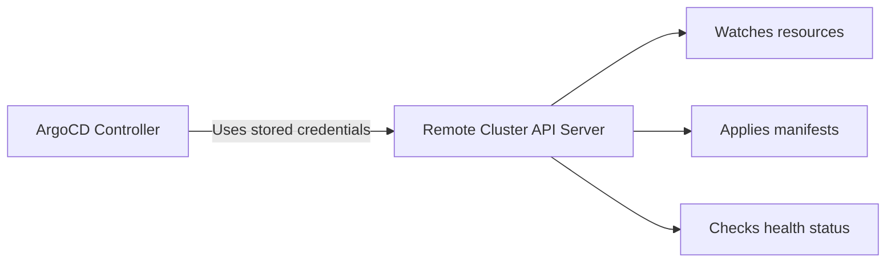

# How to Add a Remote Cluster to ArgoCD

Author: [nawazdhandala](https://github.com/nawazdhandala)

Tags: ArgoCD, GitOps, Kubernetes, Multi-Cluster, DevOps

Description: Learn how to add remote Kubernetes clusters to ArgoCD for multi-cluster deployments, covering the argocd cluster add command, declarative registration, and authentication configuration.

---

ArgoCD runs in a single cluster but can deploy applications to any number of remote clusters. This is the foundation of multi-cluster GitOps. Whether you are managing staging and production environments on separate clusters, running workloads across multiple regions, or maintaining disaster recovery clusters, adding remote clusters to ArgoCD is the first step.

In this guide, I will cover both the CLI and declarative approaches to registering clusters, along with the authentication mechanisms that make it all work.

## How ArgoCD Connects to Remote Clusters

When you add a cluster to ArgoCD, it creates a service account in the remote cluster and stores the credentials as a Kubernetes Secret in the ArgoCD namespace. ArgoCD's application controller uses these credentials to watch and sync resources:



## Method 1: Using the ArgoCD CLI

The simplest way to add a cluster is through the ArgoCD CLI. It automates creating the service account and RBAC in the remote cluster:

### Prerequisites

Make sure your kubeconfig has access to both the ArgoCD cluster and the remote cluster:

```bash
# List your available contexts
kubectl config get-contexts

# Output:
# CURRENT   NAME              CLUSTER           AUTHINFO
# *         argocd-cluster    argocd-cluster    admin
#           remote-staging    staging-cluster   staging-admin
#           remote-prod       prod-cluster      prod-admin
```

### Add the cluster

```bash
# Login to ArgoCD first
argocd login argocd.example.com --grpc-web

# Add the remote cluster using its kubeconfig context name
argocd cluster add remote-staging

# The CLI will:
# 1. Create a ServiceAccount "argocd-manager" in kube-system
# 2. Create a ClusterRole with broad permissions
# 3. Create a ClusterRoleBinding
# 4. Store the credentials as a Secret in ArgoCD's namespace
```

The output looks like:

```
INFO[0000] ServiceAccount "argocd-manager" created in namespace "kube-system"
INFO[0000] ClusterRole "argocd-manager-role" created
INFO[0000] ClusterRoleBinding "argocd-manager-role-binding" created
Cluster 'https://staging.k8s.example.com' added
```

### Customize the service account

You can specify the namespace and service account name:

```bash
argocd cluster add remote-staging \
  --name staging-cluster \
  --service-account argocd-deployer \
  --system-namespace argocd-system \
  --in-cluster
```

### Add with limited namespaces

For security, restrict ArgoCD to specific namespaces:

```bash
argocd cluster add remote-staging \
  --name staging-cluster \
  --namespace app-staging \
  --namespace monitoring
```

## Method 2: Declarative Cluster Registration

For a GitOps-native approach, define cluster credentials as Kubernetes Secrets:

```yaml
apiVersion: v1
kind: Secret
metadata:
  name: remote-staging-cluster
  namespace: argocd
  labels:
    argocd.argoproj.io/secret-type: cluster
type: Opaque
stringData:
  name: staging
  server: https://staging.k8s.example.com
  config: |
    {
      "bearerToken": "<service-account-token>",
      "tlsClientConfig": {
        "insecure": false,
        "caData": "<base64-encoded-ca-cert>"
      }
    }
```

Since this Secret contains sensitive credentials, use Sealed Secrets or ESO to store it:

```yaml
apiVersion: bitnami.com/v1alpha1
kind: SealedSecret
metadata:
  name: remote-staging-cluster
  namespace: argocd
  labels:
    argocd.argoproj.io/secret-type: cluster
spec:
  encryptedData:
    name: AgBy3i4OJSWK...
    server: AgCtr8pMQLpE...
    config: AgDfr5pKRTpE...
  template:
    metadata:
      labels:
        argocd.argoproj.io/secret-type: cluster
    type: Opaque
```

### Creating the Service Account Manually

When using declarative registration, you need to create the service account yourself in the remote cluster:

```yaml
# Apply these to the REMOTE cluster
---
apiVersion: v1
kind: ServiceAccount
metadata:
  name: argocd-manager
  namespace: kube-system

---
apiVersion: rbac.authorization.k8s.io/v1
kind: ClusterRole
metadata:
  name: argocd-manager-role
rules:
  - apiGroups: ["*"]
    resources: ["*"]
    verbs: ["*"]
  - nonResourceURLs: ["*"]
    verbs: ["*"]

---
apiVersion: rbac.authorization.k8s.io/v1
kind: ClusterRoleBinding
metadata:
  name: argocd-manager-role-binding
roleRef:
  apiGroup: rbac.authorization.k8s.io
  kind: ClusterRole
  name: argocd-manager-role
subjects:
  - kind: ServiceAccount
    name: argocd-manager
    namespace: kube-system

---
# For Kubernetes 1.24+, create a long-lived token
apiVersion: v1
kind: Secret
metadata:
  name: argocd-manager-token
  namespace: kube-system
  annotations:
    kubernetes.io/service-account.name: argocd-manager
type: kubernetes.io/service-account-token
```

Get the token:

```bash
# Get the service account token
TOKEN=$(kubectl get secret argocd-manager-token \
  -n kube-system \
  --context remote-staging \
  -o jsonpath='{.data.token}' | base64 -d)

# Get the CA certificate
CA_DATA=$(kubectl config view --raw \
  --context remote-staging \
  -o jsonpath='{.clusters[?(@.name=="staging-cluster")].cluster.certificate-authority-data}')

echo "Token: $TOKEN"
echo "CA: $CA_DATA"
```

## Method 3: Using kubeconfig Credentials

You can also provide full kubeconfig-style credentials:

```yaml
apiVersion: v1
kind: Secret
metadata:
  name: remote-cluster-kubeconfig
  namespace: argocd
  labels:
    argocd.argoproj.io/secret-type: cluster
type: Opaque
stringData:
  name: remote-production
  server: https://production.k8s.example.com
  config: |
    {
      "tlsClientConfig": {
        "insecure": false,
        "caData": "<base64-encoded-ca>",
        "certData": "<base64-encoded-client-cert>",
        "keyData": "<base64-encoded-client-key>"
      }
    }
```

## Verifying the Cluster Connection

After adding the cluster, verify it is connected:

```bash
# List all registered clusters
argocd cluster list

# Output:
# SERVER                                   NAME        VERSION  STATUS
# https://kubernetes.default.svc           in-cluster  1.28     Successful
# https://staging.k8s.example.com          staging     1.28     Successful
# https://production.k8s.example.com       production  1.27     Successful

# Get detailed cluster info
argocd cluster get https://staging.k8s.example.com

# Test connectivity
argocd cluster get https://staging.k8s.example.com --output json | jq '.connectionState'
```

## Deploying to the Remote Cluster

Once registered, use the cluster's server URL in your Application destination:

```yaml
apiVersion: argoproj.io/v1alpha1
kind: Application
metadata:
  name: staging-app
  namespace: argocd
spec:
  project: default
  source:
    repoURL: https://github.com/your-org/apps.git
    targetRevision: main
    path: apps/myapp/overlays/staging
  destination:
    # Use the registered cluster's server URL
    server: https://staging.k8s.example.com
    namespace: default
  syncPolicy:
    automated:
      selfHeal: true
      prune: true
```

Or use the cluster name:

```yaml
  destination:
    name: staging  # Matches the name in the cluster secret
    namespace: default
```

## Adding Cluster Labels

Labels help with ApplicationSet cluster generators:

```yaml
apiVersion: v1
kind: Secret
metadata:
  name: remote-staging-cluster
  namespace: argocd
  labels:
    argocd.argoproj.io/secret-type: cluster
    environment: staging
    region: us-east-1
    tier: non-production
type: Opaque
stringData:
  name: staging
  server: https://staging.k8s.example.com
  config: |
    {
      "bearerToken": "<token>",
      "tlsClientConfig": {
        "insecure": false,
        "caData": "<ca-data>"
      }
    }
```

Or add labels via CLI:

```bash
argocd cluster set https://staging.k8s.example.com \
  --label environment=staging \
  --label region=us-east-1
```

## Troubleshooting Connection Issues

```bash
# Check if ArgoCD can reach the cluster
argocd cluster get https://staging.k8s.example.com

# If "Unknown" status, check:
# 1. Network connectivity from ArgoCD pod
kubectl exec -n argocd deploy/argocd-application-controller -- \
  wget -qO- --timeout=5 https://staging.k8s.example.com/healthz

# 2. Certificate issues
kubectl exec -n argocd deploy/argocd-application-controller -- \
  wget -qO- --no-check-certificate https://staging.k8s.example.com/healthz

# 3. Token validity
argocd cluster get https://staging.k8s.example.com --output json | \
  jq '.connectionState.message'
```

## Summary

Adding remote clusters to ArgoCD enables multi-cluster GitOps management from a single control plane. Use the CLI for quick setup or declarative secrets for a fully GitOps approach. Either way, you end up with cluster credentials stored in ArgoCD's namespace that the controller uses to manage resources on remote clusters. For managing multiple clusters at scale, see our guide on [ArgoCD multi-cluster management](https://oneuptime.com/blog/post/2026-02-02-argocd-multi-cluster/view).
