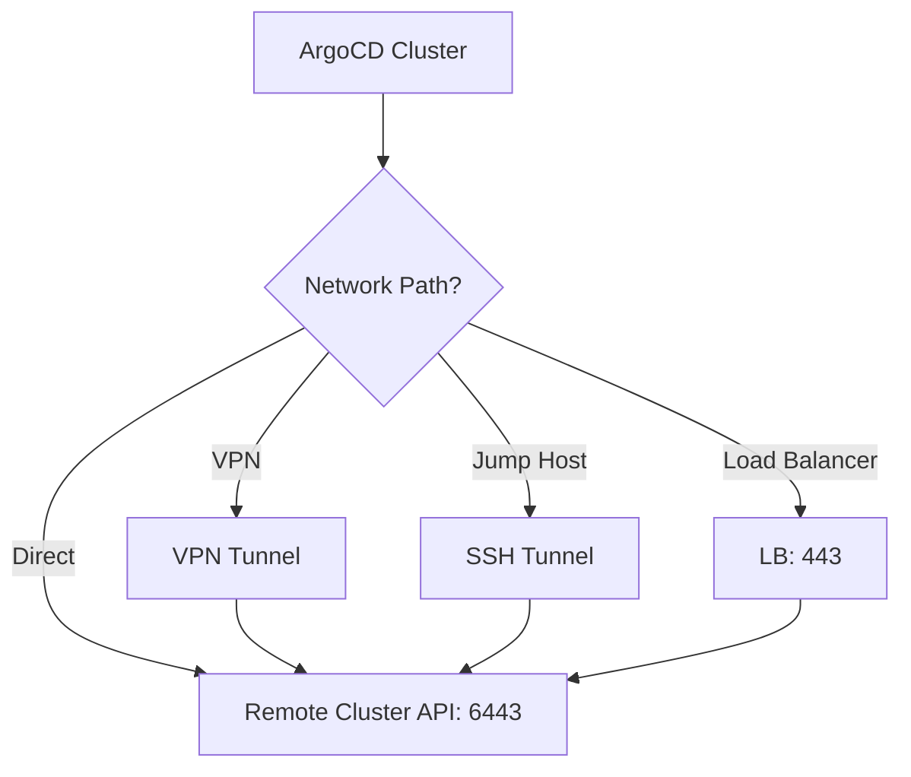

# How to Add a Self-Managed Kubernetes Cluster to ArgoCD

Author: [nawazdhandala](https://github.com/nawazdhandala)

Tags: ArgoCD, GitOps, Kubernetes, Multi-Cluster, DevOps

Description: Learn how to register a self-managed Kubernetes cluster with ArgoCD, covering kubeadm clusters, k3s, RKE2, and on-premises setups with various authentication methods.

---

Self-managed Kubernetes clusters, whether built with kubeadm, k3s, RKE2, or other tools, use standard Kubernetes authentication that is often simpler to integrate with ArgoCD than managed cloud offerings. There is no cloud provider IAM layer to deal with. However, you do need to handle certificate management, network connectivity, and credential security yourself.

In this guide, I will walk you through adding self-managed clusters to ArgoCD, covering different cluster types and authentication scenarios.

## Understanding Self-Managed Cluster Auth

Self-managed clusters typically use one or more of these authentication methods:

- **Client certificates** - X509 certificates signed by the cluster CA
- **Service account tokens** - Long-lived tokens bound to Kubernetes ServiceAccounts
- **OIDC tokens** - External identity provider tokens (if configured)
- **Webhook tokens** - Custom authentication webhook

For ArgoCD, service account tokens are the most common and straightforward approach.

## Method 1: ArgoCD CLI (Quickest)

If your kubeconfig already has access to the self-managed cluster:

```bash
# Verify your kubeconfig contexts
kubectl config get-contexts

# Output:
# CURRENT   NAME              CLUSTER
# *         argocd-cluster    argocd
#           on-prem-staging   on-prem-staging
#           on-prem-prod      on-prem-prod

# Add the cluster
argocd cluster add on-prem-staging --name on-prem-staging

# For clusters with self-signed certificates
argocd cluster add on-prem-staging --name on-prem-staging --insecure
```

## Method 2: Manual Service Account Registration

For declarative, GitOps-friendly registration, create the service account manually.

### Step 1: Create RBAC in the Remote Cluster

Apply these resources to the self-managed cluster you want to manage:

```yaml
# remote-cluster-rbac.yaml
---
apiVersion: v1
kind: Namespace
metadata:
  name: argocd-system

---
apiVersion: v1
kind: ServiceAccount
metadata:
  name: argocd-manager
  namespace: argocd-system

---
# For Kubernetes 1.24+, explicitly create a token secret
apiVersion: v1
kind: Secret
metadata:
  name: argocd-manager-token
  namespace: argocd-system
  annotations:
    kubernetes.io/service-account.name: argocd-manager
type: kubernetes.io/service-account-token

---
apiVersion: rbac.authorization.k8s.io/v1
kind: ClusterRole
metadata:
  name: argocd-manager
rules:
  # Full access for ArgoCD to manage resources
  - apiGroups: ["*"]
    resources: ["*"]
    verbs: ["*"]
  - nonResourceURLs: ["*"]
    verbs: ["*"]

---
apiVersion: rbac.authorization.k8s.io/v1
kind: ClusterRoleBinding
metadata:
  name: argocd-manager
roleRef:
  apiGroup: rbac.authorization.k8s.io
  kind: ClusterRole
  name: argocd-manager
subjects:
  - kind: ServiceAccount
    name: argocd-manager
    namespace: argocd-system
```

Apply it:

```bash
kubectl apply -f remote-cluster-rbac.yaml --context on-prem-staging
```

### Step 2: Extract Credentials

```bash
# Get the service account token
TOKEN=$(kubectl get secret argocd-manager-token \
  -n argocd-system \
  --context on-prem-staging \
  -o jsonpath='{.data.token}' | base64 -d)

# Get the cluster CA certificate
CA_DATA=$(kubectl config view --raw \
  --context on-prem-staging \
  -o jsonpath='{.clusters[?(@.name=="on-prem-staging")].cluster.certificate-authority-data}')

# If CA is a file path instead of inline data
CA_DATA=$(cat /etc/kubernetes/pki/ca.crt | base64 -w 0)

# Get the server URL
SERVER=$(kubectl config view \
  --context on-prem-staging \
  -o jsonpath='{.clusters[?(@.name=="on-prem-staging")].cluster.server}')

echo "Server: $SERVER"
echo "Token: $TOKEN"
echo "CA: $CA_DATA"
```

### Step 3: Register the Cluster

```yaml
apiVersion: v1
kind: Secret
metadata:
  name: on-prem-staging-cluster
  namespace: argocd
  labels:
    argocd.argoproj.io/secret-type: cluster
    environment: staging
    provider: on-prem
    datacenter: dc-1
type: Opaque
stringData:
  name: on-prem-staging
  server: "https://192.168.1.100:6443"
  config: |
    {
      "bearerToken": "<service-account-token>",
      "tlsClientConfig": {
        "insecure": false,
        "caData": "<base64-encoded-ca-cert>"
      }
    }
```

## Adding Specific Cluster Types

### kubeadm Clusters

kubeadm clusters store their CA certificate at `/etc/kubernetes/pki/ca.crt`:

```bash
# On the kubeadm control plane node
CA_DATA=$(sudo cat /etc/kubernetes/pki/ca.crt | base64 -w 0)

# The server URL is typically the load balancer or control plane IP
SERVER="https://10.0.0.10:6443"
```

### k3s Clusters

k3s uses a different default paths:

```bash
# k3s CA certificate
CA_DATA=$(sudo cat /var/lib/rancher/k3s/server/tls/server-ca.crt | base64 -w 0)

# k3s server URL (default port is 6443)
SERVER="https://k3s-server.example.com:6443"

# k3s also provides a kubeconfig at
# /etc/rancher/k3s/k3s.yaml
```

### RKE2 Clusters

```bash
# RKE2 CA certificate
CA_DATA=$(sudo cat /var/lib/rancher/rke2/server/tls/server-ca.crt | base64 -w 0)

# RKE2 server URL
SERVER="https://rke2-server.example.com:6443"

# RKE2 kubeconfig location
# /etc/rancher/rke2/rke2.yaml
```

### MicroK8s Clusters

```bash
# MicroK8s CA certificate
CA_DATA=$(sudo microk8s kubectl config view --raw \
  -o jsonpath='{.clusters[0].cluster.certificate-authority-data}')

# MicroK8s server URL (default port is 16443)
SERVER="https://microk8s-host.example.com:16443"
```

## Handling Self-Signed Certificates

Many self-managed clusters use self-signed CA certificates. You have two options:

### Option 1: Include the CA certificate (Recommended)

```yaml
stringData:
  config: |
    {
      "bearerToken": "<token>",
      "tlsClientConfig": {
        "insecure": false,
        "caData": "<base64-encoded-self-signed-ca>"
      }
    }
```

### Option 2: Skip TLS verification (Development only)

```yaml
stringData:
  config: |
    {
      "bearerToken": "<token>",
      "tlsClientConfig": {
        "insecure": true
      }
    }
```

Never use `insecure: true` in production. It disables certificate verification and makes the connection vulnerable to man-in-the-middle attacks.

## Network Connectivity Requirements

Self-managed clusters often have more complex networking:



### Firewalls and Security Groups

Ensure the ArgoCD pod network can reach the remote cluster's API server:

```bash
# Test connectivity from ArgoCD pod
kubectl exec -n argocd deploy/argocd-application-controller -- \
  wget -qO- --timeout=5 https://192.168.1.100:6443/healthz --no-check-certificate

# If using a load balancer, test that path
kubectl exec -n argocd deploy/argocd-application-controller -- \
  wget -qO- --timeout=5 https://k8s-lb.example.com:443/healthz --no-check-certificate
```

Required firewall rules:

| Source | Destination | Port | Protocol |
|--------|------------|------|----------|
| ArgoCD pod CIDR | Remote API server | 6443 | TCP |

## Least-Privilege RBAC

For production, restrict ArgoCD's permissions to only what it needs:

```yaml
apiVersion: rbac.authorization.k8s.io/v1
kind: ClusterRole
metadata:
  name: argocd-manager-restricted
rules:
  # Read access for all resources (needed for diff/health checks)
  - apiGroups: ["*"]
    resources: ["*"]
    verbs: ["get", "list", "watch"]

  # Write access for common workload resources
  - apiGroups: ["", "apps", "extensions", "batch"]
    resources:
      - deployments
      - services
      - configmaps
      - secrets
      - pods
      - namespaces
      - serviceaccounts
      - replicasets
      - statefulsets
      - daemonsets
      - jobs
      - cronjobs
      - persistentvolumeclaims
    verbs: ["create", "update", "patch", "delete"]

  # Write access for networking
  - apiGroups: ["networking.k8s.io"]
    resources: ["ingresses", "networkpolicies"]
    verbs: ["create", "update", "patch", "delete"]

  # Write access for RBAC (if needed)
  - apiGroups: ["rbac.authorization.k8s.io"]
    resources: ["roles", "rolebindings"]
    verbs: ["create", "update", "patch", "delete"]
```

## Verifying and Testing

```bash
# List registered clusters
argocd cluster list

# Check connectivity
argocd cluster get https://192.168.1.100:6443

# Deploy a test app
argocd app create test-on-prem \
  --repo https://github.com/argoproj/argocd-example-apps.git \
  --path guestbook \
  --dest-server https://192.168.1.100:6443 \
  --dest-namespace default

argocd app sync test-on-prem
argocd app get test-on-prem
argocd app delete test-on-prem --yes
```

## Summary

Adding self-managed Kubernetes clusters to ArgoCD is straightforward compared to cloud-managed clusters since there is no cloud IAM layer to deal with. The main considerations are network connectivity (ensuring ArgoCD can reach the remote API server), certificate management (including the CA cert or using insecure mode for development), and credential security (encrypting the cluster secrets in Git). For all cluster types, create a dedicated ServiceAccount with appropriate RBAC and store its token in ArgoCD's namespace. For more on multi-cluster patterns, see our [ArgoCD multi-cluster guide](https://oneuptime.com/blog/post/2026-02-02-argocd-multi-cluster/view).
