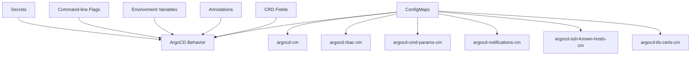

# How to Use Additional Configuration Methods for ArgoCD

Author: [nawazdhandala](https://github.com/nawazdhandala)

Tags: ArgoCD, GitOps, Kubernetes, Configuration, Operations

Description: Learn about all the configuration methods available for ArgoCD beyond command-line flags, including ConfigMaps, Secrets, environment variables, and Helm values.

---

ArgoCD has multiple configuration surfaces. Command-line flags are just one piece of the puzzle. There are ConfigMaps that control behavior, Secrets that store credentials, environment variables that override defaults, and various files that affect how ArgoCD processes repositories. Understanding all these configuration methods gives you complete control over your ArgoCD deployment.

This guide maps out every configuration method available in ArgoCD and when to use each one.

## Configuration Methods Overview

ArgoCD uses six main configuration methods:

1. **ConfigMaps** - Behavioral configuration (argocd-cm, argocd-rbac-cm, argocd-cmd-params-cm)
2. **Secrets** - Credentials and sensitive data (argocd-secret, repo secrets, cluster secrets)
3. **Command-line flags** - Container startup arguments
4. **Environment variables** - Override specific settings
5. **Annotations** - Per-resource and per-application overrides
6. **Custom Resource fields** - AppProject and Application specs



## Method 1: The argocd-cm ConfigMap

This is the primary configuration ConfigMap. It controls core ArgoCD behavior.

### Key Configuration Areas

```yaml
apiVersion: v1
kind: ConfigMap
metadata:
  name: argocd-cm
  namespace: argocd
data:
  # Server URL (required for SSO)
  url: https://argocd.example.com

  # SSO/Dex configuration
  dex.config: |
    connectors:
      - type: github
        id: github
        name: GitHub
        config:
          clientID: $dex.github.clientID
          clientSecret: $dex.github.clientSecret

  # Direct OIDC (alternative to Dex)
  oidc.config: |
    name: Okta
    issuer: https://company.okta.com
    clientID: my-client-id
    clientSecret: $oidc.okta.clientSecret

  # Resource customizations
  resource.customizations.health.argoproj.io_Rollout: |
    hs = {}
    -- lua health check script
    return hs

  # Resource exclusions
  resource.exclusions: |
    - apiGroups:
        - "cilium.io"
      kinds:
        - CiliumIdentity
      clusters:
        - "*"

  # Resource inclusions (whitelist mode)
  resource.inclusions: |
    - apiGroups:
        - "*"
      kinds:
        - "*"
      clusters:
        - "*"

  # Tracking method
  application.resourceTrackingMethod: annotation

  # Kustomize options
  kustomize.buildOptions: --enable-alpha-plugins

  # Status badge
  statusbadge.enabled: "true"

  # Exec enabled
  exec.enabled: "true"

  # Extension configuration
  extension.config: |
    extensions:
      - name: my-extension
        backend:
          services:
            - url: http://my-service:8080

  # Admin account status
  admin.enabled: "false"

  # Application set controller options
  applicationsetcontroller.enable.progressive.syncs: "true"

  # GA tracking (disabled for privacy)
  ga.trackingid: ""
```

## Method 2: The argocd-cmd-params-cm ConfigMap

This ConfigMap was introduced to separate server parameters from other configuration. It maps directly to command-line flags.

```yaml
apiVersion: v1
kind: ConfigMap
metadata:
  name: argocd-cmd-params-cm
  namespace: argocd
data:
  # Server options
  server.insecure: "true"
  server.rootpath: "/argocd"
  server.basehref: "/argocd"
  server.enable.gzip: "true"
  server.log.format: "json"
  server.log.level: "info"

  # Controller options
  controller.status.processors: "50"
  controller.operation.processors: "25"
  controller.self.heal.timeout.seconds: "10"
  controller.repo.server.timeout.seconds: "120"
  controller.log.format: "json"
  controller.log.level: "info"

  # Repo server options
  reposerver.parallelism.limit: "5"
  reposerver.log.format: "json"
  reposerver.log.level: "info"

  # Application set controller
  applicationsetcontroller.log.format: "json"
  applicationsetcontroller.log.level: "info"

  # Redis
  redis.server: "argocd-redis-ha-haproxy:6379"
  redis.compression: "gzip"

  # Timeout settings
  timeout.reconciliation: "180s"
  timeout.hard.reconciliation: "0"
```

Using `argocd-cmd-params-cm` is preferred over command-line flags because changes take effect when the ConfigMap is updated (after pod restart), and it keeps all parameters in one place.

## Method 3: The argocd-rbac-cm ConfigMap

Controls role-based access control.

```yaml
apiVersion: v1
kind: ConfigMap
metadata:
  name: argocd-rbac-cm
  namespace: argocd
data:
  # Default role for authenticated users
  policy.default: role:readonly

  # RBAC policies
  policy.csv: |
    # Admin role
    p, role:admin, applications, *, */*, allow
    p, role:admin, clusters, *, *, allow
    p, role:admin, repositories, *, *, allow
    p, role:admin, projects, *, *, allow
    p, role:admin, extensions, invoke, *, allow

    # Developer role
    p, role:developer, applications, get, */*, allow
    p, role:developer, applications, sync, */*, allow
    p, role:developer, applications, action/restart, */*, allow
    p, role:developer, repositories, get, *, allow

    # Map SSO groups to roles
    g, platform-team, role:admin
    g, dev-team, role:developer

  # RBAC scopes
  scopes: '[groups, email]'
```

## Method 4: Secrets

### argocd-secret

Contains core secrets like the admin password and Dex credentials.

```yaml
apiVersion: v1
kind: Secret
metadata:
  name: argocd-secret
  namespace: argocd
type: Opaque
stringData:
  # Admin password (bcrypt hash)
  admin.password: "$2a$10$..."
  admin.passwordMtime: "2024-01-01T00:00:00Z"

  # Dex SSO secrets (referenced with $ in argocd-cm)
  dex.github.clientID: "my-github-client-id"
  dex.github.clientSecret: "my-github-client-secret"

  # Server secret key (used for session signing)
  server.secretkey: "random-string-here"

  # Webhook secrets
  webhook.github.secret: "my-webhook-secret"
```

### Repository Secrets

Each repository is configured with a labeled Secret.

```yaml
apiVersion: v1
kind: Secret
metadata:
  name: my-repo
  namespace: argocd
  labels:
    argocd.argoproj.io/secret-type: repository
stringData:
  type: git
  url: https://github.com/my-org/my-repo
  username: git
  password: ghp_xxxxxxxxxxxx
```

### Cluster Secrets

External clusters are also configured with Secrets.

```yaml
apiVersion: v1
kind: Secret
metadata:
  name: production-cluster
  namespace: argocd
  labels:
    argocd.argoproj.io/secret-type: cluster
stringData:
  name: production
  server: https://production-api.example.com
  config: |
    {
      "bearerToken": "eyJhbG...",
      "tlsClientConfig": {
        "insecure": false,
        "caData": "LS0tLS1..."
      }
    }
```

### Repository Credential Templates

Credential templates match repositories by URL pattern.

```yaml
apiVersion: v1
kind: Secret
metadata:
  name: github-creds
  namespace: argocd
  labels:
    argocd.argoproj.io/secret-type: repo-creds
stringData:
  type: git
  url: https://github.com/my-org
  username: git
  password: ghp_xxxxxxxxxxxx
```

## Method 5: Environment Variables

Many settings can be configured through environment variables.

```yaml
env:
  # Server settings
  - name: ARGOCD_SERVER_INSECURE
    value: "true"
  - name: ARGOCD_SERVER_ROOTPATH
    value: "/argocd"

  # Controller settings
  - name: ARGOCD_RECONCILIATION_TIMEOUT
    value: "180s"
  - name: ARGOCD_CONTROLLER_REPLICAS
    value: "1"

  # Git settings
  - name: ARGOCD_GIT_MODULES_ENABLED
    value: "false"

  # Proxy settings
  - name: HTTPS_PROXY
    value: "http://proxy.internal:3128"
  - name: NO_PROXY
    value: "kubernetes.default.svc,10.0.0.0/8"
```

## Method 6: Annotations

Per-application and per-resource behavior can be controlled with annotations.

### Application Annotations

```yaml
apiVersion: argoproj.io/v1alpha1
kind: Application
metadata:
  annotations:
    # Sync waves
    argocd.argoproj.io/sync-wave: "0"
    # Refresh interval override
    argocd.argoproj.io/refresh: "hard"
    # Managed by notification
    notifications.argoproj.io/subscribe.on-sync-succeeded.slack: my-channel
```

### Resource Annotations

```yaml
metadata:
  annotations:
    # Sync options per resource
    argocd.argoproj.io/sync-options: Prune=false
    # Health check override
    argocd.argoproj.io/health-check-timeout: "60"
    # Diff customization
    argocd.argoproj.io/compare-options: IgnoreExtraneous
```

## Method 7: SSH Known Hosts

```yaml
apiVersion: v1
kind: ConfigMap
metadata:
  name: argocd-ssh-known-hosts-cm
  namespace: argocd
data:
  ssh_known_hosts: |
    github.com ssh-ed25519 AAAAC3NzaC1lZDI1NTE5AAAAIOMqqnkVzrm0SdG6UOoqKLsabgH5C9okWi0dh2l9GKJl
    gitlab.com ssh-ed25519 AAAAC3NzaC1lZDI1NTE5AAAAIAfuCHKVTjquxvt6CM6tdG4SLp1Btn/nOeHHE5UOzRdf
    bitbucket.org ssh-ed25519 AAAAC3NzaC1lZDI1NTE5AAAAIIazEu89wgQZ4bqs3d63QSMzYVa0MuJ2e2gKTKqu+UUO
```

## Method 8: TLS Certificates

```yaml
apiVersion: v1
kind: ConfigMap
metadata:
  name: argocd-tls-certs-cm
  namespace: argocd
data:
  # Custom CA for internal Git servers
  git.internal.example.com: |
    -----BEGIN CERTIFICATE-----
    MIIFvTCCA6WgAwIBAgIU...
    -----END CERTIFICATE-----
```

## Configuration Precedence

When the same setting is specified in multiple places, the precedence order is:

1. Command-line flags (highest priority)
2. Environment variables
3. argocd-cmd-params-cm ConfigMap
4. argocd-cm ConfigMap
5. Default values (lowest priority)

## Best Practices

### Store Configuration in Git

All ConfigMaps and non-sensitive Secrets should be stored in Git and managed by ArgoCD itself (or a separate ArgoCD instance).

```yaml
# App of apps for ArgoCD self-management
apiVersion: argoproj.io/v1alpha1
kind: Application
metadata:
  name: argocd-config
  namespace: argocd
spec:
  project: default
  source:
    repoURL: https://github.com/my-org/argocd-config
    path: config
    targetRevision: main
  destination:
    server: https://kubernetes.default.svc
    namespace: argocd
```

### Use argocd-cmd-params-cm Over Flags

Prefer `argocd-cmd-params-cm` over command-line flags for component settings. It is easier to manage in Git and provides a single place to view all parameters.

### Separate Concerns

- Use `argocd-cm` for application-level behavior (resource customizations, Dex config)
- Use `argocd-cmd-params-cm` for component tuning (processors, timeouts, log levels)
- Use `argocd-rbac-cm` for access control
- Use Secrets for credentials

## Conclusion

ArgoCD provides a rich set of configuration methods that cover everything from server behavior to authentication, RBAC, repository credentials, and resource customizations. Understanding which method to use for which setting is key to maintaining a clean, manageable ArgoCD deployment. For most settings, the `argocd-cmd-params-cm` ConfigMap is the preferred approach, as it centralizes component parameters in a GitOps-friendly format. Use `argocd-cm` for behavioral configuration and Secrets for credentials. Keep everything in Git, and let ArgoCD manage its own configuration.
