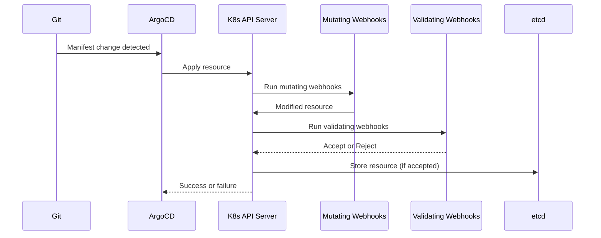

# How to Implement Admission Control for ArgoCD Deployments

Author: [nawazdhandala](https://github.com/nawazdhandala)

Tags: ArgoCD, GitOps, Kubernetes, Security, Admission Control

Description: Learn how to implement Kubernetes admission control for ArgoCD deployments using validating webhooks, OPA Gatekeeper, and Kyverno to enforce security and compliance policies.

---

Admission controllers are the last line of defense before resources are created in your Kubernetes cluster. When ArgoCD syncs an application, all resources pass through the admission control chain. This post covers how to implement admission controllers that enforce security policies, compliance requirements, and best practices on ArgoCD-managed deployments.

## How Admission Control Works with ArgoCD

When ArgoCD applies manifests to your cluster, the Kubernetes API server processes each resource through its admission control chain. This happens transparently - ArgoCD does not need any special configuration.



If a validating webhook rejects a resource, ArgoCD will report the sync as failed and show the rejection reason in the UI.

## Deploying OPA Gatekeeper with ArgoCD

Start by deploying Gatekeeper itself through ArgoCD:

```yaml
# applications/gatekeeper.yaml
apiVersion: argoproj.io/v1alpha1
kind: Application
metadata:
  name: gatekeeper
  namespace: argocd
spec:
  project: security
  source:
    repoURL: https://open-policy-agent.github.io/gatekeeper/charts
    chart: gatekeeper
    targetRevision: 3.15.0
    helm:
      values: |
        replicas: 3
        auditInterval: 60
        constraintViolationsLimit: 20
        auditFromCache: true
        auditChunkSize: 500
        logLevel: INFO
        emitAdmissionEvents: true
        emitAuditEvents: true
        # Exempt ArgoCD and system namespaces
        exemptNamespaces:
          - kube-system
          - argocd
          - gatekeeper-system
  destination:
    server: https://kubernetes.default.svc
    namespace: gatekeeper-system
  syncPolicy:
    automated:
      selfHeal: true
      prune: true
    syncOptions:
      - CreateNamespace=true
      - ServerSideApply=true
```

## Common Admission Policies

### Require Resource Limits

Ensure every container has resource limits set:

```yaml
# policies/templates/require-limits.yaml
apiVersion: templates.gatekeeper.sh/v1
kind: ConstraintTemplate
metadata:
  name: k8srequirelimits
spec:
  crd:
    spec:
      names:
        kind: K8sRequireLimits
      validation:
        openAPIV3Schema:
          type: object
          properties:
            cpu:
              type: boolean
            memory:
              type: boolean
  targets:
    - target: admission.k8s.gatekeeper.sh
      rego: |
        package k8srequirelimits

        violation[{"msg": msg}] {
          container := input.review.object.spec.containers[_]
          input.parameters.cpu
          not container.resources.limits.cpu
          msg := sprintf("Container '%v' must have CPU limits", [container.name])
        }

        violation[{"msg": msg}] {
          container := input.review.object.spec.containers[_]
          input.parameters.memory
          not container.resources.limits.memory
          msg := sprintf("Container '%v' must have memory limits", [container.name])
        }
---
apiVersion: constraints.gatekeeper.sh/v1beta1
kind: K8sRequireLimits
metadata:
  name: require-resource-limits
spec:
  enforcementAction: deny
  match:
    kinds:
      - apiGroups: [""]
        kinds: ["Pod"]
    excludedNamespaces:
      - kube-system
      - argocd
  parameters:
    cpu: true
    memory: true
```

### Require Non-Root Containers

```yaml
# policies/templates/require-non-root.yaml
apiVersion: templates.gatekeeper.sh/v1
kind: ConstraintTemplate
metadata:
  name: k8srequirenonroot
spec:
  crd:
    spec:
      names:
        kind: K8sRequireNonRoot
  targets:
    - target: admission.k8s.gatekeeper.sh
      rego: |
        package k8srequirenonroot

        violation[{"msg": msg}] {
          container := input.review.object.spec.containers[_]
          not container.securityContext.runAsNonRoot
          msg := sprintf("Container '%v' must set securityContext.runAsNonRoot=true", [container.name])
        }

        violation[{"msg": msg}] {
          input.review.object.spec.securityContext.runAsUser == 0
          msg := "Pod must not run as root (UID 0)"
        }
---
apiVersion: constraints.gatekeeper.sh/v1beta1
kind: K8sRequireNonRoot
metadata:
  name: require-non-root
spec:
  enforcementAction: deny
  match:
    kinds:
      - apiGroups: [""]
        kinds: ["Pod"]
    namespaces:
      - production
      - staging
```

### Require Specific Labels

```yaml
# policies/templates/require-labels.yaml
apiVersion: templates.gatekeeper.sh/v1
kind: ConstraintTemplate
metadata:
  name: k8srequiredlabels
spec:
  crd:
    spec:
      names:
        kind: K8sRequiredLabels
      validation:
        openAPIV3Schema:
          type: object
          properties:
            labels:
              type: array
              items:
                type: object
                properties:
                  key:
                    type: string
                  allowedRegex:
                    type: string
  targets:
    - target: admission.k8s.gatekeeper.sh
      rego: |
        package k8srequiredlabels

        violation[{"msg": msg}] {
          required := input.parameters.labels[_]
          not input.review.object.metadata.labels[required.key]
          msg := sprintf("Missing required label: '%v'", [required.key])
        }

        violation[{"msg": msg}] {
          required := input.parameters.labels[_]
          required.allowedRegex != ""
          label := input.review.object.metadata.labels[required.key]
          not re_match(required.allowedRegex, label)
          msg := sprintf("Label '%v' value '%v' does not match pattern '%v'", [required.key, label, required.allowedRegex])
        }
---
apiVersion: constraints.gatekeeper.sh/v1beta1
kind: K8sRequiredLabels
metadata:
  name: require-standard-labels
spec:
  enforcementAction: deny
  match:
    kinds:
      - apiGroups: ["apps"]
        kinds: ["Deployment", "StatefulSet"]
  parameters:
    labels:
      - key: app.kubernetes.io/name
      - key: app.kubernetes.io/version
      - key: app.kubernetes.io/managed-by
      - key: team
        allowedRegex: "^(platform|backend|frontend|data)$"
```

## Managing Policies Through ArgoCD

Store all policies in Git and manage them with a dedicated ArgoCD Application:

```yaml
# applications/admission-policies.yaml
apiVersion: argoproj.io/v1alpha1
kind: Application
metadata:
  name: admission-policies
  namespace: argocd
spec:
  project: security
  source:
    repoURL: https://github.com/your-org/k8s-policies.git
    targetRevision: main
    path: policies
  destination:
    server: https://kubernetes.default.svc
  syncPolicy:
    automated:
      selfHeal: true
      prune: true
    syncOptions:
      - ServerSideApply=true
  # Use sync waves to deploy templates before constraints
  # Templates are in policies/templates/ (wave -1)
  # Constraints are in policies/constraints/ (wave 0)
```

Add sync wave annotations to ensure templates are created before constraints:

```yaml
# In template files
metadata:
  annotations:
    argocd.argoproj.io/sync-wave: "-1"

# In constraint files
metadata:
  annotations:
    argocd.argoproj.io/sync-wave: "0"
```

## Dry-Run Mode for New Policies

When introducing new policies, start with `warn` mode to see what would be blocked without actually blocking:

```yaml
apiVersion: constraints.gatekeeper.sh/v1beta1
kind: K8sRequireLimits
metadata:
  name: require-resource-limits
spec:
  enforcementAction: warn  # Start with warn, then switch to deny
  match:
    kinds:
      - apiGroups: [""]
        kinds: ["Pod"]
```

ArgoCD will show warnings in the sync output without failing the sync. Once you are confident the policy is correct, change to `deny`.

## Handling ArgoCD Sync Failures from Admission Control

When admission controllers reject resources, ArgoCD shows specific error messages. Configure notifications to alert your team:

```yaml
# In argocd-notifications-cm
data:
  trigger.on-sync-status-unknown: |
    - when: app.status.operationState.phase in ['Error', 'Failed']
      send: [admission-control-alert]
  template.admission-control-alert: |
    message: |
      ArgoCD sync failed for {{.app.metadata.name}}.
      Error: {{.app.status.operationState.message}}

      This may be caused by admission control policy violations.
      Review the sync details in the ArgoCD UI.
```

## Exempting ArgoCD Resources

Always exempt ArgoCD's own namespace from admission policies to prevent ArgoCD from being unable to manage itself:

```yaml
# In Gatekeeper config
apiVersion: config.gatekeeper.sh/v1alpha1
kind: Config
metadata:
  name: config
  namespace: gatekeeper-system
spec:
  match:
    - excludedNamespaces:
        - argocd
        - gatekeeper-system
        - kube-system
      processes:
        - "*"
```

## Monitoring Policy Violations

Use Gatekeeper's audit feature to track violations across the cluster. You can also integrate with [OneUptime](https://oneuptime.com) to monitor policy compliance rates and alert on spikes in violations.

## Summary

Admission control for ArgoCD deployments works transparently through the Kubernetes API server. Deploy OPA Gatekeeper or Kyverno through ArgoCD, manage policies as Git resources, use sync waves to order template and constraint creation, and start new policies in warn mode before enforcing. The key is exempting ArgoCD and system namespaces from policies to prevent self-locking, and configuring notifications so teams know immediately when a deployment is blocked by a policy violation.
