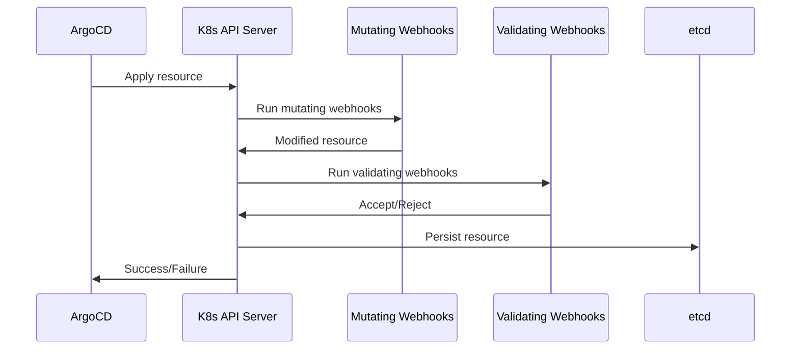

# How to Handle ArgoCD with Kubernetes Admission Webhooks

Author: [nawazdhandala](https://github.com/nawazdhandala)

Tags: ArgoCD, GitOps, Kubernetes, Admission Webhooks, Security

Description: Manage the interaction between ArgoCD and Kubernetes admission webhooks to prevent sync failures, diff issues, and deployment conflicts.

---

Kubernetes admission webhooks are powerful gatekeepers that intercept API requests before they are persisted. They validate (validating webhooks) or modify (mutating webhooks) resources as they are created or updated. When ArgoCD syncs an application, it sends resources through these same webhooks, which can cause unexpected sync failures, diff loops, and deployment issues.

This guide covers the common problems that arise when ArgoCD interacts with admission webhooks and how to solve them.

## How Admission Webhooks Interact with ArgoCD

When ArgoCD syncs a resource, the flow goes through the Kubernetes API server, which includes admission webhook processing:



The key issue is that mutating webhooks modify the resource after ArgoCD applies it. ArgoCD then compares the live state (with mutations) against the Git state (without mutations) and sees a diff. This causes OutOfSync status and potentially infinite sync loops.

## Problem 1: Mutating Webhooks Cause Constant OutOfSync

The most common issue is mutating webhooks adding fields or modifying values that are not in your Git manifests.

### Istio Sidecar Injection

Istio's mutating webhook injects a sidecar container and init container into every pod:

```yaml
# What ArgoCD applies (from Git)
spec:
  containers:
    - name: myapp
      image: myapp:1.0

# What the cluster shows (after Istio mutation)
spec:
  containers:
    - name: myapp
      image: myapp:1.0
    - name: istio-proxy
      image: docker.io/istio/proxyv2:1.20.0
  initContainers:
    - name: istio-init
      image: docker.io/istio/proxyv2:1.20.0
```

Fix by ignoring Istio-injected fields:

```yaml
apiVersion: argoproj.io/v1alpha1
kind: Application
metadata:
  name: myapp
spec:
  ignoreDifferences:
    - group: apps
      kind: Deployment
      jqPathExpressions:
        - .spec.template.spec.containers[] | select(.name == "istio-proxy")
        - .spec.template.spec.initContainers[] | select(.name == "istio-init")
        - .spec.template.spec.volumes[] | select(.name | startswith("istio"))
        - .spec.template.metadata.annotations["sidecar.istio.io/status"]
        - .spec.template.metadata.labels["security.istio.io/tlsMode"]
        - .spec.template.metadata.labels["service.istio.io/canonical-name"]
        - .spec.template.metadata.labels["service.istio.io/canonical-revision"]
  syncPolicy:
    syncOptions:
      - RespectIgnoreDifferences=true
```

### Vault Agent Injection

HashiCorp Vault's mutating webhook injects a Vault agent sidecar:

```yaml
ignoreDifferences:
  - group: apps
    kind: Deployment
    jqPathExpressions:
      - .spec.template.spec.containers[] | select(.name == "vault-agent")
      - .spec.template.spec.containers[] | select(.name == "vault-agent-init")
      - .spec.template.spec.initContainers[] | select(.name == "vault-agent-init")
      - .spec.template.spec.volumes[] | select(.name | startswith("vault"))
      - .spec.template.metadata.annotations["vault.hashicorp.com/agent-inject-status"]
```

### Kyverno Mutations

Kyverno can mutate resources based on policies. For example, adding default labels:

```yaml
ignoreDifferences:
  - group: apps
    kind: Deployment
    jqPathExpressions:
      - .metadata.labels["app.kubernetes.io/managed-by"]
      - .spec.template.metadata.labels["policies.kyverno.io/last-applied-patches"]
```

## Problem 2: Validating Webhooks Reject ArgoCD Syncs

Validating webhooks can reject resources that do not meet certain criteria. This causes ArgoCD sync failures.

### Common Validation Failures

```text
SyncError: admission webhook "validate.my-policy" denied the request:
resource does not meet security requirements
```

The fix depends on what the webhook validates:

**Missing required labels:**
```yaml
# Add the required labels to your manifests
metadata:
  labels:
    team: platform
    cost-center: engineering
    environment: production
```

**Security context requirements (e.g., OPA/Gatekeeper or Kyverno):**
```yaml
spec:
  template:
    spec:
      securityContext:
        runAsNonRoot: true
        fsGroup: 1000
      containers:
        - name: myapp
          securityContext:
            runAsUser: 1000
            allowPrivilegeEscalation: false
            readOnlyRootFilesystem: true
            capabilities:
              drop:
                - ALL
```

### Dry-Run Failures

ArgoCD performs a dry-run before syncing. If validating webhooks are called during dry-run and they depend on external services that are unavailable, the sync fails before it even starts.

Fix by configuring ArgoCD to use server-side dry-run or skip it:

```yaml
spec:
  syncPolicy:
    syncOptions:
      # Skip client-side dry-run
      - SkipDryRunOnMissingResource=true
      # Use server-side apply which has better webhook handling
      - ServerSideApply=true
```

## Problem 3: Webhook Ordering and Timing Issues

When ArgoCD deploys resources that include the webhook configuration itself, timing matters. If ArgoCD tries to create resources before the webhook is ready, the webhook either is not there (and the resources go through without validation) or the webhook is there but the webhook server pods are not ready (and all requests fail).

### Fix: Use Sync Waves

Deploy webhooks and their dependencies in the correct order:

```yaml
# Wave -2: Namespace and RBAC for the webhook server
apiVersion: v1
kind: Namespace
metadata:
  name: webhook-system
  annotations:
    argocd.argoproj.io/sync-wave: "-2"

---
# Wave -1: Deploy the webhook server
apiVersion: apps/v1
kind: Deployment
metadata:
  name: webhook-server
  namespace: webhook-system
  annotations:
    argocd.argoproj.io/sync-wave: "-1"
spec:
  # webhook server deployment

---
# Wave 0: Register the webhook (after server is ready)
apiVersion: admissionregistration.k8s.io/v1
kind: MutatingWebhookConfiguration
metadata:
  name: my-webhook
  annotations:
    argocd.argoproj.io/sync-wave: "0"

---
# Wave 1: Deploy applications that the webhook will process
apiVersion: apps/v1
kind: Deployment
metadata:
  name: myapp
  annotations:
    argocd.argoproj.io/sync-wave: "1"
```

## Problem 4: Webhook Failures Block All Syncs

If a webhook server goes down, it can block all ArgoCD syncs because every resource creation goes through the webhook. This is especially dangerous with `failurePolicy: Fail`.

### Fix: Configure Webhook Failure Policy

For webhooks that are not critical to security, use `Ignore` failure policy:

```yaml
apiVersion: admissionregistration.k8s.io/v1
kind: MutatingWebhookConfiguration
metadata:
  name: non-critical-webhook
webhooks:
  - name: non-critical.example.com
    failurePolicy: Ignore  # Don't block if webhook is unavailable
    timeoutSeconds: 5       # Short timeout
```

For critical webhooks, ensure high availability:

```yaml
apiVersion: apps/v1
kind: Deployment
metadata:
  name: critical-webhook-server
spec:
  replicas: 3  # Multiple replicas for HA
  template:
    spec:
      affinity:
        podAntiAffinity:
          requiredDuringSchedulingIgnoredDuringExecution:
            - labelSelector:
                matchLabels:
                  app: critical-webhook-server
              topologyKey: kubernetes.io/hostname
```

### Exclude ArgoCD Namespace from Webhooks

Prevent webhooks from interfering with ArgoCD's own resources:

```yaml
webhooks:
  - name: my-webhook.example.com
    namespaceSelector:
      matchExpressions:
        # Exclude the argocd namespace
        - key: kubernetes.io/metadata.name
          operator: NotIn
          values:
            - argocd
            - kube-system
```

## Problem 5: Server-Side Apply Conflicts with Webhooks

When using server-side apply, mutating webhooks can cause field ownership conflicts. The webhook modifies a field, and then ArgoCD tries to claim ownership of the same field.

### Fix: Use Force Apply for Conflicting Resources

```yaml
syncPolicy:
  syncOptions:
    - ServerSideApply=true
    # Force apply resolves ownership conflicts
    - Force=true
```

Or handle it per-resource with annotations:

```yaml
metadata:
  annotations:
    argocd.argoproj.io/sync-options: ServerSideApply=true,Force=true
```

## Debugging Webhook Issues

When ArgoCD syncs fail due to webhooks, the error messages can be cryptic. Here is how to debug:

```bash
# Check ArgoCD sync errors
argocd app get myapp

# Check the webhook configurations
kubectl get mutatingwebhookconfigurations
kubectl get validatingwebhookconfigurations

# Check webhook server logs
kubectl logs -n webhook-namespace deployment/webhook-server

# Test a resource manually to see the webhook response
kubectl apply --dry-run=server -f resource.yaml -v=6
```

The `-v=6` flag on kubectl shows the full API request and response, including webhook modifications.

Admission webhooks add complexity to GitOps workflows, but they are essential for security and compliance. The key is to identify which webhooks are mutating your resources, configure ArgoCD to ignore the mutated fields, and use sync waves to ensure webhooks are deployed before the resources they process. With these patterns in place, ArgoCD and admission webhooks work together smoothly.
