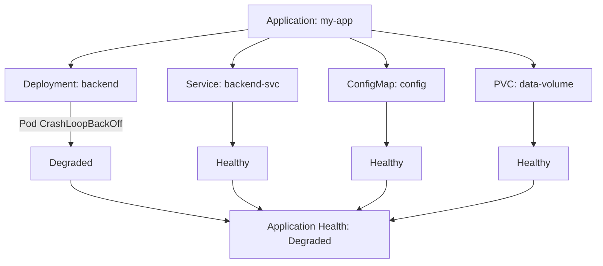

# How to Set Up Alerts for Degraded ArgoCD Applications

Author: [nawazdhandala](https://github.com/nawazdhandala)

Tags: ArgoCD, GitOps, Kubernetes, Prometheus, Alerting

Description: Learn how to set up Prometheus alerts for degraded ArgoCD applications to detect unhealthy workloads, crash-looping pods, and resource failures across your GitOps-managed fleet.

---

A Degraded application in ArgoCD means the Kubernetes resources are deployed but not functioning correctly. Pods might be crash-looping, readiness probes are failing, PersistentVolumeClaims are stuck in Pending, or Jobs have failed. This is different from an OutOfSync state - a Degraded application can be perfectly synced with Git but still broken at runtime.

Degraded health alerts are your last line of defense. They catch problems that manifest only after deployment, problems that no amount of Git validation or sync monitoring can detect.

## Understanding Degraded Health

ArgoCD aggregates the health of all resources in an application to determine the overall health status. If any single resource is unhealthy, the entire application health degrades:



Even one Degraded resource makes the whole application Degraded. This is a conservative approach that ensures you are always aware of problems.

## Key Metric for Degraded Detection

The `argocd_app_info` metric includes health_status as a label:

```promql
# All currently degraded applications
argocd_app_info{health_status="Degraded"}

# Count of degraded applications
count(argocd_app_info{health_status="Degraded"}) or vector(0)

# Degraded applications in specific namespaces
argocd_app_info{health_status="Degraded", dest_namespace=~"production|staging"}
```

## Basic Degraded Alert

Start with a straightforward alert:

```yaml
apiVersion: monitoring.coreos.com/v1
kind: PrometheusRule
metadata:
  name: argocd-degraded-alerts
  namespace: monitoring
  labels:
    release: kube-prometheus-stack
spec:
  groups:
  - name: argocd-degraded
    rules:
    - alert: ArgocdApplicationDegraded
      expr: argocd_app_info{health_status="Degraded"} == 1
      for: 5m
      labels:
        severity: warning
      annotations:
        summary: "Application {{ $labels.name }} is Degraded"
        description: "Application {{ $labels.name }} in namespace {{ $labels.dest_namespace }} has been in Degraded health state for more than 5 minutes."
```

The `for: 5m` duration filters out brief Degraded states that occur during rolling updates when old pods are terminating and new pods are starting.

## Tiered Alerts by Environment

Production Degraded states need immediate attention. Development environments can tolerate longer periods:

```yaml
groups:
- name: argocd-degraded-tiered
  rules:
  # Production - page on-call
  - alert: ArgocdProductionDegraded
    expr: |
      argocd_app_info{
        health_status="Degraded",
        dest_namespace=~"production|prod|prod-.*"
      } == 1
    for: 3m
    labels:
      severity: critical
      team: platform
    annotations:
      summary: "CRITICAL: Production app {{ $labels.name }} is Degraded"
      description: |
        Production application {{ $labels.name }} is in Degraded health state.
        Namespace: {{ $labels.dest_namespace }}
        Project: {{ $labels.project }}
        This requires immediate investigation.
      runbook_url: "https://wiki.example.com/runbooks/argocd-degraded"

  # Staging - warn the team
  - alert: ArgocdStagingDegraded
    expr: |
      argocd_app_info{
        health_status="Degraded",
        dest_namespace=~"staging|stage|stg-.*"
      } == 1
    for: 10m
    labels:
      severity: warning
    annotations:
      summary: "Staging app {{ $labels.name }} is Degraded"
      description: "Staging application {{ $labels.name }} has been Degraded for 10+ minutes."

  # Development - informational
  - alert: ArgocdDevDegraded
    expr: |
      argocd_app_info{
        health_status="Degraded",
        dest_namespace=~"dev|development|dev-.*"
      } == 1
    for: 1h
    labels:
      severity: info
    annotations:
      summary: "Dev app {{ $labels.name }} is Degraded"
```

## Detecting Mass Degradation

When multiple applications go Degraded simultaneously, it usually indicates a cluster-level problem rather than an individual application issue:

```yaml
groups:
- name: argocd-mass-degradation
  rules:
  - alert: ArgocdMassDegradation
    expr: |
      count(argocd_app_info{health_status="Degraded"}) > 3
    for: 5m
    labels:
      severity: critical
    annotations:
      summary: "{{ $value }} ArgoCD applications are Degraded"
      description: |
        Multiple applications are in Degraded health state simultaneously.
        This may indicate:
        - Node failures in the cluster
        - Resource exhaustion (CPU/memory)
        - Container registry issues
        - Network connectivity problems
        Investigate cluster health immediately.

  # Percentage-based alert for large fleets
  - alert: ArgocdHighDegradedPercentage
    expr: |
      count(argocd_app_info{health_status="Degraded"})
      / count(argocd_app_info) * 100 > 10
    for: 10m
    labels:
      severity: critical
    annotations:
      summary: "{{ $value | printf \"%.1f\" }}% of ArgoCD applications are Degraded"
      description: "More than 10% of the application fleet is in Degraded state."
```

## Combining Health and Sync Alerts

The most insightful alerts combine health and sync status:

```yaml
groups:
- name: argocd-combined-alerts
  rules:
  # Worst case: synced but degraded (deployment succeeded but app is broken)
  - alert: ArgocdSyncedButDegraded
    expr: |
      argocd_app_info{sync_status="Synced", health_status="Degraded"} == 1
    for: 5m
    labels:
      severity: critical
    annotations:
      summary: "App {{ $labels.name }} is Synced but Degraded - bad deployment?"
      description: |
        Application {{ $labels.name }} successfully synced from Git but is in Degraded health.
        This usually means the latest deployment introduced a problem:
        - Configuration error in the manifests
        - Incompatible container image
        - Missing dependencies or secrets
        - Resource limits too restrictive
        Consider rolling back to the previous version.

  # Applications stuck in Progressing state
  - alert: ArgocdStuckProgressing
    expr: |
      argocd_app_info{health_status="Progressing"} == 1
    for: 20m
    labels:
      severity: warning
    annotations:
      summary: "App {{ $labels.name }} stuck in Progressing state"
      description: "Application {{ $labels.name }} has been Progressing for 20+ minutes. The deployment may be stuck."
```

The "Synced but Degraded" alert is particularly valuable. It catches the scenario where you push a bad change to Git, ArgoCD successfully applies it, but the resulting deployment does not work. This is the type of issue that only runtime health monitoring can catch.

## Alert Routing Configuration

Route Degraded alerts appropriately:

```yaml
# alertmanager.yml
route:
  routes:
  # Production degraded - page immediately
  - match:
      alertname: ArgocdProductionDegraded
    receiver: pagerduty-platform
    group_wait: 30s
    repeat_interval: 1h

  # Synced but Degraded - likely a bad deploy
  - match:
      alertname: ArgocdSyncedButDegraded
    receiver: slack-deployments
    group_wait: 1m
    repeat_interval: 2h

  # Mass degradation - escalate immediately
  - match:
      alertname: ArgocdMassDegradation
    receiver: pagerduty-cluster
    group_wait: 0s
    repeat_interval: 30m

receivers:
- name: pagerduty-platform
  pagerduty_configs:
  - service_key: '<platform-team-key>'

- name: pagerduty-cluster
  pagerduty_configs:
  - service_key: '<cluster-team-key>'
    severity: critical

- name: slack-deployments
  slack_configs:
  - channel: '#deployments'
    title: 'Degraded Application Alert'
    text: |
      {{ range .Alerts }}
      *{{ .Labels.alertname }}*
      Application: {{ .Labels.name }}
      Namespace: {{ .Labels.dest_namespace }}
      {{ .Annotations.description }}
      {{ end }}
```

## Investigating Degraded Applications

When a Degraded alert fires, follow this investigation workflow:

```bash
# Get the application details
argocd app get my-app

# Check which resources are unhealthy
argocd app resources my-app --health-status Degraded

# Look at pod status for the degraded resources
kubectl get pods -n production -l app=my-app

# Check pod events for crash reasons
kubectl describe pod -n production <pod-name>

# Check recent events in the namespace
kubectl get events -n production --sort-by='.lastTimestamp' --field-selector type=Warning

# Check pod logs for error messages
kubectl logs -n production <pod-name> --previous
```

## Recording Rules for Health Tracking

```yaml
groups:
- name: argocd.health.recording
  rules:
  - record: argocd:degraded_count
    expr: count(argocd_app_info{health_status="Degraded"}) or vector(0)

  - record: argocd:healthy_percentage
    expr: |
      count(argocd_app_info{health_status="Healthy"})
      / count(argocd_app_info) * 100

  - record: argocd:degraded_by_namespace
    expr: |
      count(argocd_app_info{health_status="Degraded"}) by (dest_namespace)
      or vector(0)
```

## Suppressing False Positives

Some applications have expected Degraded periods. During deployments with rolling updates, applications briefly transition through Degraded as old pods terminate. The `for` duration handles most of these cases, but you might also want to:

1. Use maintenance windows in Alertmanager during known deployment windows
2. Add application-level annotations to exclude specific apps from alerts
3. Filter out known-flaky applications during initial alerting setup

```yaml
# Exclude specific applications from alerting
- alert: ArgocdApplicationDegraded
  expr: |
    argocd_app_info{
      health_status="Degraded",
      name!~"legacy-app|experimental-service"
    } == 1
  for: 5m
```

Degraded health alerts catch the problems that other monitoring layers miss. They are the runtime validation that your GitOps pipeline produces working deployments, not just successful applies. Set them up early and iterate on the thresholds as you learn your applications' normal behavior patterns.
