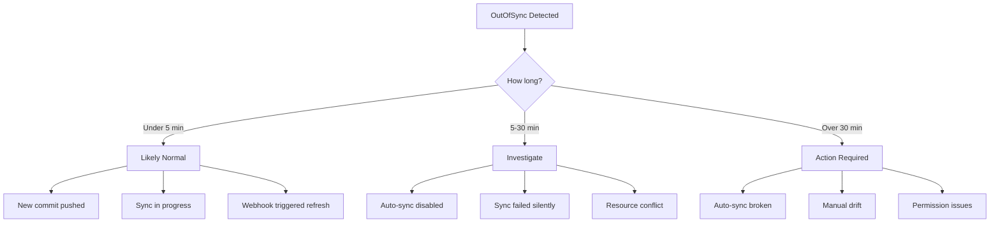

# How to Set Up Alerts for OutOfSync ArgoCD Applications

Author: [nawazdhandala](https://github.com/nawazdhandala)

Tags: ArgoCD, GitOps, Kubernetes, Prometheus, Alerting

Description: Learn how to set up Prometheus alerts for ArgoCD applications that remain OutOfSync, detect configuration drift, and distinguish between expected and unexpected OutOfSync states.

---

An OutOfSync application in ArgoCD means the live state in the cluster does not match the desired state in Git. This is sometimes expected - for example, right after pushing a change to Git but before the sync completes. Other times, it indicates a real problem: a manual change to the cluster, a failed auto-sync, or a misconfigured application that cannot reconcile.

The challenge with OutOfSync alerts is distinguishing between transient, expected drift and persistent, problematic drift. This guide covers how to build smart alerts that notify you when OutOfSync states matter.

## Understanding OutOfSync States

OutOfSync happens for several reasons, each requiring different alert strategies:



## The Key Metric

The `argocd_app_info` gauge metric includes a `sync_status` label:

```promql
# All OutOfSync applications
argocd_app_info{sync_status="OutOfSync"}

# Count of OutOfSync applications
count(argocd_app_info{sync_status="OutOfSync"}) or vector(0)
```

Since this is a gauge, the `for` duration in alerting rules acts as the timer for how long an application has been OutOfSync.

## Basic OutOfSync Alert

A simple alert that fires when any application stays OutOfSync:

```yaml
apiVersion: monitoring.coreos.com/v1
kind: PrometheusRule
metadata:
  name: argocd-outofsync-alerts
  namespace: monitoring
  labels:
    release: kube-prometheus-stack
spec:
  groups:
  - name: argocd-outofsync
    rules:
    - alert: ArgocdApplicationOutOfSync
      expr: argocd_app_info{sync_status="OutOfSync"} == 1
      for: 15m
      labels:
        severity: warning
      annotations:
        summary: "Application {{ $labels.name }} is OutOfSync"
        description: "Application {{ $labels.name }} in namespace {{ $labels.dest_namespace }} has been OutOfSync for more than 15 minutes."
```

The `for: 15m` clause is critical. It ensures the alert only fires after 15 minutes of continuous OutOfSync state, filtering out transient drift during normal deployments.

## Differentiated Alerts by Auto-Sync Status

Applications with auto-sync enabled should rarely stay OutOfSync. If they do, something is wrong. Applications without auto-sync might be intentionally OutOfSync, waiting for a manual approval.

```yaml
groups:
- name: argocd-outofsync-differentiated
  rules:
  # Auto-sync enabled but still OutOfSync - something is broken
  - alert: ArgocdAutoSyncOutOfSync
    expr: |
      argocd_app_info{
        sync_status="OutOfSync",
        autosync_enabled="true"
      } == 1
    for: 10m
    labels:
      severity: critical
    annotations:
      summary: "Auto-synced app {{ $labels.name }} stuck OutOfSync"
      description: "Application {{ $labels.name }} has auto-sync enabled but has been OutOfSync for 10+ minutes. Auto-sync may be failing silently."

  # Manual sync apps - longer grace period
  - alert: ArgocdManualSyncOutOfSync
    expr: |
      argocd_app_info{
        sync_status="OutOfSync",
        autosync_enabled="false"
      } == 1
    for: 4h
    labels:
      severity: warning
    annotations:
      summary: "Manual sync app {{ $labels.name }} has been OutOfSync for 4 hours"
      description: "Application {{ $labels.name }} requires manual sync and has been OutOfSync for more than 4 hours."
```

## Environment-Based Alert Thresholds

Production applications need tighter drift detection than development:

```yaml
groups:
- name: argocd-outofsync-by-env
  rules:
  # Production - alert quickly
  - alert: ArgocdProductionOutOfSync
    expr: |
      argocd_app_info{
        sync_status="OutOfSync",
        dest_namespace=~"production|prod|prod-.*"
      } == 1
    for: 10m
    labels:
      severity: critical
      environment: production
    annotations:
      summary: "Production app {{ $labels.name }} is OutOfSync"
      description: "Production application {{ $labels.name }} is OutOfSync. Live state does not match Git."

  # Staging - moderate threshold
  - alert: ArgocdStagingOutOfSync
    expr: |
      argocd_app_info{
        sync_status="OutOfSync",
        dest_namespace=~"staging|stage"
      } == 1
    for: 30m
    labels:
      severity: warning
      environment: staging
    annotations:
      summary: "Staging app {{ $labels.name }} is OutOfSync"

  # Development - relaxed threshold
  - alert: ArgocdDevOutOfSync
    expr: |
      argocd_app_info{
        sync_status="OutOfSync",
        dest_namespace=~"dev|development"
      } == 1
    for: 24h
    labels:
      severity: info
      environment: development
    annotations:
      summary: "Dev app {{ $labels.name }} has been OutOfSync for 24h"
```

## Fleet-Wide Drift Detection

Beyond individual application alerts, monitor the overall drift percentage:

```yaml
groups:
- name: argocd-fleet-drift
  rules:
  # Alert when too many apps are OutOfSync
  - alert: ArgocdFleetDriftHigh
    expr: |
      count(argocd_app_info{sync_status="OutOfSync"})
      / count(argocd_app_info) * 100 > 20
    for: 15m
    labels:
      severity: critical
    annotations:
      summary: "More than 20% of ArgoCD applications are OutOfSync"
      description: "{{ $value | printf \"%.1f\" }}% of applications are OutOfSync. This may indicate a systemic issue."

  # Track the count trend
  - alert: ArgocdOutOfSyncCountRising
    expr: |
      count(argocd_app_info{sync_status="OutOfSync"})
      > count(argocd_app_info{sync_status="OutOfSync"} offset 1h) * 1.5
    for: 30m
    labels:
      severity: warning
    annotations:
      summary: "OutOfSync application count is rising"
      description: "The number of OutOfSync applications has increased by 50% in the last hour."
```

## Identifying Root Causes of OutOfSync

When an OutOfSync alert fires, here is how to investigate:

```bash
# List all OutOfSync applications
argocd app list --sync-status OutOfSync

# Get details on a specific OutOfSync app
argocd app get my-app

# See what is different between live and desired state
argocd app diff my-app

# Check if the application has any active operation (stuck sync)
argocd app get my-app --show-operation
```

Common causes of persistent OutOfSync:

1. **Manual kubectl changes** - Someone modified resources directly instead of through Git
2. **Mutating webhooks** - Admission controllers inject fields that differ from Git manifests
3. **Operator-managed fields** - Controllers update resource fields that ArgoCD detects as drift
4. **Failed auto-sync** - Auto-sync keeps failing but ArgoCD does not count it as a sync failure
5. **Sync window blocking** - A deny sync window is preventing the sync

For cases 2, 3, and related field-level drift, configure ignoreDifferences in your application spec:

```yaml
spec:
  ignoreDifferences:
  - group: apps
    kind: Deployment
    jsonPointers:
    - /spec/replicas
  - group: ""
    kind: Service
    jqPathExpressions:
    - .metadata.annotations["cloud.google.com/neg-status"]
```

## Dashboard for OutOfSync Monitoring

Build a Grafana dashboard that provides context around OutOfSync states:

**Stat Panel - OutOfSync Count:**

```promql
count(argocd_app_info{sync_status="OutOfSync"}) or vector(0)
```

**Gauge Panel - Sync Percentage:**

```promql
count(argocd_app_info{sync_status="Synced"})
/ count(argocd_app_info) * 100
```

**Table Panel - OutOfSync Applications:**

```promql
argocd_app_info{sync_status="OutOfSync"}
```

Display columns: name, dest_namespace, project, health_status.

**Time Series - OutOfSync Count Over Time:**

```promql
count(argocd_app_info{sync_status="OutOfSync"}) or vector(0)
count(argocd_app_info{sync_status="Synced"})
```

## Recording Rules

Pre-compute OutOfSync metrics for faster dashboard loading:

```yaml
groups:
- name: argocd.outofsync.recording
  rules:
  - record: argocd:outofsync_count
    expr: count(argocd_app_info{sync_status="OutOfSync"}) or vector(0)

  - record: argocd:sync_percentage
    expr: |
      count(argocd_app_info{sync_status="Synced"})
      / count(argocd_app_info) * 100

  - record: argocd:outofsync_by_project
    expr: count(argocd_app_info{sync_status="OutOfSync"}) by (project) or vector(0)
```

OutOfSync alerts are about configuration drift detection. They complement sync failure alerts by catching a different class of problems - situations where the desired state and live state have diverged without an explicit sync failure. Together, these two alert categories cover the full spectrum of GitOps synchronization issues.
