# How to Create Allow Sync Windows for Maintenance Windows in ArgoCD

Author: [nawazdhandala](https://github.com/nawazdhandala)

Tags: ArgoCD, GitOps, Kubernetes, Sync Windows, Maintenance

Description: Learn how to use ArgoCD allow sync windows to restrict deployments to maintenance windows, ensuring production changes only happen during approved time periods.

---

Allow sync windows define when deployments can happen. Outside these windows, ArgoCD blocks both automated and manual syncs (unless you configure exceptions). This is the standard approach for production environments where changes should only occur during approved maintenance periods.

## How Allow Windows Work

When you define an allow window, ArgoCD only permits syncs during the window's active period. Outside that period, sync requests are rejected.

```mermaid
gantt
    title Allow Window Behavior
    dateFormat HH:mm
    axisFormat %H:%M

    section Timeline
    Sync BLOCKED    :crit, 00:00, 2h
    Allow Window (Sync OK) :active, 02:00, 4h
    Sync BLOCKED    :crit, 06:00, 18h
```



If no allow windows are defined, ArgoCD allows syncs at any time. The moment you add an allow window, syncs are only permitted during that window.

## Basic Maintenance Window

A typical maintenance window runs in the early morning hours when traffic is low.

```yaml
apiVersion: argoproj.io/v1alpha1
kind: AppProject
metadata:
  name: production
  namespace: argocd
spec:
  description: Production project with maintenance window
  sourceRepos:
    - 'https://github.com/myorg/*'
  destinations:
    - namespace: production
      server: https://kubernetes.default.svc
  syncWindows:
    - kind: allow
      schedule: '0 2 * * *'
      duration: 4h
      applications:
        - '*'
      manualSync: true
      timeZone: 'America/New_York'
```

This window allows syncs between 2:00 AM and 6:00 AM Eastern Time every day. The `manualSync: true` setting lets operators trigger syncs manually at any time, bypassing the window for emergencies.

## Weekly Maintenance Window

Some organizations prefer a single weekly maintenance window.

```yaml
syncWindows:
  # Tuesday night maintenance window
  - kind: allow
    schedule: '0 23 * * 2'
    duration: 6h
    applications:
      - '*'
    manualSync: true
    timeZone: 'America/Chicago'
```

This creates a maintenance window every Tuesday from 11:00 PM to 5:00 AM Central Time. Deployments are blocked for the rest of the week unless triggered manually.

## Multiple Maintenance Windows

You can define multiple allow windows. A sync is permitted if any allow window is currently active.

```yaml
syncWindows:
  # Weekday morning window (2-5 AM)
  - kind: allow
    schedule: '0 2 * * 1-5'
    duration: 3h
    applications:
      - '*'
    manualSync: true
    timeZone: 'UTC'

  # Weekend afternoon window (2-6 PM Saturday)
  - kind: allow
    schedule: '0 14 * * 6'
    duration: 4h
    applications:
      - '*'
    manualSync: true
    timeZone: 'UTC'
```

This gives your team two deployment opportunities: weekday mornings and Saturday afternoons. The Saturday window is useful for larger changes that need more monitoring.

## Application-Specific Maintenance Windows

Different applications might need different maintenance schedules. Critical payment processing might have a narrower window than internal tools.

```yaml
syncWindows:
  # Narrow window for payment services (2-4 AM, off-peak only)
  - kind: allow
    schedule: '0 2 * * 2,4'
    duration: 2h
    applications:
      - 'payment-*'
    manualSync: true
    timeZone: 'UTC'

  # Broader window for internal tools (10 PM - 6 AM daily)
  - kind: allow
    schedule: '0 22 * * *'
    duration: 8h
    applications:
      - 'internal-*'
    manualSync: true
    timeZone: 'UTC'

  # Relaxed window for staging (always allowed)
  - kind: allow
    schedule: '0 0 * * *'
    duration: 24h
    applications:
      - 'staging-*'
    manualSync: true
    timeZone: 'UTC'
```

Payment services can only sync during a 2-hour window twice a week. Internal tools get a nightly 8-hour window. Staging applications have a 24-hour window, which effectively means they can always sync.

## Maintenance Windows Aligned with Change Advisory Board

In regulated environments, you might align maintenance windows with your Change Advisory Board (CAB) schedule. Changes are approved at the CAB meeting and deployed during the following maintenance window.

```yaml
syncWindows:
  # CAB meets Wednesday afternoon, deployment window Wednesday night
  - kind: allow
    schedule: '0 22 * * 3'
    duration: 8h
    applications:
      - '*'
    manualSync: false  # Even manual syncs must wait for the window
    timeZone: 'America/New_York'
```

Setting `manualSync: false` is important here. It means nobody can bypass the window, even for manual syncs. This enforces the CAB process.

## Maintenance Windows for Multi-Region Deployments

When your application runs across multiple regions, stagger the maintenance windows so you are not deploying everywhere simultaneously.

```yaml
syncWindows:
  # US region: 2-4 AM Eastern
  - kind: allow
    schedule: '0 2 * * *'
    duration: 2h
    applications:
      - '*'
    clusters:
      - 'https://us-east-cluster.example.com'
    manualSync: true
    timeZone: 'America/New_York'

  # EU region: 2-4 AM London (different actual time)
  - kind: allow
    schedule: '0 2 * * *'
    duration: 2h
    applications:
      - '*'
    clusters:
      - 'https://eu-west-cluster.example.com'
    manualSync: true
    timeZone: 'Europe/London'

  # APAC region: 2-4 AM Tokyo
  - kind: allow
    schedule: '0 2 * * *'
    duration: 2h
    applications:
      - '*'
    clusters:
      - 'https://ap-northeast-cluster.example.com'
    manualSync: true
    timeZone: 'Asia/Tokyo'
```

Each region deploys at 2 AM local time, giving you sequential deployment windows to monitor each region before the next one starts.

## Combining Allow Windows with Deny Windows

You can layer deny windows on top of allow windows for finer control. Remember that deny always takes precedence over allow.

```yaml
syncWindows:
  # Allow: Daily 10 PM to 6 AM
  - kind: allow
    schedule: '0 22 * * *'
    duration: 8h
    applications:
      - '*'
    manualSync: true
    timeZone: 'UTC'

  # Deny: Block during incident freeze periods (e.g., quarter-end)
  - kind: deny
    schedule: '0 0 28 3,6,9,12 *'
    duration: 96h
    applications:
      - '*'
    manualSync: false
    timeZone: 'UTC'
```

The allow window permits nightly deployments, but the deny window blocks everything during the last 4 days of each quarter, a common freeze period for financial applications.

## Verifying Your Maintenance Windows

After configuring maintenance windows, verify they work as expected.

```bash
# List all windows for the project
argocd proj windows list production

# Check if sync is currently allowed
argocd app get my-app

# The UI also shows window status
# Look for "Sync Window" messages in the application status
```

Test your windows by attempting a sync outside the maintenance window.

```bash
# This should fail if outside the allow window
argocd app sync my-app

# Expected output:
# FATA[0000] rpc error: code = PermissionDenied desc = cannot sync: blocked by sync window
```

## Handling Timezone Considerations

Without the `timeZone` field, ArgoCD uses UTC. This can cause confusion when your team thinks in local time.

If you are on ArgoCD 2.6 or earlier without timezone support, convert your desired local time to UTC.

```yaml
# Want 2 AM Eastern (UTC-5) = 7 AM UTC
syncWindows:
  - kind: allow
    schedule: '0 7 * * *'
    duration: 4h
    applications:
      - '*'
```

Be aware that this does not account for daylight saving time. When clocks change, your 2 AM window shifts to 3 AM or 1 AM local time. Upgrade to ArgoCD 2.7+ for proper timezone support.

For creating deny windows, see the [deny sync windows guide](https://oneuptime.com/blog/post/2026-02-26-argocd-deny-sync-windows/view). For overriding windows during emergencies, check the [sync window override guide](https://oneuptime.com/blog/post/2026-02-26-argocd-override-sync-windows-emergency/view).
