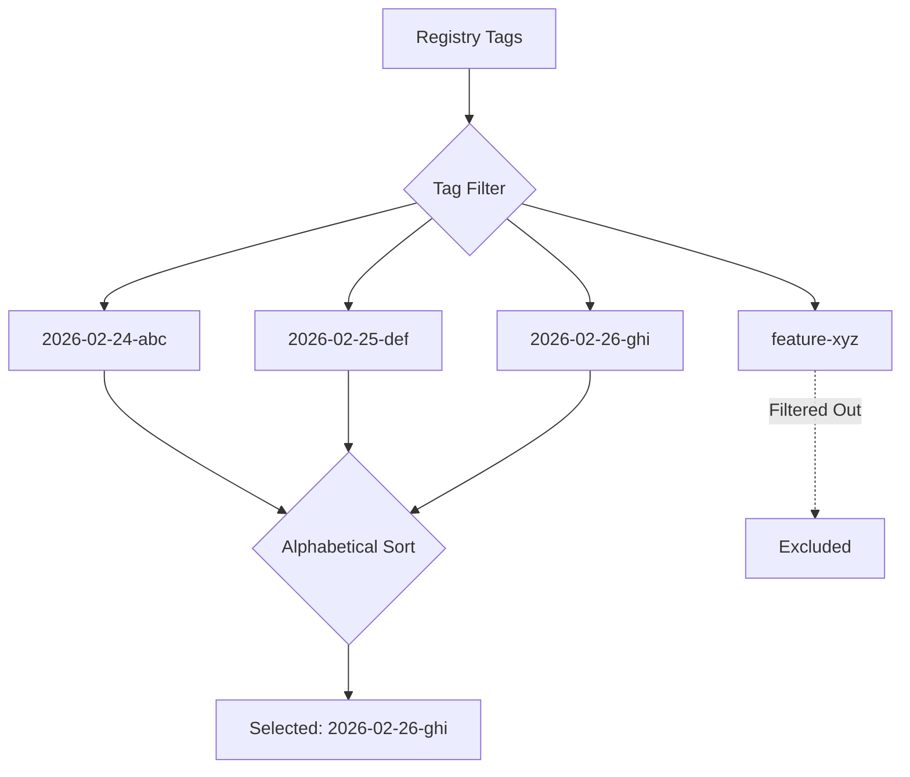

# How to Use Alphabetical Strategy for Image Updates

Author: [nawazdhandala](https://github.com/nawazdhandala)

Tags: ArgoCD, GitOps, Kubernetes, Image Updater, Container Image

Description: Learn how to use the alphabetical update strategy in ArgoCD Image Updater to select container images based on lexicographic sorting of tag names for date-based and sequential tagging schemes.

---

The alphabetical strategy in ArgoCD Image Updater selects images by sorting tag names lexicographically (alphabetically). This strategy works well with tagging schemes where newer images have alphabetically "higher" tags, such as date-based tags (2026-02-26), timestamp tags (20260226-153045), or zero-padded build numbers (build-0042).

## How the Alphabetical Strategy Works

The strategy sorts all filtered tags as strings in alphabetical order and picks the last one (the "highest" alphabetically). This relies on your tags being designed so that newer tags sort after older ones.



## Basic Configuration

```yaml
apiVersion: argoproj.io/v1alpha1
kind: Application
metadata:
  name: myapp
  namespace: argocd
  annotations:
    argocd-image-updater.argoproj.io/image-list: myapp=myregistry.com/myapp
    argocd-image-updater.argoproj.io/myapp.update-strategy: alphabetical
    # Filter to tags with a predictable format
    argocd-image-updater.argoproj.io/myapp.allow-tags: "regexp:^[0-9]{4}-[0-9]{2}-[0-9]{2}"
spec:
  project: default
  source:
    repoURL: https://github.com/my-org/k8s-manifests.git
    targetRevision: main
    path: apps/myapp
  destination:
    server: https://kubernetes.default.svc
    namespace: production
  syncPolicy:
    automated:
      prune: true
      selfHeal: true
```

## Tag Formats That Work with Alphabetical

The alphabetical strategy requires tags that sort correctly as strings. Here are tagging patterns that work:

### Date-Based Tags (YYYY-MM-DD)

This is the most natural fit. ISO 8601 dates sort correctly alphabetically.

```bash
# CI pipeline tag format
TAG="$(date +%Y-%m-%d)-${GIT_SHA::7}"
# Produces: 2026-02-26-abc1234
```

```yaml
annotations:
  argocd-image-updater.argoproj.io/myapp.update-strategy: alphabetical
  argocd-image-updater.argoproj.io/myapp.allow-tags: "regexp:^[0-9]{4}-[0-9]{2}-[0-9]{2}-[a-f0-9]{7}$"
```

### Timestamp Tags (YYYYMMDDHHmmss)

Even more precise than dates:

```bash
TAG="$(date +%Y%m%d%H%M%S)-${GIT_SHA::7}"
# Produces: 20260226153045-abc1234
```

```yaml
annotations:
  argocd-image-updater.argoproj.io/myapp.update-strategy: alphabetical
  argocd-image-updater.argoproj.io/myapp.allow-tags: "regexp:^[0-9]{14}-[a-f0-9]{7}$"
```

### Zero-Padded Build Numbers

Build numbers work if they are zero-padded to a fixed width:

```bash
# Zero-pad to 6 digits
TAG="build-$(printf '%06d' $BUILD_NUMBER)"
# Produces: build-000042, build-000043, etc.
```

```yaml
annotations:
  argocd-image-updater.argoproj.io/myapp.update-strategy: alphabetical
  argocd-image-updater.argoproj.io/myapp.allow-tags: "regexp:^build-[0-9]{6}$"
```

### Tag Formats That Do NOT Work

Be careful with these formats:

```
# BAD: Non-padded numbers sort incorrectly
build-9       # Sorts AFTER build-10 alphabetically!
build-10
build-100

# BAD: Non-ISO date formats
02-26-2026    # Month-first does not sort by date
26/02/2026    # Slashes cause issues

# BAD: Mixed formats
v1, v2, v10   # v10 sorts between v1 and v2
```

## Sorting Direction

By default, alphabetical sorts in ascending order and picks the last (highest) value. You can reverse this:

```yaml
annotations:
  argocd-image-updater.argoproj.io/myapp.update-strategy: alphabetical
  # Sort descending - pick the first (lowest) value
  argocd-image-updater.argoproj.io/myapp.sort-mode: desc
```

In practice, ascending order (the default) is almost always what you want, since newer tags should sort higher.

## Combining with Tag Filters

Tag filters are essential to prevent the alphabetical strategy from selecting unrelated tags:

```yaml
annotations:
  argocd-image-updater.argoproj.io/myapp.update-strategy: alphabetical
  # Only consider production-tagged images
  argocd-image-updater.argoproj.io/myapp.allow-tags: "regexp:^prod-[0-9]{4}-[0-9]{2}-[0-9]{2}"
  # Ignore any debug builds
  argocd-image-updater.argoproj.io/myapp.ignore-tags: "regexp:-debug$"
```

Without filters, a tag like `zzz-test` would sort after `2026-02-26` and get selected.

## Per-Environment Configuration

### Development - Latest Date Tag

```yaml
# dev-app.yaml
annotations:
  argocd-image-updater.argoproj.io/image-list: myapp=myregistry.com/myapp
  argocd-image-updater.argoproj.io/myapp.update-strategy: alphabetical
  argocd-image-updater.argoproj.io/myapp.allow-tags: "regexp:^dev-[0-9]{8}-[a-f0-9]{7}$"
```

### Staging - Release Candidate Tags

```yaml
# staging-app.yaml
annotations:
  argocd-image-updater.argoproj.io/image-list: myapp=myregistry.com/myapp
  argocd-image-updater.argoproj.io/myapp.update-strategy: alphabetical
  argocd-image-updater.argoproj.io/myapp.allow-tags: "regexp:^rc-[0-9]{4}-[0-9]{2}-[0-9]{2}"
```

### Production - Approved Release Tags

```yaml
# production-app.yaml
annotations:
  argocd-image-updater.argoproj.io/image-list: myapp=myregistry.com/myapp
  argocd-image-updater.argoproj.io/myapp.update-strategy: alphabetical
  argocd-image-updater.argoproj.io/myapp.allow-tags: "regexp:^release-[0-9]{4}-[0-9]{2}-[0-9]{2}"
```

## Write-Back Configuration

### Kustomize

```yaml
annotations:
  argocd-image-updater.argoproj.io/write-back-method: git
  argocd-image-updater.argoproj.io/write-back-target: kustomization
  argocd-image-updater.argoproj.io/git-branch: main
```

### Helm Values

```yaml
annotations:
  argocd-image-updater.argoproj.io/write-back-method: git
  argocd-image-updater.argoproj.io/write-back-target: "helmvalues:values.yaml"
  argocd-image-updater.argoproj.io/myapp.helm.image-name: image.repository
  argocd-image-updater.argoproj.io/myapp.helm.image-tag: image.tag
```

## Alphabetical vs Other Strategies

| Feature | Alphabetical | Latest | Semver |
|---------|-------------|--------|--------|
| Selection criteria | Tag name sort | Push timestamp | Version comparison |
| Requires specific format | Yes (sortable) | No | Yes (semver) |
| Works with dates | Excellent | Good | No |
| Works with build numbers | If zero-padded | Yes | No |
| Works with semver tags | Poorly | Yes | Excellent |
| Deterministic | Yes (same tags always same result) | No (depends on timestamps) | Yes |

The key advantage of alphabetical over latest is determinism. With the latest strategy, the selection depends on image push timestamps, which can be unreliable if images are rebuilt or mirrored. The alphabetical strategy only cares about tag names, making it more predictable.

## Complete Working Example

Here is a full setup for a production application using date-based tags:

```yaml
apiVersion: argoproj.io/v1alpha1
kind: Application
metadata:
  name: webapp-production
  namespace: argocd
  annotations:
    argocd-image-updater.argoproj.io/image-list: webapp=myregistry.com/webapp
    argocd-image-updater.argoproj.io/webapp.update-strategy: alphabetical
    argocd-image-updater.argoproj.io/webapp.allow-tags: "regexp:^release-[0-9]{4}-[0-9]{2}-[0-9]{2}-[a-f0-9]{7}$"
    argocd-image-updater.argoproj.io/write-back-method: git
    argocd-image-updater.argoproj.io/git-branch: main
    argocd-image-updater.argoproj.io/write-back-target: kustomization
spec:
  project: default
  source:
    repoURL: https://github.com/my-org/k8s-manifests.git
    targetRevision: main
    path: overlays/production
  destination:
    server: https://kubernetes.default.svc
    namespace: production
  syncPolicy:
    automated:
      prune: true
      selfHeal: true
```

CI pipeline produces tags like:
- `release-2026-02-24-abc1234`
- `release-2026-02-25-def5678`
- `release-2026-02-26-ghi9012`

Image Updater picks `release-2026-02-26-ghi9012` because it sorts last alphabetically.

## Troubleshooting

**Wrong tag selected** - The most common issue is tags that do not sort correctly. Check your tag format:

```bash
# List tags and sort them to see what Image Updater sees
crane ls myregistry.com/myapp | sort
```

If the sorted order does not match your expectation, adjust your tag format.

**Non-padded numbers causing issues** - If you see `build-9` selected over `build-10`, your build numbers need zero-padding. Switch to `build-0009`, `build-0010`.

**Unrelated tags being selected** - Tighten your `allow-tags` regex. A tag like `z-test` sorts after most date-based tags.

**No updates detected** - Verify that your allow-tags regex actually matches the tags in the registry:

```bash
# Check Image Updater logs
kubectl logs -n argocd deployment/argocd-image-updater --tail=100
```

For monitoring your image updates, set up [ArgoCD notifications](https://oneuptime.com/blog/post/2026-01-25-notifications-argocd/view) to track when new images are deployed.

The alphabetical strategy is the best choice when your CI pipeline produces date-based or timestamp-based tags. It provides deterministic, predictable image selection without depending on registry metadata like push timestamps.
