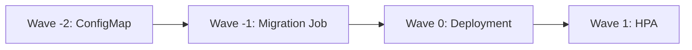

# How to Use ArgoCD Annotations for Fine-Grained Control

Author: [nawazdhandala](https://github.com/nawazdhandala)

Tags: ArgoCD, GitOps, Kubernetes, Annotations, Configuration

Description: Learn how to use ArgoCD annotations to control sync behavior, hook execution, resource tracking, diff customization, and notification subscriptions at the resource level.

---

ArgoCD annotations give you resource-level control over how individual Kubernetes resources are managed. While Application-level settings apply to all resources in an application, annotations let you customize behavior for specific Deployments, Services, ConfigMaps, or any other resource.

This is the mechanism that powers sync waves, hooks, delete policies, and sync options at the individual resource level. Understanding the full set of available annotations transforms how precisely you can control your GitOps workflow.

## Overview of ArgoCD annotations

ArgoCD recognizes several annotation namespaces:

```yaml
metadata:
  annotations:
    # Sync behavior control
    argocd.argoproj.io/sync-wave: "0"
    argocd.argoproj.io/sync-options: Prune=false
    argocd.argoproj.io/hook: PreSync
    argocd.argoproj.io/hook-delete-policy: HookSucceeded

    # Comparison and tracking
    argocd.argoproj.io/compare-options: IgnoreExtraneous
    argocd.argoproj.io/tracking-id: my-app:apps/Deployment:default/nginx

    # Notification subscriptions
    notifications.argoproj.io/subscribe.on-sync-succeeded.slack: my-channel

    # Image updater
    argocd-image-updater.argoproj.io/image-list: app=myorg/myimage
```

## Sync wave annotations

Control the order resources are applied during sync:

```yaml
# Database ConfigMap - deployed first
apiVersion: v1
kind: ConfigMap
metadata:
  name: db-config
  annotations:
    argocd.argoproj.io/sync-wave: "-2"
data:
  DATABASE_URL: "postgres://db:5432/myapp"

---
# Database migration Job - runs after config
apiVersion: batch/v1
kind: Job
metadata:
  name: db-migrate
  annotations:
    argocd.argoproj.io/sync-wave: "-1"
    argocd.argoproj.io/hook: PreSync
    argocd.argoproj.io/hook-delete-policy: BeforeHookCreation
spec:
  template:
    spec:
      containers:
        - name: migrate
          image: myorg/migrate:latest
          command: ["./migrate", "up"]
      restartPolicy: Never

---
# Application Deployment - deployed after migrations
apiVersion: apps/v1
kind: Deployment
metadata:
  name: web-app
  annotations:
    argocd.argoproj.io/sync-wave: "0"
spec:
  replicas: 3
  template:
    spec:
      containers:
        - name: app
          image: myorg/web-app:v1.2.3

---
# HPA - deployed after the Deployment exists
apiVersion: autoscaling/v2
kind: HorizontalPodAutoscaler
metadata:
  name: web-app-hpa
  annotations:
    argocd.argoproj.io/sync-wave: "1"
spec:
  scaleTargetRef:
    apiVersion: apps/v1
    kind: Deployment
    name: web-app
  minReplicas: 3
  maxReplicas: 10
```

Sync waves are processed in numerical order. Resources in the same wave are applied together. ArgoCD waits for all resources in a wave to be healthy before proceeding to the next wave.



## Sync options annotations

Control sync behavior at the resource level:

```yaml
# Prevent this specific resource from being pruned
apiVersion: v1
kind: PersistentVolumeClaim
metadata:
  name: data-volume
  annotations:
    argocd.argoproj.io/sync-options: Prune=false,Delete=false
spec:
  accessModes: ["ReadWriteOnce"]
  resources:
    requests:
      storage: 50Gi

---
# Force server-side apply for this resource
apiVersion: apps/v1
kind: Deployment
metadata:
  name: complex-deployment
  annotations:
    argocd.argoproj.io/sync-options: ServerSideApply=true
spec:
  replicas: 3
  template:
    spec:
      containers:
        - name: app
          image: myorg/app:latest

---
# Skip validation for this resource
apiVersion: v1
kind: ConfigMap
metadata:
  name: generated-config
  annotations:
    argocd.argoproj.io/sync-options: Validate=false

---
# Use Replace instead of Apply for immutable resources
apiVersion: batch/v1
kind: Job
metadata:
  name: one-time-setup
  annotations:
    argocd.argoproj.io/sync-options: Replace=true
```

You can combine multiple sync options:

```yaml
annotations:
  argocd.argoproj.io/sync-options: Prune=false,ServerSideApply=true,Validate=false
```

## Hook annotations

Define resources as sync hooks that run at specific phases:

```yaml
# PreSync hook - runs before main sync
apiVersion: batch/v1
kind: Job
metadata:
  name: pre-deploy-check
  annotations:
    argocd.argoproj.io/hook: PreSync
    argocd.argoproj.io/hook-delete-policy: BeforeHookCreation
spec:
  template:
    spec:
      containers:
        - name: check
          image: myorg/pre-check:latest
          command: ["./check-prerequisites.sh"]
      restartPolicy: Never

---
# PostSync hook - runs after successful sync
apiVersion: batch/v1
kind: Job
metadata:
  name: post-deploy-test
  annotations:
    argocd.argoproj.io/hook: PostSync
    argocd.argoproj.io/hook-delete-policy: HookSucceeded
spec:
  template:
    spec:
      containers:
        - name: test
          image: myorg/smoke-test:latest
          command: ["./run-tests.sh"]
      restartPolicy: Never

---
# SyncFail hook - runs when sync fails
apiVersion: batch/v1
kind: Job
metadata:
  name: sync-failure-notification
  annotations:
    argocd.argoproj.io/hook: SyncFail
    argocd.argoproj.io/hook-delete-policy: HookSucceeded
spec:
  template:
    spec:
      containers:
        - name: notify
          image: myorg/notify:latest
          command: ["./notify-failure.sh"]
      restartPolicy: Never
```

Hook phases: `PreSync`, `Sync`, `PostSync`, `SyncFail`, `Skip`

## Hook delete policy annotations

Control when hook resources are cleaned up:

```yaml
# Delete before creating a new instance (default for most hooks)
annotations:
  argocd.argoproj.io/hook-delete-policy: BeforeHookCreation

# Delete after the hook succeeds
annotations:
  argocd.argoproj.io/hook-delete-policy: HookSucceeded

# Delete after the hook fails
annotations:
  argocd.argoproj.io/hook-delete-policy: HookFailed

# Combine policies
annotations:
  argocd.argoproj.io/hook-delete-policy: HookSucceeded,BeforeHookCreation
```

When to use each:

| Policy | Use case |
|--------|----------|
| BeforeHookCreation | Most hooks - ensures clean state before re-running |
| HookSucceeded | Cleanup after success, keep failures for debugging |
| HookFailed | Cleanup failed hooks, keep successful ones for audit |

## Compare options annotations

Control how ArgoCD compares resources for drift detection:

```yaml
# Ignore this resource during comparison (treat as extra)
apiVersion: v1
kind: ConfigMap
metadata:
  name: operator-managed-config
  annotations:
    argocd.argoproj.io/compare-options: IgnoreExtraneous

# This resource will never show as OutOfSync
# even if it is modified outside of Git
```

`IgnoreExtraneous` is useful for resources created by operators or controllers that ArgoCD should not manage but should not flag as orphaned either.

## Managed-by annotation

Explicitly declare which ArgoCD application manages a resource:

```yaml
apiVersion: apps/v1
kind: Deployment
metadata:
  name: shared-service
  annotations:
    argocd.argoproj.io/managed-by: argocd/my-app
```

This is useful when resources are shared or when you need to transfer ownership between applications.

## Notification annotations

Subscribe individual applications to notification channels:

```yaml
apiVersion: argoproj.io/v1alpha1
kind: Application
metadata:
  name: prod-web-app
  annotations:
    # Slack notifications
    notifications.argoproj.io/subscribe.on-sync-succeeded.slack: deploy-notifications
    notifications.argoproj.io/subscribe.on-sync-failed.slack: deploy-alerts
    notifications.argoproj.io/subscribe.on-health-degraded.slack: ops-alerts

    # Email notifications
    notifications.argoproj.io/subscribe.on-sync-failed.email: oncall@myorg.com

    # Webhook notifications
    notifications.argoproj.io/subscribe.on-sync-succeeded.webhook: https://hooks.myorg.com/deploy
```

## Image updater annotations

Control automated image updates:

```yaml
apiVersion: argoproj.io/v1alpha1
kind: Application
metadata:
  name: staging-web-app
  annotations:
    # Define images to watch
    argocd-image-updater.argoproj.io/image-list: app=myorg/web-app,sidecar=myorg/proxy

    # Update strategy per image
    argocd-image-updater.argoproj.io/app.update-strategy: semver
    argocd-image-updater.argoproj.io/app.semver-constraint: ">=1.0.0 <2.0.0"

    argocd-image-updater.argoproj.io/sidecar.update-strategy: latest
    argocd-image-updater.argoproj.io/sidecar.allow-tags: "regexp:^v[0-9]+$"

    # Write-back method
    argocd-image-updater.argoproj.io/write-back-method: git
    argocd-image-updater.argoproj.io/git-branch: main
```

## Combining annotations for complex workflows

Here is a real-world example combining multiple annotations for a database deployment:

```yaml
# Step 1: Ensure namespace exists
apiVersion: v1
kind: Namespace
metadata:
  name: database
  annotations:
    argocd.argoproj.io/sync-wave: "-5"
    argocd.argoproj.io/sync-options: Prune=false

---
# Step 2: Database secrets (never prune)
apiVersion: v1
kind: Secret
metadata:
  name: db-credentials
  namespace: database
  annotations:
    argocd.argoproj.io/sync-wave: "-4"
    argocd.argoproj.io/sync-options: Prune=false,Delete=false
    argocd.argoproj.io/compare-options: IgnoreExtraneous

---
# Step 3: PVC (never prune, never delete)
apiVersion: v1
kind: PersistentVolumeClaim
metadata:
  name: postgres-data
  namespace: database
  annotations:
    argocd.argoproj.io/sync-wave: "-3"
    argocd.argoproj.io/sync-options: Prune=false,Delete=false

---
# Step 4: StatefulSet
apiVersion: apps/v1
kind: StatefulSet
metadata:
  name: postgres
  namespace: database
  annotations:
    argocd.argoproj.io/sync-wave: "0"
    argocd.argoproj.io/sync-options: ServerSideApply=true

---
# Step 5: Run migrations after database is up
apiVersion: batch/v1
kind: Job
metadata:
  name: db-migrate
  namespace: database
  annotations:
    argocd.argoproj.io/sync-wave: "1"
    argocd.argoproj.io/hook: Sync
    argocd.argoproj.io/hook-delete-policy: BeforeHookCreation

---
# Step 6: Smoke test
apiVersion: batch/v1
kind: Job
metadata:
  name: db-health-check
  namespace: database
  annotations:
    argocd.argoproj.io/hook: PostSync
    argocd.argoproj.io/hook-delete-policy: HookSucceeded
```

## Best practices for annotation usage

1. **Be consistent** - Use the same annotation patterns across all applications
2. **Document your wave numbering scheme** - Create a team convention (e.g., -5 to -1 for infrastructure, 0 for main resources, 1+ for post-deploy)
3. **Do not over-annotate** - Only add annotations when you need to override default behavior
4. **Use sync options sparingly** - Every `Prune=false` is a resource that might become orphaned
5. **Test hook delete policies** - Wrong policies lead to accumulating old Job resources

For detailed guides on individual annotations, see the posts on [sync-wave annotation](https://oneuptime.com/blog/post/2026-02-26-argocd-sync-wave-annotation/view), [hook annotation](https://oneuptime.com/blog/post/2026-02-26-argocd-hook-annotation/view), [hook-delete-policy annotation](https://oneuptime.com/blog/post/2026-02-26-argocd-hook-delete-policy-annotation/view), and [sync-options annotation](https://oneuptime.com/blog/post/2026-02-26-argocd-sync-options-annotation/view).

## Summary

ArgoCD annotations provide resource-level control over sync order (sync-wave), sync behavior (sync-options), lifecycle hooks (hook and hook-delete-policy), comparison behavior (compare-options), notifications, and image updates. Use them to build precise deployment workflows, protect critical resources from accidental deletion, run pre and post-deployment tasks, and customize how ArgoCD manages individual resources within your applications.
