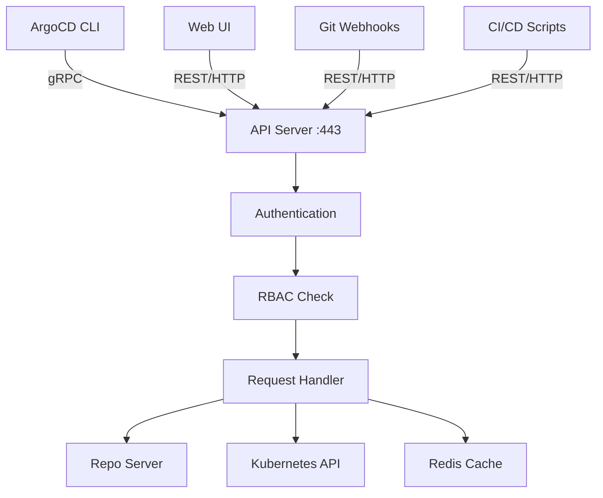
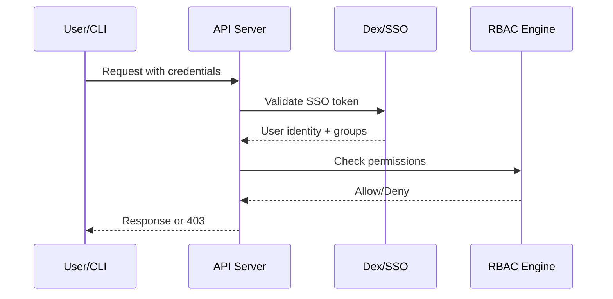

# How the ArgoCD API Server Handles Requests

Author: [nawazdhandala](https://github.com/nawazdhandala)

Tags: ArgoCD, GitOps, Kubernetes, API

Description: A detailed look at the ArgoCD API Server covering its gRPC and REST interfaces, authentication flow, RBAC enforcement, and how it coordinates with other components.

---

The ArgoCD API Server is the component that sits between users and the rest of ArgoCD. Whether you click a button in the web UI, run an `argocd` CLI command, or call the API from a script, your request goes through the API Server first. Understanding how it works helps you configure access control, debug authentication issues, and integrate ArgoCD with other tools.

## What the API Server Does

The API Server has five primary responsibilities:

1. **Serving the web UI** - it hosts the ArgoCD dashboard as a single-page application
2. **Handling gRPC requests** - the ArgoCD CLI communicates over gRPC
3. **Handling REST requests** - the web UI and external integrations use REST/HTTP
4. **Authentication and authorization** - validating tokens and enforcing RBAC policies
5. **Coordinating operations** - delegating work to the Repo Server and Application Controller

## gRPC and REST Interfaces

The API Server exposes two API protocols on the same port (443 by default):



The gRPC API is the primary interface. The REST API is automatically generated from the gRPC definitions using grpc-gateway, so both APIs have the same capabilities.

You can explore the REST API directly:

```bash
# Get an auth token
ARGOCD_TOKEN=$(argocd account generate-token)

# List applications via REST API
curl -k https://argocd.example.com/api/v1/applications \
  -H "Authorization: Bearer $ARGOCD_TOKEN"

# Get a specific application
curl -k https://argocd.example.com/api/v1/applications/my-app \
  -H "Authorization: Bearer $ARGOCD_TOKEN"

# Trigger a sync via REST API
curl -k -X POST https://argocd.example.com/api/v1/applications/my-app/sync \
  -H "Authorization: Bearer $ARGOCD_TOKEN" \
  -H "Content-Type: application/json" \
  -d '{}'
```

## Authentication Flow

When a request arrives, the API Server first authenticates the caller. ArgoCD supports several authentication methods:

**Local accounts** - username and password stored in ArgoCD's ConfigMap. Suitable for admin accounts and CI/CD service accounts.

```bash
# Login with local account
argocd login argocd.example.com --username admin --password <password>

# The CLI stores a JWT token locally after login
cat ~/.argocd/config
```

**SSO/OIDC** - integration with identity providers like Okta, Azure AD, Google, or Keycloak. Users authenticate through the identity provider and receive a JWT token.

**Dex** - ArgoCD's built-in identity broker. Dex connects to upstream identity providers (LDAP, SAML, GitHub, GitLab) and issues JWT tokens that ArgoCD understands. For details, see [how the ArgoCD Dex server handles authentication](https://oneuptime.com/blog/post/2026-02-26-argocd-dex-server-authentication/view).

The authentication flow works like this:

1. The user presents credentials (password, SSO token, or API token)
2. The API Server validates the credentials against the configured auth method
3. If valid, a JWT token is issued (or the existing JWT is validated)
4. The JWT contains the username and group memberships
5. This information is used for RBAC decisions



## RBAC Enforcement

After authentication, every request goes through RBAC checking. ArgoCD uses a Casbin-based policy engine with a CSV-formatted policy definition.

The policy is stored in the `argocd-rbac-cm` ConfigMap:

```yaml
apiVersion: v1
kind: ConfigMap
metadata:
  name: argocd-rbac-cm
  namespace: argocd
data:
  policy.default: role:readonly
  policy.csv: |
    # Grant the 'dev-team' group access to sync applications in the 'dev' project
    p, role:dev-deployer, applications, sync, dev/*, allow
    p, role:dev-deployer, applications, get, dev/*, allow

    # Map SSO group to ArgoCD role
    g, dev-team, role:dev-deployer

    # Admin role for the platform team
    p, role:platform-admin, applications, *, */*, allow
    p, role:platform-admin, clusters, *, *, allow
    g, platform-team, role:platform-admin
```

The RBAC check happens on every API call. The API Server extracts the username and groups from the JWT token, then evaluates the policy to determine if the requested action is allowed.

For a complete guide to RBAC configuration, see [how to configure RBAC policies in ArgoCD](https://oneuptime.com/blog/post/2026-01-25-rbac-policies-argocd/view).

## Webhook Handling

The API Server processes incoming webhooks from Git providers. When you push a commit to a repository that ArgoCD tracks, the Git provider sends a webhook notification. The API Server receives it, identifies which Applications track that repository, and triggers a refresh for those Applications.

```bash
# GitHub webhook configuration
# URL: https://argocd.example.com/api/webhook
# Content type: application/json
# Events: Push events

# You can configure a webhook secret in the argocd-secret
kubectl edit secret argocd-secret -n argocd
# Add: webhook.github.secret: <your-secret>
```

Webhook processing is much faster than polling. Instead of waiting up to 3 minutes for the next poll cycle, the Application Controller is notified immediately.

Supported webhook providers include GitHub, GitLab, Bitbucket, Bitbucket Server, and Gogs.

## Request Lifecycle

Let us trace a complete request - what happens when you run `argocd app sync my-app`:

1. **CLI sends gRPC request** - the CLI serializes the sync request and sends it to the API Server over gRPC with the JWT token in the metadata.

2. **Authentication** - the API Server validates the JWT token. If it is expired or invalid, a 401 error is returned.

3. **RBAC check** - the API Server evaluates whether the authenticated user has permission to sync the specified application. If not, a 403 error is returned.

4. **Application lookup** - the API Server reads the Application custom resource from the Kubernetes API to get its current state and configuration.

5. **Sync operation creation** - the API Server creates a sync operation on the Application resource by updating its `spec.operation` field.

6. **Controller pickup** - the Application Controller detects the operation and starts executing the sync (this happens asynchronously).

7. **Response** - the API Server returns the updated Application state to the CLI, including the pending operation.

```bash
# You can see the operation on the Application resource
kubectl get application my-app -n argocd -o jsonpath='{.status.operationState}'
```

## High Availability

The API Server is stateless and can be scaled horizontally:

```yaml
apiVersion: apps/v1
kind: Deployment
metadata:
  name: argocd-server
  namespace: argocd
spec:
  replicas: 3
  template:
    spec:
      containers:
      - name: argocd-server
        resources:
          requests:
            cpu: 250m
            memory: 256Mi
          limits:
            cpu: "1"
            memory: 512Mi
```

Place a load balancer or ingress in front of multiple API Server replicas. Since the server is stateless (session data is in JWT tokens, and state is in Kubernetes and Redis), requests can go to any replica.

```yaml
# Example Ingress for the API Server
apiVersion: networking.k8s.io/v1
kind: Ingress
metadata:
  name: argocd-server
  namespace: argocd
  annotations:
    nginx.ingress.kubernetes.io/ssl-passthrough: "true"
    nginx.ingress.kubernetes.io/backend-protocol: "HTTPS"
spec:
  rules:
  - host: argocd.example.com
    http:
      paths:
      - path: /
        pathType: Prefix
        backend:
          service:
            name: argocd-server
            port:
              number: 443
```

## TLS Configuration

The API Server handles TLS termination by default. It generates a self-signed certificate on startup. For production, you have three options:

1. **Use your own certificate** - provide a TLS secret that the API Server uses
2. **TLS termination at the ingress** - run the API Server in insecure mode and let the ingress handle TLS
3. **TLS passthrough** - let the ingress pass through TLS to the API Server

```bash
# Option 2: Run the API Server without TLS (ingress handles it)
# Add to the argocd-server deployment
containers:
- name: argocd-server
  command:
  - argocd-server
  - --insecure  # Disable built-in TLS
```

## Monitoring the API Server

The API Server exposes Prometheus metrics:

```bash
# Port-forward to the metrics endpoint
kubectl port-forward deploy/argocd-server -n argocd 8083:8083

# Key metrics to monitor
# argocd_app_info - application state information
# grpc_server_handled_total - gRPC request counts
# grpc_server_handling_seconds - gRPC request durations
```

Watch the gRPC error rates. A spike in permission denied errors might indicate an RBAC misconfiguration. High latency might indicate the API Server is overloaded or the Kubernetes API is slow.

## Common Issues

**"permission denied" errors** - Check the RBAC policy in `argocd-rbac-cm`. Verify the user's groups match what the policy expects. Use `argocd account can-i` to test permissions.

```bash
# Test if a user can sync an application
argocd account can-i sync applications my-app --as dev-user
```

**"token is expired" errors** - Re-authenticate with `argocd login` or generate a new API token. Configure token expiry in the `argocd-cm` ConfigMap.

**"connection refused" when using CLI** - Ensure the API Server is running and the service is accessible. Check port-forward or ingress configuration.

## The Bottom Line

The API Server is the gateway to ArgoCD. It handles every user interaction, enforces authentication and authorization, and coordinates with other components to execute operations. For most teams, the default configuration works well. When you need to scale, add replicas behind a load balancer. When you need security, configure SSO and fine-grained RBAC policies. The API Server makes all of that possible.
