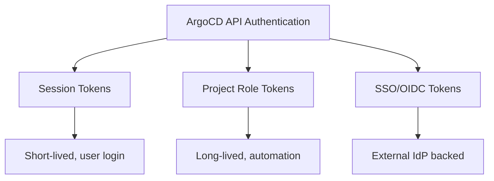

# How to Authenticate with ArgoCD API Using Tokens

Author: [nawazdhandala](https://github.com/nawazdhandala)

Tags: ArgoCD, GitOps, Kubernetes, API, Authentication

Description: Learn how to authenticate with the ArgoCD API using session tokens, project tokens, and API keys for secure automation workflows.

---

Authentication is the first step for any ArgoCD API interaction. ArgoCD supports multiple authentication methods, each suited for different use cases. Session tokens work for short-lived human interactions, while project role tokens are ideal for long-running automation. Understanding when to use each approach is critical for building secure, reliable integrations.

## Authentication Methods Overview

ArgoCD provides three main authentication approaches:



1. **Session tokens** - Generated by logging in with username/password. They expire based on server configuration.
2. **Project role JWT tokens** - Generated for specific project roles. These can be long-lived or set with custom expiration.
3. **SSO/OIDC tokens** - Obtained through your identity provider and passed to the API.

## Method 1: Session Token Authentication

The simplest way to authenticate is using the session endpoint. This is identical to what happens when you log into the ArgoCD UI:

```bash
# Authenticate and get a session token
curl -s -k https://argocd.example.com/api/v1/session \
  -H "Content-Type: application/json" \
  -d '{
    "username": "admin",
    "password": "your-admin-password"
  }'

# Response:
# {"token":"eyJhbGciOiJIUzI1NiIsInR5cCI6IkpXVCJ9.eyJpc3Mi..."}
```

Store the token and use it in the `Authorization` header:

```bash
# Export the token for reuse
export ARGOCD_TOKEN=$(curl -s -k https://argocd.example.com/api/v1/session \
  -d '{"username":"admin","password":"your-admin-password"}' \
  | jq -r '.token')

# Make authenticated API calls
curl -s -k -H "Authorization: Bearer $ARGOCD_TOKEN" \
  https://argocd.example.com/api/v1/applications | jq '.items | length'
```

### Session Token Expiration

Session tokens have a configurable expiration. The default is 24 hours. You can change this in the `argocd-cm` ConfigMap:

```yaml
apiVersion: v1
kind: ConfigMap
metadata:
  name: argocd-cm
  namespace: argocd
data:
  # Set session token expiry to 12 hours
  server.sessionDuration: "12h"
```

## Method 2: Project Role JWT Tokens

For CI/CD pipelines and long-running automation, project role tokens are the recommended approach. They are scoped to a specific project and role, giving you fine-grained access control.

### Step 1: Create a Project Role

First, define a role within your ArgoCD project:

```bash
# Create a role called "ci-deploy" in the "production" project
argocd proj role create production ci-deploy \
  --description "CI/CD deployment automation"
```

Or declaratively:

```yaml
apiVersion: argoproj.io/v1alpha1
kind: AppProject
metadata:
  name: production
  namespace: argocd
spec:
  description: Production applications
  sourceRepos:
    - "https://github.com/myorg/*"
  destinations:
    - namespace: "production"
      server: "https://kubernetes.default.svc"
  roles:
    - name: ci-deploy
      description: CI/CD deployment automation role
      policies:
        # Allow syncing any application in this project
        - p, proj:production:ci-deploy, applications, sync, production/*, allow
        # Allow getting application status
        - p, proj:production:ci-deploy, applications, get, production/*, allow
        # Allow reading application logs
        - p, proj:production:ci-deploy, logs, get, production/*, allow
```

### Step 2: Generate a Token

```bash
# Generate a token that never expires
argocd proj role create-token production ci-deploy

# Generate a token that expires in 90 days
argocd proj role create-token production ci-deploy --expires-in 2160h
```

Via the API:

```bash
# Generate a token using the REST API
curl -s -k -H "Authorization: Bearer $ARGOCD_TOKEN" \
  -X POST "https://argocd.example.com/api/v1/projects/production/roles/ci-deploy/token" \
  -H "Content-Type: application/json" \
  -d '{"expiresIn": "7776000"}'  # 90 days in seconds
```

### Step 3: Use the Token

```bash
# Store the project token
export CI_TOKEN="eyJhbGciOiJIUzI1NiIsInR5cCI6IkpXVCJ9..."

# Sync an application with the project-scoped token
curl -s -k -H "Authorization: Bearer $CI_TOKEN" \
  -X POST "https://argocd.example.com/api/v1/applications/my-app/sync" \
  -H "Content-Type: application/json" \
  -d '{"prune": true}'
```

## Method 3: SSO/OIDC Token Authentication

If you use SSO with ArgoCD, you can pass OIDC tokens directly:

```bash
# Get an OIDC token from your identity provider
OIDC_TOKEN=$(curl -s https://idp.example.com/oauth/token \
  -d "grant_type=client_credentials" \
  -d "client_id=$CLIENT_ID" \
  -d "client_secret=$CLIENT_SECRET" \
  -d "scope=openid" | jq -r '.access_token')

# Use the OIDC token with ArgoCD API
curl -s -k -H "Authorization: Bearer $OIDC_TOKEN" \
  https://argocd.example.com/api/v1/applications
```

For this to work, ArgoCD must be configured with the same OIDC provider:

```yaml
apiVersion: v1
kind: ConfigMap
metadata:
  name: argocd-cm
  namespace: argocd
data:
  url: https://argocd.example.com
  oidc.config: |
    name: Okta
    issuer: https://idp.example.com
    clientID: your-client-id
    clientSecret: $oidc.okta.clientSecret
    requestedScopes:
      - openid
      - profile
      - email
      - groups
```

## Token Management Best Practices

### Rotating Tokens

Regularly rotate your automation tokens:

```bash
#!/bin/bash
# rotate-token.sh - Rotate ArgoCD project token

PROJECT="production"
ROLE="ci-deploy"

# Delete old tokens (all of them)
argocd proj role delete-token $PROJECT $ROLE --all

# Generate a new token with 90-day expiry
NEW_TOKEN=$(argocd proj role create-token $PROJECT $ROLE \
  --expires-in 2160h -o json | jq -r '.token')

# Store the new token in your secret manager
# Example with AWS Secrets Manager
aws secretsmanager update-secret \
  --secret-id "argocd/$PROJECT/$ROLE/token" \
  --secret-string "$NEW_TOKEN"

echo "Token rotated successfully"
```

### Inspecting Token Claims

JWT tokens contain useful claims. Decode them to inspect permissions:

```bash
# Decode a JWT token (using jq)
echo "$ARGOCD_TOKEN" | cut -d'.' -f2 | base64 -d 2>/dev/null | jq .

# Output shows claims like:
# {
#   "iss": "argocd/apiserver",
#   "sub": "proj:production:ci-deploy",
#   "iat": 1740000000,
#   "exp": 1747776000,
#   "nbf": 1740000000
# }
```

### Validating a Token

Check if a token is still valid before using it:

```bash
# Quick validation - try to get user info
HTTP_STATUS=$(curl -s -k -o /dev/null -w "%{http_code}" \
  -H "Authorization: Bearer $ARGOCD_TOKEN" \
  https://argocd.example.com/api/v1/session/userinfo)

if [ "$HTTP_STATUS" = "200" ]; then
  echo "Token is valid"
else
  echo "Token is invalid or expired (HTTP $HTTP_STATUS)"
fi
```

## Storing Tokens Securely

Never hardcode tokens. Use proper secret management:

```yaml
# Kubernetes Secret for CI/CD pipelines
apiVersion: v1
kind: Secret
metadata:
  name: argocd-ci-token
  namespace: ci-cd
type: Opaque
stringData:
  token: "eyJhbGciOiJIUzI1NiIs..."
```

In GitHub Actions:

```yaml
# .github/workflows/deploy.yml
jobs:
  deploy:
    runs-on: ubuntu-latest
    steps:
      - name: Sync ArgoCD Application
        env:
          ARGOCD_TOKEN: ${{ secrets.ARGOCD_TOKEN }}
        run: |
          curl -s -k -H "Authorization: Bearer $ARGOCD_TOKEN" \
            -X POST "https://argocd.example.com/api/v1/applications/my-app/sync" \
            -H "Content-Type: application/json" \
            -d '{"prune": true}'
```

## Troubleshooting Authentication Issues

Common errors and fixes:

| Error | Cause | Fix |
|-------|-------|-----|
| 401 Unauthorized | Token expired or invalid | Re-authenticate or generate a new token |
| 403 Forbidden | Insufficient RBAC permissions | Update project role policies |
| "invalid session" | Session was revoked | Generate a new session token |
| "account disabled" | Local account is disabled | Enable the account in argocd-cm |

```bash
# Check if the account is enabled
kubectl get configmap argocd-cm -n argocd -o yaml | grep accounts

# Enable an account
kubectl patch configmap argocd-cm -n argocd --type merge \
  -p '{"data":{"accounts.ci-user":"apiKey"}}'
```

Authentication tokens are the gateway to ArgoCD automation. Use session tokens for interactive use and project role tokens for CI/CD pipelines. Always scope tokens to the minimum permissions needed, set expiration times, and rotate them regularly. With the right token strategy, you can build secure automation that scales with your organization.
