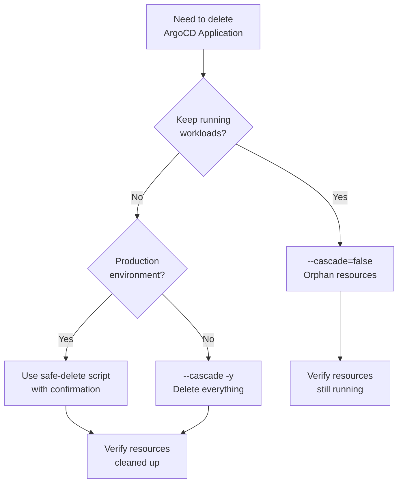

# How to Use argocd app delete Safely

Author: [nawazdhandala](https://github.com/nawazdhandala)

Tags: ArgoCD, GitOps, Kubernetes, CLI, Application Lifecycle

Description: Learn how to safely delete ArgoCD applications using the CLI with cascade and orphan options, force deletion, and recovery from stuck deletion states.

---

Deleting an ArgoCD application seems straightforward, but getting it wrong can either leave orphaned resources cluttering your cluster or accidentally destroy production workloads. The `argocd app delete` command has several critical options that control what happens to the managed Kubernetes resources when the Application resource is removed.

## Basic Deletion

```bash
argocd app delete my-app
```

This prompts for confirmation and then deletes the application. What happens to the managed resources depends on whether the application has a finalizer configured.

## Cascade vs Non-Cascade Delete

This is the most important decision when deleting an application:

### Cascade Delete (Delete Resources)

Cascade delete removes the Application resource AND all Kubernetes resources it manages:

```bash
# Explicit cascade delete
argocd app delete my-app --cascade

# This is equivalent if the app has the resources-finalizer
argocd app delete my-app
```

With cascade delete, ArgoCD will:
1. Delete all managed Deployments, Services, ConfigMaps, etc.
2. Wait for deletions to complete
3. Remove the Application resource

### Non-Cascade Delete (Orphan Resources)

Non-cascade delete removes only the Application resource, leaving all managed resources running:

```bash
argocd app delete my-app --cascade=false
```

This is what you want when:
- Migrating an application between ArgoCD instances
- Switching from imperative to declarative app management
- Removing ArgoCD management without disrupting running workloads
- Transferring ownership to a different tool

## Propagation Policy

Control how Kubernetes handles dependent resources during cascade delete:

```bash
# Foreground: Parent waits for children to be deleted first
argocd app delete my-app --propagation-policy foreground

# Background: Parent is deleted immediately, children are garbage collected
argocd app delete my-app --propagation-policy background

# Orphan: Parent is deleted, children are NOT garbage collected
argocd app delete my-app --propagation-policy orphan
```

The propagation policy matters for resources with owner references:
- **foreground**: Slowest but safest. Pods are terminated before the Deployment is removed.
- **background**: Fastest. Deployment is removed first, pods are cleaned up asynchronously.
- **orphan**: Dependent resources (like ReplicaSets, Pods) are left behind.

## Skip Confirmation

In scripts and CI/CD pipelines, skip the interactive confirmation:

```bash
# Skip confirmation prompt
argocd app delete my-app -y

# Or use the long form
argocd app delete my-app --yes
```

## Deleting Multiple Applications

Delete multiple applications at once:

```bash
# Delete multiple named applications
argocd app delete app1 app2 app3 -y

# Delete applications matching a label selector
for app in $(argocd app list -l environment=dev -o name); do
  argocd app delete "$app" -y --cascade
done
```

## Safe Deletion Workflow

Here is a safe workflow for deleting a production application:

```bash
#!/bin/bash
# safe-delete.sh - Safely delete an ArgoCD application

APP_NAME="${1:?Usage: safe-delete.sh <app-name>}"

echo "=== Pre-Deletion Check for: $APP_NAME ==="

# Step 1: Get current state
DATA=$(argocd app get "$APP_NAME" -o json)
HEALTH=$(echo "$DATA" | jq -r '.status.health.status')
RESOURCES=$(echo "$DATA" | jq '.status.resources | length')
NAMESPACE=$(echo "$DATA" | jq -r '.spec.destination.namespace')
HAS_FINALIZER=$(echo "$DATA" | jq 'any(.metadata.finalizers[]?; . == "resources-finalizer.argocd.argoproj.io")')

echo "Health:          $HEALTH"
echo "Managed Resources: $RESOURCES"
echo "Namespace:       $NAMESPACE"
echo "Has Finalizer:   $HAS_FINALIZER"
echo ""

# Step 2: List resources that will be affected
echo "=== Resources that will be affected ==="
argocd app resources "$APP_NAME"
echo ""

# Step 3: Confirm deletion type
if [ "$HAS_FINALIZER" = "true" ]; then
  echo "WARNING: This application has a cascade finalizer."
  echo "All $RESOURCES resources in $NAMESPACE will be DELETED."
else
  echo "This application does NOT have a cascade finalizer."
  echo "Resources in $NAMESPACE will be ORPHANED (left running)."
fi

echo ""
read -p "Proceed with deletion? (type 'DELETE' to confirm) " CONFIRM

if [ "$CONFIRM" = "DELETE" ]; then
  echo "Deleting application..."
  argocd app delete "$APP_NAME" -y
  echo "Application deleted."
else
  echo "Deletion cancelled."
fi
```

## Handling Stuck Deletions

Applications can get stuck in a terminating state. Here is how to diagnose and fix it.

### Diagnosing

```bash
# Check if the app is stuck terminating
kubectl get application "$APP_NAME" -n argocd -o jsonpath='{.metadata.deletionTimestamp}'

# Check what finalizers are present
kubectl get application "$APP_NAME" -n argocd -o jsonpath='{.metadata.finalizers}'

# Check controller logs for errors
kubectl logs deployment/argocd-application-controller -n argocd | grep "$APP_NAME" | tail -20
```

### Common Causes

1. **Target cluster unreachable**: ArgoCD cannot delete resources on a cluster that is down
2. **RBAC changes**: ArgoCD lost permissions to delete resources
3. **Resource finalizers**: A managed resource has its own stuck finalizer
4. **Namespace terminating**: The target namespace is also stuck terminating

### Force Removing a Stuck Application

```bash
# Option 1: Remove the finalizer to allow deletion without resource cleanup
kubectl patch application "$APP_NAME" -n argocd \
  --type json \
  -p '[{"op": "remove", "path": "/metadata/finalizers"}]'

# Option 2: Force remove with ArgoCD CLI (if available in your version)
argocd app delete "$APP_NAME" --cascade=false -y
```

After force-removing the finalizer, you will need to manually clean up any managed resources:

```bash
# Find and clean up orphaned resources
kubectl get all -n "$NAMESPACE" -l app.kubernetes.io/instance="$APP_NAME"
kubectl delete all -n "$NAMESPACE" -l app.kubernetes.io/instance="$APP_NAME"
```

## Preventing Accidental Deletion

### Disable Delete in RBAC

```csv
# argocd-rbac-cm - Prevent developers from deleting production apps
p, role:developer, applications, delete, production-project/*, deny
p, role:admin, applications, delete, production-project/*, allow
```

### Remove Finalizer for Critical Apps

For applications that should never be cascade-deleted:

```yaml
apiVersion: argoproj.io/v1alpha1
kind: Application
metadata:
  name: critical-database
  namespace: argocd
  # No finalizers - prevents accidental cascade delete
  annotations:
    argocd.argoproj.io/sync-options: "Delete=false"
spec:
  project: production
  source:
    repoURL: https://github.com/my-org/manifests.git
    path: production/database
    targetRevision: main
  destination:
    server: https://kubernetes.default.svc
    namespace: database
```

### Use Sync Option Delete=false

The `Delete=false` sync option prevents ArgoCD from deleting specific resources during sync, but it also serves as a signal that these resources should be handled carefully.

## Cleanup After Deletion

After deleting an application, verify the cleanup:

```bash
# Check that the Application resource is gone
kubectl get application "$APP_NAME" -n argocd

# Check that managed resources are cleaned up (cascade delete)
kubectl get all -n "$NAMESPACE"

# Check for lingering PVCs (not always deleted by cascade)
kubectl get pvc -n "$NAMESPACE"

# Check for lingering secrets
kubectl get secrets -n "$NAMESPACE"

# Check for lingering configmaps
kubectl get configmaps -n "$NAMESPACE"
```

## Deletion in App-of-Apps Pattern

When using the app-of-apps pattern, deleting the parent application can cascade to all child applications:

```bash
# This deletes the parent AND all child applications AND their resources
argocd app delete apps-of-apps --cascade -y

# This deletes only the parent, leaving child applications intact
argocd app delete apps-of-apps --cascade=false -y
```

Be extremely careful with cascade delete on parent applications. Deleting a parent with cascade enabled will delete every child application and all their managed resources.

## Decision Matrix



## Summary

The `argocd app delete` command is straightforward in syntax but has significant consequences. Always know whether you want cascade or non-cascade deletion before running the command. For production environments, build safety wrappers around the command with confirmation prompts and pre-deletion checks. When dealing with stuck deletions, removing the finalizer via kubectl patch is the escape hatch, but remember to clean up orphaned resources manually afterward.
