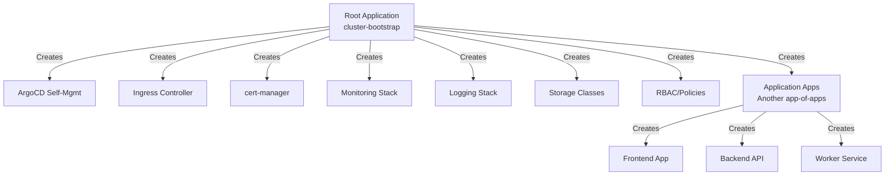

# How to Use App-of-Apps for Cluster Bootstrapping

Author: [nawazdhandala](https://github.com/nawazdhandala)

Tags: ArgoCD, GitOps, Kubernetes, App-of-Apps, Bootstrapping

Description: Learn how to use the ArgoCD app-of-apps pattern to bootstrap entire Kubernetes clusters, manage infrastructure components declaratively, and scale across multiple environments.

---

The app-of-apps pattern is the most popular way to bootstrap Kubernetes clusters with ArgoCD. Instead of creating applications one by one, you create a single "root" application that points to a directory of Application manifests. ArgoCD then creates and manages all the child applications automatically. This guide shows you how to implement this pattern effectively for cluster bootstrapping.

## What Is the App-of-Apps Pattern



The root application watches a directory in Git. Every YAML file in that directory that defines an ArgoCD Application becomes a child application. When you add a new file to the directory, a new application appears. When you remove a file, the application is pruned.

## Repository Structure

```text
cluster-bootstrap/
  apps/                          # Root application watches this directory
    00-namespaces.yaml           # Namespace definitions
    01-argocd.yaml              # ArgoCD self-management
    02-ingress-nginx.yaml       # Ingress controller
    03-cert-manager.yaml        # Certificate management
    04-monitoring.yaml          # Prometheus + Grafana
    05-logging.yaml             # Loki or EFK stack
    06-storage.yaml             # Storage classes
    10-team-apps.yaml           # Another app-of-apps for team apps
  values/                        # Helm values for each component
    argocd-values.yaml
    ingress-values.yaml
    cert-manager-values.yaml
    monitoring-values.yaml
  projects/                      # ArgoCD project definitions
    infrastructure.yaml
    applications.yaml
```

The numbered prefix convention (00, 01, 02...) is just for human readability. Actual ordering is controlled by sync waves.

## The Root Application

```yaml
# root-application.yaml
apiVersion: argoproj.io/v1alpha1
kind: Application
metadata:
  name: cluster-bootstrap
  namespace: argocd
  finalizers:
    - resources-finalizer.argocd.argoproj.io
spec:
  project: default
  source:
    repoURL: https://github.com/your-org/cluster-bootstrap.git
    targetRevision: HEAD
    path: apps
  destination:
    server: https://kubernetes.default.svc
    namespace: argocd
  syncPolicy:
    automated:
      prune: true
      selfHeal: true
    retry:
      limit: 5
      backoff:
        duration: 5s
        factor: 2
        maxDuration: 3m
```

Apply it to start the bootstrap:

```bash
kubectl apply -f root-application.yaml
```

## Child Application Examples

### Namespaces (Sync Wave 0)

```yaml
# apps/00-namespaces.yaml
apiVersion: argoproj.io/v1alpha1
kind: Application
metadata:
  name: cluster-namespaces
  namespace: argocd
  annotations:
    argocd.argoproj.io/sync-wave: "0"
  finalizers:
    - resources-finalizer.argocd.argoproj.io
spec:
  project: default
  source:
    repoURL: https://github.com/your-org/cluster-bootstrap.git
    targetRevision: HEAD
    path: base/namespaces
  destination:
    server: https://kubernetes.default.svc
  syncPolicy:
    automated:
      prune: true
      selfHeal: true
```

With namespace definitions in the repo:

```yaml
# base/namespaces/namespaces.yaml
apiVersion: v1
kind: Namespace
metadata:
  name: ingress-nginx
---
apiVersion: v1
kind: Namespace
metadata:
  name: cert-manager
---
apiVersion: v1
kind: Namespace
metadata:
  name: monitoring
---
apiVersion: v1
kind: Namespace
metadata:
  name: logging
```

### Ingress Controller (Sync Wave 1)

```yaml
# apps/02-ingress-nginx.yaml
apiVersion: argoproj.io/v1alpha1
kind: Application
metadata:
  name: ingress-nginx
  namespace: argocd
  annotations:
    argocd.argoproj.io/sync-wave: "1"
  finalizers:
    - resources-finalizer.argocd.argoproj.io
spec:
  project: default
  source:
    repoURL: https://kubernetes.github.io/ingress-nginx
    chart: ingress-nginx
    targetRevision: 4.9.1
    helm:
      releaseName: ingress-nginx
      valueFiles:
        - $values/values/ingress-values.yaml
  sources:
    - repoURL: https://kubernetes.github.io/ingress-nginx
      chart: ingress-nginx
      targetRevision: 4.9.1
      helm:
        releaseName: ingress-nginx
        valueFiles:
          - $values/values/ingress-values.yaml
    - repoURL: https://github.com/your-org/cluster-bootstrap.git
      targetRevision: HEAD
      ref: values
  destination:
    server: https://kubernetes.default.svc
    namespace: ingress-nginx
  syncPolicy:
    automated:
      prune: true
      selfHeal: true
    syncOptions:
      - CreateNamespace=true
```

### Monitoring Stack (Sync Wave 3)

```yaml
# apps/04-monitoring.yaml
apiVersion: argoproj.io/v1alpha1
kind: Application
metadata:
  name: monitoring
  namespace: argocd
  annotations:
    argocd.argoproj.io/sync-wave: "3"
  finalizers:
    - resources-finalizer.argocd.argoproj.io
spec:
  project: default
  source:
    repoURL: https://prometheus-community.github.io/helm-charts
    chart: kube-prometheus-stack
    targetRevision: 56.6.2
    helm:
      releaseName: monitoring
      values: |
        prometheus:
          prometheusSpec:
            retention: 15d
            storageSpec:
              volumeClaimTemplate:
                spec:
                  accessModes: ["ReadWriteOnce"]
                  resources:
                    requests:
                      storage: 50Gi
        grafana:
          enabled: true
          ingress:
            enabled: true
            hosts:
              - grafana.example.com
  destination:
    server: https://kubernetes.default.svc
    namespace: monitoring
  syncPolicy:
    automated:
      prune: true
      selfHeal: true
    syncOptions:
      - CreateNamespace=true
      - ServerSideApply=true  # Needed for CRDs
```

## Sync Wave Strategy

Use sync waves to control the installation order:

| Wave | Components | Reason |
|------|-----------|--------|
| 0 | Namespaces, CRDs, Projects | Must exist before anything else |
| 1 | ArgoCD self-management | Ensures ArgoCD config is applied early |
| 2 | Ingress controller | Needed for external access |
| 3 | cert-manager | Needs CRDs, needed before TLS ingress |
| 4 | Monitoring, Logging | Can now use ingress for dashboards |
| 5 | Storage classes, policies | Infrastructure-level components |
| 10 | Application workloads | All infrastructure is ready |

## Nested App-of-Apps

For large organizations, nest app-of-apps for better organization:

```yaml
# apps/10-team-apps.yaml - Another app-of-apps for team workloads
apiVersion: argoproj.io/v1alpha1
kind: Application
metadata:
  name: team-applications
  namespace: argocd
  annotations:
    argocd.argoproj.io/sync-wave: "10"
  finalizers:
    - resources-finalizer.argocd.argoproj.io
spec:
  project: default
  source:
    repoURL: https://github.com/your-org/cluster-bootstrap.git
    targetRevision: HEAD
    path: team-apps
  destination:
    server: https://kubernetes.default.svc
    namespace: argocd
  syncPolicy:
    automated:
      prune: true
      selfHeal: true
```

## Multi-Environment Support

Use the same app-of-apps structure across environments with Kustomize overlays:

```text
cluster-bootstrap/
  base/
    apps/
      ingress.yaml
      cert-manager.yaml
      monitoring.yaml
      kustomization.yaml
  overlays/
    dev/
      apps/
        kustomization.yaml       # Patches for dev
    staging/
      apps/
        kustomization.yaml
    production/
      apps/
        kustomization.yaml
```

```yaml
# overlays/dev/apps/kustomization.yaml
apiVersion: kustomize.config.k8s.io/v1beta1
kind: Kustomization
resources:
  - ../../../base/apps
patches:
  - target:
      kind: Application
      name: monitoring
    patch: |
      - op: replace
        path: /spec/source/helm/values
        value: |
          prometheus:
            prometheusSpec:
              retention: 3d
              resources:
                requests:
                  memory: 512Mi
```

Root application for each environment:

```yaml
# root-dev.yaml
apiVersion: argoproj.io/v1alpha1
kind: Application
metadata:
  name: dev-cluster-bootstrap
  namespace: argocd
spec:
  project: default
  source:
    repoURL: https://github.com/your-org/cluster-bootstrap.git
    targetRevision: HEAD
    path: overlays/dev/apps
  destination:
    server: https://kubernetes.default.svc
    namespace: argocd
  syncPolicy:
    automated:
      prune: true
      selfHeal: true
```

## Adding New Components

To add a new component to the cluster, simply add a new Application YAML to the apps directory:

```yaml
# apps/07-external-dns.yaml
apiVersion: argoproj.io/v1alpha1
kind: Application
metadata:
  name: external-dns
  namespace: argocd
  annotations:
    argocd.argoproj.io/sync-wave: "3"
  finalizers:
    - resources-finalizer.argocd.argoproj.io
spec:
  project: default
  source:
    repoURL: https://kubernetes-sigs.github.io/external-dns
    chart: external-dns
    targetRevision: 1.14.3
    helm:
      values: |
        provider: aws
        policy: sync
  destination:
    server: https://kubernetes.default.svc
    namespace: external-dns
  syncPolicy:
    automated:
      prune: true
      selfHeal: true
    syncOptions:
      - CreateNamespace=true
```

Commit and push - ArgoCD automatically detects the new file and creates the application.

## Monitoring the Bootstrap

```bash
# Watch all applications being created and synced
watch -n 5 'kubectl get applications -n argocd \
  -o custom-columns=NAME:.metadata.name,WAVE:.metadata.annotations.argocd\\.argoproj\\.io/sync-wave,SYNC:.status.sync.status,HEALTH:.status.health.status'

# Check for any failed applications
kubectl get applications -n argocd -o json | \
  jq -r '.items[] | select(.status.sync.status != "Synced" or .status.health.status != "Healthy") | "\(.metadata.name): sync=\(.status.sync.status) health=\(.status.health.status)"'
```

## Summary

The app-of-apps pattern is the standard approach for cluster bootstrapping with ArgoCD. Create a root application that watches a directory of Application manifests, use sync waves to control installation order, and commit new Application YAML files to add components. This pattern scales from single clusters to multi-environment setups using Kustomize overlays, and it supports nested app-of-apps for organizational separation. The entire cluster state lives in Git, making it reproducible, auditable, and easy to replicate across environments. For cross-referencing with monitoring setup, see our guide on [bootstrapping the monitoring stack with ArgoCD](https://oneuptime.com/blog/post/2026-02-26-argocd-bootstrap-monitoring-stack/view).
